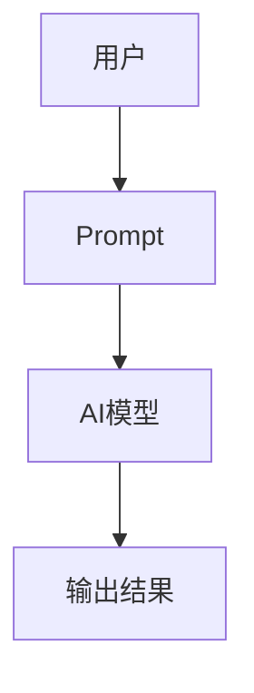
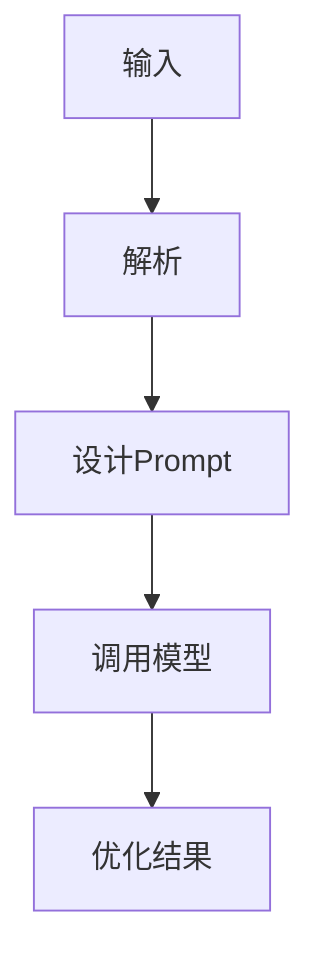
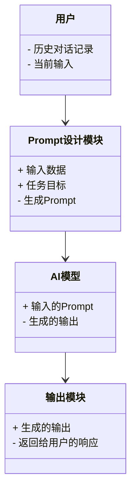
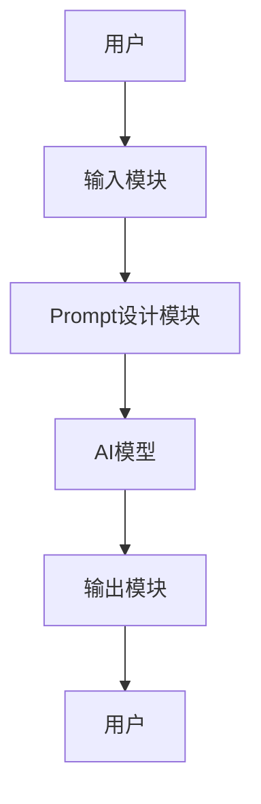
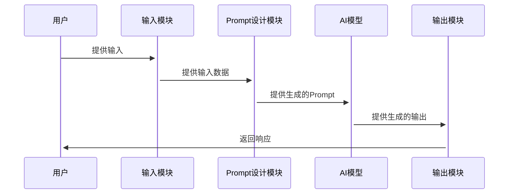

                 


# Prompt工程高级技巧：提升AI Agent性能

## 关键词：Prompt工程, AI Agent, 自然语言处理, 人机交互, AI系统优化

## 摘要：Prompt工程是提升AI Agent性能的关键技术，通过优化提示设计和系统架构，结合数学模型和算法原理，实现更高效的自然语言处理和人机交互。本文深入探讨Prompt工程的核心概念、算法原理、系统架构，并通过项目实战和最佳实践，帮助读者掌握提升AI Agent性能的高级技巧。

---

## 第一部分：Prompt工程与AI Agent概述

### 第1章：Prompt工程的背景与核心概念

#### 1.1 Prompt工程的起源与发展
##### 1.1.1 从传统NLP到Prompt工程的演进
自然语言处理（NLP）技术经历了从规则驱动到数据驱动的转变。早期的NLP系统依赖于复杂的规则和专家知识，难以应对真实场景中的多样化需求。随着深度学习的兴起，尤其是大语言模型的出现，NLP技术进入了一个新的阶段。然而，如何高效地引导模型生成符合特定任务需求的输出成为了新的挑战。此时，Prompt工程作为一种创新的技术，应运而生。它通过设计合适的提示（Prompt），将复杂的任务需求转化为模型可以理解的输入，从而实现了更高效的自然语言处理。

##### 1.1.2 Prompt工程的核心概念
Prompt工程的核心在于设计和优化提示（Prompt）。提示是一种输入形式，用于引导AI模型生成特定的输出。它不仅仅是简单的指令，而是一个包含了任务目标、输入数据和期望输出的结构化输入。通过精心设计的提示，AI模型能够更准确地理解用户的需求，并生成高质量的输出。

##### 1.1.3 AI Agent与Prompt工程的关系
AI Agent是一种能够感知环境、执行任务并做出决策的智能实体。它需要与人类用户进行交互，理解用户的需求，并通过内部逻辑处理生成相应的输出。Prompt工程为AI Agent提供了一种高效的方式来理解和处理用户的输入，从而提升其性能和用户体验。

#### 1.2 Prompt工程的核心概念与背景
##### 1.2.1 问题背景
在AI Agent的实际应用中，如何设计合适的提示（Prompt）是一个关键问题。传统的指令输入方式往往无法充分表达任务的需求，导致模型输出不符合预期。例如，在对话系统中，简单的指令如“告诉我天气情况”可能会导致模型只提供天气数据，而无法结合用户的具体需求提供更个性化的服务。

##### 1.2.2 问题描述
提示设计的复杂性主要体现在以下几个方面：
1. **任务多样**：AI Agent需要处理的任务种类繁多，从简单的信息查询到复杂的决策支持。
2. **输入多样性**：用户输入的提示可能包含多种格式和内容，如文本、图片、语音等。
3. **输出要求**：不同的任务对输出的要求也不同，需要提示能够明确指导模型生成符合预期的输出。

##### 1.2.3 问题解决
通过Prompt工程，可以系统地设计和优化提示，使其能够准确表达任务需求，并指导AI模型生成高质量的输出。例如，在对话系统中，通过设计包含上下文信息的提示，模型可以更好地理解用户意图，并生成更相关的回复。

##### 1.2.4 边界与外延
Prompt工程的边界主要集中在提示的设计和优化，而其外延则涉及AI模型的训练、部署和应用。提示设计是AI Agent与用户交互的桥梁，通过优化提示可以提升整个系统的性能。

##### 1.2.5 核心要素组成
有效的提示设计需要考虑以下几个核心要素：
1. **任务目标**：明确提示的目标是什么，例如信息查询、决策支持等。
2. **输入数据**：提示需要包含哪些输入数据，例如用户的历史对话记录。
3. **输出要求**：提示需要明确期望的输出格式和内容。
4. **上下文信息**：提示是否需要包含上下文信息，例如对话历史、用户身份等。

#### 1.3 Prompt工程的应用领域
##### 1.3.1 自然语言处理
在自然语言处理领域，Prompt工程被广泛应用于文本生成、问答系统、对话系统等任务。例如，在问答系统中，通过设计合适的提示，模型可以更准确地理解用户的问题，并生成相关的答案。

##### 1.3.2 人机交互
在人机交互领域，Prompt工程帮助AI Agent更好地理解用户的输入，并生成符合用户期望的输出。例如，在智能音箱中，通过设计合适的提示，模型可以更准确地识别用户的指令，并执行相应的操作。

##### 1.3.3 AI Agent开发
在AI Agent的开发中，Prompt工程是连接用户需求和模型输出的关键技术。通过优化提示设计，可以显著提升AI Agent的性能和用户体验。

### 1.4 本章小结
本章介绍了Prompt工程的背景、核心概念以及在AI Agent中的应用。通过理解Prompt工程的起源和发展，读者可以更好地掌握其在自然语言处理和人机交互中的重要作用。下一章将深入探讨Prompt工程的核心概念与联系，帮助读者进一步理解其设计原则和优化策略。

---

### 第2章：Prompt工程的核心概念与联系

#### 2.1 核心概念原理
##### 2.1.1 Prompt的定义与作用
Prompt是一种输入形式，用于引导AI模型生成特定的输出。它通常包含任务目标、输入数据和输出要求等信息。通过设计合适的Prompt，可以显著提升AI模型的生成能力和输出质量。

##### 2.1.2 Prompt与AI模型的关系
Prompt是AI模型与用户交互的桥梁。通过Prompt，AI模型可以理解用户的意图，并生成符合预期的输出。例如，在对话系统中，用户输入的提示可以是“告诉我今天北京的天气情况”，模型通过解析这个提示，生成相应的天气信息。

##### 2.1.3 Prompt的结构与属性
有效的Prompt通常包含以下几个结构：
1. **任务目标**：明确提示的目标是什么，例如“生成一段关于人工智能的介绍”。
2. **输入数据**：提示中包含哪些输入数据，例如“基于用户的历史对话记录”。
3. **输出要求**：提示明确期望的输出格式和内容，例如“生成一段自然流畅的中文文本”。

#### 2.2 核心概念对比表
通过对比不同的Prompt类型，可以帮助读者更好地理解其特点和适用场景。以下是一个核心概念对比表：

| 对比维度 | 示例1：简单指令 | 示例2：上下文提示 | 示例3：动态调整提示 |
|----------|-----------------|-------------------|--------------------|
| **任务目标** | 生成一句话介绍人工智能。 | 基于用户的历史对话，生成一段关于人工智能的详细介绍。 | 根据用户的实时输入，动态调整生成内容的长度和复杂度。 |
| **输入数据** | 无额外输入数据。 | 包含用户的历史对话记录。 | 包含用户的实时输入数据。 |
| **输出要求** | 生成一句话。 | 生成一段详细文本。 | 动态调整输出长度和内容。 |

#### 2.3 实体关系图
为了更好地理解Prompt工程中的实体关系，我们可以使用Mermaid图来展示其结构。以下是一个简单的实体关系图：



这个图展示了用户通过提示（Prompt）与AI模型进行交互的过程。用户输入提示后，AI模型根据提示生成输出结果。

### 2.4 本章小结
本章详细探讨了Prompt工程的核心概念，包括Prompt的定义、结构和作用，以及不同类型Prompt的对比。通过理解这些核心概念，读者可以更好地掌握Prompt工程的设计原则和优化策略。

---

### 第3章：Prompt工程的算法原理与数学模型

#### 3.1 算法原理
##### 3.1.1 Prompt生成的算法流程
Prompt生成的算法流程通常包括以下几个步骤：
1. **输入解析**：解析用户的输入，提取任务目标和输入数据。
2. **Prompt设计**：根据任务目标和输入数据，设计合适的Prompt。
3. **模型调用**：将设计好的Prompt输入AI模型，生成输出结果。
4. **结果优化**：根据生成的输出结果，进行优化和调整，以提升输出质量。

以下是一个简单的算法流程图：



##### 3.1.2 算法实现
以下是一个简单的Prompt生成算法实现示例：

```python
def generate_prompt(task, input_data):
    # 1. 解析输入数据
    input_parsed = parse_input(input_data)
    
    # 2. 设计Prompt
    prompt = f"基于以下输入数据，生成{task}：{input_parsed}"
    
    # 3. 返回设计好的Prompt
    return prompt
```

##### 3.1.3 算法优化
为了提升Prompt生成的效果，可以在算法中引入动态调整策略。例如，根据生成结果的质量，动态调整Prompt的结构和内容。

#### 3.2 数学模型与公式
##### 3.2.1 Prompt生成的数学模型
Prompt生成的数学模型可以表示为：

$$
P(output | prompt) = f(prompt)
$$

其中，\( f \) 是AI模型的生成函数，\( prompt \) 是输入的提示，\( output \) 是生成的输出。

##### 3.2.2 动态调整策略
动态调整策略可以通过以下公式表示：

$$
f(p) = g(p, context)
$$

其中，\( p \) 是当前Prompt，\( context \) 是上下文信息，\( g \) 是动态调整函数。

#### 3.3 本章小结
本章介绍了Prompt生成的算法原理和数学模型，包括算法流程、实现方法和优化策略。通过理解这些内容，读者可以更好地掌握Prompt工程的技术细节。

---

### 第4章：AI Agent的系统架构与优化

#### 4.1 系统架构分析
##### 4.1.1 系统组成模块
AI Agent的系统架构通常包括以下几个模块：
1. **输入模块**：负责接收用户的输入，例如文本、语音等。
2. **Prompt设计模块**：根据输入数据设计合适的Prompt。
3. **模型调用模块**：将设计好的Prompt输入AI模型，生成输出结果。
4. **输出模块**：将生成的输出结果返回给用户，例如文本、语音等。

##### 4.1.2 系统功能设计
系统功能设计可以通过领域模型类图来展示：



##### 4.1.3 系统架构设计
系统架构设计可以通过以下架构图展示：



##### 4.1.4 系统接口设计
系统接口设计包括以下几个部分：
1. **输入接口**：接收用户的输入，例如文本、语音等。
2. **Prompt设计接口**：设计和生成合适的Prompt。
3. **模型调用接口**：将Prompt输入AI模型，生成输出结果。
4. **输出接口**：将生成的输出结果返回给用户。

##### 4.1.5 系统交互流程
系统交互流程可以通过以下序列图展示：



#### 4.2 系统优化与实现
##### 4.2.1 优化策略
为了提升AI Agent的性能，可以采用以下优化策略：
1. **动态调整Prompt**：根据生成结果的质量，动态调整Prompt的结构和内容。
2. **多模型融合**：结合多个AI模型的结果，生成更高质量的输出。
3. **上下文记忆**：利用上下文信息，提升生成结果的相关性和连贯性。

##### 4.2.2 实现方案
以下是一个优化后的系统实现方案：

```python
def optimize_prompt(task, input_data, context):
    # 1. 解析输入数据
    input_parsed = parse_input(input_data)
    
    # 2. 设计Prompt
    prompt = f"基于以下输入数据和上下文，生成{task}：{input_parsed}，上下文为{context}"
    
    # 3. 动态调整Prompt
    if context:
        prompt += f"，结合上下文生成结果"
    
    # 4. 调用模型
    output = model.generate(prompt)
    
    # 5. 返回优化后的输出
    return output
```

##### 4.2.3 效果对比
通过动态调整Prompt和结合上下文信息，可以显著提升生成结果的质量。例如，在对话系统中，结合上下文的Prompt可以生成更连贯和相关的回复。

#### 4.3 本章小结
本章分析了AI Agent的系统架构，并提出了优化策略和实现方案。通过理解系统的组成模块和优化策略，读者可以更好地掌握Prompt工程在AI Agent中的应用。

---

### 第5章：项目实战——基于Prompt工程的AI Agent优化

#### 5.1 项目背景与目标
##### 5.1.1 项目背景
在本章中，我们将通过一个具体的项目案例，展示如何通过Prompt工程优化AI Agent的性能。项目的背景是开发一个智能问答系统，用户可以通过输入问题，获取相关的答案。

##### 5.1.2 项目目标
本项目的目的是通过设计和优化Prompt，提升智能问答系统的生成质量和用户体验。

#### 5.2 项目环境与工具
##### 5.2.1 环境安装
为了实现本项目，我们需要安装以下工具和库：
1. **Python**：编程语言。
2. **Hugging Face Transformers**：用于调用预训练的AI模型。
3. **Mermaid**：用于绘制流程图和类图。

##### 5.2.2 核心实现
以下是一个简单的Prompt生成和优化的实现示例：

```python
from transformers import pipeline

# 初始化模型
model = pipeline('text-generation', model='gpt2')

def generate_prompt(task, input_data):
    prompt = f"生成{task}：{input_data}"
    return prompt

def optimize_prompt(task, input_data, context):
    prompt = f"基于以下输入数据和上下文，生成{task}：{input_data}，上下文为{context}"
    return prompt

# 生成基础Prompt
base_prompt = generate_prompt('回答', '什么是人工智能？')
print(base_prompt)

# 生成优化后的Prompt
optimized_prompt = optimize_prompt('详细回答', '什么是人工智能？', '用户是新手')
print(optimized_prompt)

# 调用模型生成输出
output_base = model(base_prompt)
output_optimized = model(optimized_prompt)

print(output_base)
print(output_optimized)
```

##### 5.2.3 代码解读与分析
通过上述代码，我们可以看到基础Prompt和优化后的Prompt对生成结果的不同影响。优化后的Prompt结合了上下文信息，生成的输出更加详细和相关。

#### 5.3 项目小结
本章通过一个具体的项目案例，展示了如何通过Prompt工程优化AI Agent的性能。通过设计和优化Prompt，可以显著提升生成结果的质量和用户体验。

---

### 第6章：高级技巧与最佳实践

#### 6.1 高级技巧
##### 6.1.1 动态调整策略
在实际应用中，可以根据生成结果的质量动态调整Prompt的结构和内容。例如，如果生成的结果不够详细，可以增加Prompt中的详细要求。

##### 6.1.2 多模态应用
Prompt工程不仅仅适用于文本生成，还可以扩展到多模态应用，例如图像生成和语音合成。

##### 6.1.3 伦理安全
在设计Prompt时，需要注意伦理和安全问题，避免生成有害或不适当的内容。

#### 6.2 最佳实践
##### 6.2.1 设计原则
1. **明确任务目标**：确保Prompt清晰地表达任务目标。
2. **简洁明了**：避免复杂的结构，确保Prompt简洁明了。
3. **动态调整**：根据生成结果的质量，动态调整Prompt的内容。

##### 6.2.2 注意事项
1. **上下文信息**：合理利用上下文信息，提升生成结果的相关性。
2. **模型选择**：选择合适的AI模型，确保生成结果的质量。
3. **用户反馈**：根据用户的反馈，不断优化Prompt设计。

#### 6.3 拓展阅读
##### 6.3.1 相关技术
1. **大语言模型**：如GPT、BERT等。
2. **对话系统**：如生成式对话系统。
3. **人机交互**：如自然语言理解（NLU）和生成（NLG）。

##### 6.3.2 应用场景
1. **智能问答系统**：如客服机器人。
2. **内容生成**：如新闻标题生成。
3. **代码生成**：如自动编写代码片段。

---

### 第7章：总结与展望

#### 7.1 本章总结
本章全面总结了Prompt工程的核心概念、算法原理、系统架构和项目实战。通过理解这些内容，读者可以掌握提升AI Agent性能的关键技术。

#### 7.2 未来展望
随着AI技术的不断发展，Prompt工程将在更多领域得到应用。未来的研究方向可能包括：
1. **动态调整策略**：进一步优化Prompt的动态调整机制。
2. **多模态应用**：扩展Prompt工程在多模态任务中的应用。
3. **伦理安全**：加强Prompt工程的伦理和安全研究。

---

## 结语
通过本篇文章的学习，读者可以系统地掌握Prompt工程的核心技术，并将其应用于实际的AI Agent开发中。Prompt工程不仅能够提升AI Agent的性能，还能优化用户体验，是当前AI领域的重要技术之一。希望本文的内容能够为读者提供有价值的参考和启发。

