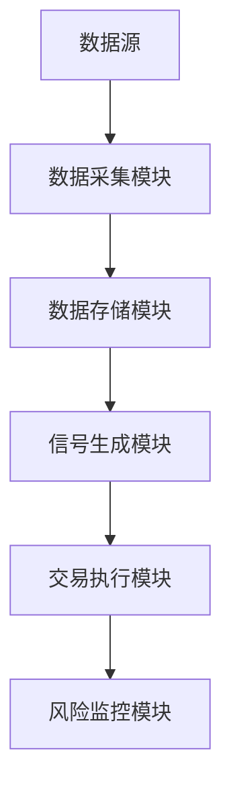

                 


# Volatility投资策略：如何从市场波动中获利

> 关键词：波动性投资，市场波动，投资策略，风险管理，算法交易，技术分析，投资组合优化

> 摘要：波动性投资是一种通过捕捉市场波动性来获利的投资策略。本文将深入探讨波动性投资的核心概念、策略、技术分析方法、风险管理技巧，以及如何利用算法交易和系统架构设计来优化投资效果。通过实际案例分析和项目实战，我们将帮助读者掌握如何在市场波动中实现稳健的投资收益。

---

## 第1章: Volatility投资策略概述

### 1.1 市场波动性的定义与特征
市场波动性是指资产价格在一定时期内波动的程度，通常用标准差或波动率来衡量。波动性投资策略的核心在于利用价格波动捕捉短期收益。

- **定义**：波动性投资策略通过分析价格波动，寻找短期价格变化的机会。
- **特征**：高频交易、技术分析驱动、风险较高但潜在收益大。

### 1.2 Volatility投资策略的重要性
- **分散风险**：通过捕捉波动性，投资者可以在不同市场条件下分散风险。
- **短期收益**：波动性策略适合短期投资者，能够在短时间内获利。

### 1.3 Volatility投资策略与其他策略的区别
- **传统价值投资**：基于基本面分析，长期持有优质资产。
- **趋势跟踪策略**：依赖于价格趋势的持续性，适合中长期投资。
- **波动性策略**：专注于短期价格波动，利用市场的短期波动获利。

---

## 第2章: Volatility投资策略的核心原理

### 2.1 市场波动性的形成机制
- **市场参与者行为**：投资者情绪波动、资金流动影响市场价格。
- **信息不对称**：市场信息的不透明性导致价格波动。

### 2.2 技术分析与市场波动
- **技术指标**：移动平均线、RSI、MACD等指标帮助识别价格趋势。
- **图表模式**：通过价格图表识别支撑位、阻力位等关键点。

### 2.3 动量策略与均值回归
- **动量策略**：基于价格的动量效应，买入近期强势资产，卖出近期弱势资产。
- **均值回归**：假设价格会回归到均值，寻找超买或超卖机会。

---

## 第3章: 技术分析与波动性投资

### 3.1 常用技术指标
- **移动平均线（MA）**：用于识别价格趋势。
- **相对强度指数（RSI）**：衡量资产超买或超卖状态。

### 3.2 技术分析的高级方法
- **波浪理论**：通过价格波浪模式预测未来价格走势。
- **斐波那契回调**：利用价格回调比例寻找买卖点。

---

## 第4章: 风险管理与波动性投资

### 4.1 风险管理策略
- **止损策略**：设定止损点，限制潜在亏损。
- **止盈策略**：设定止盈点，锁定收益。

### 4.2 风险控制系统
- **VaR模型**：衡量投资组合的潜在损失。
- **动态调整**：根据市场变化动态调整投资组合。

---

## 第5章: 算法交易与波动性投资

### 5.1 算法交易的基本原理
- **算法设计**：基于数学模型和统计分析，自动执行交易指令。
- **高频交易**：利用算法快速捕捉市场机会。

### 5.2 算法交易的优化方法
- **参数优化**：调整算法参数，提高交易效率。
- **回测与验证**：通过历史数据验证算法的有效性。

---

## 第6章: 系统架构设计

### 6.1 系统功能设计
- **数据采集**：收集市场数据，包括价格、成交量等。
- **信号生成**：通过技术分析生成买卖信号。
- **交易执行**：根据信号自动执行交易。

### 6.2 系统架构图


---

## 第7章: 项目实战

### 7.1 环境安装
- **Python环境**：安装Python和必要的库，如Pandas、Matplotlib、Backtrader。

### 7.2 核心代码实现
```python
import pandas as pd
import numpy as np

# 示例代码：计算动量策略的收益
def calculate_momentum_return(prices, window=20):
    returns = []
    for i in range(window, len(prices)):
        return_i = (prices[i] / prices[i - window]) - 1
        returns.append(return_i)
    return pd.Series(returns, index=prices.index[window:])

# 示例代码：计算均值回归策略的信号
def calculate_mean_reversion_signal(prices, window=20):
    signal = []
    for i in range(len(prices)):
        if i < window:
            signal.append(0)
        else:
            z_score = (prices[i] - prices[i - window].mean()) / prices[i - window].std()
            if z_score > 1:
                signal.append(-1)
            elif z_score < -1:
                signal.append(1)
            else:
                signal.append(0)
    return pd.Series(signal, index=prices.index)
```

### 7.3 案例分析
- **动量策略**：通过计算动量指标，选择近期表现强劲的资产进行投资。
- **均值回归策略**：在资产价格超买或超卖时进行交易。

---

## 第8章: 总结与展望

### 8.1 总结
波动性投资策略通过捕捉市场波动性，能够在短期内实现较高的收益。然而，投资者需要具备技术分析能力、风险管理能力以及对市场的深刻理解。

### 8.2 未来展望
- **人工智能的应用**：利用机器学习技术进一步优化波动性投资策略。
- **大数据分析**：通过大数据分析，发现更多的市场机会。

---

## 最佳实践 Tips

- **风险管理**：始终将风险管理放在首位，避免过度杠杆和过度交易。
- **持续学习**：市场环境不断变化，投资者需要不断学习和适应新的策略。
- **技术分析与基本面分析结合**：结合技术分析和基本面分析，提高投资决策的准确性。

---

通过本文的系统讲解，读者可以全面了解波动性投资策略的核心概念、策略、技术分析方法、风险管理技巧以及如何利用算法交易和系统架构设计优化投资效果。希望本文能够为读者在市场波动中获利提供有价值的指导和启发。

