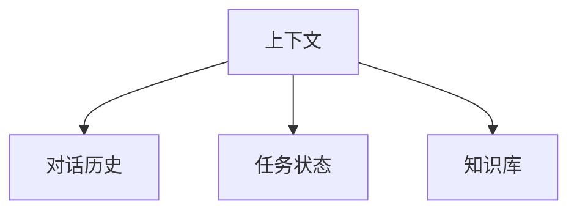
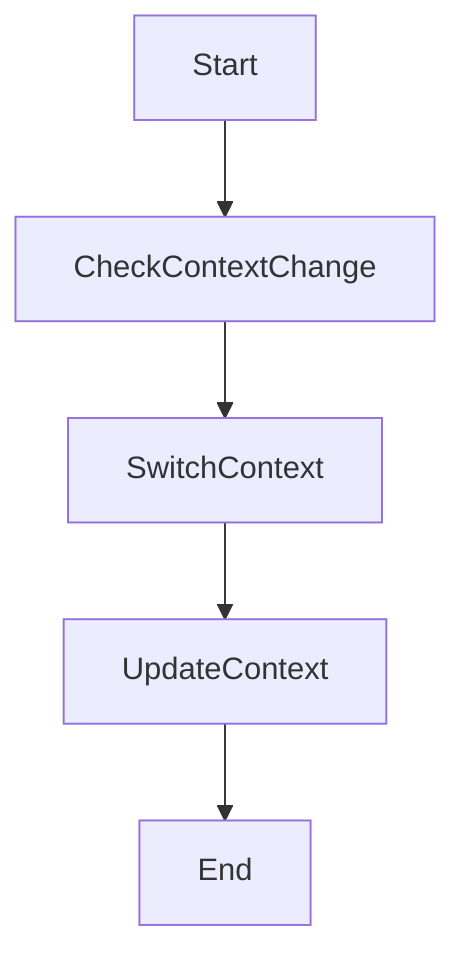
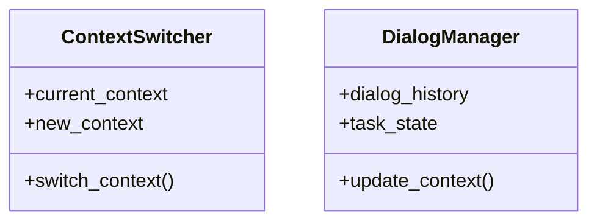
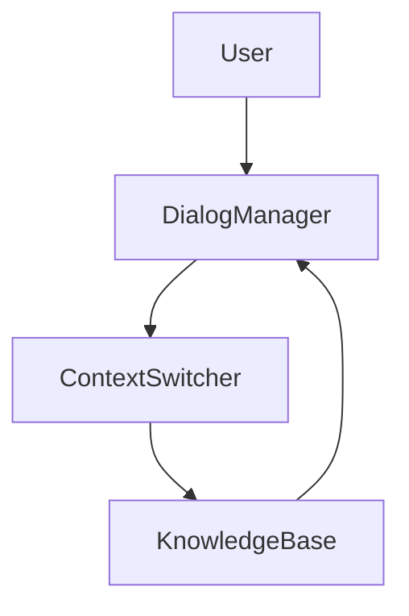

                 


# 上下文切换：让AI Agent灵活应对多主题对话

## 关键词：上下文切换，AI Agent，多主题对话，对话管理，自然语言处理

## 摘要：本文深入探讨了AI Agent在多主题对话中的上下文切换技术，分析了其核心概念、算法原理、系统架构，并通过实际案例展示了如何实现高效的上下文切换，以提升AI Agent的对话能力。

---

## 第一部分：背景介绍

### 第1章：上下文切换的核心概念

#### 1.1 问题背景与问题描述

- **1.1.1 多主题对话的挑战**
  - 在多轮对话中，用户可能会突然切换话题，AI Agent需要快速调整上下文。
  - 例如，用户先讨论“天气”，接着转向“旅行计划”，AI Agent需要记住之前的对话内容。

- **1.1.2 上下文切换的必要性**
  - AI Agent需要根据当前对话主题，动态调整知识库和记忆空间。
  - 如果不进行上下文切换，AI Agent可能会混淆不同主题的信息，导致回答错误。

- **1.1.3 AI Agent在多主题对话中的角色**
  - AI Agent需要能够识别对话主题的切换。
  - 需要支持多个上下文同时存在，并根据需要切换。

#### 1.2 问题解决与边界外延

- **1.2.1 上下文切换的解决方案**
  - 使用记忆机制记录对话历史。
  - 基于关键词或语义相似度检测主题切换。
  - 通过上下文窗口管理当前相关对话内容。

- **1.2.2 上下文切换的边界与限制**
  - 上下文切换不能影响当前对话的主题连贯性。
  - 不能过度切换导致性能下降。

- **1.2.3 上下文切换的外延与应用场景**
  - 在智能客服、虚拟助手等场景中广泛应用。
  - 支持用户在不同主题间自由切换。

---

## 第二部分：核心概念与联系

### 第2章：上下文切换的原理与机制

#### 2.1 核心概念原理

- **2.1.1 上下文的定义与存储**
  - 上下文是对话中的一段连续信息，通常以JSON格式存储。
  - 包括对话历史、当前任务状态、相关知识库等。

- **2.1.2 上下文切换的触发条件**
  - 检测到关键词变化。
  - 语义相似度计算结果低于阈值。
  - 用户明确指示切换话题。

- **2.1.3 上下文的恢复与更新机制**
  - 恢复：加载新的上下文内容。
  - 更新：合并旧上下文和新上下文。

#### 2.2 核心概念属性对比

| 概念 | 定义 | 特性 | 示例 |
|------|------|------|------|
| 上下文 | 对话中的信息片段 | 知识库依赖、可变性 | 天气、旅行 |
| 对话历史 | 过去的对话记录 | 不可变性 | 用户：天气好 |
| 任务状态 | 当前任务的状态 | 状态性 | 天气查询完成 |

#### 2.3 ER实体关系图



---

## 第三部分：算法原理讲解

### 第3章：上下文切换算法的实现

#### 3.1 算法原理概述

- **3.1.1 基于记忆的上下文切换**
  - 使用记忆机制存储上下文信息。
  - 利用关键词匹配判断是否切换。

- **3.1.2 基于关键词的上下文切换**
  - 通过关键词检测主题切换。
  - 例如，检测到“旅行”关键词，切换到旅行相关的上下文。

- **3.1.3 基于上下文窗口的切换机制**
  - 维护一个上下文窗口，记录最近的对话内容。
  - 当窗口内容变化超过阈值时，切换上下文。

#### 3.2 算法流程图



#### 3.3 算法实现代码

```python
def context_switch(current_context, new_context):
    # 判断是否需要切换
    if needs_change(current_context, new_context):
        # 切换上下文
        new_context = load_new_context(new_context)
        # 更新上下文
        update_context(new_context)
    return new_context

def needs_change(current_context, new_context):
    # 基于关键词或语义相似度判断
    return compare_contexts(current_context, new_context) < threshold
```

---

## 第四部分：系统分析与架构设计

### 第4章：上下文切换的系统架构

#### 4.1 问题场景介绍

- **4.1.1 系统功能需求**
  - 支持多主题对话。
  - 实现上下文切换功能。
  - 提供用户友好的交互界面。

#### 4.2 系统功能设计

- **4.2.1 领域模型设计**



- **4.2.2 系统架构设计**



---

## 第五部分：项目实战

### 第5章：上下文切换的实现与应用

#### 5.1 环境安装

- 安装Python和相关库：
  ```bash
  pip install python-dotenv
  pip install transformers
  ```

#### 5.2 核心代码实现

```python
from transformers import AutoTokenizer, AutoModel
import json

class ContextSwitcher:
    def __init__(self):
        self.current_context = {}

    def switch_context(self, new_context):
        if self.needs_change(self.current_context, new_context):
            self.load_new_context(new_context)
            self.update_context()

    def needs_change(self, current, new):
        # 简单实现：比较JSON字符串长度
        return len(json.dumps(current)) < len(json.dumps(new))
```

#### 5.3 代码解读与分析

- **代码解读**
  - `ContextSwitcher`类负责管理上下文切换。
  - `switch_context`方法判断是否需要切换。
  - `update_context`方法更新当前上下文。

- **代码应用**
  ```python
  cs = ContextSwitcher()
  cs.current_context = {"theme": "weather"}
  cs.switch_context({"theme": "travel"})
  ```

#### 5.4 实际案例分析

- 案例：用户先讨论天气，然后讨论旅行计划。
- 切换上下文后，AI Agent能够准确回答旅行相关的问题。

---

## 第六部分：最佳实践

### 第6章：上下文切换的实践与优化

#### 6.1 小结

- 上下文切换是AI Agent处理多主题对话的关键技术。
- 通过记忆机制和关键词检测，可以实现高效的上下文切换。

#### 6.2 注意事项

- 避免过度切换导致性能下降。
- 确保上下文切换的连贯性和准确性。

#### 6.3 未来展望

- 结合强化学习优化上下文切换策略。
- 研究更高效的上下文管理方法。

---

## 结语

上下文切换是实现AI Agent多主题对话能力的核心技术。通过合理设计和优化，AI Agent可以在复杂对话中灵活切换上下文，提升用户体验。希望本文能够为相关领域的研究和实践提供有价值的参考。

