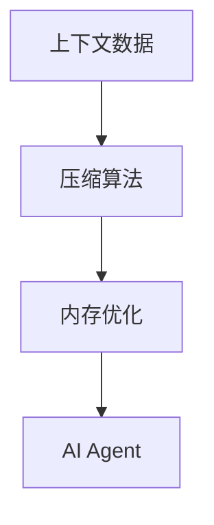
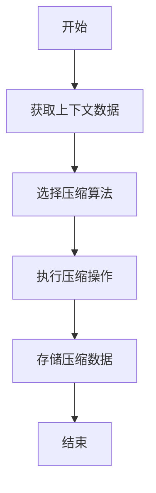
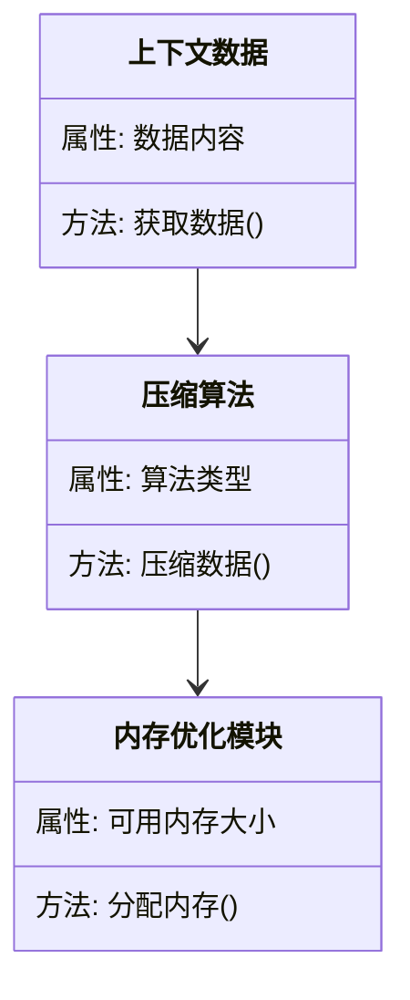
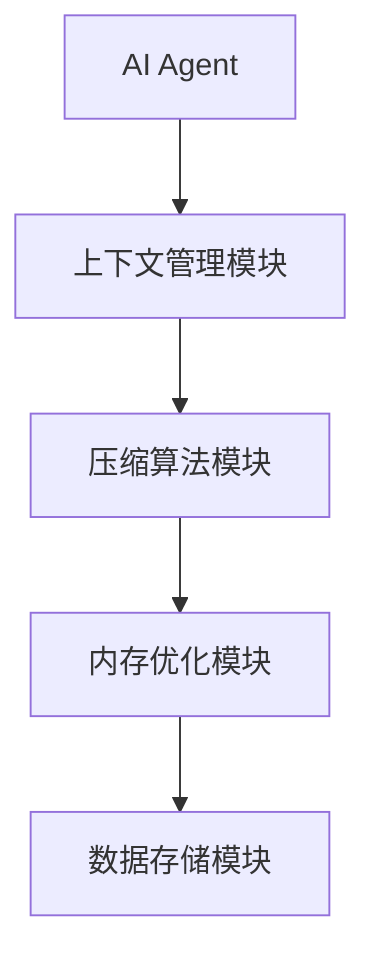

                 


# 上下文压缩：优化AI Agent的内存使用

## 关键词：
上下文压缩, AI Agent, 内存优化, 数据压缩算法, 系统架构设计

## 摘要：
本文详细探讨了上下文压缩在优化AI Agent内存使用中的应用，从背景介绍到核心概念，再到算法原理和系统架构设计，最后通过项目实战和最佳实践，全面解析如何通过上下文压缩技术有效降低AI Agent的内存消耗，提升系统性能和运行效率。

---

# 目录大纲

## 第一部分: 上下文压缩与AI Agent概述

### 第1章: 上下文压缩的背景与重要性

#### 1.1 问题背景
- 1.1.1 AI Agent内存使用问题的提出  
- 1.1.2 上下文在AI Agent中的作用  
- 1.1.3 上下文压缩的必要性  

#### 1.2 问题描述
- 1.2.1 上下文数据的膨胀问题  
- 1.2.2 内存使用过载的后果  
- 1.2.3 上下文压缩的目标与范围  

#### 1.3 问题解决思路
- 1.3.1 数据压缩的基本原理  
- 1.3.2 上下文压缩的实现方法  
- 1.3.3 内存优化的具体措施  

#### 1.4 边界与外延
- 1.4.1 上下文压缩的边界条件  
- 1.4.2 相关技术的外延影响  
- 1.4.3 与其他优化技术的对比  

#### 1.5 核心概念结构与组成
- 1.5.1 上下文压缩的核心要素  
- 1.5.2 相关概念的对比分析  
- 1.5.3 概念结构图展示  

---

## 第二部分: 上下文压缩的核心概念与联系

### 第2章: 上下文压缩的核心原理

#### 2.1 核心概念原理
- 2.1.1 数据压缩的基本原理  
- 2.1.2 上下文压缩的实现机制  
- 2.1.3 内存优化的具体步骤  

#### 2.2 核心概念对比表格
- 2.2.1 不同压缩算法的对比  
- 2.2.2 各种优化策略的优缺点  
- 2.2.3 数据结构的对比分析  

#### 2.3 ER实体关系图


---

## 第三部分: 上下文压缩的算法原理

### 第3章: 上下文压缩算法的实现

#### 3.1 算法原理
- 3.1.1 基于滑动窗口的压缩方法  
- 3.1.2 基于哈希表的压缩策略  
- 3.1.3 混合压缩算法的实现思路  

#### 3.2 算法流程图


#### 3.3 算法实现代码
```python
def context_compression(context_data):
    compressed_data = []
    for data in context_data:
        if data not in compressed_data:
            compressed_data.append(data)
    return compressed_data
```

#### 3.4 数学模型与公式
$$ \text{压缩率} = \frac{\text{原始数据大小}}{\text{压缩后数据大小}} $$

---

## 第四部分: 系统分析与架构设计方案

### 第4章: 系统分析与架构设计

#### 4.1 问题场景介绍
- 4.1.1 AI Agent的上下文数据管理问题  
- 4.1.2 内存使用过载的具体表现  

#### 4.2 系统功能设计
- 4.2.1 上下文压缩模块的功能需求  
- 4.2.2 内存优化模块的设计思路  

#### 4.3 领域模型类图


#### 4.4 系统架构设计


---

## 第五部分: 项目实战

### 第5章: 项目实战

#### 5.1 环境安装
- 5.1.1 安装Python环境  
- 5.1.2 安装必要的库和工具  

#### 5.2 系统核心实现源代码
```python
def compress_context(context):
    compressed = []
    seen = set()
    for item in context:
        if item not in seen:
            compressed.append(item)
            seen.add(item)
    return compressed
```

#### 5.3 代码应用解读与分析
- 5.3.1 代码功能分析  
- 5.3.2 代码优化建议  

#### 5.4 实际案例分析
- 5.4.1 案例背景介绍  
- 5.4.2 数据压缩过程分析  
- 5.4.3 内存优化效果评估  

#### 5.5 项目小结
- 5.5.1 项目实现总结  
- 5.5.2 可能遇到的问题及解决方案  

---

## 第六部分: 最佳实践

### 第6章: 最佳实践

#### 6.1 小结
- 6.1.1 上下文压缩的核心要点总结  
- 6.1.2 系统优化的关键因素  

#### 6.2 注意事项
- 6.2.1 数据压缩的边界条件  
- 6.2.2 内存优化的注意事项  

#### 6.3 拓展阅读
- 6.3.1 推荐的技术文献  
- 6.3.2 相关领域的研究进展  

---

## 结语
通过本文的详细讲解，读者可以全面理解上下文压缩在优化AI Agent内存使用中的重要作用，并掌握其实现方法和系统设计的关键点。

