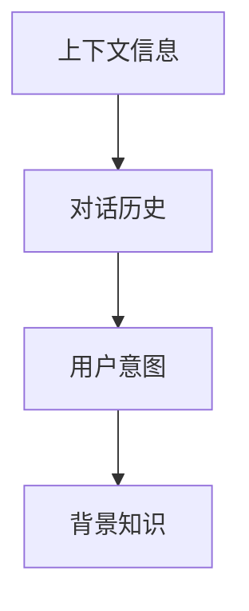
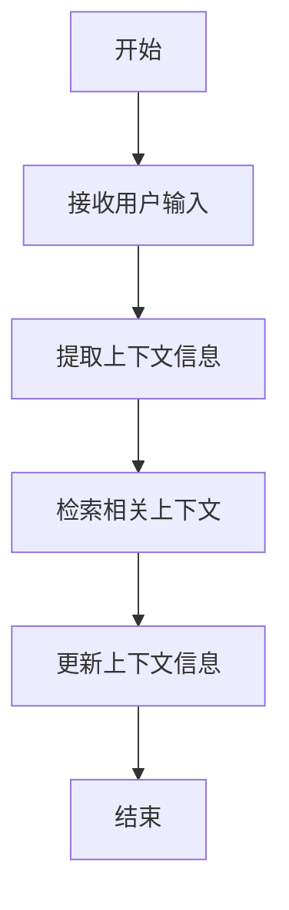
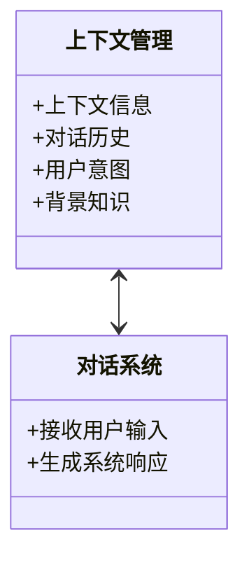

                 

# 上下文管理：增强AI Agent的对话连贯性

> **关键词**：上下文管理，对话系统，AI Agent，连贯性，记忆机制，系统架构

> **摘要**：本文探讨了上下文管理在增强AI Agent对话连贯性中的作用。通过详细分析上下文管理的核心概念、算法原理、系统架构设计以及项目实战，本文为读者提供了从理论到实践的全面指导，帮助理解如何通过有效的上下文管理提升AI Agent的对话能力。

---

# 第1章: 上下文管理的背景与概念

## 1.1 问题背景

在人与人之间的对话中，连贯性是自然且无缝的。然而，当我们将对话任务交给AI Agent时，这种连贯性往往难以实现。AI Agent需要理解对话的上下文，即对话中已经提到的信息、背景知识以及用户意图，才能在后续的交流中保持逻辑性和一致性。

### 1.1.1 对话连贯性的重要性
对话连贯性是指对话中各部分之间逻辑清晰、语义连贯。在AI Agent的应用中，连贯性直接影响用户体验。例如，在智能客服系统中，如果Agent无法记住之前的对话内容，可能会重复询问用户信息，导致用户体验下降。

### 1.1.2 当前对话系统中的挑战
传统的对话系统通常依赖预定义的规则或简单的关键词匹配，难以处理复杂多变的对话场景。当对话超出预定义的规则范围时，系统往往无法有效应对，导致对话中断或不连贯。

### 1.1.3 上下文管理的必要性
上下文管理是解决对话连贯性问题的关键。通过管理对话中的上下文信息，AI Agent可以更好地理解和响应用户的需求，从而提升对话的连贯性和用户体验。

## 1.2 上下文管理的定义与特点

### 1.2.1 上下文的定义
上下文是指在对话过程中，与当前对话相关的所有信息，包括用户的历史输入、系统的历史响应、背景知识等。

### 1.2.2 上下文管理的核心特点
- **动态性**：上下文随着对话的进行不断变化。
- **关联性**：上下文信息之间存在逻辑关联。
- **持久性**：上下文信息需要在对话过程中保持一定的时间范围。

### 1.2.3 上下文管理与传统对话系统的区别
| 特性 | 传统对话系统 | 上下文管理对话系统 |
|------|----------------|---------------------|
| 信息处理方式 | 基于关键词匹配 | 基于上下文信息 |
| 对话连贯性 | 较差 | 较好 |
| 用户体验 | 一般 | 更佳 |

## 1.3 上下文管理的应用领域

### 1.3.1 智能客服中的应用
在智能客服系统中，上下文管理可以帮助系统记住用户的对话历史，避免重复询问信息，提升服务效率。

### 1.3.2 智能助手中的应用
智能助手（如Siri、Alexa）需要通过上下文管理来理解用户的连续对话，提供更自然的交互体验。

### 1.3.3 其他应用场景
- 医疗健康咨询
- 金融投资建议
- 在线教育辅导

## 1.4 上下文管理的边界与外延

### 1.4.1 上下文管理的边界
上下文管理的边界包括：
- 时间范围：上下文信息的有效时间。
- 信息范围：上下文信息的相关性。

### 1.4.2 上下文管理的外延
上下文管理的外延包括：
- 对话历史记录
- 用户意图识别
- 知识库管理

### 1.4.3 上下文管理与其他技术的关系
- **自然语言处理（NLP）**：上下文管理依赖NLP技术来理解对话内容。
- **知识图谱**：上下文管理可以与知识图谱结合，提供更丰富的背景信息。

## 1.5 本章小结

本章介绍了上下文管理的背景、定义、特点以及应用领域。通过对比传统对话系统，明确了上下文管理的重要性和必要性。接下来，我们将深入探讨上下文管理的核心概念与联系。

---

# 第2章: 上下文管理的核心概念与联系

## 2.1 上下文表示与存储

### 2.1.1 上下文表示方法
- **文本表示**：将上下文信息存储为文本形式。
- **向量表示**：将上下文信息表示为向量，便于计算相似性。

### 2.1.2 上下文存储结构
- **数据库存储**：将上下文信息存储在数据库中，支持高效的查询和更新。
- **缓存存储**：使用缓存技术存储最近使用的上下文信息，提升访问速度。

### 2.1.3 上下文表示的优缺点对比（表格）

| 表示方法 | 优点 | 缺点 |
|----------|------|------|
| 文本表示 | 易于理解 | 查询效率低 |
| 向量表示 | 查询效率高 | 对计算资源要求高 |

### 2.1.4 实体关系图（Mermaid）

## 2.2 上下文检索与更新

### 2.2.1 上下文检索算法
- **基于关键词的检索**：通过关键词匹配上下文信息。
- **基于相似度的检索**：通过计算上下文向量的相似度进行检索。

### 2.2.2 上下文更新机制
- **增量更新**：对话过程中逐步更新上下文信息。
- **批量更新**：在特定时间点批量更新上下文信息。

### 2.2.3 上下文检索与更新的流程图（Mermaid）

## 2.3 上下文管理的实体关系图（Mermaid）

## 2.4 本章小结

本章详细讲解了上下文表示与存储的核心概念，分析了上下文检索与更新的实现方法，并通过Mermaid图展示了实体关系。接下来，我们将深入探讨上下文管理的算法原理。

---

（注：由于篇幅限制，后续章节内容将在后续回答中继续补充。）

