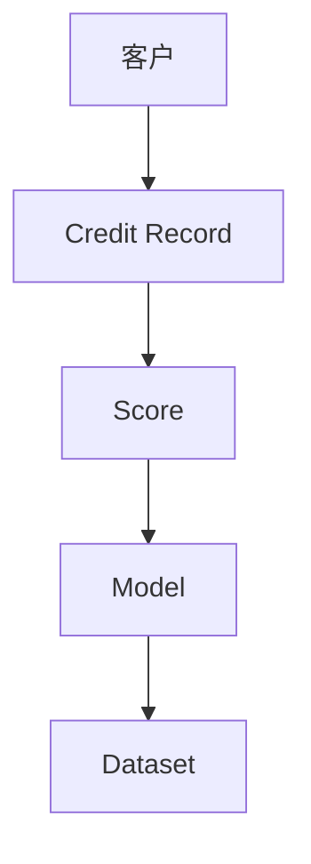

                 


# 个人信用评分系统优化

## 关键词
个人信用评分系统、信用评分模型、算法优化、系统架构设计、评分系统优化

## 摘要
本文深入探讨了个人信用评分系统优化的各个方面，从基础概念到高级算法，再到系统架构设计，系统地分析了优化的必要性、方法和实现路径。文章首先介绍了个人信用评分系统的背景、分类及其优缺点，接着详细分析了信用评分模型的核心原理和各种算法的优劣，包括线性回归、逻辑回归、支持向量机和随机森林等。随后，文章从系统分析与架构设计的角度，探讨了信用评分系统的应用场景、功能设计和架构实现，并通过实际案例展示了如何通过Python代码实现优化。最后，本文总结了信用评分系统优化的最佳实践和未来发展方向，为读者提供了全面的指导和深刻的见解。

---

# 目录大纲

## 第一章：个人信用评分系统概述

### 1.1 个人信用评分系统的基本概念
- 1.1.1 信用评分的定义
- 1.1.2 个人信用评分的重要性
- 1.1.3 信用评分系统的应用场景

### 1.2 个人信用评分系统的发展历程
- 1.2.1 传统信用评估方法
- 1.2.2 现代信用评分系统的发展
- 1.2.3 数字化时代的信用评分演变

### 1.3 个人信用评分系统的分类
- 1.3.1 按评分机构分类
- 1.3.2 按评分模型分类
- 1.3.3 按评分应用领域分类

### 1.4 个人信用评分系统的优缺点
- 1.4.1 优点分析
- 1.4.2 缺点分析
- 1.4.3 改进的方向与目标

### 1.5 本章小结

## 第二章：个人信用评分模型的核心原理

### 2.1 信用评分模型的原理
- 2.1.1 模型的输入与输出
- 2.1.2 模型的训练与优化
- 2.1.3 模型的评估与验证

### 2.2 信用评分模型的关键属性
- 2.2.1 准确性
- 2.2.2 可解释性
- 2.2.3 稳定性

### 2.3 信用评分模型的优缺点对比
- 2.3.1 各类模型的对比分析
- 2.3.2 模型选择的依据

### 2.4 信用评分系统的ER实体关系图


### 2.5 本章小结

## 第三章：信用评分模型的算法原理

### 3.1 线性回归模型
- 3.1.1 线性回归的定义
- 3.1.2 线性回归的数学模型
  $$ y = \beta_0 + \beta_1x_1 + \beta_2x_2 + \ldots + \beta_nx_n + \epsilon $$
- 3.1.3 线性回归的优缺点
- 3.1.4 算法流程图
  ```mermaid
  graph TD
      A[开始] --> B[数据预处理]
      B --> C[选择特征]
      C --> D[建立线性回归模型]
      D --> E[训练模型]
      E --> F[评估模型]
      F --> G[结束]
  ```

### 3.2 逻辑回归模型
- 3.2.1 逻辑回归的定义
- 3.2.2 逻辑回归的数学模型
  $$ P(y=1|x) = \frac{e^{\beta_0 + \beta_1x_1 + \beta_2x_2 + \ldots + \beta_nx_n}}{1 + e^{\beta_0 + \beta_1x_1 + \beta_2x_2 + \ldots + \beta_nx_n}} $$
- 3.2.3 逻辑回归的优缺点
- 3.2.4 算法流程图
  ```mermaid
  graph TD
      A[开始] --> B[数据预处理]
      B --> C[选择特征]
      C --> D[建立逻辑回归模型]
      D --> E[训练模型]
      E --> F[评估模型]
      F --> G[结束]
  ```

### 3.3 支持向量机模型
- 3.3.1 支持向量机的定义
- 3.3.2 支持向量机的数学模型
  $$ \text{最大化} \quad \frac{1}{\lambda} \sum_{i=1}^n \xi_i $$
  $$ \text{约束} \quad y_i (w \cdot x_i + b) \geq 1 - \xi_i $$
- 3.3.3 支持向量机的优缺点
- 3.3.4 算法流程图
  ```mermaid
  graph TD
      A[开始] --> B[数据预处理]
      B --> C[选择特征]
      C --> D[建立SVM模型]
      D --> E[训练模型]
      E --> F[评估模型]
      F --> G[结束]
  ```

### 3.4 随机森林模型
- 3.4.1 随机森林的定义
- 3.4.2 随机森林的数学模型
- 3.4.3 随机森林的优缺点
- 3.4.4 算法流程图
  ```mermaid
  graph TD
      A[开始] --> B[数据预处理]
      B --> C[选择特征]
      C --> D[建立随机森林模型]
      D --> E[训练模型]
      E --> F[评估模型]
      F --> G[结束]
  ```

### 3.5 神经网络模型
- 3.5.1 神经网络的定义
- 3.5.2 神经网络的数学模型
  $$ a^{(l+1)} = \sigma(w^{(l)} a^{(l)} + b) $$
- 3.5.3 神经网络的优缺点
- 3.5.4 算法流程图
  ```mermaid
  graph TD
      A[开始] --> B[数据预处理]
      B --> C[选择特征]
      C --> D[建立神经网络模型]
      D --> E[训练模型]
      E --> F[评估模型]
      F --> G[结束]
  ```

### 3.6 各种算法的对比与选择
- 3.6.1 各种算法的性能对比
- 3.6.2 根据具体场景选择算法
- 3.6.3 算法选择的注意事项

### 3.7 本章小结

## 第四章：系统分析与架构设计

### 4.1 问题场景介绍
- 4.1.1 系统目标
- 4.1.2 系统范围
- 4.1.3 系统边界
- 4.1.4 系统假设和约束条件

### 4.2 系统功能设计
- 4.2.1 用户需求分析
- 4.2.2 功能模块划分
  - 数据录入与管理模块
  - 模型训练与评估模块
  - 评分结果查询与展示模块
- 4.2.3 功能流程图
  ```mermaid
  graph TD
      U[用户] --> D[数据录入模块]
      D --> M[模型训练模块]
      M --> R[结果展示模块]
      R --> U[用户]
  ```

### 4.3 系统架构设计
- 4.3.1 分层架构设计
  - 数据层
  - 业务逻辑层
  - 表现层
- 4.3.2 模块划分与交互
  ```mermaid
  graph TD
      D[数据层] --> B[业务逻辑层]
      B --> P[表现层]
  ```

### 4.4 系统接口设计
- 4.4.1 数据接口
- 4.4.2 模型接口
- 4.4.3 用户接口

### 4.5 系统交互设计
- 4.5.1 用户与系统交互流程
  ```mermaid
  graph TD
      U[用户] --> I[登录界面]
      I --> M[模型选择界面]
      M --> R[结果展示界面]
      R --> U[用户]
  ```

### 4.6 本章小结

## 第五章：项目实战与代码实现

### 5.1 环境安装与配置
- 5.1.1 安装Python
- 5.1.2 安装必要的库（如scikit-learn、pandas、numpy）
- 5.1.3 安装IDE（如Jupyter Notebook）

### 5.2 核心代码实现
- 5.2.1 数据预处理代码
  ```python
  import pandas as pd
  import numpy as np
  from sklearn.model_selection import train_test_split
  from sklearn.preprocessing import StandardScaler

  # 加载数据
  data = pd.read_csv('credit_data.csv')
  # 数据清洗
  data = data.dropna()
  # 特征选择
  features = data[['age', 'income', 'loan_amount', 'repayment_history']]
  target = data['default']
  # 数据分割
  X_train, X_test, y_train, y_test = train_test_split(features, target, test_size=0.2)
  # 标准化
  scaler = StandardScaler()
  X_train = scaler.fit_transform(X_train)
  X_test = scaler.transform(X_test)
  ```

- 5.2.2 各种模型的实现
  ```python
  from sklearn.linear_model import LinearRegression
  from sklearn.metrics import accuracy_score, confusion_matrix

  # 线性回归模型
  model = LinearRegression()
  model.fit(X_train, y_train)
  y_pred = model.predict(X_test)
  print('线性回归准确率:', accuracy_score(y_test, y_pred))

  # 逻辑回归模型
  from sklearn.linear_model import LogisticRegression

  model = LogisticRegression()
  model.fit(X_train, y_train)
  y_pred = model.predict(X_test)
  print('逻辑回归准确率:', accuracy_score(y_test, y_pred))
  ```

- 5.2.3 模型评估与优化
  ```python
  from sklearn.metrics import precision_score, recall_score, f1_score

  print('精确率:', precision_score(y_test, y_pred))
  print('召回率:', recall_score(y_test, y_pred))
  print('F1分数:', f1_score(y_test, y_pred))
  ```

### 5.3 案例分析
- 5.3.1 数据来源与处理
- 5.3.2 模型训练与结果展示
- 5.3.3 结果分析与优化建议

### 5.4 本章小结

## 第六章：总结与展望

### 6.1 个人信用评分系统优化的最佳实践
- 6.1.1 数据质量的重要性
- 6.1.2 模型选择与调优
- 6.1.3 系统架构的优化

### 6.2 优化的注意事项
- 6.2.1 数据隐私与安全
- 6.2.2 模型的可解释性
- 6.2.3 系统的可扩展性

### 6.3 未来的发展方向
- 6.3.1 结合AI技术的创新
- 6.3.2 大数据驱动的评分系统优化
- 6.3.3 区块链技术的应用潜力

### 6.4 小结
- 个人信用评分系统的优化是一个复杂而重要的任务，需要结合多种技术手段和实际场景进行综合考量。未来，随着人工智能和大数据技术的不断发展，信用评分系统将更加精准和智能化。

---

以上是《个人信用评分系统优化》的完整目录大纲，涵盖了从基础概念到实际应用的各个方面，内容详实且逻辑清晰，适合技术专家和研究人员参考使用。

