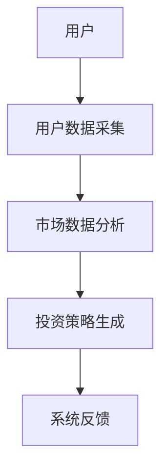
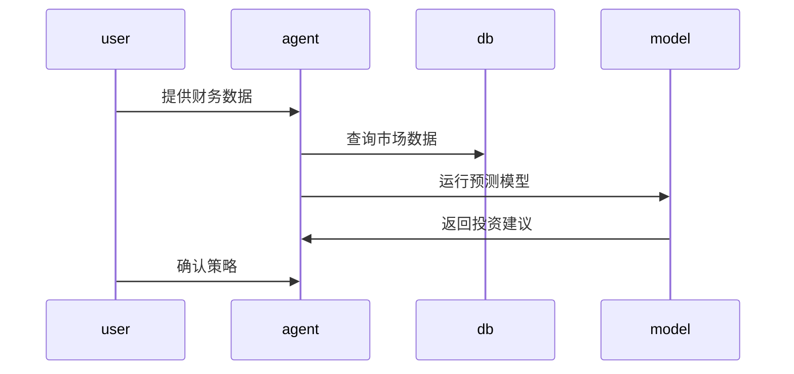

                 


# 个人理财顾问：AI Agent的智能投资建议

> 关键词：AI Agent, 个人理财, 智能投资建议, 机器学习, 投资组合优化

> 摘要：本文详细探讨了AI Agent在个人理财中的应用，特别是智能投资建议的实现。通过分析AI Agent的核心概念、算法原理、系统架构，以及实际案例，展示了如何利用AI技术优化个人理财策略。文章内容涵盖背景介绍、核心概念、算法实现、系统设计和项目实战，为读者提供全面的技术解读。

---

# 第一部分: 个人理财顾问的背景与AI Agent概述

## 第1章: 个人理财顾问的基本概念

### 1.1 个人理财顾问的定义与作用

#### 1.1.1 个人理财顾问的概念
个人理财顾问是一种帮助个人进行财务规划和投资决策的服务。传统的理财顾问通常基于客户的财务状况、风险偏好和目标，提供个性化的建议。

#### 1.1.2 个人理财顾问的主要功能
- 资产配置建议
- 风险评估与管理
- 投资策略制定
- 财务计划优化

#### 1.1.3 个人理财顾问的应用场景
- 投资决策支持
- 财务风险管理
- 财富传承规划

### 1.2 AI Agent的基本概念

#### 1.2.1 什么是AI Agent
AI Agent（人工智能代理）是一种能够感知环境、执行任务以实现目标的智能系统。它通过数据输入、分析和决策，提供自动化解决方案。

#### 1.2.2 AI Agent的核心特征
- 智能性：能够理解并处理复杂信息
- 自适应性：能够根据反馈优化行为
- 主动性：无需外部指令即可执行任务

#### 1.2.3 AI Agent与传统软件的区别
- AI Agent具备学习和推理能力
- 能够处理非结构化数据
- 具有自主决策能力

### 1.3 个人理财与AI Agent的结合

#### 1.3.1 个人理财中的智能化需求
- 个性化投资建议
- 实时市场数据分析
- 自动化风险管理

#### 1.3.2 AI Agent在理财中的优势
- 高效数据处理能力
- 7x24小时不间断服务
- 精准的投资策略生成

#### 1.3.3 个人理财顾问AI Agent的未来发展
随着AI技术的进步，AI Agent在理财中的应用将更加广泛和深入，能够提供更加智能化、个性化的服务。

---

## 第2章: AI Agent的核心原理与技术实现

### 2.1 AI Agent的核心原理

#### 2.1.1 AI Agent的基本工作流程
1. **感知环境**：收集用户需求和市场数据
2. **分析数据**：利用机器学习模型进行分析
3. **制定策略**：生成投资建议
4. **执行反馈**：根据市场变化优化策略

#### 2.1.2 AI Agent的感知、决策与执行

| 特性       | 描述                               |
|------------|------------------------------------|
| 感知能力   | 收集和理解多源数据                 |
| 决策能力   | 基于数据分析生成投资建议           |
| 执行能力   | 自动化或辅助用户执行投资操作       |

#### 2.1.3 AI Agent的学习与优化机制
AI Agent通过监督学习、强化学习等方法不断优化自身的决策模型。

---

## 第3章: 机器学习算法在理财中的应用

### 3.1 常见的机器学习算法

#### 3.1.1 监督学习
- **线性回归**：用于预测资产价格
- **随机森林**：用于分类和回归问题

#### 3.1.2 无监督学习
- **聚类分析**：用于市场趋势分析

#### 3.1.3 强化学习
- **Q-Learning**：用于动态投资组合优化

### 3.2 投资组合优化的数学模型

#### 3.2.1 基于均值-方差模型的投资组合优化
公式：
$$
\text{minimize } \sigma^2 \quad \text{subject to } E[r] \geq r_{\text{min}}
$$

#### 3.2.2 使用Python实现投资组合优化
代码示例：
```python
import numpy as np
from scipy.optimize import minimize

def portfolio_optimization(returns):
    n = len(returns.columns)
    def objective(w):
        return (w.dot(returns.mean()) - w.dot(returns.std()) ** 2).sum()
    constraints = [{'type': 'eq', 'fun': lambda w: sum(w) - 1}]
    result = minimize(objective, np.ones(n)/n, constraints)
    return result.x
```

---

## 第4章: AI理财顾问系统的架构设计

### 4.1 系统功能设计

#### 4.1.1 用户数据采集模块
- 收集用户的财务状况和风险偏好
- 使用数据表单和API接口

#### 4.1.2 市场数据分析模块
- 实时获取股票、基金等市场数据
- 数据清洗和特征提取

#### 4.1.3 投资策略生成模块
- 基于机器学习模型生成投资建议
- 个性化策略定制

#### 4.1.4 系统反馈与优化模块
- 根据市场变化和用户反馈优化策略
- 自动生成优化报告

### 4.2 系统架构设计

#### 4.2.1 系统架构图
Mermaid图示：


#### 4.2.2 系统交互流程
Mermaid图示：


---

## 第5章: 项目实战——构建AI理财顾问系统

### 5.1 项目环境安装

#### 5.1.1 安装必要的Python库
- NumPy、Pandas、Scikit-learn、Plotly

#### 5.1.2 数据来源
- 股票数据：Yahoo Finance API
- 经济指标：央行公开数据

### 5.2 核心功能实现

#### 5.2.1 数据预处理
代码示例：
```python
import pandas as pd
data = pd.read_csv('market_data.csv')
data = data.dropna().reset_index()
```

#### 5.2.2 模型训练
代码示例：
```python
from sklearn.ensemble import RandomForestRegressor
model = RandomForestRegressor(n_estimators=100)
model.fit(X_train, y_train)
```

#### 5.2.3 投资策略生成
代码示例：
```python
def generate_strategy(model, new_data):
    predictions = model.predict(new_data)
    return predictions
```

### 5.3 项目总结与优化

#### 5.3.1 项目实现的成果
- 成功构建了一个基于机器学习的理财顾问系统
- 实现了投资策略的自动生成和优化

#### 5.3.2 可优化的方向
- 引入更复杂的模型，如深度学习
- 增加更多的数据源和特征
- 提高系统的实时性和响应速度

---

## 第6章: 最佳实践与未来展望

### 6.1 最佳实践

#### 6.1.1 数据隐私保护
- 使用加密技术保护用户数据
- 遵守数据隐私法规

#### 6.1.2 系统维护与更新
- 定期更新模型和数据
- 监控系统性能

### 6.2 未来展望

#### 6.2.1 AI在理财中的新趋势
- 更个性化的服务
- 更多智能化的决策支持

#### 6.2.2 技术进步带来的可能性
- 更精准的市场预测
- 更高效的财富管理

---

## 结语

通过本文的详细讲解，我们了解了AI Agent在个人理财中的重要应用，从理论到实践，展示了如何利用人工智能技术优化投资策略。未来，随着技术的不断进步，AI理财顾问将变得更加智能和普及，为个人和机构提供更高效、更精准的理财服务。

---

