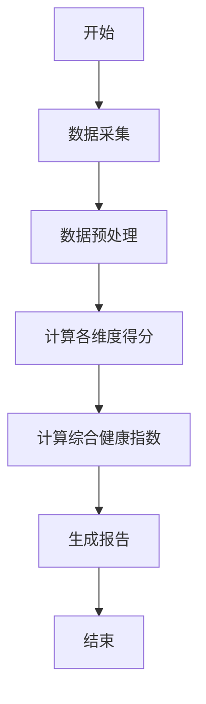
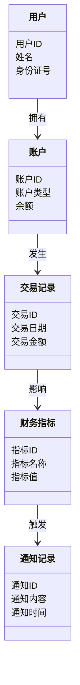
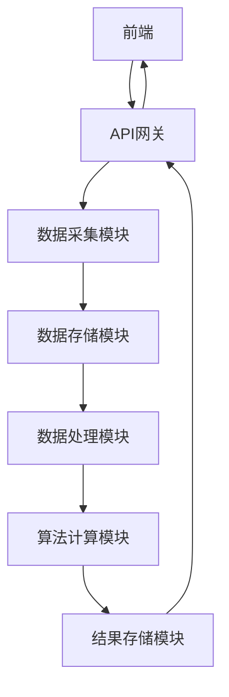
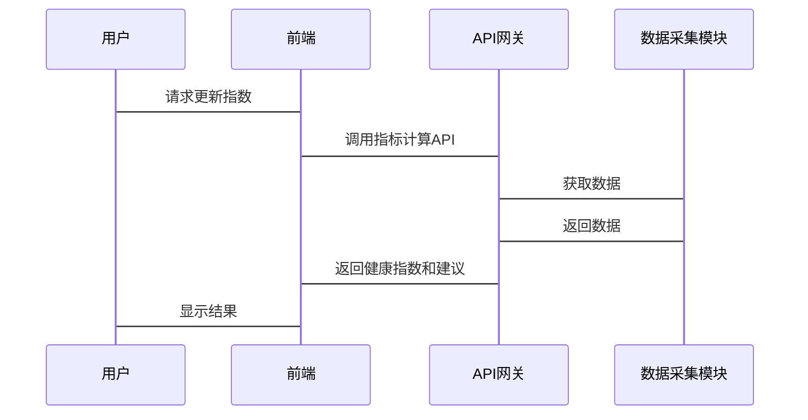

                 


# 个人财务健康指数动态跟踪系统

## 关键词：个人财务、健康指数、动态跟踪、系统设计、算法原理、系统架构

## 摘要：本文介绍了一个实时动态跟踪个人财务健康指数的系统设计。通过分析财务数据，系统提供健康评分和改进建议，帮助用户优化财务管理。文章涵盖背景、核心概念、算法、架构、项目实战和最佳实践。

---

# 第1章：个人财务健康指数动态跟踪系统背景介绍

## 1.1 问题背景

### 1.1.1 个人财务健康的重要性

在现代社会，个人财务健康直接影响生活质量。良好的财务状况能带来安全感和机会，而财务问题可能导致压力和风险。因此，实时跟踪财务健康至关重要。

### 1.1.2 当前财务管理的痛点

- 数据分散：银行、支付宝、股票等数据分散，难以整合。
- 缺乏实时跟踪：手动记录或单点工具难以全面分析。
- 操作复杂：普通用户难以处理财务数据，获取有效建议困难。

### 1.1.3 个人财务健康指数的定义

个人财务健康指数是衡量财务状况的综合指标，包括流动性、信用风险、投资风险、债务负担和消费习惯。

## 1.2 问题描述

### 1.2.1 财务健康指数的核心要素

- 流动性：可快速变现的资产比例。
- 信用风险：负债结构合理性。
- 投资风险：投资分布的健康性。
- 偿债能力：收入覆盖债务情况。
- 消费习惯：消费与收入匹配度。

### 1.2.2 系统目标与范围

- 动态计算指数，提供实时反馈。
- 面向个人用户，支持多数据源。
- 提供个性化改进建议，不直接处理投资决策。

## 1.3 问题解决方法

### 1.3.1 动态跟踪的必要性

及时发现问题，避免潜在风险，如高负债或过度消费。

### 1.3.2 系统设计的核心思想

整合多数据源，实时计算，动态调整指数，提供个性化建议。

### 1.3.3 核心要素组成

数据采集、计算模型、算法、可视化和通知模块。

---

# 第2章：个人财务健康指数动态跟踪系统的核心概念与联系

## 2.1 核心概念

### 2.1.1 财务健康指数的定义与属性

| 属性 | 描述 |
|------|------|
| 流动性 | 可用于支付紧急支出的资产 |
| 信用风险 | 负债结构合理性 |
| 投资风险 | 投资分布的健康性 |
| 偿债能力 | 收入覆盖债务情况 |
| 消费习惯 | 消费与收入匹配度 |

### 2.1.2 ER实体关系图

```mermaid
er
    %% 个人财务健康指数动态跟踪系统 ER 图
    顾客(顾客ID, 姓名, 身份证号)
    账户(账户ID, 账户类型, 余额)
    交易记录(交易ID, 交易日期, 交易金额)
    财务指标(指标ID, 指标名称, 指标值)
    通知记录(通知ID, 通知内容, 通知时间)
    顾客--|{拥有}|账户
    账户--|{发生}|交易记录
    交易记录--|{影响}|财务指标
    财务指标--|{触发}|通知记录
```

---

# 第3章：个人财务健康指数动态跟踪系统的算法原理

## 3.1 算法流程图



## 3.2 算法实现

### 3.2.1 Python源代码

```python
import pandas as pd
import numpy as np

def calculate_health_index(financial_data):
    # 数据预处理
    df = pd.DataFrame(financial_data)
    df['流动性'] = df['现金'] / df['月支出']
    df['信用风险'] = df['信用卡余额'] / df['收入']
    df['投资风险'] = df['高风险投资'] / df['总资产']
    df['偿债能力'] = df['收入'] / df['总债务']
    df['消费习惯'] = df['总支出'] / df['收入']

    # 计算各维度得分
    liquidity_score = np.mean(df['流动性'])
    credit_risk_score = np.mean(df['信用风险'])
    investment_risk_score = np.mean(df['投资风险'])
    debt_capability_score = np.mean(df['偿债能力'])
    consumption_habit_score = np.mean(df['消费习惯'])

    # 综合健康指数计算
    health_index = (
        liquidity_score * 0.3 +
        credit_risk_score * 0.2 +
        investment_risk_score * 0.2 +
        debt_capability_score * 0.15 +
        consumption_habit_score * 0.15
    )
    return health_index
```

### 3.2.2 数学模型

健康指数计算模型：

$$
健康指数 = 0.3 \times 流动性 + 0.2 \times 信用风险 + 0.2 \times 投资风险 + 0.15 \times 偿债能力 + 0.15 \times 消费习惯
$$

---

# 第4章：个人财务健康指数动态跟踪系统的系统分析与架构设计

## 4.1 项目背景

本系统旨在帮助用户实时监控财务健康状况，提供个性化建议，避免财务风险。

## 4.2 系统功能设计

### 4.2.1 领域模型Mermaid类图



## 4.3 系统架构设计

### 4.3.1 Mermaid架构图



### 4.3.2 接口设计与交互流程

#### 4.3.2.1 接口设计

- 数据采集API：收集各账户数据。
- 指标计算API：返回健康指数和建议。
- 通知API：发送财务提醒。

#### 4.3.2.2 交互流程Mermaid序列图



---

# 第5章：个人财务健康指数动态跟踪系统项目实战

## 5.1 环境安装

安装必要的库：

```bash
pip install pandas numpy scikit-learn
```

## 5.2 核心代码实现

### 5.2.1 数据采集函数

```python
import requests

def fetch_financial_data(api_key):
    headers = {'Authorization': f'Bearer {api_key}'}
    response = requests.get('https://api.financialtracker.com/data', headers=headers)
    return response.json()
```

### 5.2.2 计算健康指数

```python
def compute_health_index(financial_data):
    # 计算各指标
    # ... 具体实现 ...
    return health_index
```

## 5.3 案例分析

### 5.3.1 示例数据

假设用户数据如下：

| 账户类型 | 余额 |
|----------|------|
| 活期存款 | 10000|
| 股票     | 50000|
| 信用卡   | 20000|
| 总收入   | 30000|
| 总支出   | 25000|

计算健康指数：

1. 流动性 = 10000 / 25000 = 0.4
2. 信用风险 = 20000 / 30000 = 0.666...
3. 投资风险 = 50000 / (10000+50000+20000) = 0.5
4. 偿债能力 = 30000 / (10000+50000+20000) = 0.25
5. 消费习惯 = 25000 / 30000 = 0.833...

健康指数 = 0.4*0.3 + 0.666*0.2 + 0.5*0.2 + 0.25*0.15 + 0.833*0.15 ≈ 0.67

### 5.3.2 系统输出

健康指数为0.67，建议优化信用卡使用和增加紧急储备金。

## 5.4 项目小结

系统通过整合数据源，实时计算健康指数，帮助用户优化财务管理。代码实现简单，但实际应用中需考虑数据安全和隐私保护。

---

# 第6章：个人财务健康指数动态跟踪系统的最佳实践

## 6.1 小结

本系统通过整合多数据源，实时计算个人财务健康指数，提供个性化建议，帮助用户优化财务状况。

## 6.2 注意事项

- 数据隐私：确保数据传输和存储的安全性。
- 算法局限：健康指数仅提供参考，需结合实际情况。
- 使用场景：适用于个人用户，不处理复杂投资决策。

## 6.3 拓展阅读

- 推荐书籍：《个人理财》、《财务自由之路》
- 工具推荐：Mint、YNAB、Mvelopes

---

# 结语

个人财务健康指数动态跟踪系统通过实时数据分析，帮助用户优化财务管理。从数据采集到算法实现，系统设计全面，功能强大，为用户提供了有效的财务健康评估工具。

