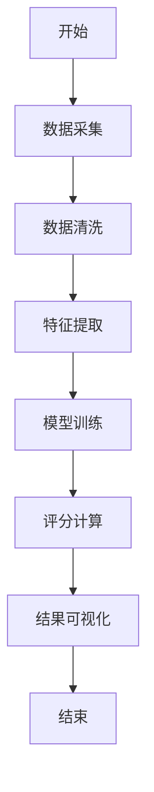
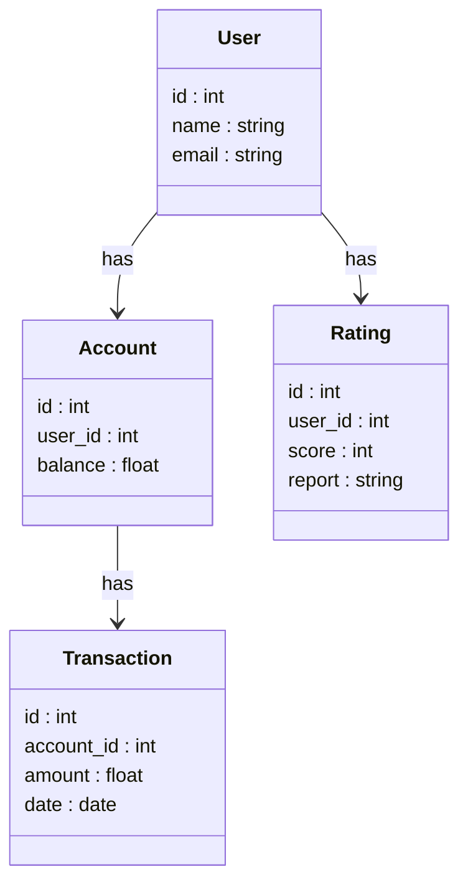

                 


# 个人财务健康评分系统设计

> 关键词：个人财务，评分系统，数据挖掘，机器学习，系统架构

> 摘要：本文旨在设计一个个人财务健康评分系统，通过分析用户的收入、支出、资产、负债等核心数据，结合数据挖掘和机器学习算法，构建一个科学的评分模型，为用户提供个性化的财务健康评估和改进建议。文章从系统设计的核心要素、算法原理、系统架构、项目实战等方面进行详细阐述，帮助读者全面理解个人财务健康评分系统的实现过程。

---

## 目录

### 第一部分：个人财务健康评分系统概述

#### 第1章：个人财务健康评分系统背景与目标

##### 1.1 个人财务健康评分的概念与意义
- 1.1.1 什么是个人财务健康评分
- 1.1.2 个人财务健康评分的重要性
- 1.1.3 系统设计的目标与价值

##### 1.2 个人财务健康评分的核心要素
- 1.2.1 收入与支出分析
- 1.2.2 资产与负债评估
- 1.2.3 财务风险与稳定性

#### 第2章：个人财务健康评分系统的核心概念与联系

##### 2.1 财务健康评分的核心原理
- 2.1.1 数据采集与处理
- 2.1.2 评分模型的设计与实现
- 2.1.3 评分结果的可视化与反馈

##### 2.2 财务健康评分的核心要素对比

| 核心要素 | 描述 | 权重 | 示例 |
|----------|------|------|------|
| 收入     | 收入来源与稳定性 | 30% | 工资、投资收益 |
| 支出     | 日常支出与结构 | 25% | 房租、餐饮、交通 |
| 资产     | 可投资产与流动性 | 20% | 银行存款、股票、房产 |
| 负债     | 个人负债与风险 | 15% | 信用卡欠款、贷款 |
| 风险     | 财务风险评估 | 10% | 债务负担、收入波动 |

##### 2.3 财务健康评分的ER实体关系图

```mermaid
erDiagram
    user {
        id : int
        name : string
        email : string
        password : string
    }
    account {
        id : int
        user_id : int
        balance : float
        type : string
    }
    transaction {
        id : int
        account_id : int
        amount : float
        date : date
        description : string
    }
    rating {
        id : int
        user_id : int
        score : int
        report : string
        timestamp : datetime
    }
    user --> account : has
    account --> transaction : has
    user --> rating : has
```

### 第二部分：个人财务健康评分系统的算法原理

#### 第3章：个人财务健康评分系统的数学模型与算法

##### 3.1 财务健康评分的加权评分法
$$
\text{评分} = \sum_{i=1}^{n} (w_i \times f_i)
$$
其中，\( w_i \) 是第 \( i \) 个要素的权重，\( f_i \) 是第 \( i \) 个要素的评分。

##### 3.2 基于机器学习的评分模型
- 3.2.1 数据预处理与特征提取
- 3.2.2 模型训练与优化
- 3.2.3 模型评估与部署

#### 第4章：评分算法的实现与优化

##### 4.1 算法流程图



##### 4.2 Python实现代码

```python
def calculate_score(income, expenditure, assets, liabilities):
    # 收入与支出评分（权重30%）
    income_score = (income / expenditure) * 0.3
    # 资产与负债评分（权重40%）
    asset_score = (assets / liabilities) * 0.4
    # 风险评分（权重30%）
    risk_score = (income + assets) / (expenditure + liabilities) * 0.3
    total_score = income_score + asset_score + risk_score
    return total_score

# 示例数据
income = 50000
expenditure = 30000
assets = 100000
liabilities = 50000

score = calculate_score(income, expenditure, assets, liabilities)
print(f"财务健康评分为：{score}")
```

### 第三部分：个人财务健康评分系统的系统架构设计

#### 第5章：系统功能设计与实现

##### 5.1 系统功能模块划分
- 用户模块：用户注册与登录
- 数据模块：数据采集与存储
- 评分模块：评分计算与结果展示
- 报告模块：生成财务健康报告

##### 5.2 领域模型类图



#### 第6章：系统架构设计与优化

##### 6.1 系统架构图


##### 6.2 系统接口设计
- 用户登录接口：`POST /login`
- 数据上传接口：`POST /data/upload`
- 评分计算接口：`POST /rating/calculate`

### 第四部分：个人财务健康评分系统的项目实战

#### 第7章：环境搭建与核心代码实现

##### 7.1 环境安装
- 安装Python和必要的库（如Pandas、Scikit-learn）
- 安装前端框架（如React或Vue）

##### 7.2 核心代码实现
- 数据处理代码：读取Excel文件，清洗数据
- 模型训练代码：训练机器学习模型，保存模型
- 接口开发代码：RESTful API实现

#### 第8章：项目小结与经验分享

##### 8.1 项目总结
- 项目目标达成情况
- 实现的关键功能
- 遇到的技术难点与解决方案

### 第五部分：个人财务健康评分系统的最佳实践与拓展

#### 第9章：最佳实践与注意事项

##### 9.1 小结
- 系统设计的核心要素
- 算法实现的关键点
- 系统架构的优化建议

##### 9.2 注意事项
- 数据隐私保护
- 模型的可解释性
- 系统的可扩展性

#### 第10章：拓展阅读与深入学习

##### 10.1 拓展阅读
- 机器学习在金融领域的应用
- 数据挖掘在个人财务管理中的创新
- 财务健康评分的行业标准与规范

---

### 总结
本文从个人财务健康评分系统的背景出发，详细阐述了系统的算法原理、系统架构设计和项目实现过程。通过数学模型、机器学习算法和系统架构的结合，为读者提供了一个全面的个人财务健康评估解决方案。希望本文能为个人财务管理领域的研究和实践提供有价值的参考。

