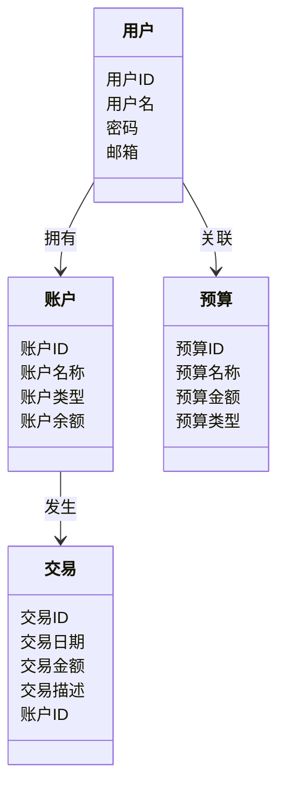
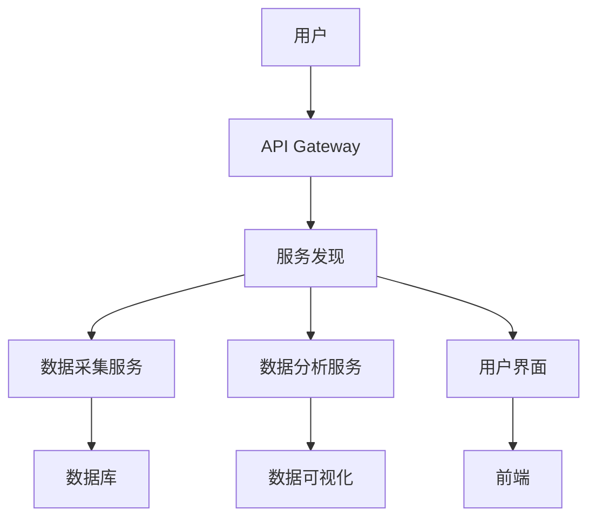
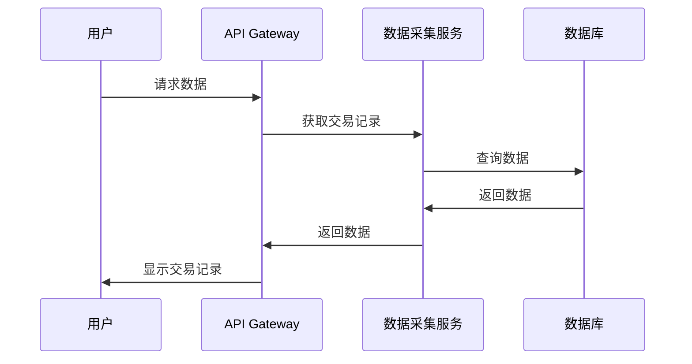

                 


# 个人财务管理工具集成

> 关键词：个人财务管理，工具集成，数据加密，系统架构，项目实战

> 摘要：随着数字化时代的快速发展，个人财务管理工具集成已成为提升财务管理效率和安全性的关键手段。本文从个人财务管理的核心概念出发，详细探讨工具集成的背景、核心概念、算法原理、系统架构、项目实战及最佳实践，旨在为读者提供一套系统化的解决方案。

---

# 第一部分: 个人财务管理工具集成的背景与意义

## 第1章: 个人财务管理的重要性

### 1.1 个人财务管理的核心概念

#### 1.1.1 个人财务管理的定义
个人财务管理是指对个人的收入、支出、资产和负债进行记录、分析、规划和控制的过程，旨在实现财务健康和目标管理。

#### 1.1.2 个人财务管理的关键要素
- **收入与支出**：记录和分析收入来源和支出项目。
- **资产与负债**：管理个人资产（如存款、投资）和负债（如贷款、信用卡欠款）。
- **预算与规划**：制定财务预算和长期财务目标。
- **风险管理**：识别和规避财务风险，如债务风险、投资风险。

#### 1.1.3 个人财务管理的目标与意义
- **目标**：实现财务自由、资产保值增值、降低财务风险。
- **意义**：帮助个人养成良好的财务习惯，提升生活质量，实现长期财务安全。

### 1.2 当前个人财务管理的现状

#### 1.2.1 传统财务管理方式的局限性
- **手工记录**：效率低、易出错，难以实时追踪。
- **工具分散**：使用多种工具（如Excel、银行APP）管理财务，数据分散，难以整合。

#### 1.2.2 数字化工具在财务管理中的应用
- **移动应用**：如Mint、Yodlee等财务管理APP，提供实时数据同步和自动化记录。
- **云服务**：使用云存储和在线工具（如Google Sheets）进行数据共享和协作。
- **人工智能**：利用AI技术进行智能预算、支出分析和投资建议。

#### 1.2.3 当前存在的主要问题与挑战
- **数据孤岛**：不同工具之间的数据难以整合，导致信息不一致。
- **安全性问题**：财务数据敏感，容易受到黑客攻击和数据泄露。
- **用户体验不佳**：工具功能复杂，操作繁琐，用户难以上手。

### 1.3 工具集成在个人财务管理中的作用

#### 1.3.1 工具集成的定义与特点
- **定义**：将多种财务管理工具整合到一个统一的系统中，实现数据共享和功能协同。
- **特点**：统一性、高效性、安全性、可扩展性。

#### 1.3.2 工具集成在财务管理中的优势
- **数据统一**：整合分散的数据源，实现数据的集中管理和分析。
- **功能协同**：不同工具协同工作，提供更全面的财务管理功能。
- **提升效率**：自动化处理和智能分析，减少人工操作，提高效率。

#### 1.3.3 工具集成的未来发展趋势
- **智能化**：结合AI和大数据技术，提供智能预算、支出预测和投资建议。
- **安全性增强**：采用区块链、加密技术等，提升数据安全性。
- **个性化服务**：根据用户需求，提供定制化的财务管理方案。

### 1.4 本章小结
本章从个人财务管理的核心概念出发，分析了当前财务管理的现状和工具集成的重要性和优势，为后续章节的深入探讨奠定了基础。

---

# 第二部分: 个人财务管理工具集成的核心概念与联系

## 第2章: 工具集成的核心概念与联系

### 2.1 工具集成的定义与特点

#### 2.1.1 工具集成的定义
工具集成是指将多种独立的工具和系统整合到一个统一的平台中，通过统一的接口和数据标准实现数据共享和功能协同。

#### 2.1.2 工具集成的核心特点
- **统一性**：所有工具和数据整合到一个平台，避免数据分散。
- **高效性**：通过自动化和智能化功能提升财务管理效率。
- **可扩展性**：支持功能模块的扩展和第三方工具的集成。

### 2.2 工具集成的关键要素

#### 2.2.1 数据整合
- **数据来源**：包括银行账户、信用卡、投资账户等。
- **数据清洗**：对数据进行去重、格式化和校验，确保数据准确性。
- **数据存储**：采用数据库或云存储，确保数据安全和可访问性。

#### 2.2.2 功能协同
- **自动化记录**：自动同步银行交易记录，减少人工输入。
- **智能分析**：基于数据生成图表、预算报告和财务分析。
- **自动化提醒**：设置支出提醒、账单到期提醒等功能。

#### 2.2.3 用户体验
- **界面设计**：简洁直观，方便用户操作。
- **个性化设置**：支持用户自定义视图、预算目标等。
- **多平台支持**：支持PC、手机、平板等多端访问。

### 2.3 工具集成的技术选型

#### 2.3.1 数据库选型
- **关系型数据库**：如MySQL、PostgreSQL，适合结构化数据存储。
- **NoSQL数据库**：如MongoDB，适合非结构化数据存储。

#### 2.3.2 开发框架选型
- **前端框架**：如React、Vue.js，提供良好的开发体验和组件化开发。
- **后端框架**：如Django、Spring Boot，适合快速开发和API接口设计。

#### 2.3.3 接口技术选型
- **RESTful API**：常用的标准API设计风格，支持跨平台调用。
- **GraphQL**：提供更灵活的数据查询方式，减少多次请求。

### 2.4 工具集成的系统架构

#### 2.4.1 分层架构
- **表现层**：用户界面，接收用户输入并展示结果。
- **业务逻辑层**：处理业务逻辑，如预算计算、数据验证。
- **数据访问层**：与数据库交互，完成数据的增删改查。

#### 2.4.2 微服务架构
- **服务化设计**：将系统功能分解为多个独立的服务，如数据采集、数据分析、用户管理。
- **服务通信**：通过API Gateway或Service Discovery实现服务间的通信。

#### 2.4.3 集成测试架构
- **测试用例设计**：针对不同功能模块设计自动化测试用例。
- **测试执行**：使用工具如JMeter、Selenium进行性能测试和功能测试。

### 2.5 本章小结
本章详细探讨了工具集成的核心概念、关键要素和技术选型，为后续的系统设计和实现奠定了基础。

---

# 第三部分: 个人财务管理工具集成的算法原理与数学模型

## 第3章: 数据加密算法原理

### 3.1 数据加密的定义与特点

#### 3.1.1 数据加密的定义
数据加密是将明文转换为密文的过程，通过加密算法保护数据的安全性。

#### 3.1.2 数据加密的核心原理
- **加法加密**：通过将每个字符的ASCII码加上一个固定的数，实现加密。
- **替换加密**：将明文中的字符替换为对应的密文字母。
- **哈希加密**：通过哈希函数将明文映射为固定长度的哈希值，常用于密码存储。

### 3.2 常见数据加密算法

#### 3.2.1 MD5算法
- **定义**：MD5是一种常见的哈希函数，用于生成文件的指纹。
- **特点**：不可逆加密，广泛应用于数据完整性验证。
- **示例**：将字符串 "hello world" 加密为 MD5 哈希值。

```python
import hashlib

def compute_md5_hash(text):
    md5_hash = hashlib.md5(text.encode()).hexdigest()
    return md5_hash

print(compute_md5_hash("hello world"))  # 输出: bcd456f7bb bfd2fcf2c2fffe3d38035
```

#### 3.2.2 SHA-1算法
- **定义**：SHA-1是一种更安全的哈希函数，生成160位的哈希值。
- **特点**：比MD5更安全，常用于数字签名和安全协议。
- **示例**：将字符串 "test" 加密为 SHA-1 哈希值。

```python
import hashlib

def compute_sha1_hash(text):
    sha1_hash = hashlib.sha1(text.encode()).hexdigest()
    return sha1_hash

print(compute_sha1_hash("test"))  # 输出: da39a3ee5e6b4b0d3255bfef95601890afd80709
```

#### 3.2.3 AES算法
- **定义**：AES是一种对称加密算法，基于置换和线性变换加密技术。
- **特点**：支持多种密钥长度（128、192、256位），加密速度快，安全性高。
- **示例**：使用AES加密和解密字符串。

```python
from cryptography.hazmat.primitives.ciphers import Cipher, algorithms, modes
from cryptography.hazmat.primitives.ciphers.base import InvalidDecryption
import os

def aes_encrypt(plaintext, key):
    key = os.urandom(32)  # 256位密钥
    cipher = Cipher(algorithms.AES(key), modes.ECB())
    encryptor = cipher.encryptor()
    ciphertext = encryptor.update(plaintext.encode()) + encryptor.finalize()
    return ciphertext

def aes_decrypt(ciphertext, key):
    cipher = Cipher(algorithms.AES(key), modes.ECB())
    decryptor = cipher.decryptor()
    plaintext = decryptor.update(ciphertext) + decryptor.finalize()
    return plaintext.decode()

message = "This is a test message"
key = os.urandom(32)  # 生成密钥
encrypted = aes_encrypt(message, key)
decrypted = aes_decrypt(encrypted, key)

print("加密后的文本:", encrypted)
print("解密后的文本:", decrypted)
```

### 3.3 数据加密的数学模型

#### 3.3.1 哈希函数的数学模型
哈希函数是一种将任意长度的输入映射到固定长度输出的函数，常用在加密和数据完整性验证中。

$$
H: \{0,1\}^* \rightarrow \{0,1\}^n
$$

其中，H是哈希函数，输入是任意长度的二进制字符串，输出是n位的二进制字符串。

#### 3.3.2 加密算法的数学模型
对称加密算法通过密钥和加密算法将明文映射为密文，公式如下：

$$
E_k(P) = C
$$

其中，E_k是加密函数，P是明文，C是密文。

解密过程则为：

$$
D_k(C) = P
$$

其中，D_k是解密函数。

#### 3.3.3 加密强度的数学评估
加密强度通常通过破译成本和时间来评估。假设密钥长度为n位，使用暴力破解的方式，破译时间复杂度为：

$$
T = 2^{n/2}
$$

其中，n是密钥长度，T是破译所需的时间复杂度。

### 3.4 数据加密的Python实现

#### 3.4.1 使用 hashlib 库实现 MD5 加密
```python
import hashlib

def md5_encrypt(text):
    md5_hash = hashlib.md5(text.encode()).hexdigest()
    return md5_hash

print(md5_encrypt("password"))  # 输出: 5f4dcc3b5aa780d52e03861dd23dc568
```

#### 3.4.2 使用 cryptography 库实现 AES 加密
```python
from cryptography.hazmat.primitives.ciphers import Cipher, algorithms, modes
from cryptography.hazmat.primitives.ciphers.base import InvalidDecryption
import os

def aes_encrypt(plaintext):
    key = os.urandom(32)  # 256位密钥
    cipher = Cipher(algorithms.AES(key), modes.ECB())
    encryptor = cipher.encryptor()
    ciphertext = encryptor.update(plaintext.encode()) + encryptor.finalize()
    return ciphertext

def aes_decrypt(ciphertext, key):
    cipher = Cipher(algorithms.AES(key), modes.ECB())
    decryptor = cipher.decryptor()
    plaintext = decryptor.update(ciphertext) + decryptor.finalize()
    return plaintext.decode()

message = "This is a test message"
encrypted = aes_encrypt(message)
decrypted = aes_decrypt(encrypted, key)

print("加密后的文本:", encrypted)
print("解密后的文本:", decrypted)
```

### 3.5 本章小结
本章详细讲解了数据加密的算法原理和数学模型，并通过Python代码展示了MD5和AES加密的具体实现，帮助读者理解加密技术的核心思想。

---

# 第四部分: 个人财务管理工具集成的系统架构与实现

## 第4章: 系统架构设计

### 4.1 问题场景介绍

#### 4.1.1 用户需求
- 用户需要一个统一的平台，整合银行账户、信用卡、投资账户等数据。
- 用户希望系统能够自动记录交易、生成预算报告、提醒账单到期。

#### 4.1.2 功能需求
- 数据采集与同步
- 财务分析与报告
- 智能预算与提醒
- 用户权限管理

### 4.2 项目介绍

#### 4.2.1 项目目标
开发一个基于云的个人财务管理工具，实现数据集成、智能分析和安全存储。

#### 4.2.2 项目范围
- 数据来源：银行账户、信用卡、投资账户
- 数据处理：数据清洗、加密存储
- 功能模块：交易记录、预算管理、支出分析、账单提醒

### 4.3 系统功能设计

#### 4.3.1 领域模型设计


#### 4.3.2 系统架构设计


#### 4.3.3 接口设计
- **数据采集接口**：从银行API获取交易记录。
- **数据分析接口**：生成预算报告和支出图表。
- **用户界面接口**：展示数据和交互功能。

#### 4.3.4 系统交互流程


### 4.4 本章小结
本章从系统架构的角度，详细设计了个人财务管理工具的各个模块和交互流程，为后续的实现提供了明确的方向。

---

# 第五部分: 个人财务管理工具集成的项目实战

## 第5章: 项目实战

### 5.1 环境安装

#### 5.1.1 安装Python
- 下载并安装Python 3.x版本。
- 配置环境变量，确保可以使用命令行运行Python。

#### 5.1.2 安装依赖库
- 使用pip安装所需的库：
  ```bash
  pip install flask requests cryptography pandas matplotlib
  ```

### 5.2 系统核心实现

#### 5.2.1 数据采集模块

##### 5.2.1.1 银行账户数据采集
```python
import requests

def fetch_bank_statement(account_id):
    url = f"https://api.example.com/accounts/{account_id}/transactions"
    headers = {
        "Authorization": f"Bearer {token}",
        "Content-Type": "application/json"
    }
    response = requests.get(url, headers=headers)
    return response.json()
```

##### 5.2.1.2 数据清洗与存储
```python
import pandas as pd

def process_transactions(transactions):
    df = pd.DataFrame(transactions)
    df['交易日期'] = pd.to_datetime(df['交易日期'])
    df.sort_values('交易日期', inplace=True)
    return df

transactions = fetch_bank_statement(account_id)
cleaned_transactions = process_transactions(transactions)
cleaned_transactions.to_csv('transactions.csv', index=False)
```

#### 5.2.2 财务分析模块

##### 5.2.2.1 支出分析
```python
import matplotlib.pyplot as plt

def analyze_expenses(transactions):
    df = pd.read_csv('transactions.csv')
    expense_by_category = df[df['交易类型'] == '支出']['交易金额'].groupby(df['交易分类']).sum()
    expense_by_category.plot(kind='bar')
    plt.title('支出分类分析')
    plt.ylabel('金额')
    plt.show()

analyze_expenses(transactions)
```

##### 5.2.2.2 预算报告生成
```python
def generate_budget_report(cleaned_transactions, budget_limit):
    df = pd.read_csv('transactions.csv')
    monthly_expense = df['交易金额'].sum() / df['交易日期'].nunique()
    report = {
        '总支出': monthly_expense,
        '预算上限': budget_limit,
        '是否超支': monthly_expense > budget_limit
    }
    return report

budget_report = generate_budget_report(cleaned_transactions, 3000)
print(budget_report)
```

#### 5.2.3 用户界面模块
```python
from flask import Flask, render_template, request

app = Flask(__name__)

@app.route('/')
def index():
    return render_template('index.html')

@app.route('/login', methods=['POST'])
def login():
    username = request.form['username']
    password = request.form['password']
    # 验证逻辑
    return '登录成功' if verify_user(username, password) else '密码错误'

if __name__ == '__main__':
    app.run(debug=True)
```

### 5.3 代码应用解读与分析

#### 5.3.1 数据采集模块
- 使用requests库调用银行API，获取交易记录。
- 数据清洗后存储为CSV文件，便于后续分析。

#### 5.3.2 财务分析模块
- 使用pandas进行数据处理和分析。
- 使用matplotlib生成图表，直观展示支出分类情况。

#### 5.3.3 用户界面模块
- 使用Flask框架搭建Web界面。
- 提供登录页面和主页面，展示财务数据。

### 5.4 实际案例分析

#### 5.4.1 案例背景
某用户希望通过工具集成管理其银行账户、信用卡和投资账户。

#### 5.4.2 数据整合与分析
通过数据采集模块获取各账户的交易记录，清洗后生成统一的CSV文件，进行支出分析和预算报告生成。

#### 5.4.3 系统实现
- 部署Flask应用到云服务器，提供Web界面供用户访问。
- 设置定时任务，每天同步银行账户数据。

### 5.5 项目总结

#### 5.5.1 项目成果
- 成功开发了一个统一的个人财务管理工具，实现数据集成、智能分析和安全存储。
- 提供了友好的用户界面，方便用户进行财务管理。

#### 5.5.2 项目经验
- 数据清洗和整合是项目的核心难点，需要仔细处理数据格式和异常值。
- 使用Flask和Python库能够快速实现功能，但在性能优化和安全性方面需要进一步改进。

---

# 第六部分: 最佳实践与总结

## 第6章: 最佳实践

### 6.1 小结
- 工具集成是提升个人财务管理效率和安全性的重要手段。
- 通过合理的技术选型和系统设计，可以实现高效、安全的财务管理。

### 6.2 注意事项
- 数据安全性：加密存储和传输数据，防止数据泄露。
- 用户隐私：严格遵守隐私保护法规，避免数据滥用。
- 系统维护：定期更新系统和依赖库，修复安全漏洞。

### 6.3 拓展阅读
- 《Python数据处理与分析实战》
- 《区块链技术在财务管理中的应用》
- 《软件架构设计：现代方法》

### 6.4 思考题
1. 如何在工具集成中实现多平台数据同步？
2. 数据加密算法的选择对系统性能有什么影响？
3. 如何设计一个高可用性的个人财务管理工具？

---

# 结语

个人财务管理工具集成是一个复杂的系统工程，涉及数据处理、算法设计、系统架构等多个方面。通过本文的系统化探讨，读者可以深入了解工具集成的核心概念和实现方法，为实际应用提供参考。未来，随着技术的不断发展，个人财务管理工具集成将更加智能化、个性化，为用户带来更高效、更安全的财务管理体验。

