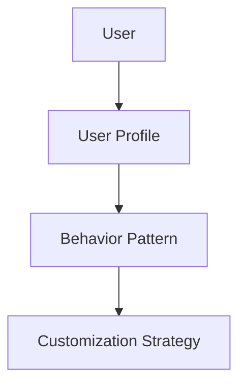
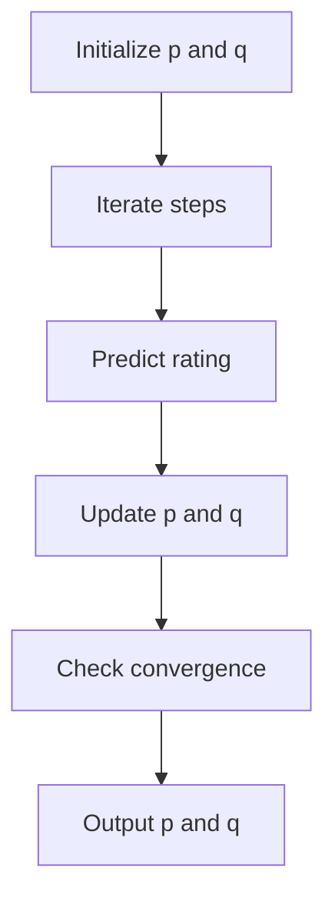
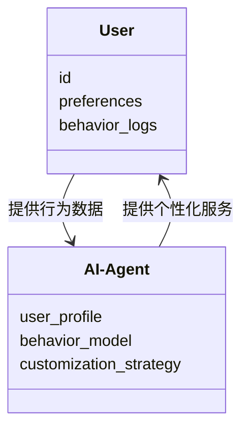

                 


# 个性化定制：为不同用户调整AI Agent的行为

## 关键词：
- AI Agent，个性化定制，行为调整，用户需求，系统架构

## 摘要：
本文探讨如何为不同用户提供个性化的AI Agent行为调整方案，涵盖背景分析、核心概念、算法原理、系统架构及项目实战，通过详细的技术分析和案例展示，提供实现个性化定制的有效方法。

---

# 1. 个性化定制的背景与概念

## 1.1 问题背景

AI Agent的发展现状表明，尽管其在自动化任务处理方面表现出色，但缺乏灵活性，无法适应用户的个性化需求。随着AI技术的普及，用户期望AI Agent能够根据他们的特定需求和偏好调整行为，以提供更高效的服务。

### 1.1.1 AI Agent的发展现状
AI Agent已广泛应用于智能助手、推荐系统等领域，但其行为通常是基于统一的规则，难以适应不同用户的多样化需求。

### 1.1.2 个性化定制的需求驱动
用户希望AI Agent能够根据他们的使用习惯、偏好和特定场景调整响应方式，从而提升用户体验。

### 1.1.3 当前AI Agent的局限性
现有AI Agent的行为模式单一，难以满足用户个性化需求，导致用户体验不佳，应用范围受限。

## 1.2 问题描述

个性化定制的核心问题是为AI Agent赋予适应不同用户需求的能力，使其能够根据用户输入动态调整行为。

### 1.2.1 用户需求的多样性
用户在使用AI Agent时，可能有不同的偏好、习惯和场景需求，这要求AI Agent能够识别并适应这些差异。

### 1.2.2 AI Agent行为的统一性
传统AI Agent的行为模式是固定的，无法根据用户需求动态调整，这限制了其应用的灵活性和用户满意度。

### 1.2.3 个性化定制的核心问题
如何在统一架构下实现个性化定制，同时保持系统高效性和稳定性，是当前面临的主要挑战。

## 1.3 问题解决与边界

### 1.3.1 个性化定制的目标
通过分析用户需求，动态调整AI Agent的行为模式，以提高用户体验和任务处理效率。

### 1.3.2 解决方案的边界
个性化定制仅针对用户需求和行为的可定制部分，边界包括用户隐私保护、系统性能优化等。

### 1.3.3 相关概念的外延
个性化定制不仅涉及用户需求的分析，还包括行为预测和策略生成等多方面内容。

---

# 2. 个性化定制的核心概念与联系

## 2.1 核心概念原理

个性化定制依赖于对用户需求的准确分析和行为预测模型的构建。

### 2.1.1 用户需求分析
通过数据采集和处理，识别用户的偏好、习惯和潜在需求。

### 2.1.2 行为预测模型
基于历史数据，构建模型预测用户在不同场景下的行为，为定制策略生成提供依据。

### 2.1.3 定制策略生成
根据用户需求和行为预测结果，生成个性化的AI Agent行为调整策略。

## 2.2 核心概念对比

通过对比分析，明确不同定制方法的优劣。

### 2.2.1 不同定制方法的对比
| 方法 | 基于特征 | 基于行为 | 基于反馈 |
|------|----------|----------|----------|
| 描述 | 基于用户特征进行定制 | 根据用户行为数据调整 | 通过用户反馈优化 |

### 2.2.2 核心要素的特征分析
用户需求、行为数据、反馈机制是个性化定制的三大核心要素。

### 2.2.3 实体关系图


---

# 3. 算法原理与实现

## 3.1 算法原理

基于用户特征的推荐算法是实现个性化定制的核心方法。

### 3.1.1 矩阵分解方法
矩阵分解通过降维技术，将用户-物品的交互数据分解为潜在因子，以捕捉用户偏好。

#### 3.1.1.1 矩阵分解公式
$$ R_{u_i} = \sum_{k=1}^K p_{u_i,k} q_{i,k} $$

其中，$R_{u_i}$表示用户$u_i$对物品$i$的评分，$p_{u_i,k}$和$q_{i,k}$分别是用户和物品的潜在因子。

### 3.1.1.2 算法流程
1. 初始化潜在因子矩阵。
2. 迭代优化，最小化预测误差。
3. 更新潜在因子，直至收敛。

### 3.1.1.3 示例
假设我们有一个用户-电影评分矩阵，使用矩阵分解将其分解为用户潜在因子矩阵和电影潜在因子矩阵，从而预测未评分电影的得分。

## 3.2 算法实现

### 3.2.1 Python代码实现
```python
import numpy as np

def matrix_factorization(R, k, steps=500, learning_rate=0.01):
    # 初始化潜在因子矩阵
    p = np.random.randn(n_users, k)
    q = np.random.randn(n_items, k)
    
    # 迭代优化
    for step in range(steps):
        for i in range(n_users):
            for j in range(n_items):
                if R[i][j] > 0:
                    e = R[i][j] - np.dot(p[i], q[j])
                    # 更新p和q
                    p[i] += learning_rate * (e * q[j])
                    q[j] -= learning_rate * (e * p[i])
        learning_rate *= 0.95
    return p, q
```

### 3.2.2 算法流程图（Mermaid）


---

# 4. 系统分析与架构设计

## 4.1 问题场景介绍

### 4.1.1 用户需求分析
用户可能需要AI Agent根据他们的使用习惯调整推荐内容、交互方式等。

### 4.1.2 系统功能模块
- 用户数据采集模块
- 行为分析模块
- 定制策略生成模块

### 4.1.3 项目目标
构建一个能够动态调整AI Agent行为的系统，满足用户的个性化需求。

## 4.2 系统功能设计

### 4.2.1 用户数据采集
通过日志记录用户与AI Agent的交互数据，提取用户偏好和行为模式。

### 4.2.2 行为分析模块
利用机器学习模型分析用户数据，预测用户行为，生成定制策略。

### 4.2.3 定制策略生成
根据分析结果，动态调整AI Agent的行为模式，以适应用户的个性化需求。

## 4.3 系统架构图（Mermaid）


---

# 5. 项目实战与案例分析

## 5.1 环境安装

### 5.1.1 开发环境配置
- Python 3.8+
- Jupyter Notebook
- pip packages: numpy, scikit-learn, matplotlib

### 5.1.2 依赖库安装
```bash
pip install numpy scikit-learn matplotlib
```

## 5.2 核心代码实现

### 5.2.1 用户数据处理
```python
import pandas as pd

# 加载用户行为数据
data = pd.read_csv('user_behavior.csv')
```

### 5.2.2 行为预测模型
```python
from sklearn.metrics.pairwise import cosine_similarity

def predict_behavior(user_vector):
    return cosine_similarity(user_vector, item_vectors)
```

### 5.2.3 定制策略生成
```python
def generate_customization_strategy(user_id, predicted_behavior):
    strategy = {
        'recommendation': predicted_behavior,
        'interaction_mode': 'proactive'
    }
    return strategy
```

## 5.3 案例分析

### 5.3.1 环境安装与数据加载
安装依赖库并加载用户行为数据。

### 5.3.2 行为预测与策略生成
基于用户数据，预测其行为并生成定制策略。

### 5.3.3 案例分析与结果展示
通过实际案例分析，展示个性化定制的效果和改进空间。

## 5.4 项目小结
个性化定制项目成功实现了AI Agent行为的动态调整，提升了用户体验，但仍有优化空间。

---

# 6. 最佳实践与总结

## 6.1 总结与经验

个性化定制是实现AI Agent智能化的重要手段，通过准确分析用户需求和行为，动态调整系统行为，能够显著提升用户体验。

## 6.2 注意事项

- 数据隐私保护
- 系统性能优化
- 定制策略的可解释性

## 6.3 拓展阅读

建议深入研究强化学习在个性化定制中的应用，探索更复杂的动态调整方法。

---

# 结语

个性化定制为AI Agent的行为调整提供了新的思路，通过系统的分析与实践，我们能够构建出更智能、更高效的AI系统，更好地服务于不同用户的需求。

