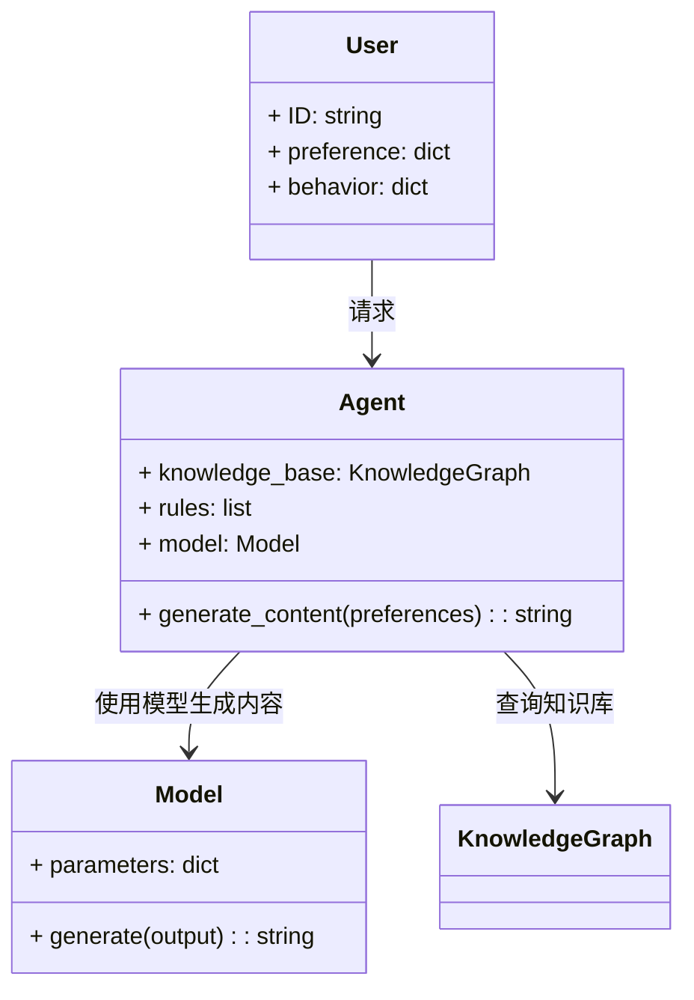

                 


# 个性化定制：打造独特风格的AI Agent

## 关键词：个性化定制、AI Agent、自然语言生成、机器学习、用户行为分析

## 摘要：  
个性化定制是打造独特风格的AI Agent的核心，本文将从背景、概念、算法原理、数学模型、系统架构设计、项目实战等多个维度详细阐述如何实现个性化定制的AI Agent。通过分析用户需求和行为，结合自然语言生成技术和机器学习算法，本文提供了一套完整的个性化定制AI Agent解决方案。

---

# 第一部分: 个性化定制与AI Agent概述

## 第1章: 个性化定制与AI Agent的背景介绍

### 1.1 个性化定制的定义与特点
个性化定制是指根据用户的需求、偏好和行为，动态调整系统输出或服务内容的过程。其特点包括：  
1. **动态性**：能够根据用户的实时反馈进行调整。  
2. **针对性**：针对不同用户输出不同的内容或服务。  
3. **多样性**：支持多种风格和形式的定制化输出。  

### 1.2 AI Agent的基本概念与功能
AI Agent是一种智能代理系统，能够感知环境、理解用户需求并执行任务。其核心功能包括：  
1. **感知环境**：通过传感器或API获取外部信息。  
2. **理解需求**：利用自然语言处理技术解析用户意图。  
3. **执行任务**：根据用户需求生成相应内容或采取行动。  

### 1.3 个性化定制在AI Agent中的必要性
个性化定制能够显著提升用户体验，增强系统的适用性和商业价值。通过分析用户行为数据，AI Agent可以为用户提供更精准的服务，从而提高用户满意度和忠诚度。

---

## 第2章: 个性化定制的核心概念与联系

### 2.1 核心概念原理
个性化定制的实现依赖于以下几个关键步骤：  
1. **用户需求分析**：通过数据采集和建模理解用户需求。  
2. **生成策略制定**：基于用户需求设计生成规则或模型。  
3. **动态调整优化**：根据用户反馈持续优化生成策略。  

### 2.2 概念属性特征对比表
| 概念 | 属性 | 特征对比 |  
|------|------|----------|  
| 个性化定制 | 输入 | 用户需求、行为数据 |  
|          | 输出 | 独特风格的生成内容 |  
| 非个性化定制 | 输入 | 固定规则或模板 |  
|          | 输出 | 标准化内容或服务 |  

### 2.3 ER实体关系图
```mermaid
er
actor: 用户
agent: AI Agent
rule: 定制规则
data: 用户数据
goal: 生成目标
output: 生成内容

actor --> rule
rule --> goal
goal --> output
actor --> data
data --> agent
agent --> output
```

---

## 第3章: 个性化定制AI Agent的算法原理

### 3.1 基于规则的生成算法
基于规则的生成算法通过预定义的规则生成输出内容。  
#### 步骤：
1. **规则定义**：根据用户需求制定生成规则。  
2. **内容生成**：根据规则生成内容。  
3. **结果校验**：检查生成内容是否符合预期。  

#### 示例代码：
```python
def generate_content(rule_set):
    for rule in rule_set:
        if rule.matches_condition():
            return rule.generate_output()
    return default_output
```

---

### 3.2 基于增强学习的生成算法
增强学习通过奖励机制优化生成策略。  
#### 步骤：
1. **环境交互**：AI Agent与用户交互。  
2. **状态感知**：感知当前状态。  
3. **动作选择**：根据状态选择动作。  
4. **奖励反馈**：根据结果获得奖励或惩罚。  

#### 示例代码：
```python
class Agent:
    def __init__(self, model):
        self.model = model
    def act(self, state):
        action = self.model.predict(state)
        return action
```

---

### 3.3 基于知识图谱的生成算法
知识图谱通过结构化数据生成内容。  
#### 步骤：
1. **数据建模**：构建领域知识图谱。  
2. **路径规划**：根据用户需求规划生成路径。  
3. **内容生成**：根据路径生成内容。  

#### 示例代码：
```python
from kg import KnowledgeGraph
kg = KnowledgeGraph()
result = kg.generate_content(user_query)
```

---

## 第4章: 个性化定制AI Agent的数学模型与公式

### 4.1 概率论基础
1. **条件概率**：$P(A|B) = \frac{P(A \cap B)}{P(B)}$  
2. **贝叶斯定理**：$P(A|B) = \frac{P(B|A)P(A)}{P(B)}$  

### 4.2 优化算法
1. **最大似然估计**：$\theta = \arg\max_{\theta} \sum_{i=1}^n \log P(x_i|\theta)$  
2. **梯度下降**：$\theta_{t+1} = \theta_t - \eta \nabla J(\theta_t)$  

### 4.3 生成模型
1. **变分自编码器（VAE）**：  
   - 编码器：$q(z|x)$  
   - 解码器：$p(x|z)$  
2. **生成对抗网络（GAN）**：  
   - 生成器：$G(z)$  
   - 判别器：$D(x)$  

---

## 第5章: 系统分析与架构设计

### 5.1 问题场景介绍
用户希望AI Agent能够根据其偏好生成个性化内容，如文本、图像等。  

### 5.2 系统功能设计


### 5.3 系统架构设计


### 5.4 系统接口设计
1. **输入接口**：用户输入偏好和需求。  
2. **输出接口**：生成内容或服务。  

### 5.5 系统交互流程
```mermaid
sequenceDiagram
    actor 用户
    participant 系统
    participant 知识库
    actor 用户 -> 系统: 提交需求
    系统 -> 知识库: 查询规则
    知识库 --> 系统: 返回规则
    系统 -> 系统: 生成内容
    系统 --> 用户: 返回结果
```

---

## 第6章: 项目实战

### 6.1 环境安装
安装所需的依赖库：  
```bash
pip install numpy pandas scikit-learn
```

### 6.2 核心代码实现
```python
import numpy as np
from sklearn.metrics.pairwise import cosine_similarity

def personalized_agent(user_input):
    # 分析用户输入
    user_profile = analyze(user_input)
    # 生成内容
    content = generate(user_profile)
    return content

def analyze(user_input):
    # 简单的用户分析逻辑
    return user_input

def generate(profile):
    # 简单的内容生成逻辑
    return f"个性化内容：{profile}"
```

### 6.3 案例分析
假设用户输入为“我想写一篇关于AI的博客”，系统生成如下内容：  
```python
user_input = "我想写一篇关于AI的博客"
result = personalized_agent(user_input)
print(result)  # 输出：个性化内容：想写一篇关于AI的博客
```

### 6.4 项目小结
通过上述代码示例，我们可以看到个性化定制AI Agent的基本实现流程。实际应用中需要结合具体业务需求优化算法和模型。

---

## 第7章: 总结与展望

### 7.1 总结
本文详细阐述了个性化定制AI Agent的实现方法，从背景、算法原理到系统架构设计，为读者提供了一套完整的解决方案。

### 7.2 展望
未来，个性化定制AI Agent将更加智能化，结合更多先进技术如大语言模型（LLM）和强化学习（RL）进行优化。

### 7.3 最佳实践Tips
- 在实际应用中，建议结合用户反馈持续优化生成策略。  
- 注意保护用户隐私，确保数据安全。  

---

# 结语  
个性化定制AI Agent的实现需要结合用户需求、算法设计和系统架构，通过持续优化和创新，我们可以打造更加智能化、个性化的AI系统。

