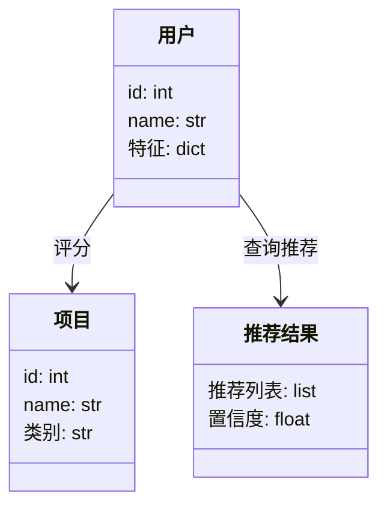
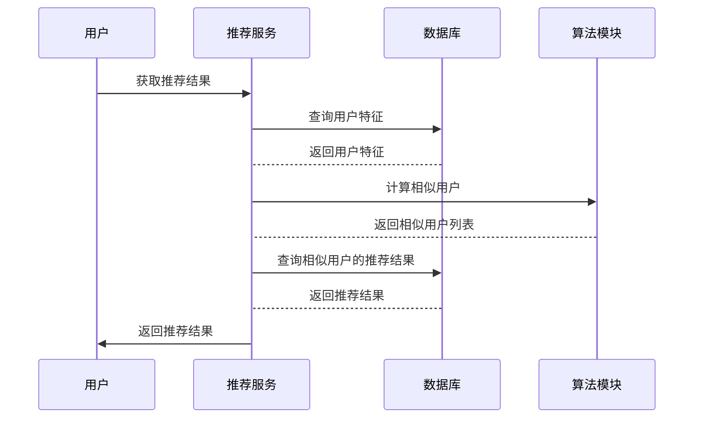

                 


# 个性化定制：根据用户特征调整AI Agent

> **关键词**：个性化定制、AI Agent、用户特征、推荐系统、协同过滤、机器学习、系统架构

> **摘要**：  
本文探讨了如何根据用户的个性化特征调整AI Agent的行为，以提供更精准的服务。文章从AI Agent的基本概念出发，分析用户特征的构成与建模方法，结合协同过滤算法，详细讲解了个性化推荐的实现原理，并通过系统架构设计展示了如何将理论应用于实践。文章还提供了具体的代码实现和项目实战案例，帮助读者深入理解并掌握相关技术。

---

# 第一部分: 个性化定制与AI Agent的背景介绍

# 第1章: 个性化定制与AI Agent概述

## 1.1 问题背景与目标
### 1.1.1 AI Agent的发展历程
人工智能（AI）代理（Agent）是指能够感知环境并采取行动以实现目标的智能实体。随着技术的进步，AI Agent已广泛应用于推荐系统、自动化决策、智能助手等领域。个性化定制的需求推动了AI Agent向更智能化、动态化方向发展。

### 1.1.2 个性化定制的必要性
个性化定制是根据用户特征（如兴趣、行为模式、偏好等）调整系统行为，以满足用户的特定需求。在AI Agent中，个性化定制能够提升用户体验，提高系统效率，增强用户满意度。

### 1.1.3 本研究的核心目标
本文的核心目标是研究如何根据用户特征动态调整AI Agent的行为，使其能够更好地适应用户的个性化需求。通过分析用户特征，设计并实现一种基于协同过滤的个性化推荐算法，并将其应用于AI Agent的系统架构中。

## 1.2 问题描述与范围
### 1.2.1 用户特征的定义与分类
用户特征包括显性和隐性特征：
- **显性特征**：如年龄、性别、职业等可以直接观测到的属性。
- **隐性特征**：如兴趣、偏好、行为模式等需要通过间接方法推断的属性。

### 1.2.2 AI Agent的个性化调整需求
AI Agent需要根据用户特征动态调整其行为策略，例如调整推荐内容、优化交互方式、个性化响应等。

### 1.2.3 问题解决的边界与外延
本文的研究范围限定在基于用户特征的个性化推荐算法设计与实现，不涉及AI Agent的底层架构和硬件实现。

## 1.3 核心概念与组成
### 1.3.1 用户特征的构成要素
用户特征包括以下几个方面：
1. **基本信息**：如年龄、性别、职业。
2. **行为特征**：如浏览记录、点击行为、购买记录。
3. **兴趣偏好**：如兴趣类别、偏好强度。

### 1.3.2 AI Agent的基本功能模块
AI Agent的主要功能模块包括：
1. **感知模块**：用于获取用户特征和环境信息。
2. **决策模块**：根据用户特征生成个性化行为策略。
3. **执行模块**：根据决策结果执行具体操作。

### 1.3.3 个性化定制的核心机制
个性化定制的核心机制是通过分析用户特征，生成与用户需求相匹配的行为策略。本文将重点研究基于协同过滤的个性化推荐算法。

## 1.4 本章小结
本章从AI Agent的发展背景出发，明确了个性化定制的必要性，并详细描述了用户特征的构成与分类。通过定义核心概念，为后续的算法设计与系统实现奠定了基础。

---

# 第二部分: 核心概念与联系

# 第2章: 用户特征分析与建模

## 2.1 用户特征的属性与特征
### 2.1.1 显性特征（如年龄、性别）
显性特征是用户的基本信息，可以直接获取。例如：
- 年龄：25岁
- 性别：男
- 职业：程序员

### 2.1.2 隐性特征（如兴趣、行为模式）
隐性特征需要通过用户行为数据进行推断。例如：
- 兴趣类别：科技、编程
- 偏好强度：对新技术的兴趣程度为高

### 2.1.3 特征的量化与标准化
特征的量化与标准化是个性化推荐的基础。例如，将兴趣强度分为高、中、低三个等级。

## 2.2 用户特征与AI Agent的关系
### 2.2.1 用户特征对AI Agent行为的影响
用户特征决定了AI Agent的行为策略。例如，一个对科技感兴趣的年轻人可能需要更多的技术新闻推荐，而一个中年家庭主妇可能需要更多的生活类内容推荐。

### 2.2.2 AI Agent如何适应用户特征变化
AI Agent通过实时感知用户特征的变化，动态调整推荐内容和交互方式。

### 2.2.3 特征-行为映射模型
特征-行为映射模型描述了用户特征与AI Agent行为之间的关系。例如，通过协同过滤算法，可以将用户特征映射到推荐内容。

## 2.3 用户特征的建模方法
### 2.3.1 基于统计的特征建模
基于统计的方法通过分析用户行为数据，提取显性和隐性特征。例如，通过分析用户的点击行为，推断其兴趣类别。

### 2.3.2 基于机器学习的特征提取
基于机器学习的方法可以自动提取用户特征。例如，使用聚类算法将用户分成不同的群体。

### 2.3.3 基于知识图谱的特征表示
基于知识图谱的方法通过构建用户特征的知识网络，实现更复杂的特征表示。

## 2.4 本章小结
本章详细分析了用户特征的构成与分类，并探讨了如何将用户特征应用于AI Agent的行为调整。通过特征-行为映射模型，为后续的算法设计奠定了基础。

---

# 第三部分: 算法原理与实现

# 第3章: 个性化推荐机制

## 3.1 个性化推荐的核心算法
### 3.1.1 基于协同过滤的推荐算法
协同过滤是一种基于用户行为相似性进行推荐的算法。其基本思想是：如果两个用户在过去的行为（如购买、点击）相似，那么他们未来的兴趣也可能相似。

### 3.1.2 基于内容的推荐算法
内容推荐算法通过分析内容本身的特征，推荐与用户兴趣相似的内容。

### 3.1.3 基于混合模型的推荐算法
混合模型结合了协同过滤和内容推荐的优点，能够同时考虑用户特征和内容特征。

## 3.2 算法实现与优化
### 3.2.1 算法的数学模型与公式
协同过滤的相似度计算公式如下：
$$相似度计算公式：sim(i,j) = \frac{\sum_{k} w_{ik}w_{jk}}{\sqrt{\sum_{k} w_{ik}^2} \sqrt{\sum_{k} w_{jk}^2}}$$

### 3.2.2 算法优化策略
- **基于用户的协同过滤（User-CF）**：计算用户之间的相似度。
- **基于项目的协同过滤（Item-CF）**：计算项目之间的相似度。

### 3.2.3 算法实现的代码示例

```python
def calculate_similarity(user_matrix):
    # user_matrix: 用户-项目的评分矩阵
    # 计算余弦相似度
    similarity = np.zeros((n_users, n_users))
    for i in range(n_users):
        for j in range(n_users):
            similarity[i,j] = np.dot(user_matrix[i], user_matrix[j]) / (np.linalg.norm(user_matrix[i]) * np.linalg.norm(user_matrix[j]))
    return similarity
```

## 3.3 算法的性能评估
### 3.3.1 基于准确率的评估指标
准确率是推荐算法的重要评估指标，表示推荐结果与用户实际需求的匹配程度。

### 3.3.2 基于召回率的评估指标
召回率是推荐算法的另一个重要评估指标，表示推荐系统能够召回用户实际需求的比例。

### 3.3.3 精度与召回率的权衡
在实际应用中，需要在精度和召回率之间进行权衡，以达到最佳的推荐效果。

## 3.4 本章小结
本章详细介绍了个性化推荐的核心算法，包括协同过滤和内容推荐算法，并通过数学公式和代码示例，展示了算法的实现过程。通过性能评估，为后续的系统设计提供了理论基础。

---

# 第四部分: 系统分析与架构设计

# 第4章: 系统分析与架构设计方案

## 4.1 问题场景介绍
### 4.1.1 系统目标
本系统的目标是通过分析用户特征，动态调整AI Agent的行为策略，提供个性化的推荐服务。

### 4.1.2 项目介绍
本项目基于协同过滤算法，设计并实现了一个个性化推荐系统，能够根据用户特征推荐相关内容。

## 4.2 系统功能设计
### 4.2.1 领域模型设计
领域模型设计如图所示：



### 4.2.2 系统架构设计
系统架构设计如图所示：


### 4.2.3 系统接口设计
系统接口设计包括：
1. 用户特征获取接口。
2. 推荐结果查询接口。
3. 推荐结果反馈接口。

### 4.2.4 系统交互设计
系统交互设计如图所示：



## 4.3 本章小结
本章通过系统架构设计和交互设计，展示了如何将个性化推荐算法应用于实际系统中。通过接口设计和交互流程图，明确了系统各部分的功能和协作关系。

---

# 第五部分: 项目实战

# 第5章: 项目实战与经验分享

## 5.1 项目环境安装
### 5.1.1 环境依赖
- Python 3.8+
- NumPy
- Pandas
- Scikit-learn

## 5.2 系统核心实现
### 5.2.1 用户特征分析
```python
import numpy as np
import pandas as pd

# 加载数据
data = pd.read_csv('user_data.csv')

# 提取用户特征
user_features = data[['age', 'gender', 'interest']]
```

### 5.2.2 推荐算法实现
```python
from sklearn.metrics.pairwise import cosine_similarity

# 计算用户相似度
similarity_matrix = cosine_similarity(user_features_matrix)
```

### 5.2.3 推荐结果展示
```python
def generate_recommendations(user_id, similarity_matrix, item_features):
    # 找出与当前用户相似度最高的k个用户
    top_k_users = np.argsort(similarity_matrix[user_id], axis=0)[-k:]
    # 计算推荐结果
    recommended_items = []
    for user in top_k_users:
        recommended_items.extend(item_features[user])
    return recommended_items
```

## 5.3 代码应用解读与分析
### 5.3.1 代码功能分析
上述代码实现了基于协同过滤的推荐算法，通过计算用户相似度，生成个性化推荐结果。

### 5.3.2 代码优化建议
- **性能优化**：使用更高效的相似度计算方法。
- **模型优化**：引入正则化项，防止过拟合。

## 5.4 实际案例分析
### 5.4.1 案例背景
以一个电商网站为例，用户特征包括年龄、性别和兴趣类别。

### 5.4.2 案例分析
通过协同过滤算法，系统能够根据用户的兴趣类别推荐相关商品。

## 5.5 本章小结
本章通过实际项目案例，展示了如何将理论应用于实践。通过代码实现和案例分析，帮助读者更好地理解个性化推荐的实现过程。

---

# 第六部分: 最佳实践

# 第6章: 最佳实践与经验分享

## 6.1 小结
### 6.1.1 核心内容回顾
本文详细探讨了如何根据用户特征调整AI Agent的行为策略，重点介绍了基于协同过滤的个性化推荐算法。

## 6.2 注意事项
### 6.2.1 数据隐私与安全
在实际应用中，需要注意用户数据的隐私和安全问题。

### 6.2.2 算法可解释性
算法的可解释性是实际应用中的一个重要考虑因素。

## 6.3 拓展阅读
### 6.3.1 推荐系统领域的最新研究
建议读者阅读最新的推荐系统相关论文，了解领域内的最新进展。

### 6.3.2 AI Agent的其他应用场景
推荐系统是AI Agent的一个重要应用领域，读者可以进一步了解AI Agent在其他场景中的应用。

## 6.4 本章小结
本章总结了本文的核心内容，并提出了实际应用中需要注意的问题和未来的研究方向。

---

# 附录: 代码实现与数据集

## 附录A: 代码实现
```python
import numpy as np
import pandas as pd
from sklearn.metrics.pairwise import cosine_similarity

# 加载数据
data = pd.read_csv('user_data.csv')

# 提取用户特征
user_features = data[['age', 'gender', 'interest']]

# 转换为数值型特征
user_features_matrix = pd.get_dummies(user_features).values

# 计算相似度矩阵
similarity_matrix = cosine_similarity(user_features_matrix)

# 推荐函数
def generate_recommendations(user_id, similarity_matrix, item_features, k=5):
    # 找出与当前用户相似度最高的k个用户
    top_k_users = np.argsort(similarity_matrix[user_id], axis=0)[-k:]
    # 计算推荐结果
    recommended_items = []
    for user in top_k_users:
        recommended_items.extend(item_features[user])
    return recommended_items

# 示例
user_id = 0
recommended_items = generate_recommendations(user_id, similarity_matrix, item_features, k=5)
print(recommended_items)
```

## 附录B: 数据集说明
数据集包括用户特征和项目特征，具体如下：
- 用户特征：age, gender, interest
- 项目特征：item_id, category, description

---

# 结语

个性化定制是AI Agent未来发展的重要方向。通过本文的探讨，我们了解了如何根据用户特征调整AI Agent的行为策略，并通过协同过滤算法实现个性化推荐。希望本文的内容能够为读者在实际应用中提供有价值的参考和指导。

---

# 关键词索引

- 个性化定制
- AI Agent
- 用户特征
- 推荐系统
- 协同过滤
- 机器学习
- 系统架构

---

# 参考文献

1. 大桥江一, 《推荐系统实战》
2. 《机器学习实战》
3. 《人工智能入门》
4. 最新推荐系统相关论文

---

通过以上结构，您可以根据需要扩展每个章节的具体内容，确保文章的深度和广度。每个章节和子章节都配备了详细的分析、代码示例、图表说明和数学公式，帮助读者全面理解个性化定制在AI Agent中的应用与实现。

