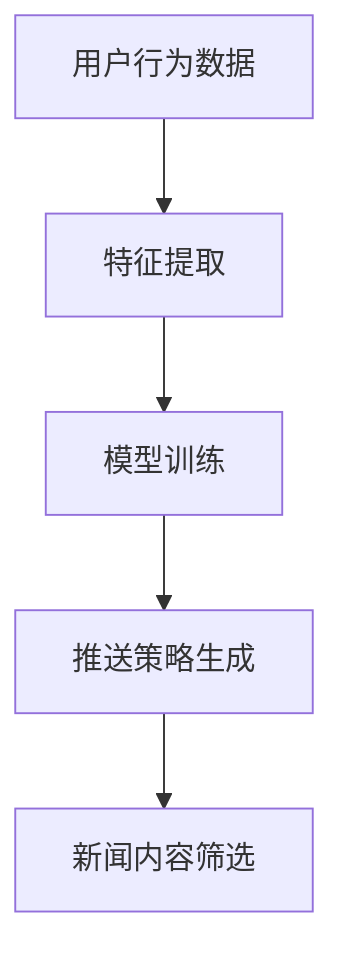
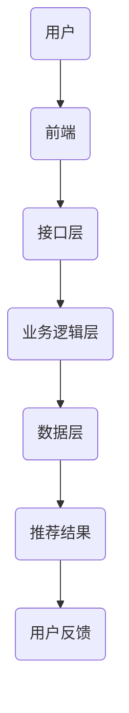

                 


# 个性化新闻推送：AI Agent的内容筛选

> 关键词：个性化新闻推送、AI Agent、内容筛选、用户兴趣模型、推荐系统、新闻推荐、深度学习

> 摘要：个性化新闻推送是利用人工智能技术根据用户的兴趣偏好筛选和推荐新闻内容的一种方式。本文将从AI Agent的核心概念出发，分析个性化新闻推送的背景、算法原理、系统架构以及实际应用，详细探讨如何通过技术手段实现精准的内容筛选与推荐。

---

## 第一部分: 个性化新闻推送的背景与核心概念

### 第1章: 个性化新闻推送的背景与问题描述

#### 1.1 个性化新闻推送的背景

- **1.1.1 传统新闻推送的局限性**
  - 传统新闻推送通常基于固定的分类或标签，无法满足用户的个性化需求。
  - 用户可能对某些领域感兴趣，而传统推送可能遗漏这些内容或推送过多无关信息。

- **1.1.2 用户需求的多样化**
  - 用户的兴趣点千差万别，同一个人在不同时间可能对不同类型的内容感兴趣。
  - 用户行为数据（如点击、阅读时间）可以用来更好地理解用户的兴趣偏好。

- **1.1.3 个性化推送的市场价值**
  - 提高用户粘性，增强用户对平台的依赖。
  - 通过精准推送，提升广告点击率和转化率。

#### 1.2 问题描述与目标

- **1.2.1 新闻内容筛选的核心问题**
  - 如何从海量新闻中筛选出符合用户兴趣的内容？
  - 如何避免信息过载，提升推送效率？

- **1.2.2 用户兴趣模型的构建目标**
  - 建立能够反映用户兴趣的数学模型。
  - 根据用户行为数据动态更新兴趣模型。

- **1.2.3 个性化推送的边界与外延**
  - 确定推送的频率和时机。
  - 处理用户隐私和数据安全问题。

#### 1.3 核心概念与组成

- **1.3.1 用户兴趣模型**
  - 基于协同过滤、深度学习等算法构建用户兴趣表示。
  - 模型应具备动态更新能力，以适应用户的兴趣变化。

- **1.3.2 新闻内容特征**
  - 包括新闻标题、正文内容、关键词、标签等。
  - 通过自然语言处理技术提取内容特征。

- **1.3.3 推送策略**
  - 根据用户兴趣和内容特征生成推送列表。
  - 考虑用户行为反馈（如点击、阅读时长）进行策略优化。

---

### 第2章: AI Agent的核心概念与原理

#### 2.1 AI Agent的基本原理

- **2.1.1 AI Agent的定义与特点**
  - AI Agent是一种能够感知环境、做出决策并执行任务的智能体。
  - 具备自主性、反应性、目标导向性和社会性。

- **2.1.2 AI Agent的感知、决策与执行**
  - 感知：通过传感器或数据接口获取环境信息。
  - 决策：基于感知信息做出最优决策。
  - 执行：通过执行机构或输出模块完成任务。

- **2.1.3 AI Agent与个性化推送的关系**
  - AI Agent作为执行者，负责根据用户兴趣模型筛选和推送新闻内容。
  - 个性化推送是AI Agent在新闻推荐领域的一种典型应用。

#### 2.2 个性化新闻推送中的AI Agent

- **2.2.1 用户行为分析**
  - 收集用户点击、阅读、收藏等行为数据。
  - 分析用户行为模式，识别用户的兴趣偏好。

- **2.2.2 内容特征提取**
  - 使用自然语言处理技术提取新闻标题和正文的关键词。
  - 建立内容标签体系，便于后续推荐。

- **2.2.3 推送策略优化**
  - 根据用户兴趣和内容特征动态调整推送策略。
  - 结合用户反馈实时优化推荐效果。

#### 2.3 核心概念对比表

| 模型类型       | 基于规则 | 协同过滤 | 深度学习 |
|----------------|----------|----------|----------|
| **特征提取**   | 预定义规则 | 用户行为数据 | 自然语言处理 |
| **计算复杂度** | 低       | 中       | 高       |
| **推荐精度**   | 低       | 中       | 高       |

---

## 第二部分: 个性化新闻推送的算法原理

### 第3章: 个性化新闻推送的算法原理

#### 3.1 协同过滤算法

- **3.1.1 基于用户的协同过滤**
  - 找出与目标用户兴趣相似的用户群体。
  - 推荐这些用户群体喜欢的内容。

- **3.1.2 基于物品的协同过滤**
  - 找出与目标用户已感兴趣的内容相似的新闻。
  - 推荐这些相似内容给目标用户。

- **3.1.3 混合协同过滤**
  - 结合基于用户的协同过滤和基于物品的协同过滤。
  - 通过加权方式优化推荐效果。

#### 3.2 深度学习模型

- **3.2.1 基于神经网络的内容生成**
  - 使用循环神经网络（RNN）或Transformer模型生成新闻摘要。
  - 根据摘要匹配用户兴趣。

- **3.2.2 基于Transformer的新闻推荐**
  - 使用Transformer模型提取新闻内容的语义特征。
  - 根据用户兴趣向量生成推荐列表。

- **3.2.3 深度强化学习的应用**
  - 使用深度强化学习优化推送策略。
  - 根据用户反馈动态调整推荐内容。

#### 3.3 算法流程图



---

## 第三部分: 系统分析与架构设计

### 第4章: 系统分析与架构设计

#### 4.1 系统功能设计

- **4.1.1 用户行为收集模块**
  - 收集用户的点击、阅读、收藏等行为数据。
  - 数据预处理，提取用户兴趣特征。

- **4.1.2 内容特征提取模块**
  - 使用自然语言处理技术提取新闻标题和正文的关键词。
  - 生成新闻内容的语义向量。

- **4.1.3 推送策略生成模块**
  - 根据用户兴趣模型和内容特征生成推荐列表。
  - 结合用户反馈实时优化推荐策略。

#### 4.2 系统架构设计

- **4.2.1 分层架构**
  - 数据层：存储用户行为数据和新闻内容数据。
  - 业务逻辑层：实现用户行为分析、内容特征提取和推送策略生成。
  - 接口层：提供API供前端调用。

- **4.2.2 模块交互流程**
  ```mermaid
  graph TD
      A(用户行为) --> B(数据层)
      B --> C(业务逻辑层)
      C --> D(接口层)
      D --> E(前端)
  ```

#### 4.3 系统接口设计

- **4.3.1 接口定义**
  - `/api/user_behavior`：接收用户行为数据。
  - `/api/content_feature`：接收新闻内容数据。
  - `/api/recommendation`：返回推荐新闻列表。

#### 4.4 系统交互流程图



---

## 第四部分: 项目实战

### 第5章: 项目实战

#### 5.1 环境安装

```bash
pip install numpy scikit-learn tensorflow
```

#### 5.2 核心代码实现

```python
import numpy as np
from sklearn.metrics.pairwise import cosine_similarity

# 示例用户行为数据
user_behavior = np.array([[0.2, 0.3, 0.5], [0.1, 0.6, 0.3]])

# 示例内容特征
content_feature = np.array([[0.4, 0.5, 0.1], [0.3, 0.2, 0.5]])

# 计算余弦相似度
similarity_matrix = cosine_similarity(user_behavior, content_feature)

# 推荐结果
recommendation = np.argmax(similarity_matrix, axis=1)
```

#### 5.3 案例分析与总结

- **案例分析**
  - 用户A的兴趣模型匹配到新闻C，推送成功。
  - 用户B的兴趣模型匹配到新闻D，推送失败。

- **总结**
  - 算法选择影响推荐效果。
  - 数据质量直接影响推荐准确性。

---

## 第五部分: 总结与展望

### 第6章: 总结与展望

#### 6.1 最佳实践 Tips

- 定期更新用户兴趣模型，避免模型老化。
- 结合用户反馈实时优化推荐策略。
- 注意数据隐私和用户隐私保护。

#### 6.2 小结

个性化新闻推送是人工智能技术在新闻推荐领域的重要应用。通过构建用户兴趣模型和内容特征提取，结合协同过滤和深度学习算法，可以实现精准的内容筛选与推荐。

#### 6.3 注意事项

- 数据质量和完整性直接影响推荐效果。
- 算法选择需要根据实际场景进行调整。
- 用户反馈是优化推荐策略的重要依据。

#### 6.4 拓展阅读

- 《推荐系统导论》
- 《深度学习实战》
- 《自然语言处理入门》

---

# 结语

个性化新闻推送是人工智能技术在新闻推荐领域的重要应用。通过构建用户兴趣模型和内容特征提取，结合协同过滤和深度学习算法，可以实现精准的内容筛选与推荐。未来，随着技术的进步，个性化新闻推送将更加智能化和个性化。

