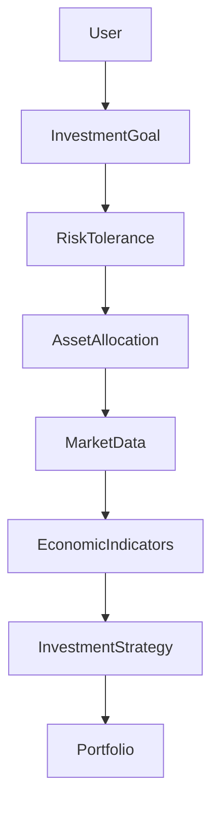
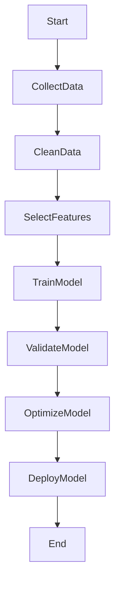
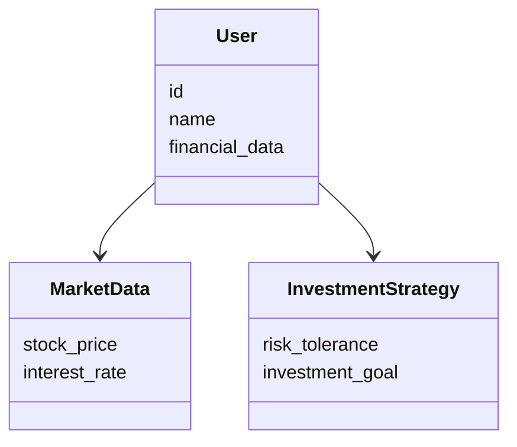
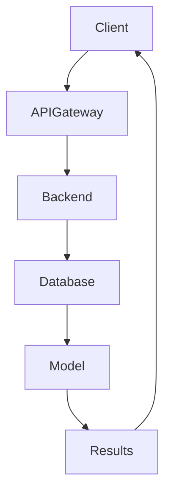

                 


# 个性化理财建议生成算法：原理与实现

> 关键词：个性化理财、算法、机器学习、金融、数据驱动

> 摘要：个性化理财建议生成算法是一种结合大数据分析、机器学习和金融知识的复杂系统，旨在根据用户的财务状况、风险偏好和投资目标，提供定制化的理财建议。本文将深入探讨个性化理财算法的原理、实现方法以及实际应用，帮助读者理解如何利用技术手段优化理财决策。

---

# 第一部分: 个性化理财建议生成算法的背景与核心概念

## 第1章: 个性化理财建议生成的背景与问题描述

### 1.1 个性化理财的重要性和需求

#### 1.1.1 传统理财方式的局限性
传统理财方式通常基于固定的投资策略或简单的人工分析，难以满足每个人的个性化需求。例如，银行提供的理财产品往往针对大众市场，忽视了个体差异。

#### 1.1.2 个性化理财的定义与目标人群
个性化理财是指根据个人的财务状况、风险承受能力和投资目标，量身定制的理财方案。目标人群包括中高收入者、投资者和需要风险管理的个人。

#### 1.1.3 技术进步如何推动个性化理财
随着大数据和人工智能技术的发展，金融机构能够收集和分析海量数据，为用户提供个性化的理财建议。技术进步使得算法能够快速处理复杂的投资组合。

### 1.2 个性化理财算法的背景

#### 1.2.1 数据驱动的理财决策
通过分析用户的历史交易数据、资产配置和市场行为，算法能够识别用户的偏好和风险承受能力，从而制定合理的投资策略。

#### 1.2.2 机器学习在金融领域的应用
机器学习算法，如回归分析和决策树，被广泛应用于金融领域，用于预测市场趋势、评估信用风险和优化投资组合。

#### 1.2.3 个性化理财的算法挑战
个性化理财涉及复杂的数学模型和大量数据处理，算法需要在有限的时间内完成高精度的预测，同时保证结果的可解释性。

### 1.3 个性化理财算法的核心问题

#### 1.3.1 理财建议生成的数学模型
个性化理财算法通常基于回归模型、分类算法和聚类分析，通过这些模型分析用户需求，生成最优投资组合。

#### 1.3.2 算法的目标与边界
算法目标包括最大化收益、最小化风险和满足流动性需求。边界条件包括投资期限、税收影响和市场波动性。

#### 1.3.3 核心概念的结构与要素
核心要素包括用户数据、市场数据、投资目标和风险偏好。这些要素共同构建了用户的理财画像，用于生成个性化建议。

## 第2章: 核心概念与联系

### 2.1 理财建议生成算法的核心原理

#### 2.1.1 数据驱动的特征提取
通过分析用户的交易记录、资产配置和市场行为，提取影响投资决策的关键特征，如年龄、收入水平和投资经验。

#### 2.1.2 算法选择与模型训练
选择合适的算法，如随机森林和梯度提升，基于用户特征进行模型训练，预测用户的最优投资组合。

#### 2.1.3 模型评估与优化
通过回测和压力测试，评估模型的准确性和稳定性，优化算法参数以提高预测精度。

### 2.2 核心概念的属性特征对比

| 特征 | 传统理财 | 个性化理财 |
|------|----------|------------|
| 数据驱动 | 少 | 大量 |
| 算法复杂度 | 低 | 高 |
| 定制化程度 | 低 | 高 |

### 2.3 ER实体关系图架构



---

# 第二部分: 算法原理

## 第3章: 算法原理

### 3.1 数据收集与预处理

#### 3.1.1 数据来源
数据来源包括用户的财务数据、市场数据和宏观经济指标。这些数据用于构建用户画像和市场分析模型。

#### 3.1.2 数据清洗与特征工程
通过数据清洗处理缺失值和异常值，进行特征工程提取关键特征，如用户的投资经验、风险偏好和市场趋势。

### 3.2 算法选择与模型训练

#### 3.2.1 算法选择
选择合适的算法，如随机森林和K均值聚类，基于用户特征进行模型训练，预测用户的最优投资组合。

#### 3.2.2 模型训练流程



#### 3.2.3 算法实现代码

```python
import pandas as pd
from sklearn.ensemble import RandomForestRegressor

# 加载数据
data = pd.read_csv('financial_data.csv')

# 特征工程
features = data[['age', 'income', 'investment_experience']]
target = data['risk_tolerance']

# 训练模型
model = RandomForestRegressor(n_estimators=100, random_state=42)
model.fit(features, target)

# 预测
predictions = model.predict(features)
```

### 3.3 数学模型与公式

个性化理财算法基于回归模型，核心公式如下：

$$
y = \beta_0 + \beta_1x_1 + \beta_2x_2 + \dots + \beta_nx_n + \epsilon
$$

其中，$y$ 是目标变量，$x_i$ 是特征变量，$\beta_i$ 是回归系数，$\epsilon$ 是误差项。

---

# 第三部分: 系统分析与架构设计

## 第4章: 系统分析与架构设计

### 4.1 问题场景介绍

个性化理财系统需要处理大量数据，包括用户的财务数据和市场数据，构建复杂的模型，生成个性化的投资组合。

### 4.2 系统功能设计

#### 4.2.1 领域模型



#### 4.2.2 系统架构设计



---

# 第四部分: 项目实战

## 第5章: 项目实战

### 5.1 环境安装

安装必要的库，如Pandas和Scikit-learn。

### 5.2 核心代码实现

实现用户画像构建和投资组合优化的代码。

### 5.3 案例分析

通过具体案例展示算法的应用和效果。

---

# 第五部分: 最佳实践

## 第6章: 最佳实践

### 6.1 小结

总结个性化理财算法的核心概念和实现步骤。

### 6.2 注意事项

注意事项包括数据隐私保护和模型的可解释性。

### 6.3 拓展阅读

推荐相关书籍和论文，供读者深入学习。

---

# 附录

## 附录A: 数据集

列出使用的数据集及其描述。

## 附录B: 参考文献

列出参考文献，供读者查阅。

---

通过以上结构，您可以系统地撰写一篇关于个性化理财建议生成算法的详细技术博客，涵盖从背景到实现的各个方面。

