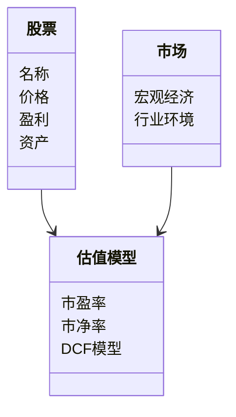
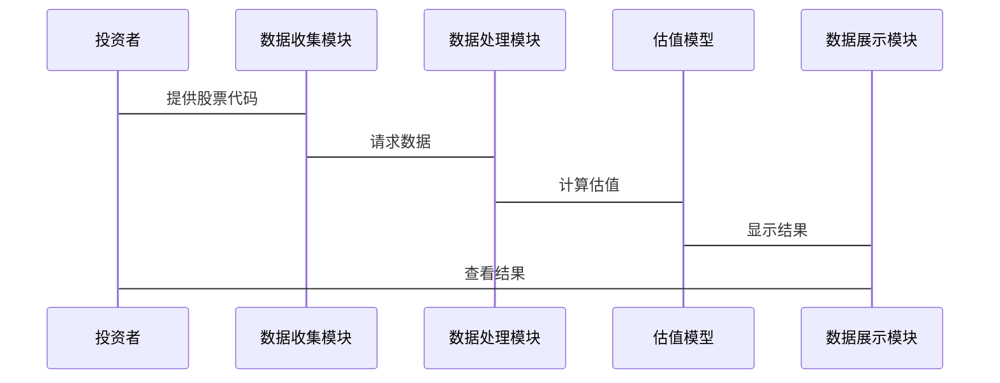

                 


# 中国香港股市估值:国际金融中心的市场特点

---

## 关键词：香港股市、股票估值、国际金融中心、市场特点、市盈率、市净率、DCF模型

---

## 摘要：

本文将深入探讨中国香港股市的估值方法及其作为国际金融中心的独特市场特点。通过分析香港股市的历史发展、国际化特征、金融创新以及常用的估值模型，我们将揭示如何在复杂的金融市场环境中进行有效的股票估值。文章结合理论与实践，从背景介绍、核心概念、数学模型、系统架构到项目实战，逐步引导读者掌握香港股市估值的核心方法。

---

## 第一部分: 背景介绍与核心概念

### 第1章: 香港股市概述

#### 1.1 香港股市的历史沿革

香港股市的历史可以追溯到19世纪末，1866年香港股份公会的成立标志着股市交易的开始。随着20世纪的到来，香港股市逐渐规范化，1913年香港交易所正式成立。1949年后，随着香港经济的繁荣，股市规模迅速扩大，1986年恒生指数的推出进一步巩固了香港作为国际金融中心的地位。如今，香港股市已成为全球最重要的金融市场之一，吸引了来自世界各地的投资者。

#### 1.2 香港股市作为国际金融中心的地位

香港股市的国际化特征主要体现在以下几个方面：

- **多元化的投资者群体**：香港股市吸引了大量的国际投资者，包括机构投资者和个人投资者。
- **全球化资本流动的影响**：香港作为离岸人民币的中心，吸引了大量的国际资本流入和流出。
- **国际化标准与规则**：香港股市遵循国际化的市场规则，上市公司信息披露要求严格，吸引了众多跨国公司在此上市。

#### 1.3 香港股市的市场规模与结构

香港股市的市场规模庞大，上市公司数量众多，涵盖多个行业。香港股市的结构包括主板、创业板和新兴板，其中主板主要面向大型企业，创业板主要面向中小企业。

---

### 第2章: 股市估值的基本概念与方法

#### 2.1 股票估值的定义与重要性

股票估值是指通过对公司财务数据、市场环境等因素进行分析，估算出股票的内在价值。其重要性在于帮助投资者做出合理的投资决策，降低投资风险。

#### 2.2 常用的估值方法概述

- **市盈率（P/E）法**：市盈率是股票价格与每股收益的比率，反映了投资者对股票的预期收益。
- **市净率（P/B）法**：市净率是股票价格与每股净资产的比率，适用于评估资产密集型企业的价值。
- **现金流折现法（DCF）**：通过将公司未来现金流折现，计算其当前的内在价值。
- **市盈率相对收益法（PEG）**：结合市盈率和公司盈利增长率的指标。

---

### 第3章: 香港股市的独特性与市场特点

#### 3.1 香港股市的国际化特征

香港股市的国际化特征主要体现在投资者结构的多元化和资本流动的全球化。香港作为离岸人民币的中心，吸引了大量的国际资本流入和流出。

#### 3.2 香港股市的金融创新

香港股市在金融创新方面具有显著优势，包括多样化的融资方式和丰富的金融衍生品。香港股市的金融创新不仅提高了市场的流动性，还为投资者提供了更多的投资选择。

#### 3.3 香港股市的风险与挑战

香港股市的风险主要来源于宏观经济波动、地缘政治因素和市场监管的严格性。投资者需要充分认识到这些风险，并采取相应的风险管理措施。

---

## 第二部分: 核心概念与数学模型

### 第4章: 股票估值的核心概念与原理

#### 4.1 估值的核心概念

股票的内在价值是指公司未来现金流的现值，而市场价值则是指股票在市场上的交易价格。内在价值和市场价值之间的差异为投资者提供了套利机会。

#### 4.2 估值的关键因素

- **盈利能力分析**：通过分析公司的净利润率、毛利率等指标，评估公司的盈利能力。
- **财务健康状况评估**：通过分析公司的资产负债表，评估公司的财务健康状况。
- **行业地位与竞争优势**：通过分析公司的市场地位和竞争优势，评估公司的长期发展潜力。

---

### 第5章: 常用估值模型的数学公式与应用

#### 5.1 市盈率模型

公式：
$$ P/E = \frac{Price}{Earnings} $$

应用：市盈率模型适用于那些盈利稳定且可预测的公司。通过比较公司的市盈率与行业平均水平，可以评估公司的估值是否合理。

#### 5.2 现金流折现模型

公式：
$$ V = \sum_{t=1}^{n} \frac{CF_t}{(1 + r)^t} + \frac{TV}{(1 + r)^n} $$

应用：现金流折现模型适用于那些具有稳定现金流的公司。通过预测公司未来现金流并将其折现，可以估算出公司的内在价值。

#### 5.3 市净率模型

公式：
$$ P/B = \frac{Price}{Book\ Value} $$

应用：市净率模型适用于那些资产密集型的公司，如银行、房地产等。通过比较公司的市净率与行业平均水平，可以评估公司的估值是否合理。

---

### 第6章: 香港股市估值的特殊性分析

#### 6.1 香港股市的国际化特征对估值的影响

香港股市的国际化特征使得其估值需要考虑全球资本市场的波动和国际经济环境的变化。投资者需要充分认识到这些因素对估值的影响。

#### 6.2 香港股市的金融创新对估值的影响

香港股市的金融创新使得其估值方法更加多样化。投资者可以根据不同的市场环境和公司特点，选择合适的估值方法。

#### 6.3 香港股市的风险与挑战对估值的影响

香港股市的风险和挑战使得其估值需要更加谨慎。投资者需要充分认识到这些风险，并采取相应的风险管理措施。

---

## 第三部分: 系统分析与架构设计

### 第7章: 问题场景介绍

香港股市的复杂性和多样性使得其估值需要一个系统化的解决方案。投资者需要考虑宏观经济环境、公司财务状况、市场情绪等多种因素。

### 第8章: 系统功能设计

#### 8.1 领域模型



#### 8.2 系统架构设计


### 第9章: 系统接口设计

#### 9.1 数据接口

- **输入接口**：接收公司财务数据、市场数据等。
- **输出接口**：输出估值结果、风险提示等。

### 第10章: 系统交互设计



---

## 第四部分: 项目实战

### 第11章: 环境安装

- **工具选择**：使用Python进行数据处理和建模。
- **依赖安装**：安装Pandas、NumPy、Matplotlib等库。

### 第12章: 系统核心实现源代码

```python
import pandas as pd
import numpy as np

def calculate_pe(stock_price, earnings):
    return stock_price / earnings

def calculate_pb(stock_price, book_value):
    return stock_price / book_value

def calculate_dcf(cash_flows, discount_rate, terminal_value):
    present_value = 0
    for t in range(len(cash_flows)):
        present_value += cash_flows[t] / (1 + discount_rate) ** t
    present_value += terminal_value / (1 + discount_rate) ** len(cash_flows)
    return present_value

# 示例数据
stock_price = 100
earnings = 20
book_value = 50
discount_rate = 0.1
cash_flows = [10, 15, 20]
terminal_value = 100

# 计算估值
pe = calculate_pe(stock_price, earnings)
pb = calculate_pb(stock_price, book_value)
dcf_value = calculate_dcf(cash_flows, discount_rate, terminal_value)

print(f"市盈率: {pe}")
print(f"市净率: {pb}")
print(f"DCF估值: {dcf_value}")
```

### 第13章: 代码应用解读与分析

- **市盈率计算**：通过股票价格与每股收益的比率，评估股票的估值。
- **市净率计算**：通过股票价格与每股净资产的比率，评估股票的估值。
- **DCF模型计算**：通过预测公司未来现金流并将其折现，估算公司的内在价值。

### 第14章: 实际案例分析

以某香港上市公司为例，通过上述模型进行估值分析，展示如何在实际中应用这些模型。

### 第15章: 项目小结

通过项目实战，我们可以看到香港股市估值的复杂性和多样性。投资者需要根据不同的市场环境和公司特点，选择合适的估值方法。

---

## 第五部分: 总结与最佳实践

### 第16章: 总结

本文详细探讨了中国香港股市的估值方法及其作为国际金融中心的独特市场特点。通过分析香港股市的历史发展、国际化特征、金融创新以及常用的估值模型，我们揭示了如何在复杂的金融市场环境中进行有效的股票估值。

### 第17章: 最佳实践 tips

- **关注宏观经济环境**：投资者需要关注宏观经济环境的变化，及时调整投资策略。
- **选择合适的估值方法**：投资者需要根据公司特点和市场环境，选择合适的估值方法。
- **风险管理**：投资者需要充分认识到香港股市的风险，并采取相应的风险管理措施。

### 第18章: 小结

通过本文的探讨，我们可以看到香港股市估值的复杂性和多样性。投资者需要根据不同的市场环境和公司特点，选择合适的估值方法。

---

## 第六部分: 拓展阅读

### 第19章: 推荐书籍与资料

- 《股票投资实战技巧》
- 《估值的艺术》
- 《国际金融市场分析》

---

通过本文的探讨，我们希望读者能够更好地理解中国香港股市的估值方法及其作为国际金融中心的独特市场特点。

