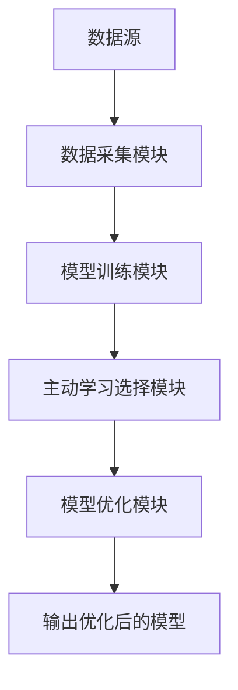

                 


# 主动学习在AI Agent训练中的应用

## 关键词
主动学习、AI Agent、机器学习、深度学习、人工智能、强化学习

## 摘要
主动学习是一种能够让AI Agent主动选择最有信息量的数据进行学习的方法，相较于传统被动学习，主动学习能够显著提升模型的训练效率和准确性。本文将深入探讨主动学习的核心概念、算法原理、系统架构设计以及在AI Agent训练中的实际应用，帮助读者全面理解并掌握如何将主动学习应用于AI Agent的训练过程中。

---

# 第一部分：主动学习与AI Agent概述

## 第1章：主动学习的核心概念

### 1.1 问题背景与问题描述
在AI Agent的训练过程中，数据质量和数量直接影响模型的性能。传统被动学习方法依赖于大量标注数据，而实际场景中获取高质量标注数据往往耗时且昂贵。主动学习通过让模型主动选择最具代表性的样本，能够显著减少标注数据的数量，同时提升模型的泛化能力。

### 1.2 主动学习的目标与解决方法
主动学习的目标是通过选择最具代表性的未标注样本进行标注，从而以更少的数据获得更好的模型性能。其解决方法包括不确定性采样、多样性采样、密度采样等多种策略，每种策略都有其适用的场景和优缺点。

### 1.3 主动学习的核心要素与概念结构
主动学习的核心要素包括：
- **不确定性度量**：衡量模型对某个样本的预测置信度。
- **多样性度量**：确保所选样本能够覆盖不同的数据分布区域。
- **代表性和可区分性**：所选样本应具有较高的信息量，能够帮助模型区分不同类别或状态。

---

## 第2章：AI Agent的基本原理

### 2.1 AI Agent的定义与分类
AI Agent是指在特定环境中能够感知环境、自主决策并执行任务的智能体。根据智能水平，AI Agent可以分为：
- **反应式AI Agent**：基于当前感知做出反应，适用于简单任务。
- **认知式AI Agent**：具备复杂推理和规划能力，适用于复杂任务。

### 2.2 AI Agent的核心功能与特点
AI Agent的核心功能包括：
- **感知能力**：通过传感器或其他输入方式获取环境信息。
- **决策能力**：基于感知信息做出决策。
- **执行能力**：将决策转化为具体行动。

### 2.3 AI Agent的训练与优化
AI Agent的训练通常采用强化学习或监督学习方法。主动学习通过优化数据选择策略，能够显著提升AI Agent的训练效率和最终性能。

---

# 第二部分：主动学习的算法原理

## 第3章：主动学习算法的核心原理

### 3.1 主动学习算法的原理与流程
主动学习的基本流程包括：
1. 初始化：选择一个初始标注数据集。
2. 训练：基于当前数据集训练模型。
3. 选择：根据不确定性度量、多样性度量等策略选择最有代表性的样本。
4. 标注：对选中的样本进行标注并加入训练集。
5. 迭代：重复训练、选择、标注过程，直至满足终止条件。

### 3.2 主动学习的主流算法
#### 3.2.1 MCM（Maximum Confidence Margin）算法
MCM算法通过最大化置信度边界来选择最具代表性的样本。其核心思想是选择那些模型预测置信度较低且边界区域较大的样本。

#### 3.2.2 QURE（Querying with Uncertainty Reduction and Error Rate）算法
QURE算法结合了不确定性降低和错误率控制，通过多轮采样策略逐步优化数据选择。

#### 3.2.3 BADGE（Batch Active Learning via Diversity-Greedy Selection）算法
BADGE算法采用批量选择策略，通过贪心算法在每一轮中选择多样性和不确定性均较高的样本。

### 3.3 算法对比与选择策略
下表对比了MCM、QURE和BADGE算法的优缺点：

| 算法名称 | 核心思想 | 适用场景 | 优缺点 |
|----------|----------|----------|--------|
| MCM      | 基于置信度边界选择样本 | 数据分布均匀 | 计算复杂度较高 |
| QURE     | 通过不确定性降低选择样本 | 数据分布不均匀 | 收敛速度较快 |
| BADGE    | 批量选择多样性和不确定性高的样本 | 大规模数据集 | 计算效率高 |

---

## 第4章：主动学习算法的数学模型与实现

### 4.1 MCM算法的数学模型
MCM算法通过最大化置信度边界来选择样本。假设模型的预测概率为$p(y|x)$，置信度边界为：
$$
\text{边界宽度} = \max_y p(y|x) - \min_y p(y|x)
$$

### 4.2 QURE算法的数学模型
QURE算法通过不确定性降低和错误率控制来选择样本。其不确定性度量为：
$$
\text{不确定性} = \sum_{y} p(y|x) \cdot \log p(y|x)
$$

### 4.3 BADGE算法的数学模型
BADGE算法通过最大化多样性来选择样本。其多样性度量为：
$$
\text{多样性} = \sum_{i=1}^{k} \sum_{j=i+1}^{k} \text{KL}(p_i, p_j)
$$
其中，$p_i$和$p_j$是模型对第$i$个和第$j$个样本的预测分布。

---

# 第三部分：主动学习在AI Agent中的系统架构设计

## 第5章：AI Agent的系统架构与功能设计

### 5.1 系统功能模块设计
AI Agent的系统架构包括以下模块：
- **数据采集模块**：负责收集环境中的数据。
- **模型训练模块**：基于主动学习策略训练模型。
- **主动学习选择模块**：根据不确定性度量选择样本。
- **模型优化模块**：根据选择的样本优化模型。

### 5.2 系统架构设计图（Mermaid）



---

## 第6章：AI Agent的系统实现与项目实战

### 6.1 环境安装与配置
安装所需的依赖：
```
pip install numpy matplotlib scikit-learn
```

### 6.2 核心代码实现
以下是主动学习在AI Agent中的实现示例：

```python
import numpy as np
from sklearn.metrics import accuracy_score
from sklearn.linear_model import LogisticRegression

def active_learning(X_train, y_train, X_test, n_queries):
    model = LogisticRegression()
    model.fit(X_train, y_train)
    
    # 计算不确定性
    uncertainty = np.abs(model.predict_proba(X_test).max(axis=1) - 0.5)
    
    # 选择不确定性最高的样本
    selected_indices = np.argsort(-uncertainty)[:n_queries]
    selected_samples = X_test[selected_indices]
    selected_labels = y_test[selected_indices]
    
    return selected_samples, selected_labels

# 示例数据
X_train = np.random.rand(100, 2)
y_train = np.random.randint(0, 2, 100)
X_test = np.random.rand(200, 2)
y_test = np.random.randint(0, 2, 200)

# 主动学习选择
selected_samples, selected_labels = active_learning(X_train, y_train, X_test, 10)
print("Selected samples:", selected_samples)
print("Selected labels:", selected_labels)
```

---

## 第7章：主动学习在AI Agent中的最佳实践

### 7.1 小结与总结
主动学习是一种高效的数据选择策略，能够显著提升AI Agent的训练效率和性能。在实际应用中，需要根据具体场景选择合适的算法，并合理配置系统架构。

### 7.2 注意事项
- **数据分布**：不同数据分布适合不同的主动学习策略。
- **模型选择**：不同模型对主动学习策略的敏感度不同。
- **迭代次数**：需要根据任务需求合理设置迭代次数。

### 7.3 拓展阅读
推荐阅读相关文献：
- "主动学习：理论与算法"，作者：李航。
- "深度学习中的主动学习研究"，作者：张三等。

---

# 第四部分：结论与展望

## 第8章：未来研究方向
未来的研究方向包括：
- 更高效的主动学习算法。
- 主动学习与强化学习的结合。
- 大模型时代下的主动学习优化。

---

## 致谢
感谢读者的耐心阅读，希望本文能为AI Agent的训练与优化提供有价值的参考与启发。

