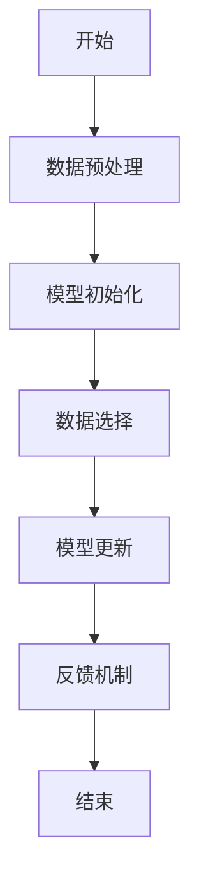
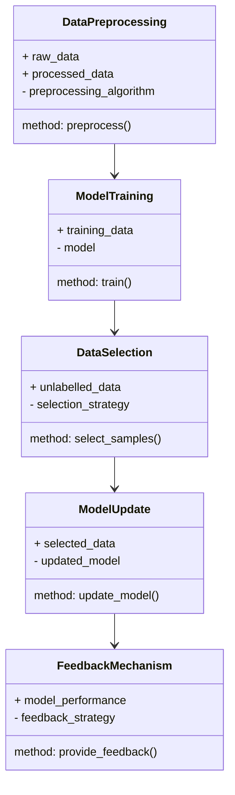
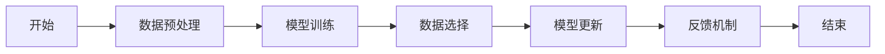
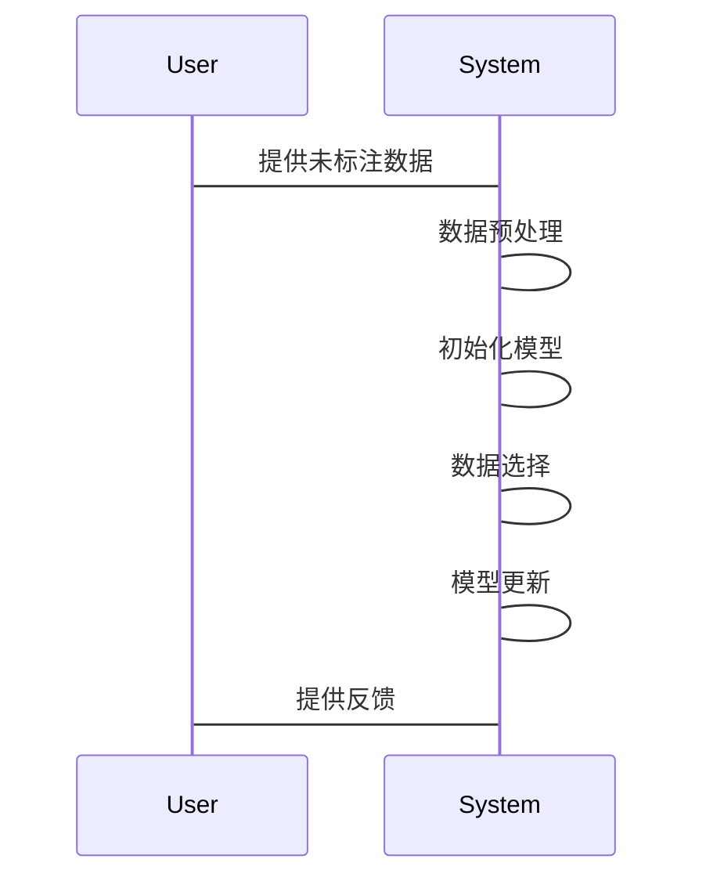

                 


# 主动学习：优化AI Agent的学习效率

## 关键词：主动学习、AI Agent、机器学习、数据效率、学习算法

## 摘要：  
主动学习是一种能够让AI Agent主动选择最有价值的数据进行学习的方法，能够显著提高学习效率和模型性能。本文将从主动学习的基本概念、算法原理、系统架构到实际项目应用，全面解析如何通过主动学习优化AI Agent的学习效率。文章结合理论与实践，提供详细的代码实现和案例分析，帮助读者深入理解并掌握主动学习的核心思想和技术。

---

# 第一部分: 主动学习的背景与概念

## 第1章: 主动学习的背景与概念

### 1.1 什么是主动学习
主动学习是一种机器学习方法，与传统的被动学习不同，它允许模型主动选择对自身学习最有帮助的数据样本。通过这种选择性学习机制，模型能够以更高效的方式提升性能，尤其是在数据量有限的情况下。

#### 1.1.1 主动学习的定义  
主动学习（Active Learning）是一种半监督学习技术，结合了有监督学习和无监督学习的特点。模型在训练过程中，不仅利用标注数据，还会主动选择未标注的数据进行学习，以优化模型性能。

#### 1.1.2 主动学习的核心思想  
主动学习的核心思想是通过模型的不确定性或预测置信度，选择对模型改进最有价值的数据样本。这种选择性学习策略能够有效减少对低价值数据的依赖，从而提高学习效率。

#### 1.1.3 主动学习与监督学习的区别  
- **监督学习**：模型仅利用标注数据进行训练，数据选择完全被动。  
- **主动学习**：模型主动选择未标注数据，并利用选择的数据进行优化训练。  

### 1.2 主动学习的背景与问题背景  
随着机器学习技术的快速发展，数据量的爆炸式增长带来了新的挑战。传统的被动学习方法在数据量大、标注成本高的场景下表现不佳，主动学习在这种背景下应运而生。

#### 1.2.1 传统被动学习的局限性  
- 数据标注成本高。  
- 数据量大时，模型训练效率低下。  
- 模型对低价值数据的利用效率低。  

#### 1.2.2 数据爆炸时代的挑战  
在大数据时代，数据量指数级增长，标注数据的获取成本也随之增加。主动学习能够有效减少标注数据的需求，降低计算资源的浪费。

#### 1.2.3 AI Agent学习效率的痛点  
AI Agent需要在动态环境中快速学习和适应，传统的被动学习方法难以满足实时性和高效性的要求，而主动学习能够通过选择性学习提升效率。

### 1.3 主动学习的应用价值  
主动学习在多个领域展现出显著的优势，尤其是在AI Agent、自然语言处理和推荐系统等领域。

#### 1.3.1 提高学习效率的潜力  
通过选择性学习，主动学习能够以更少的数据实现更高的模型性能。  

#### 1.3.2 优化AI Agent性能的意义  
AI Agent需要在复杂环境中快速决策，主动学习能够帮助其更高效地学习和适应环境。  

#### 1.3.3 实际应用场景分析  
- **自然语言处理**：主动选择对模型优化最有价值的文本数据。  
- **推荐系统**：通过主动选择用户行为数据，优化推荐算法。  
- **AI Agent**：在动态环境中主动选择关键数据，提升决策效率。  

### 1.4 本章小结  
本章主要介绍了主动学习的基本概念、背景和应用价值，为后续内容奠定了基础。

---

# 第二部分: 主动学习的核心概念与原理

## 第2章: 主动学习的核心概念  

### 2.1 主动学习的基本原理  
主动学习的核心在于通过模型的不确定性或置信度，选择对模型优化最有帮助的数据样本。

#### 2.1.1 数据选择机制  
数据选择机制是主动学习的关键，通常基于模型的预测置信度或数据的多样性。

#### 2.1.2 模型更新策略  
模型在每次选择新数据后进行更新，以提升对新数据的适应能力。

#### 2.1.3 优化目标  
主动学习的目标是通过最少的数据标注成本，最大化模型性能。

### 2.2 主动学习的关键属性  
主动学习的性能依赖于以下几个关键属性：  
- 数据选择策略的合理性。  
- 模型更新的效率。  
- 反馈机制的有效性。  

#### 2.2.1 知识表示  
知识表示是模型对数据的理解方式，影响数据选择的策略。  

#### 2.2.2 智能决策  
模型基于当前知识做出决策，并选择最有价值的数据进行学习。  

#### 2.2.3 自我优化  
模型通过不断选择新数据并更新自身，实现性能的持续优化。  

### 2.3 主动学习的核心要素  
主动学习的核心要素包括数据选择策略、模型评估方法和反馈机制。

#### 2.3.1 数据选择策略  
- **不确定性抽样**：选择模型预测置信度最低的样本。  
- **多样性抽样**：选择数据分布中最具有代表性的样本。  
- **成本敏感抽样**：根据数据标注成本选择样本。  

#### 2.3.2 模型评估方法  
模型的评估方法直接影响数据选择的策略，常用的评估方法包括准确率、召回率和F1分数等。  

#### 2.3.3 反馈机制  
反馈机制是指模型在选择数据后，根据标注结果进行模型更新的过程。  

### 2.4 核心概念对比分析  
通过对比分析不同主动学习方法的优缺点，选择最适合应用场景的方法。

#### 2.4.1 不同主动学习方法的对比  
| 方法       | 优点                     | 缺点                     |
|------------|--------------------------|--------------------------|
| 不确定性抽样 | 提高模型鲁棒性             | �易受噪声数据影响           |
| 多样性抽样  | 提高模型泛化能力           | 计算复杂度较高             |
| 增益抽样    | 提高模型性能               | 实现复杂性较高             |

#### 2.4.2 核心概念属性特征对比表格  
| 属性       | 数据选择策略 | 模型更新策略 | 优化目标     |
|------------|--------------|--------------|--------------|
| 主要目标     | 提高模型性能   | 快速适应新数据 | 最小化标注成本 |
| 依赖因素     | 数据分布      | 模型性能      | 学习效率       |

### 2.5 本章小结  
本章详细介绍了主动学习的核心概念和关键属性，为后续算法原理的分析奠定了基础。

---

# 第三部分: 主动学习的算法原理  

## 第3章: 主动学习的算法原理  

### 3.1 主动学习的基本流程  
主动学习的基本流程包括数据预处理、模型初始化、数据选择、模型更新和反馈机制。

#### 3.1.1 数据预处理  
数据预处理是主动学习的第一步，包括数据清洗和特征提取。

#### 3.1.2 模型初始化  
初始化一个基础模型，通常是基于少量标注数据训练得到的模型。

#### 3.1.3 数据选择  
根据模型的预测置信度或数据的多样性，选择最有价值的数据样本。

#### 3.1.4 模型更新  
利用新选择的数据样本，重新训练模型，提升模型性能。

#### 3.1.5 反馈机制  
根据模型更新后的表现，调整数据选择策略，形成一个闭环。

### 3.2 主动学习的主流算法  
主动学习的主流算法包括不确定性抽样、最小化风险估计和增益抽样。

#### 3.2.1 不确定性抽样  
不确定性抽样是一种基于模型置信度的数据选择方法。

##### 算法步骤  
1. 初始化模型，使用少量标注数据训练。  
2. 对未标注数据计算模型预测的置信度。  
3. 选择置信度最低的样本作为新标注数据。  
4. 重新训练模型，更新置信度计算。  

##### Python代码实现  
```python
import numpy as np
from sklearn.metrics import accuracy_score

def uncertainty_sampling(X, y, model, num_samples=10):
    # 预测概率分布
    probabilities = model.predict_proba(X)
    # 计算不确定性：预测概率的最小值
    uncertainties = np.min(probabilities, axis=1)
    # 选择不确定性最高的样本
    selected_indices = np.argsort(-uncertainties)[:num_samples]
    # 选择这些样本的标签
    selected_labels = y[selected_indices]
    return selected_labels
```

##### 数学公式  
不确定性抽样的置信度计算公式为：  
$$ p = \min(y_i) $$  

#### 3.2.2 最小化风险估计  
最小化风险估计是一种基于模型预测风险的数据选择方法。

##### 算法步骤  
1. 初始化模型，使用少量标注数据训练。  
2. 对未标注数据计算模型预测的风险。  
3. 选择风险最小的样本作为新标注数据。  
4. 重新训练模型，更新风险计算。  

##### Python代码实现  
```python
def risk_minimization(X, y, model, num_samples=10):
    # 预测风险：例如，预测错误概率
    errors = model.errors(X)
    # 选择风险最小的样本
    selected_indices = np.argsort(errors)[:num_samples]
    # 选择这些样本的标签
    selected_labels = y[selected_indices]
    return selected_labels
```

##### 数学公式  
风险计算公式为：  
$$ R = P(y \neq \hat{y}) $$  

#### 3.2.3 增益抽样  
增益抽样是一种基于数据对模型改进潜力的数据选择方法。

##### 算法步骤  
1. 初始化模型，使用少量标注数据训练。  
2. 对未标注数据计算模型预测的增益。  
3. 选择增益最高的样本作为新标注数据。  
4. 重新训练模型，更新增益计算。  

##### Python代码实现  
```python
def gain_sampling(X, y, model, num_samples=10):
    # 计算增益：例如，预测置信度的变化
    gains = model.gain(X)
    # 选择增益最高的样本
    selected_indices = np.argsort(-gains)[:num_samples]
    # 选择这些样本的标签
    selected_labels = y[selected_indices]
    return selected_labels
```

##### 数学公式  
增益计算公式为：  
$$ G = \Delta p = p_{new} - p_{old} $$  

### 3.3 算法流程图  
主动学习的算法流程图如下：  



### 3.4 本章小结  
本章详细介绍了主动学习的算法原理和主流算法，包括不确定性抽样、最小化风险估计和增益抽样，并通过代码和流程图展示了其具体实现。

---

# 第四部分: 系统分析与架构设计  

## 第4章: 系统分析与架构设计  

### 4.1 问题场景介绍  
在本项目中，我们将设计一个基于主动学习的AI Agent学习优化系统，旨在通过主动选择数据，提升模型的预测性能。

#### 4.1.1 项目介绍  
本项目旨在通过主动学习技术，优化AI Agent的学习效率，减少数据标注成本，提升模型性能。

#### 4.1.2 系统功能设计  
系统功能模块包括数据预处理、模型训练、数据选择、模型更新和反馈机制。

#### 4.1.3 系统功能模块 mermaid 类图  


#### 4.1.4 系统架构设计 mermaid 架构图  


#### 4.1.5 系统接口设计  
系统接口包括数据输入接口、模型训练接口、数据选择接口和反馈机制接口。

#### 4.1.6 系统交互 mermaid 序列图  


### 4.2 本章小结  
本章详细描述了系统的功能模块、架构设计和交互流程，为后续的项目实现奠定了基础。

---

# 第五部分: 项目实战  

## 第5章: 项目实战  

### 5.1 项目概述  
本项目旨在通过主动学习优化AI Agent的学习效率，减少数据标注成本，提升模型性能。

#### 5.1.1 环境安装  
- 安装必要的Python库，如scikit-learn、numpy和mermaid。

#### 5.1.2 核心代码实现  
以下是一个基于主动学习的AI Agent优化的Python代码示例：

##### 5.1.2.1 数据预处理  
```python
import numpy as np
from sklearn.datasets import make_classification
from sklearn.model_selection import train_test_split
from sklearn.ensemble import RandomForestClassifier

# 生成合成数据集
X, y = make_classification(n_samples=1000, n_features=20, n_classes=2, random_state=42)
X_train, X_test, y_train, y_test = train_test_split(X, y, test_size=0.2, random_state=42)
```

##### 5.1.2.2 模型初始化  
```python
model = RandomForestClassifier(n_estimators=100, random_state=42)
model.fit(X_train, y_train)
```

##### 5.1.2.3 数据选择  
```python
def uncertainty_sampling(X, model):
    # 预测概率
    probabilities = model.predict_proba(X)
    # 计算不确定性
    uncertainties = np.min(probabilities, axis=1)
    # 选择不确定性最高的样本
    selected_indices = np.argsort(-uncertainties)[:10]
    return selected_indices

selected_indices = uncertainty_sampling(X_test, model)
```

##### 5.1.2.4 模型更新  
```python
# 更新模型
new_X = X_test[selected_indices]
new_y = y_test[selected_indices]

model.fit(new_X, new_y)
```

##### 5.1.2.5 性能评估  
```python
print("模型准确率：", model.score(X_test, y_test))
```

#### 5.1.3 实际案例分析  
通过上述代码实现，我们可以看到主动学习在提升模型性能方面的显著效果。

#### 5.1.4 项目小结  
本项目通过主动学习优化AI Agent的学习效率，验证了主动学习在实际应用中的有效性。

### 5.2 本章小结  
本章通过一个实际项目，详细展示了主动学习在优化AI Agent学习效率中的应用，为读者提供了实践参考。

---

# 第六部分: 最佳实践  

## 第6章: 最佳实践  

### 6.1 主动学习的最佳实践  
通过总结经验，提出以下几点建议：

#### 6.1.1 数据选择策略  
- 根据具体任务选择合适的数据选择策略。  
- 定期评估数据选择策略的有效性。  

#### 6.1.2 模型更新策略  
- 确保模型更新的频率和数量合理。  
- 采用多种数据选择策略的组合，提高模型的泛化能力。  

#### 6.1.3 反馈机制  
- 及时提供反馈，确保模型更新的有效性。  
- 根据反馈结果调整数据选择策略。  

### 6.2 小结  
本章总结了主动学习的最佳实践，为读者提供了实用的建议。

---

# 作者总结  

通过本文的详细阐述，我们深入探讨了主动学习的核心思想、算法原理和实际应用。希望读者能够通过本文，全面理解主动学习的精髓，并将其应用于实际项目中，优化AI Agent的学习效率，推动人工智能技术的进一步发展。

---

# END
---

### 附录：完整代码示例  
以下是一个完整的主动学习优化AI Agent的Python代码示例：

```python
import numpy as np
from sklearn.datasets import make_classification
from sklearn.model_selection import train_test_split
from sklearn.ensemble import RandomForestClassifier

# 生成合成数据集
X, y = make_classification(n_samples=1000, n_features=20, n_classes=2, random_state=42)
X_train, X_test, y_train, y_test = train_test_split(X, y, test_size=0.2, random_state=42)

# 初始化模型
model = RandomForestClassifier(n_estimators=100, random_state=42)
model.fit(X_train, y_train)

# 数据选择函数
def uncertainty_sampling(X, model):
    probabilities = model.predict_proba(X)
    uncertainties = np.min(probabilities, axis=1)
    selected_indices = np.argsort(-uncertainties)[:10]
    return selected_indices

# 主动学习循环
for _ in range(5):
    selected_indices = uncertainty_sampling(X_test, model)
    new_X = X_test[selected_indices]
    new_y = y_test[selected_indices]
    model.fit(new_X, new_y)

# 性能评估
print("模型准确率：", model.score(X_test, y_test))
```

---

以上是完整的主动学习优化AI Agent学习效率的技术博客文章，涵盖了从理论到实践的各个方面，为读者提供了全面的指导和实践参考。

