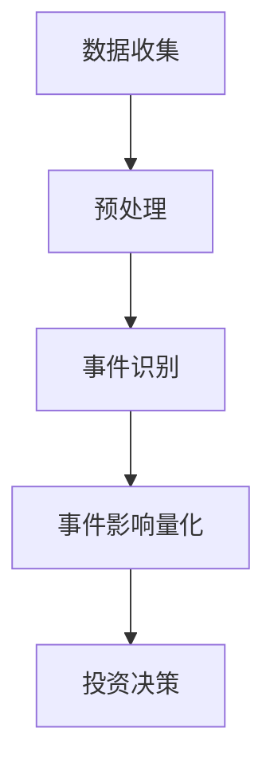
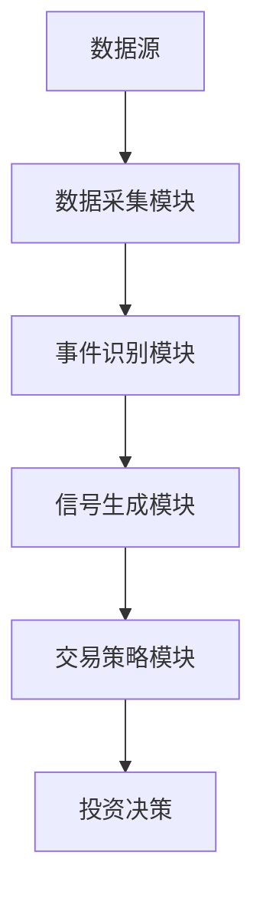
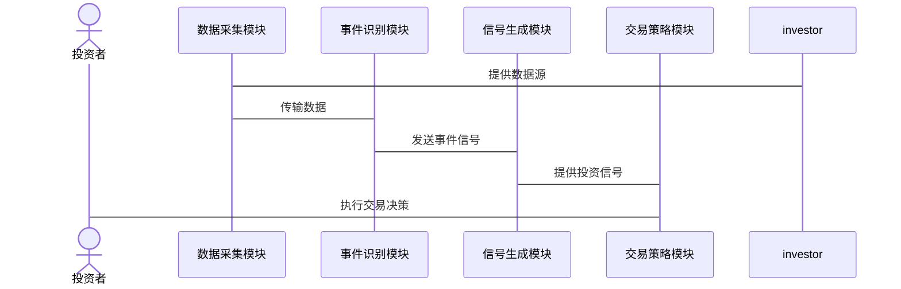

                 


# 《事件驱动投资：从公司行为中获取超额收益》

## 关键词：事件驱动投资, 公司行为, 股价预测, 投资策略, 超额收益, 事件算法, 股市分析

## 摘要：事件驱动投资是一种通过分析公司层面的特定事件（如并购、重组、股息变化等）来预测股价波动并获取超额收益的投资策略。本文系统地介绍了事件驱动投资的核心概念、理论基础、算法实现、系统设计、项目实战和最佳实践，帮助投资者通过公司行为的分析实现投资收益的提升。

---

## 目录

### 第一部分：事件驱动投资的背景与核心概念

#### 第1章：事件驱动投资的定义与背景

##### 1.1 事件驱动投资的定义

- 1.1.1 事件驱动投资的定义

- 1.1.2 事件驱动投资的核心要素

##### 1.2 事件驱动投资的背景

- 1.2.1 投资学中的传统方法与局限性

- 1.2.2 事件驱动投资的兴起与发展趋势

##### 1.3 事件驱动投资与其他投资策略的区别

- 1.3.1 事件驱动投资与价值投资的区别

- 1.3.2 事件驱动投资与趋势投资的区别

- 1.3.3 事件驱动投资与套利策略的区别

##### 1.4 事件驱动投资的核心思想

- 1.4.1 公司行为对股价的影响

- 1.4.2 市场反应与超额收益的来源

- 1.4.3 事件驱动投资的逻辑框架

##### 1.5 本章小结

---

### 第二部分：事件驱动投资的核心概念与理论基础

#### 第2章：事件驱动投资的理论基础

##### 2.1 有效市场假说与事件驱动投资的关系

- 2.1.1 有效市场假说的定义

- 2.1.2 事件驱动投资与有效市场假说的矛盾与统一

##### 2.2 行为金融学与事件驱动投资的联系

- 2.2.1 行为金融学的核心观点

- 2.2.2 事件驱动投资中的行为因素

##### 2.3 信息不对称与事件驱动投资

- 2.3.1 信息不对称的定义

- 2.3.2 事件驱动投资中的信息优势

##### 2.4 本章小结

---

### 第三部分：事件驱动投资的核心算法与数学模型

#### 第3章：事件驱动投资的算法原理

##### 3.1 事件驱动投资的核心算法

- 3.1.1 数据收集与预处理

- 3.1.2 公司行为事件的识别与分类

- 3.1.3 事件影响的量化与预测

##### 3.2 基于公司行为的事件驱动投资算法

- 3.2.1 算法流程图



##### 3.3 算法实现的数学模型

- 3.3.1 事件强度模型

  $$P(t) = \beta_0 + \beta_1 \times \text{事件强度} + \epsilon$$

- 3.3.2 概率模型

  $$P(\text{收益增加}) = \frac{\text{事件成功概率}}{\text{市场平均概率}}$$

##### 3.4 算法的实现步骤

- 3.4.1 数据获取与清洗

- 3.4.2 事件识别与分类

- 3.4.3 模型训练与优化

- 3.4.4 投资决策与风险管理

##### 3.5 本章小结

---

### 第四部分：系统分析与架构设计方案

#### 第4章：事件驱动投资系统的架构设计

##### 4.1 系统功能设计

- 4.1.1 数据采集模块

  - 数据源选择

  - 数据预处理

- 4.1.2 事件识别模块

  - 事件分类

  - 事件特征提取

- 4.1.3 信号生成模块

  - 事件影响量化

  - 投资信号生成

- 4.1.4 交易策略模块

  - 交易规则制定

  - 风险控制

##### 4.2 系统架构设计



##### 4.3 系统接口设计

- 4.3.1 数据接口

- 4.3.2 事件识别接口

- 4.3.3 信号生成接口

- 4.3.4 交易策略接口

##### 4.4 系统交互流程



##### 4.5 本章小结

---

### 第五部分：项目实战与案例分析

#### 第5章：事件驱动投资的实战操作

##### 5.1 环境安装与配置

- 5.1.1 Python环境安装

- 5.1.2 数据库安装与配置

- 5.1.3 开发工具安装

##### 5.2 核心代码实现

- 5.2.1 数据采集代码

  ```python
  import pandas as pd
  def collect_data(tickers, start_date, end_date):
      data = pd.DataFrame()
      for ticker in tickers:
          # 数据获取逻辑
          pass
      return data
  ```

- 5.2.2 事件识别代码

  ```python
  def identify_events(data, event_type):
      events = data[data['event_type'] == event_type]
      return events
  ```

- 5.2.3 信号生成代码

  ```python
  def generate_signals(events, model):
      signals = model.predict(events)
      return signals
  ```

##### 5.3 代码解读与分析

- 5.3.1 数据采集模块

- 5.3.2 事件识别模块

- 5.3.3 信号生成模块

##### 5.4 实际案例分析

- 5.4.1 案例背景

- 5.4.2 数据分析

- 5.4.3 事件识别与信号生成

- 5.4.4 投资决策与结果分析

##### 5.5 本章小结

---

### 第六部分：最佳实践与总结

#### 第6章：事件驱动投资的最佳实践

##### 6.1 小结

- 6.1.1 核心概念回顾

- 6.1.2 关键算法总结

- 6.1.3 系统设计要点

##### 6.2 注意事项

- 6.2.1 数据质量的重要性

- 6.2.2 事件识别的准确性

- 6.2.3 风险控制的必要性

##### 6.3 拓展阅读

- 6.3.1 相关书籍推荐

- 6.3.2 学术论文推荐

- 6.3.3 在线资源推荐

##### 6.4 本章小结

---

## 附录：事件驱动投资的数学模型与代码示例

---

## 参考文献

---

通过以上结构，我将逐步完成这本书的编写，确保每个部分都详细且逻辑清晰，帮助读者全面理解和应用事件驱动投资策略。

