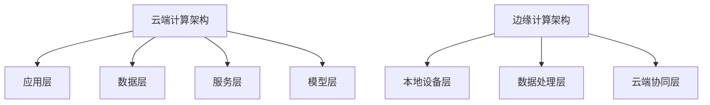
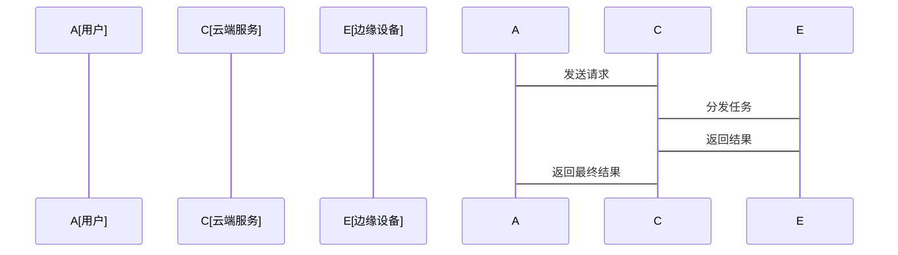

                 


# 《云端 vs 边缘计算：AI Agent的最佳运行环境》

---

## 关键词：
- 云端计算、边缘计算、AI Agent、技术优劣势、实现方案、案例分析、未来趋势

---

## 摘要：
本文系统地探讨了云端计算和边缘计算在AI Agent中的应用环境与最佳实践。通过分析云端和边缘计算的特点、技术优劣势，以及它们在AI Agent中的实现方案和实际案例，本文为读者提供了清晰的思路和决策依据。同时，本文还展望了未来的技术融合趋势和AI Agent的发展方向，为技术从业者和研究者提供了重要的参考。

---

## 第一部分: 引言

## 第1章: 引言

### 1.1 问题背景与研究意义
#### 1.1.1 云计算与边缘计算的兴起
- 云计算的普及与挑战
- 边缘计算的崛起及其特点
- AI Agent的定义与应用场景

#### 1.1.2 AI Agent的概念与应用需求
- AI Agent的基本概念
- AI Agent的核心需求：实时性、数据量、隐私保护
- AI Agent在云端和边缘计算中的定位

#### 1.1.3 本书的研究目标与意义
- 研究目标：云端 vs 边缘计算的优劣势分析
- 研究意义：为AI Agent的最佳运行环境提供决策依据

### 1.2 本书结构安排
- 目录概览
- 核心内容与学习路径
- 读者对象与预期收获

---

## 第二部分: 云端与边缘计算的基础

## 第2章: 云端计算概述

### 2.1 云端计算的基本概念
#### 2.1.1 云端计算的定义与特点
- 云端计算的核心概念
- 云端计算的主要特点：资源池化、弹性扩展、按需分配

#### 2.1.2 云端计算的核心技术与优势
- 虚拟化技术：容器与虚拟机的优劣势
- 分布式计算：数据分片与任务调度
- 大数据处理：MapReduce与Spark框架

#### 2.1.3 云端计算的应用场景
- 企业级AI模型训练
- 云计算在AI Agent中的应用场景

### 2.2 云端计算的挑战与局限性
#### 2.2.1 带宽与延迟问题
- 云端计算的延迟问题
- 带宽不足的影响

#### 2.2.2 数据隐私与安全风险
- 云端数据的安全威胁
- 数据隐私保护的挑战

#### 2.2.3 计算资源的弹性扩展性
- 云端资源的动态分配问题
- 资源分配的延迟与成本

---

## 第3章: 边缘计算概述

### 3.1 边缘计算的基本概念
#### 3.1.1 边缘计算的定义与特点
- 边缘计算的核心概念
- 边缘计算的主要特点：低延迟、本地化处理

#### 3.1.2 边缘计算的核心技术与优势
- 边缘计算的关键技术：本地数据处理、分布式计算
- 边缘计算的优势：低延迟、带宽优化

#### 3.1.3 边缘计算的应用场景
- 工业自动化中的边缘计算
- 智能家居中的边缘计算

### 3.2 边缘计算的挑战与局限性
#### 3.2.1 资源限制
- 边缘设备的计算能力不足
- 边缘设备的维护与管理

#### 3.2.2 数据隐私与安全风险
- 边缘设备的数据安全问题
- 数据隐私保护的挑战

#### 3.2.3 通信延迟与带宽不足
- 边缘计算中的通信延迟问题
- 网络带宽的限制

---

## 第三部分: AI Agent的需求与环境选择

## 第4章: AI Agent的基本概念与需求

### 4.1 AI Agent的定义与核心需求
#### 4.1.1 AI Agent的定义
- AI Agent的基本概念
- AI Agent的核心能力：感知、决策、执行

#### 4.1.2 AI Agent的运行需求
- 实时性需求
- 数据处理需求
- 隐私保护需求

### 4.2 云端与边缘计算在AI Agent中的角色
#### 4.2.1 云端计算在AI Agent中的角色
- 云端计算的优势：强大的计算能力、丰富的数据资源
- 云端计算的劣势：延迟与带宽问题

#### 4.2.2 边缘计算在AI Agent中的角色
- 边缘计算的优势：低延迟、本地化处理
- 边缘计算的劣势：资源限制

### 4.3 云端与边缘计算的结合
#### 4.3.1 云端与边缘计算的协同
- 云端与边缘的协同模式
- 云端与边缘的联合优化

#### 4.3.2 混合计算的实现
- 混合计算的概念
- 混合计算的优势与挑战

---

## 第四部分: 技术实现与案例分析

## 第5章: 云端与边缘计算的技术实现

### 5.1 云端计算的技术实现
#### 5.1.1 云端AI Agent的系统架构
- 系统架构设计：分层架构与微服务架构
- 数据流与任务调度

#### 5.1.2 云端AI Agent的实现方案
- 云端AI Agent的实现步骤
- 云端AI Agent的核心代码示例

### 5.2 边缘计算的技术实现
#### 5.2.1 边缘AI Agent的系统架构
- 边缘计算的系统架构设计
- 边缘AI Agent的数据处理流程

#### 5.2.2 边缘AI Agent的实现方案
- 边缘AI Agent的实现步骤
- 边缘AI Agent的核心代码示例

---

## 第6章: 云端与边缘计算的案例分析

### 6.1 云端计算的应用案例
#### 6.1.1 智能客服系统的云端实现
- 案例背景与需求分析
- 系统架构设计与实现方案
- 实际效果与优化建议

#### 6.1.2 大规模AI模型训练的云端实现
- 案例背景与需求分析
- 系统架构设计与实现方案
- 实际效果与优化建议

### 6.2 边缘计算的应用案例
#### 6.2.1 工业自动化中的边缘计算应用
- 案例背景与需求分析
- 系统架构设计与实现方案
- 实际效果与优化建议

#### 6.2.2 智能家居中的边缘计算应用
- 案例背景与需求分析
- 系统架构设计与实现方案
- 实际效果与优化建议

---

## 第五部分: 挑战与解决方案

## 第7章: 云端与边缘计算的挑战

### 7.1 云端计算的挑战
#### 7.1.1 计算资源的弹性扩展性
- 云端资源分配的优化问题
- 资源分配的延迟与成本

#### 7.1.2 数据隐私与安全风险
- 云端数据的安全威胁
- 数据隐私保护的挑战

### 7.2 边缘计算的挑战
#### 7.2.1 资源限制
- 边缘设备的计算能力不足
- 边缘设备的维护与管理

#### 7.2.2 数据隐私与安全风险
- 边缘设备的数据安全问题
- 数据隐私保护的挑战

---

## 第8章: 解决方案与优化策略

### 8.1 云端计算的优化策略
#### 8.1.1 算法优化
- 算法优化的核心思想
- 算法优化的具体实现

#### 8.1.2 数据压缩与编码技术
- 数据压缩的核心思想
- 数据编码的具体实现

### 8.2 边缘计算的优化策略
#### 8.2.1 算法优化
- 算法优化的核心思想
- 算法优化的具体实现

#### 8.2.2 数据压缩与编码技术
- 数据压缩的核心思想
- 数据编码的具体实现

---

## 第六部分: 未来趋势与展望

## 第9章: 未来趋势与展望

### 9.1 技术融合与创新
#### 9.1.1 云端与边缘计算的深度融合
- 云端与边缘计算的协同优化
- 混合计算的未来发展方向

#### 9.1.2 边缘计算的智能化发展
- 边缘计算的智能化趋势
- AI Agent在边缘计算中的未来角色

### 9.2 5G与物联网的推动作用
#### 9.2.1 5G技术对AI Agent的推动作用
- 5G技术的核心优势
- 5G技术在AI Agent中的应用

#### 9.2.2 物联网的未来发展
- 物联网的核心优势
- 物联网在AI Agent中的应用

---

## 第七部分: 总结与小结

## 第10章: 总结与小结

### 10.1 核心内容回顾
- 云端与边缘计算的特点与优势
- AI Agent的最佳运行环境选择

### 10.2 未来研究方向
- 云端与边缘计算的进一步融合
- AI Agent在新兴技术中的应用

### 10.3 致谢与参考文献
- 致谢
- 参考文献与推荐阅读资料

---

## 附录

### 附录A: 云端与边缘计算的技术对比表
| **技术特性**       | **云端计算**                     | **边缘计算**                     |
|--------------------|----------------------------------|----------------------------------|
| 计算能力           | 强大，资源弹性扩展               | 有限，依赖本地设备               |
| 延迟               | 高，依赖网络条件                 | 低，本地处理                     |
| 数据隐私           | 中，依赖云服务提供商的保护措施   | 高，数据本地存储与处理           |
| 带宽需求           | 高，依赖网络带宽                 | 低，本地处理减少带宽需求         |

### 附录B: 云端与边缘计算的系统架构图


### 附录C: AI Agent算法实现示例代码
```python
# 云端AI Agent示例代码
def cloud_ai_agent(data):
    import requests
    import json
    headers = {'Content-Type': 'application/json'}
    response = requests.post('http://localhost:8000/api', json=data, headers=headers)
    return json.loads(response.text)

# 边缘AI Agent示例代码
def edge_ai_agent(data):
    from local_model import predict
    result = predict(data)
    return result
```

---

## 附录D: 云端与边缘计算的数学模型对比

### 云端计算数学模型
$$
C_{\text{云端}} = \frac{R_{\text{总}}}{N_{\text{资源}}}
$$
其中，$R_{\text{总}}$ 表示总资源需求，$N_{\text{资源}}$ 表示可用资源数量。

### 边缘计算数学模型
$$
E_{\text{边缘}} = \min(R_{\text{局部}}, N_{\text{资源}})
$$
其中，$R_{\text{局部}}$ 表示局部资源需求，$N_{\text{资源}}$ 表示可用资源数量。

---

## 附录E: 云端与边缘计算的系统交互图


---

## 附录F: 最佳实践与注意事项
1. **选择云端计算的场景**：
   - 数据量大、计算需求高
   - 需要弹性扩展能力
   - 对延迟不敏感

2. **选择边缘计算的场景**：
   - 需要低延迟处理
   - 数据本地化需求高
   - 网络条件有限

3. **混合计算的注意事项**：
   - 合理分配任务，避免资源浪费
   - 优化数据同步机制，减少通信开销
   - 确保数据隐私与安全

---

## 附录G: 拓展阅读与参考文献
1. 《Cloud Computing: Concepts, Technology, and Research》
2. 《Edge Computing: Vision and Challenges》
3. 《Artificial Intelligence: Theory and Practice》
4. 《Distributed Systems: Principles and Practice》

