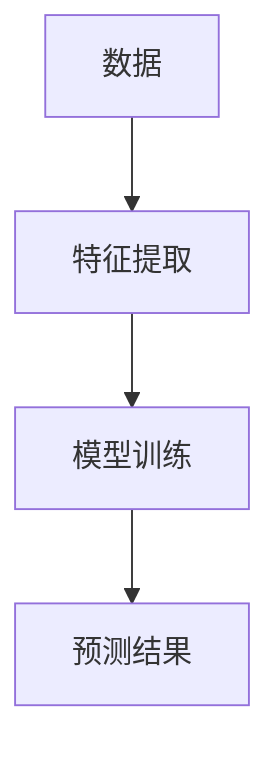
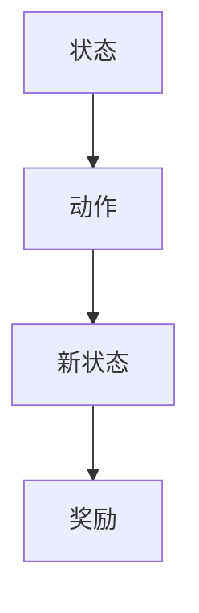

                 


```markdown
# 交通AI Agent：智能路况分析与导航

> 关键词：交通AI Agent，智能路况分析，导航系统，机器学习，深度学习，强化学习，系统架构设计

> 摘要：随着城市交通的日益复杂，传统的导航系统已经难以满足人们对高效、智能交通管理的需求。本书旨在介绍如何利用AI Agent技术来实现智能路况分析与导航。通过结合机器学习、深度学习和强化学习等算法，我们能够构建出更加智能化的交通管理系统，实时分析路况并提供最优导航方案。本书不仅涵盖理论知识，还包括实际项目的实现步骤，帮助读者从零开始掌握交通AI Agent的设计与应用。

---

# 第一部分: 引言

## 1.1 交通AI Agent的背景与意义
### 1.1.1 交通智能化的背景
随着城市化进程的加快，交通拥堵、事故频发等问题日益严重，传统的交通管理系统已经难以应对复杂的交通状况。AI Agent作为一种智能体，能够实时感知环境、自主决策并执行任务，为解决交通问题提供了新的思路。

### 1.1.2 AI Agent在交通中的作用
AI Agent可以通过分析实时交通数据，预测路况变化，优化路径规划，从而提高交通效率，减少拥堵和事故发生率。此外，AI Agent还可以与其他交通系统和设备（如智能交通信号灯、自动驾驶车辆）进行无缝对接，实现智能化的交通管理。

### 1.1.3 本书的目的与目标
本书旨在介绍AI Agent在交通中的应用，从理论到实践，详细讲解智能路况分析与导航的核心技术。通过本书的学习，读者将能够掌握AI Agent的基本概念、相关算法以及系统设计方法，并能够将其应用到实际的交通管理中。

---

# 第二部分: 交通AI Agent基础

## 2.1 AI Agent的基本概念
### 2.1.1 什么是AI Agent
AI Agent是一种智能体，能够感知环境、自主决策并执行任务。在交通领域，AI Agent可以用于实时分析路况、优化路径规划等。

### 2.1.2 AI Agent的分类
AI Agent可以根据智能水平分为反应式AI Agent和认知式AI Agent。反应式AI Agent仅根据当前感知做出决策，而认知式AI Agent则具备推理、规划等高级功能。

### 2.1.3 交通AI Agent的特点
交通AI Agent具有实时性、自主性、智能性和适应性等特点。它能够实时处理交通数据，自主决策并优化路径，同时具备学习和适应能力，能够不断优化其性能。

## 2.2 交通大数据概述
### 2.2.1 交通大数据的定义与特点
交通大数据是指在交通系统中产生的海量数据，包括交通流量、车辆位置、事故记录等。这些数据具有多样性、海量性和实时性等特点。

### 2.2.2 数据来源与处理
交通数据可以来源于交通传感器、GPS、摄像头等多种设备。数据处理包括数据清洗、特征提取和数据存储等步骤。

### 2.2.3 数据分析与可视化
通过数据分析技术，可以提取交通数据中的有用信息，帮助我们理解交通状况。数据可视化技术可以将复杂的交通数据以直观的方式呈现，便于决策者和公众理解。

## 2.3 智能路况分析的基本原理
### 2.3.1 路况数据的采集与处理
通过交通传感器、摄像头等设备采集路况数据，并进行预处理和特征提取。

### 2.3.2 数据驱动的路况预测
利用机器学习等技术，基于历史数据预测未来的路况。

### 2.3.3 基于模型的路况分析
通过建立交通流模型，模拟交通系统的运行状态，分析潜在的问题和优化方案。

---

# 第三部分: 交通AI Agent的核心算法

## 3.1 机器学习在交通中的应用
### 3.1.1 机器学习的基本概念
机器学习是一种人工智能技术，通过训练模型从数据中学习规律，并用于预测或分类。

### 3.1.2 常见算法及其应用
常用的机器学习算法包括线性回归、支持向量机（SVM）、随机森林等。这些算法在交通预测、分类等方面有广泛应用。

### 3.1.3 机器学习在路况预测中的案例
例如，利用线性回归模型预测交通流量的变化。



```python
# 线性回归模型
import numpy as np
from sklearn.linear_model import LinearRegression

# 数据准备
X = np.array([i for i in range(100)]).reshape(-1, 1)
y = np.array([2*i + 1 for i in range(100)])

# 模型训练
model = LinearRegression()
model.fit(X, y)

# 预测
print(model.predict(X))
```

## 3.2 深度学习在交通中的应用
### 3.2.1 深度学习的基本原理
深度学习是一种机器学习技术，通过多层神经网络提取数据的高层次特征。

### 3.2.2 CNN与RNN在交通数据中的应用
卷积神经网络（CNN）适用于图像处理，可以用于交通流量监控；循环神经网络（RNN）适用于时间序列数据，可以用于预测交通状况。

### 3.2.3 深度学习模型的训练与优化
通过调整网络结构、选择合适的优化算法（如Adam）和调节超参数来提高模型性能。

## 3.3 强化学习在交通导航中的应用
### 3.3.1 强化学习的基本原理
强化学习通过智能体与环境的交互，学习最优策略。

### 3.3.2 强化学习在路径规划中的应用
例如，利用强化学习算法训练智能体在交通网络中寻找最优路径。

### 3.3.3 实例分析与代码实现
以下是一个简单的强化学习示例：



```python
# 强化学习示例（Q-learning）
import numpy as np

# 状态空间和动作空间
states = 5
actions = 4

# Q表初始化
Q = np.zeros((states, actions))

# 训练过程
for episode in range(100):
    state = 0
    while True:
        action = np.argmax(Q[state])
        next_state = ...  # 根据动作计算新状态
        reward = ...  # 计算奖励
        Q[state, action] += reward
        state = next_state
```

---

# 第四部分: 交通AI Agent的系统设计

## 4.1 交通AI Agent的系统架构
### 4.1.1 系统模块划分
交通AI Agent系统可以划分为数据采集模块、数据处理模块、模型训练模块和结果输出模块。

### 4.1.2 各模块的功能与交互
数据采集模块负责收集交通数据，数据处理模块进行清洗和特征提取，模型训练模块基于这些数据训练模型，结果输出模块将预测结果用于导航。

### 4.1.3 系统架构的优缺点
集中式架构便于管理，但可能面临单点故障；分布式架构具有高可用性，但设计复杂。

### 4.1.4 实体关系图（ER图）
```mermaid
erDiagram
    user {
        id : integer
        name : string
    }
    traffic_data {
        id : integer
        timestamp : datetime
        speed : float
        location : string
    }
    model {
        id : integer
        name : string
        accuracy : float
    }
    user --> traffic_data
    traffic_data --> model
```

## 4.2 系统功能设计
### 4.2.1 数据采集与处理模块
负责收集和预处理交通数据，确保数据的准确性和完整性。

### 4.2.2 路况分析模块
基于机器学习模型分析当前和未来的路况，识别拥堵、事故等异常情况。

### 4.2.3 路径规划与导航模块
根据路况分析结果，为用户提供最优导航方案。

### 4.2.4 用户界面模块
提供友好的用户界面，展示分析结果和导航方案。

## 4.3 系统接口设计
### 4.3.1 数据接口
定义数据的输入和输出格式，确保不同模块之间的数据兼容性。

### 4.3.2 用户接口
设计用户与系统交互的界面，包括数据输入、结果显示等功能。

### 4.3.3 第三方服务接口
与地图服务、交通信号灯等第三方系统进行对接，实现数据共享和功能扩展。

## 4.4 系统交互流程
### 4.4.1 用户请求处理流程
用户输入起点和终点，系统根据当前路况生成最优路径。

### 4.4.2 数据处理与分析流程
系统接收数据后，进行清洗、特征提取，并利用训练好的模型进行分析。

### 4.4.3 结果返回与展示流程
分析结果返回给用户，展示最优路径和实时路况。

---

# 第五部分: 项目实战

## 5.1 环境搭建与数据准备
### 5.1.1 开发环境的选择与安装
推荐使用Python作为开发语言，安装必要的库（如TensorFlow、Keras）。

### 5.1.2 数据集的获取与预处理
从公开数据集获取交通数据，进行清洗和特征提取。

### 5.1.3 数据清洗与特征工程
利用数据清洗技术去除异常值，提取有用的特征。

## 5.2 系统核心实现
### 5.2.1 数据采集模块实现
编写代码采集实时交通数据。

### 5.2.2 路况分析模块实现
训练机器学习模型，进行路况预测。

### 5.2.3 路径规划模块实现
基于强化学习算法实现路径规划。

### 5.2.4 用户界面模块实现
设计一个简单的GUI界面，展示分析结果。

## 5.3 实际案例分析
### 5.3.1 案例背景介绍
介绍一个实际案例，如某城市交通管理系统的优化。

### 5.3.2 数据分析与模型训练
对案例数据进行分析，训练模型并评估性能。

### 5.3.3 系统实现与测试
实现系统并进行测试，验证其有效性和性能。

## 5.4 项目总结与优化
### 5.4.1 项目总结
总结项目的实现过程和主要成果。

### 5.4.2 系统优化
提出优化建议，如优化算法性能、改进系统架构等。

### 5.4.3 拓展阅读
推荐相关领域的书籍和论文，供读者进一步学习。

---

# 第六部分: 总结与展望

## 6.1 本书总结
回顾本书的主要内容，强调AI Agent在交通中的重要性。

## 6.2 未来展望
展望交通AI Agent的发展方向，如与其他技术的结合（如边缘计算、5G）。

## 6.3 最佳实践 tips
提供一些实际应用中的注意事项和技巧。

## 6.4 小结
鼓励读者将所学知识应用到实际中，为智能交通的发展贡献力量。

---

# 参考文献
（此处列出本书参考的文献和资料）

---

# 索引
（此处列出书中的术语和关键词索引）
```

