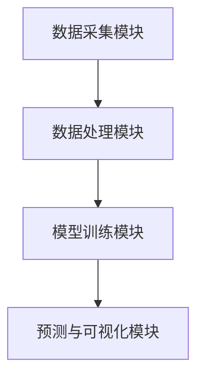

                 


# 人口结构变化对长期投资的影响

> 关键词：人口老龄化，投资策略，经济增长，社会保障，消费市场，资产配置，数学模型

> 摘要：人口结构的变化，如老龄化和少子化，对全球经济和社会产生了深远影响。本文分析了人口结构变化对长期投资的影响，探讨了其对不同资产类别（如股票、债券、房地产）的投资策略调整，构建了数学模型以预测人口变化对投资的影响，并通过实际案例分析了投资策略的动态调整。本文旨在为投资者提供基于人口结构变化的长期投资策略和决策支持。

---

## 第一部分: 人口结构变化的背景与影响

### 第1章: 人口结构变化的背景与现状

#### 1.1 人口结构变化的定义与核心概念

人口结构变化是指人口在年龄、性别、职业、教育水平等方面的分布发生变化的过程。核心概念包括：

- **年龄结构**：不同年龄段人口的比例变化，如老龄化程度。
- **性别比例**：男性与女性人口的比例变化。
- **教育结构**：不同教育水平人口的比例变化。
- **职业结构**：不同职业领域人口的比例变化。

#### 1.2 人口结构变化的现状分析

- **老龄化趋势**：全球范围内，尤其是发达国家，65岁及以上人口比例显著增加。
- **少子化现象**：生育率下降，年轻人口比例减少。
- **城乡人口迁移**：农村人口向城市集中，导致城市人口比例上升。

#### 1.3 人口结构变化对经济与社会的影响

- **经济增长**：劳动力减少可能导致经济增长放缓，但技术创新可能成为新的增长驱动力。
- **就业市场**：老龄化导致劳动力供给减少，可能推高工资水平，同时年轻人就业压力增加。
- **消费市场**：老龄化可能导致医疗、养老服务需求增加，而年轻人口减少可能影响消费多样性。

---

### 第2章: 人口结构变化对投资的影响机制

#### 2.1 人口结构变化对资产价格的影响

- **股票市场**：老龄化可能导致防御性股票（如公用事业、医疗保健）需求增加。
- **债券市场**：老龄化可能导致政府债券需求增加，推高债券价格。
- **房地产市场**：年轻人口减少可能导致住房需求下降，但老龄化可能导致对养老服务设施的需求增加。

#### 2.2 人口结构变化对投资策略的影响

- **风险偏好**：老龄化可能导致投资者风险偏好降低，倾向于更保守的投资策略。
- **资产配置**：年轻人口比例下降可能导致投资者增加防御性资产配置。

#### 2.3 人口结构变化对长期投资目标的影响

- **投资期限**：长期投资目标可能需要根据人口结构变化进行调整。
- **风险评估**：人口结构变化可能导致长期投资风险评估发生变化。

---

## 第二部分: 人口结构变化的数学模型与算法

### 第3章: 人口结构变化的数学模型构建

#### 3.1 时间序列分析模型

使用ARIMA模型预测人口变化对投资的影响。步骤如下：

1. 数据准备：收集人口数据和资产价格数据。
2. 数据预处理：对数据进行平稳化处理。
3. 模型训练：使用ARIMA模型拟合数据。
4. 预测与验证：对未来人口变化进行预测，并验证模型准确性。

**代码示例：**

```python
from statsmodels.tsa.arima_model import ARIMA
import pandas as pd
import matplotlib.pyplot as plt

# 数据准备
data = pd.read_csv('population.csv')
data['date'] = pd.to_datetime(data['date'])
data.set_index('date', inplace=True)
population = data['population']

# 数据预处理
population_diff = population.diff().dropna()

# 模型训练
model = ARIMA(population_diff, order=(1, 1, 1))
model_fit = model.fit()

# 预测
forecast_steps = 5
forecast, stderr, conf_int = model_fit.forecast(forecast_steps)

# 可视化
plt.plot(population, label='Actual')
plt.plot(forecast, 'r', label='Forecast')
plt.legend()
plt.show()
```

#### 3.2 多元回归模型

构建多元回归模型，将人口变化与资产回报率相关联。公式如下：

$$ \text{资产回报率} = \beta_0 + \beta_1 \times \text{老龄化率} + \beta_2 \times \text{少子化率} + \epsilon $$

**代码示例：**

```python
import statsmodels.api as sm

# 数据准备
X = data[['aging_rate', 'low_birth_rate']]
X = sm.add_constant(X)
y = data['return']

# 模型训练
model = sm.OLS(y, X)
results = model.fit()

# 输出结果
print(results.summary())
```

---

## 第三部分: 系统设计与架构

### 第4章: 系统设计与架构

#### 4.1 系统功能设计

- 数据采集模块：收集人口数据和资产价格数据。
- 数据处理模块：对数据进行清洗和预处理。
- 模型训练模块：构建ARIMA和多元回归模型。
- 预测与可视化模块：对未来人口变化进行预测，并生成可视化报告。

#### 4.2 系统架构设计



---

## 第四部分: 项目实战

### 第5章: 项目实战

#### 5.1 环境安装

安装所需的库：

```bash
pip install pandas statsmodels matplotlib
```

#### 5.2 核心实现

```python
import pandas as pd
import matplotlib.pyplot as plt
from statsmodels.tsa.arima_model import ARIMA

# 数据准备
data = pd.read_csv('population.csv')
data['date'] = pd.to_datetime(data['date'])
data.set_index('date', inplace=True)
population = data['population']

# 数据预处理
population_diff = population.diff().dropna()

# 模型训练
model = ARIMA(population_diff, order=(1, 1, 1))
model_fit = model.fit()

# 预测
forecast_steps = 5
forecast, stderr, conf_int = model_fit.forecast(forecast_steps)

# 可视化
plt.plot(population, label='Actual')
plt.plot(forecast, 'r', label='Forecast')
plt.legend()
plt.show()
```

---

## 第五部分: 总结与展望

### 第6章: 总结与展望

#### 6.1 总结

人口结构变化对长期投资的影响是一个复杂但重要的问题。通过构建数学模型和分析实际案例，我们可以更好地理解人口变化对投资的影响，并制定相应的投资策略。

#### 6.2 展望

未来的研究可以进一步探讨其他因素（如技术进步、政策变化）对投资的影响，以及如何将这些因素纳入数学模型中。

---

### 最佳实践 tips

- 在进行投资决策时，应综合考虑人口结构变化和其他经济因素。
- 定期更新模型，以反映最新的数据和市场变化。
- 保持对经济和社会趋势的关注，以及时调整投资策略。

