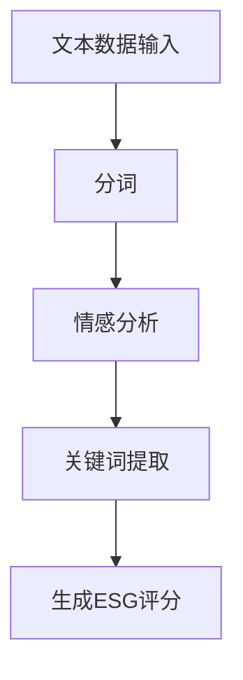
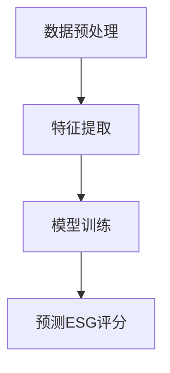
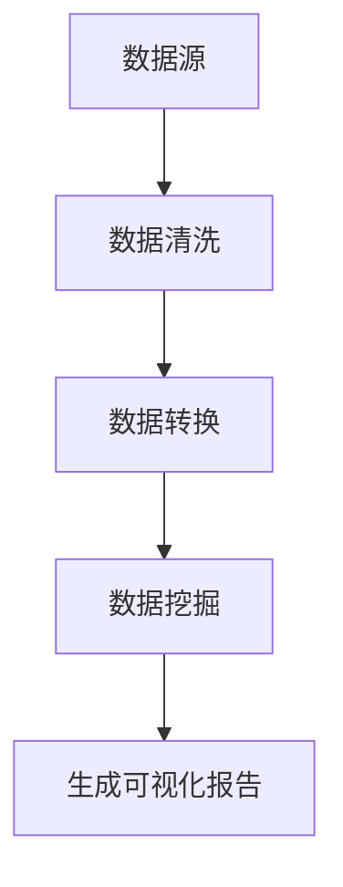
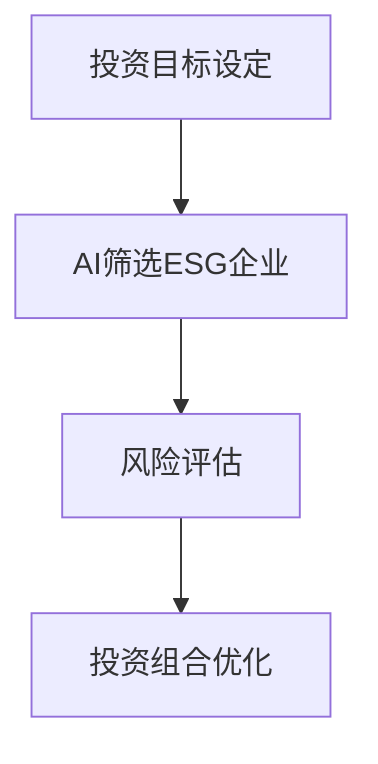

                 


# 人工智能在ESG评分和可持续投资中的应用

> 关键词：人工智能, ESG评分, 可持续投资, 自然语言处理, 机器学习, 数据挖掘

> 摘要：本文深入探讨了人工智能在ESG评分和可持续投资中的应用，从技术原理到实际案例，系统地分析了AI如何提升ESG评估的效率和准确性。文章涵盖了自然语言处理、机器学习和数据挖掘等技术，并通过具体案例展示了AI在可持续投资中的潜力。

---

## 第1章：ESG评分与可持续投资的背景

### 1.1 ESG评分的基本概念

ESG评分是评估企业环境、社会和治理表现的重要指标。环境（Environmental）关注企业的资源使用效率和碳排放；社会（Social）关注企业对员工、社区和人权的保护；治理（Governance）关注企业董事会结构、高管薪酬和透明度。ESG评分帮助投资者识别企业的长期风险和机会。

### 1.2 可持续投资的定义与特点

可持续投资是指在追求财务回报的同时，考虑环境和社会影响的投资策略。其核心特点是将ESG因素纳入投资决策，关注企业的长期价值创造。与传统投资相比，可持续投资更注重社会和环境效益，而非短期财务表现。

### 1.3 人工智能在ESG评分中的作用

人工智能通过自动化数据处理、模式识别和预测分析，显著提升了ESG评分的效率和准确性。传统方法依赖人工分析，耗时且易受主观因素影响。AI技术可以快速处理大量非结构化数据，发现隐藏的关联性，帮助投资者做出更明智的决策。

---

## 第2章：人工智能技术在ESG评分中的应用

### 2.1 自然语言处理在ESG报告中的应用

自然语言处理（NLP）技术用于分析企业的ESG报告和新闻媒体。通过文本挖掘，AI可以提取关键词和情感倾向，评估企业在环境、社会和治理方面的表现。

**Mermaid流程图：NLP在ESG报告分析中的流程**



**Python代码示例：**

```python
from textblob import TextBlob
text = "公司减少了碳排放并提高了员工福利。"
blob = TextBlob(text)
print(blob.sentiment.polarity)  # 输出情感倾向
```

### 2.2 机器学习在ESG评分中的应用

机器学习模型通过历史数据训练，预测企业的ESG表现。监督学习用于分类任务，无监督学习用于聚类分析。

**Mermaid流程图：机器学习模型训练流程**



**数学模型：线性回归**

$$
y = \beta_0 + \beta_1x_1 + \beta_2x_2 + \ldots + \beta_nx_n + \epsilon
$$

其中，$y$为ESG评分，$x_i$为特征变量，$\beta_i$为系数。

### 2.3 数据挖掘与分析在ESG评分中的应用

数据挖掘技术用于识别数据中的模式和关联性。通过数据清洗和可视化，AI帮助投资者发现潜在风险和机会。

**Mermaid流程图：数据挖掘流程**



**Python代码示例：**

```python
import pandas as pd
import matplotlib.pyplot as plt
data = pd.read_csv('esg_data.csv')
data.hist()
plt.show()
```

---

## 第3章：人工智能在可持续投资中的应用

### 3.1 可持续投资的智能化转型

AI技术帮助投资者快速识别符合ESG标准的企业，优化投资组合。通过实时监控和预测分析，AI提升了投资决策的效率和准确性。

**Mermaid流程图：可持续投资的AI驱动流程**



### 3.2 基于AI的ESG投资策略

AI可以根据市场变化动态调整投资策略，识别新兴风险和机会。通过多模态数据融合，AI提供了更全面的评估视角。

**数学模型：支持向量机（SVM）**

$$
\text{最大化} \quad \frac{1}{2} \|w\|^2 \\
\text{受限于} \quad y_i (w \cdot x_i + b) \geq 1
$$

其中，$w$为权重向量，$b$为偏置项，$y_i$为类别标签。

### 3.3 可持续投资中的AI挑战与解决方案

数据质量、模型解释性和合规性是AI在可持续投资中的主要挑战。通过数据清洗、模型可解释性增强和合规性优化，AI技术可以更好地服务于可持续投资。

---

## 第4章：项目实战：基于AI的ESG评分系统

### 4.1 环境安装

```bash
pip install numpy pandas scikit-learn spacy textblob
```

### 4.2 核心代码实现

```python
import spacy
nlp = spacy.load('en_core_web_sm')
text = "公司致力于减少碳排放并改善员工福利。"
doc = nlp(text)
for token in doc:
    print(token.text, token.pos_, token.dep_)
```

### 4.3 案例分析

分析一家公司的ESG报告，提取关键词并生成评分。通过可视化工具展示结果，评估公司的环境、社会和治理表现。

### 4.4 项目小结

通过该项目，读者可以掌握AI在ESG评分中的具体应用，包括数据处理、模型训练和结果可视化。

---

## 第5章：未来展望与最佳实践

### 5.1 未来趋势

多模态数据融合、实时监控和个性化投资策略是未来的发展方向。AI技术将更加智能化，帮助投资者应对复杂市场环境。

### 5.2 最佳实践

1. 数据质量是关键，确保数据来源可靠。
2. 模型解释性需增强，便于投资者理解。
3. 合规性是核心，确保投资符合法规要求。

### 5.3 注意事项

避免过度依赖AI，结合人工判断，确保决策的准确性。

### 5.4 拓展阅读

推荐阅读《人工智能与金融投资》和《可持续投资指南》。

---

## 总结

人工智能在ESG评分和可持续投资中的应用前景广阔。通过技术进步和实践积累，AI将为投资者提供更高效、更准确的决策支持，推动全球经济向可持续方向发展。

