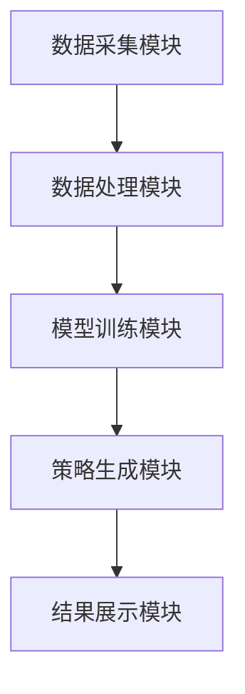

                 


# 人工智能在另类数据分析和投资中的应用

> 关键词：人工智能、另类数据、投资决策、机器学习、深度学习、金融数据分析

> 摘要：随着金融市场的复杂化和数据的多样化，传统的数据分析方法已难以应对日益增长的非结构化数据和复杂的投资决策需求。人工智能技术，特别是机器学习和深度学习，为另类数据分析和投资决策提供了新的解决方案。本文系统地探讨了人工智能在另类数据分析中的应用，从数据收集、处理、建模到投资策略的生成与优化，详细分析了每一步的关键技术和实现方法。通过实际案例和系统架构设计，展示了如何利用人工智能技术提升投资决策的准确性和效率。

---

# 第一部分: 背景介绍与核心概念

## 第1章: 背景介绍与核心概念

### 1.1 另类数据的定义与特点

#### 1.1.1 另类数据的定义
另类数据是指传统金融数据（如股票价格、成交量等）之外的非结构化数据，包括社交媒体文本、新闻文章、卫星图像、传感器数据等。这些数据具有多样性和实时性，能够提供传统数据无法捕捉的市场信息。

#### 1.1.2 另类数据的分类与特征
- **文本数据**：社交媒体、新闻文章等。
- **图像数据**：卫星图像、市场图表等。
- **语音数据**：电话会议录音等。
- **传感器数据**：物联网设备收集的实时数据。

| 数据类型 | 描述 | 示例 |
|----------|------|------|
| 文本数据 | 文本内容，需要进行自然语言处理 | Twitter上的股票相关推文 |
| 图像数据 | 图片、图表等，需要进行图像识别 | 卫星图像用于分析工厂生产情况 |
| 语音数据 | 语音信号，需要进行语音识别 | 电话会议中的讨论内容 |
| 传感器数据 | 实时传感器数据，用于预测市场变化 | 物联网设备收集的天气数据 |

#### 1.1.3 另类数据在金融投资中的作用
- 提供市场情绪分析。
- 发现市场趋势。
- 提前预警市场变化。
- 为投资决策提供额外信息。

### 1.2 人工智能的基本概念与特点

#### 1.2.1 人工智能的定义
人工智能（Artificial Intelligence，AI）是指计算机系统模拟人类智能的能力，包括学习、推理、问题解决和自然语言处理等。

#### 1.2.2 人工智能的核心技术
- **机器学习**：通过数据训练模型，使其能够进行预测和分类。
- **深度学习**：基于人工神经网络的机器学习方法，能够处理复杂的非结构化数据。
- **自然语言处理**：处理和理解人类语言的技术。
- **计算机视觉**：处理和理解图像的技术。

#### 1.2.3 人工智能与传统数据分析的区别
| 技术 | 传统数据分析 | 人工智能 |
|------|--------------|----------|
| 数据需求 | 结构化数据为主 | 非结构化数据为主 |
| 处理方式 | 手工规则 | 自动学习模式 |
| 应用场景 | 简单预测 | 复杂预测和决策 |

### 1.3 本章小结
本章介绍了另类数据的定义、分类及其在金融投资中的作用，同时详细阐述了人工智能的基本概念和核心技术，并对比了传统数据分析与人工智能的区别。

---

# 第二部分: 另类数据分析与人工智能的结合

## 第2章: 另类数据的收集与处理

### 2.1 数据收集的挑战与解决方案

#### 2.1.1 数据来源的多样性
- **文本数据**：社交媒体、新闻网站。
- **图像数据**：卫星图像、市场图表。
- **语音数据**：电话会议录音。
- **传感器数据**：物联网设备数据。

#### 2.1.2 数据清洗与预处理
- **数据清洗**：去除噪声、填补缺失值。
- **数据标准化**：将数据转换为统一格式。
- **数据增强**：通过技术手段增加数据量和多样性。

#### 2.1.3 数据标注与特征提取
- **数据标注**：对数据进行分类或打标签。
- **特征提取**：从原始数据中提取有用特征，例如从文本中提取情感特征。

### 2.2 数据分析的工具与方法

#### 2.2.1 数据可视化工具
- **工具**：Matplotlib、Seaborn、Tableau。
- **方法**：通过图表展示数据分布、趋势等。

#### 2.2.2 数据挖掘技术
- **关联规则挖掘**：发现数据中的关联规则。
- **聚类分析**：将相似的数据点聚类。
- **分类与回归**：预测目标变量的值。

#### 2.2.3 数据建模与预测
- **机器学习模型**：线性回归、支持向量机（SVM）、随机森林等。
- **深度学习模型**：卷积神经网络（CNN）、循环神经网络（RNN）。

### 2.3 本章小结
本章详细讨论了另类数据的收集与处理过程，包括数据清洗、预处理、标注、特征提取以及数据分析工具和方法的选择。

---

## 第3章: 人工智能在另类数据分析中的应用

### 3.1 机器学习在另类数据中的应用

#### 3.1.1 监督学习与无监督学习
- **监督学习**：有标签数据，例如情绪分类。
- **无监督学习**：无标签数据，例如聚类分析市场趋势。

#### 3.1.2 算法选择与优化
- **算法选择**：根据数据类型选择合适的算法。
- **模型优化**：通过交叉验证选择最优参数。

#### 3.1.3 模型评估与验证
- **评估指标**：准确率、召回率、F1分数。
- **验证方法**：训练集、验证集、测试集划分。

#### 3.1.4 示例：情绪分类
- **任务**：将社交媒体上的文本分为积极、消极、中性三类。
- **算法**：使用随机森林或支持向量机进行分类。
- **流程**：数据预处理 → 特征提取 → 模型训练 → 模型评估。

### 3.2 深度学习在另类数据中的应用

#### 3.2.1 神经网络的基本原理
- **神经网络结构**：输入层、隐藏层、输出层。
- **激活函数**：ReLU、Sigmoid、Tanh。

#### 3.2.2 卷积神经网络（CNN）与循环神经网络（RNN）的应用
- **CNN**：适用于图像数据，如卫星图像分析。
- **RNN**：适用于序列数据，如时间序列分析。

#### 3.2.3 深度学习模型的训练与优化
- **训练方法**：批量训练、随机梯度下降。
- **优化器**：Adam、SGD、RMSprop。
- **超参数调优**：学习率、批次大小等。

### 3.3 本章小结
本章详细探讨了机器学习和深度学习在另类数据分析中的应用，包括算法选择、模型优化和具体应用案例。

---

## 第4章: 人工智能在投资决策中的应用

### 4.1 投资策略的生成与优化

#### 4.1.1 基于机器学习的投资策略
- **策略生成**：通过模型预测股票价格走势。
- **策略优化**：根据市场变化动态调整投资组合。

#### 4.1.2 基于深度学习的投资策略
- **模型选择**：使用LSTM进行时间序列预测。
- **策略优化**：结合市场数据和情绪分析动态调整。

#### 4.1.3 策略的动态调整与优化
- **动态调整**：根据市场反馈实时调整模型。
- **优化方法**：遗传算法、粒子群优化。

### 4.2 风险控制与投资组合管理

#### 4.2.1 风险评估与量化
- **风险指标**：VaR（在险价值）、CVaR（条件在险价值）。
- **风险来源**：市场风险、流动性风险。

#### 4.2.2 投资组合优化
- **优化目标**：最大化收益，最小化风险。
- **优化方法**：均值-方差优化、黑塞矩阵优化。

#### 4.2.3 风险管理的机器学习方法
- **风险预测**：使用机器学习模型预测市场崩盘。
- **风险对冲**：利用衍生品对冲风险。

### 4.3 本章小结
本章详细讨论了人工智能在投资策略生成和风险控制中的应用，包括策略生成与优化、风险评估与量化等内容。

---

# 第三部分: 系统分析与架构设计

## 第5章: 投资系统架构设计

### 5.1 系统功能模块划分

#### 5.1.1 数据采集模块
- **功能**：从多种数据源采集另类数据。
- **实现**：使用爬虫技术采集社交媒体数据，使用API接口获取传感器数据。

#### 5.1.2 数据处理模块
- **功能**：清洗、预处理和特征提取。
- **实现**：使用Python的pandas库进行数据清洗，使用自然语言处理库（如NLTK）进行文本特征提取。

#### 5.1.3 模型训练模块
- **功能**：训练机器学习和深度学习模型。
- **实现**：使用Scikit-learn训练随机森林模型，使用Keras训练深度学习模型。

#### 5.1.4 策略生成模块
- **功能**：基于模型输出生成投资策略。
- **实现**：根据模型预测结果生成买卖信号。

#### 5.1.5 结果展示模块
- **功能**：可视化模型预测结果和投资策略。
- **实现**：使用Matplotlib和Seaborn绘制图表。

### 5.2 系统架构设计

#### 5.2.1 分层架构设计
- **数据层**：数据采集和存储。
- **计算层**：数据处理和模型训练。
- **应用层**：策略生成和结果展示。

#### 5.2.2 微服务架构设计
- **数据采集服务**：负责从不同数据源采集数据。
- **数据处理服务**：负责数据清洗和特征提取。
- **模型训练服务**：负责训练机器学习模型。
- **策略生成服务**：负责生成投资策略。
- **结果展示服务**：负责展示分析结果。

#### 5.2.3 数据流与模块交互关系



### 5.3 本章小结
本章详细讨论了投资系统的架构设计，包括功能模块划分和系统架构设计。

---

# 第四部分: 项目实战

## 第6章: 项目实战

### 6.1 环境安装与配置

#### 6.1.1 安装Python
- 使用Anaconda安装Python 3.8及以上版本。

#### 6.1.2 安装依赖库
- 数据处理：pandas、numpy。
- 机器学习：scikit-learn、keras。
- 数据可视化：matplotlib、seaborn。
- 自然语言处理：nltk、spaCy。

#### 6.1.3 配置开发环境
- 安装Jupyter Notebook作为开发环境。

### 6.2 系统核心实现源代码

#### 6.2.1 数据采集模块

```python
import requests
from bs4 import BeautifulSoup

def scrape_data(url):
    response = requests.get(url)
    soup = BeautifulSoup(response.text, 'html.parser')
    data = []
    for tweet in soup.find_all('div', class_='tweet'):
        text = tweet.find('div', class_='content').text
        data.append(text)
    return data
```

#### 6.2.2 数据处理模块

```python
import pandas as pd
from sklearn.feature_extraction.text import TfidfVectorizer

def preprocess_data(data):
    vectorizer = TfidfVectorizer(max_features=100)
    X = vectorizer.fit_transform(data)
    return X.toarray()
```

#### 6.2.3 模型训练模块

```python
from sklearn.ensemble import RandomForestClassifier

def train_model(X, y):
    model = RandomForestClassifier(n_estimators=100, max_depth=5)
    model.fit(X, y)
    return model
```

#### 6.2.4 策略生成模块

```python
import numpy as np

def generate_strategy(model, new_data):
    processed_data = preprocess_data(new_data)
    predictions = model.predict(processed_data)
    return predictions
```

#### 6.2.5 结果展示模块

```python
import matplotlib.pyplot as plt

def visualize_results(predictions):
    plt.hist(predictions, bins=3, label=['Negative', 'Neutral', 'Positive'])
    plt.show()
```

### 6.3 项目小结
本章通过一个具体的项目案例，详细讲解了如何利用人工智能技术进行另类数据分析和投资策略生成。通过代码实现，展示了从数据采集到结果展示的完整流程。

---

# 第五部分: 最佳实践与总结

## 第7章: 最佳实践与总结

### 7.1 最佳实践

#### 7.1.1 数据质量的重要性
- 确保数据的准确性和完整性。

#### 7.1.2 模型选择的注意事项
- 根据数据类型选择合适的算法。
- 避免过拟合和欠拟合。

#### 7.1.3 风险控制的策略
- 定期监控模型表现。
- 设置止损点。

### 7.2 小结

#### 7.2.1 技术总结
- 人工智能为另类数据分析和投资决策提供了强大的工具。
- 需要结合具体场景选择合适的算法和模型。

#### 7.2.2 实践总结
- 数据预处理和特征提取是关键步骤。
- 模型的调优和验证是确保模型性能的重要环节。

### 7.3 注意事项

#### 7.3.1 数据隐私问题
- 确保数据的合法性和隐私性。

#### 7.3.2 模型的可解释性
- 需要确保模型的可解释性，以便更好地理解和优化模型。

#### 7.3.3 系统的实时性
- 需要保证系统的实时性，能够快速响应市场变化。

### 7.4 拓展阅读

#### 7.4.1 推荐书籍
- 《Python机器学习实战》
- 《深度学习实战》

#### 7.4.2 推荐博客与资源
- TensorFlow官方博客
- Keras官方文档
- Towards Data Science

---

# 附录

## 附录A: 术语解释

- **另类数据**：非结构化数据，包括文本、图像、语音等。
- **机器学习**：通过数据训练模型，使其能够进行预测和分类。
- **深度学习**：基于人工神经网络的机器学习方法，能够处理复杂的非结构化数据。

## 附录B: 参考文献

1. 书籍：《Python机器学习实战》
2. 书籍：《深度学习实战》
3. 网站：Towards Data Science
4. 网站：Keras官方文档

---

# 结束语

通过本篇文章的系统介绍和详细分析，我们深入探讨了人工智能在另类数据分析和投资中的应用。从数据收集、处理到模型训练和策略生成，每一步都进行了详细的分析和讲解。希望读者能够通过本文的指导，更好地理解和应用人工智能技术，提升投资决策的准确性和效率。

