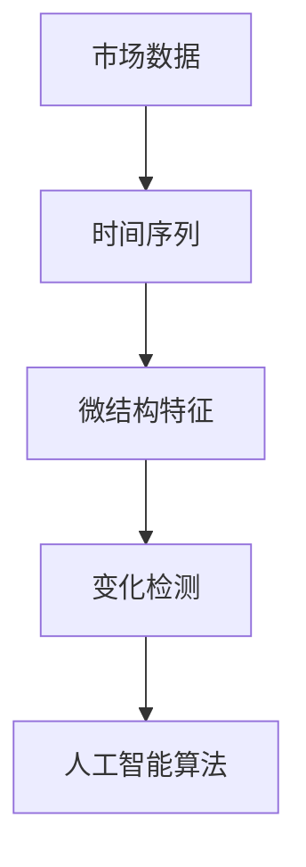
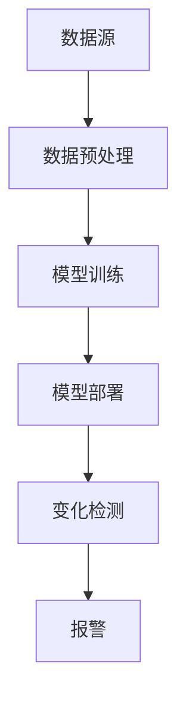

                 


# 人工智能在市场微结构变化检测中的应用

> 关键词：人工智能、市场微结构、变化检测、时间序列、深度学习、LSTM、金融分析

> 摘要：本文详细探讨了人工智能在市场微结构变化检测中的应用，从问题背景、核心概念、算法原理到系统设计与项目实战，全面分析了如何利用人工智能技术实现对市场微结构变化的高效检测。文章结合理论与实践，通过具体案例分析，展示了人工智能在金融领域的强大潜力，并提出了未来的研究方向。

---

## 第一部分: 背景与核心概念

### 第1章: 市场微结构变化检测概述

#### 1.1 问题背景与重要性

##### 1.1.1 金融市场中的微结构变化
在金融市场中，市场微结构指的是市场参与者的交易行为、订单簿状态以及价格形成的机制。这些因素共同构成了市场的微观结构。然而，市场的微结构会受到多种因素的影响，如市场参与者的行为变化、信息的发布、突发事件等，这些都会导致市场微结构的变化。

##### 1.1.2 微结构变化对市场的影响
市场微结构的变化会直接影响市场的流动性、价格波动性以及交易成本。例如，当市场参与者的行为发生变化时，可能会导致订单簿的深度发生变化，从而影响市场的买卖价差和订单执行的效率。此外，微结构的变化还可能预示着市场的潜在风险，如流动性风险或市场波动性风险。

##### 1.1.3 人工智能在金融分析中的优势
传统的市场分析方法主要依赖于统计分析和经验判断，但在面对高频交易、大数据量以及复杂市场行为时，这些方法往往显得力不从心。人工智能技术，尤其是深度学习和自然语言处理技术，能够处理海量数据，并从中提取复杂的模式和特征，从而在市场微结构变化检测中展现出独特的优势。

#### 1.2 问题描述与目标

##### 1.2.1 微结构变化的定义与特征
市场微结构变化是指市场参与者的交易行为、订单簿状态或价格形成机制发生显著变化。这种变化通常表现为交易量的变化、买卖价差的变化、订单深度的变化等。

##### 1.2.2 市场数据的特征与挑战
市场数据通常具有以下特征：
- **高维性**：市场数据可能包含订单簿数据、成交数据、参与者行为数据等多个维度。
- **时序性**：市场数据往往具有时间依赖性，需要考虑数据的时间序列特征。
- **复杂性**：市场的参与者行为复杂，且受到多种内外部因素的影响。

##### 1.2.3 人工智能在变化检测中的应用目标
人工智能在市场微结构变化检测中的目标是通过分析市场数据，识别出微结构的变化，并对变化进行分类和预测。具体目标包括：
- **实时监测**：实时检测市场的微结构变化。
- **变化分类**：对检测到的变化进行分类，判断其类型和影响程度。
- **预测预警**：基于历史数据和当前变化，预测未来的变化趋势，并发出预警。

#### 1.3 问题解决与边界

##### 1.3.1 微结构变化检测的关键问题
- 如何有效地提取市场数据中的特征。
- 如何设计高效的算法来检测微结构的变化。
- 如何处理市场数据的高维性和时序性。

##### 1.3.2 人工智能解决方案的边界
人工智能解决方案的边界包括：
- 数据范围：通常局限于特定市场的数据，可能无法跨市场通用。
- 时间范围：通常局限于短时间窗口内的变化检测。
- 解释性：部分深度学习模型的解释性较差，可能无法满足某些应用场景的需求。

##### 1.3.3 检测方法的可扩展性与实时性
为了满足实际应用的需求，检测方法需要具备良好的可扩展性和实时性。可扩展性意味着能够处理大规模数据，实时性则要求能够在较短的时间内完成检测。

---

### 第2章: 核心概念与联系

#### 2.1 核心概念原理

##### 2.1.1 市场微结构的特征分析
市场微结构的特征包括：
- **订单簿深度**：订单簿的买卖订单数量和价格分布。
- **买卖价差**：买卖价差的变化反映了市场的流动性状况。
- **交易量**：交易量的变化可能反映了市场参与者的行为变化。

##### 2.1.2 时间序列数据的特性
时间序列数据通常具有以下特性：
- **趋势性**：数据可能呈现上升或下降的趋势。
- **周期性**：数据可能具有一定的周期性，如日周期、周周期等。
- **随机性**：数据中可能包含随机噪声。

##### 2.1.3 人工智能算法的基本原理
人工智能算法的基本原理包括：
- **监督学习**：基于标注数据进行学习，适用于分类和回归任务。
- **无监督学习**：基于未标注数据进行学习，适用于聚类和异常检测任务。
- **深度学习**：通过多层神经网络提取数据的高层次特征。

#### 2.2 概念属性对比表格

| 概念               | 时间序列分析         | 深度学习模型         | 数据特征             |
|--------------------|----------------------|----------------------|----------------------|
| 数据类型           | 时间序列数据         | 高维数据             | 多维数据             |
| 分析目标           | 发现趋势、周期性       | 发现复杂模式         | 提取特征             |
| 算法复杂度         | 较低                  | 较高                  | 较高                  |
| 适用场景           | 预测、异常检测         | 图像识别、自然语言处理 | 金融时间序列分析     |

#### 2.3 ER实体关系图


---

## 第二部分: 算法原理与数学模型

### 第3章: 算法原理讲解

#### 3.1 时间序列分析

##### 3.1.1 时间序列的基本特征
时间序列的基本特征包括：
- **趋势**：数据的整体上升或下降趋势。
- **周期性**：数据的周期性波动。
- **季节性**：数据在特定时间段内的规律性变化。

##### 3.1.2 常见的时间序列模型
- **ARIMA模型**：一种经典的统计模型，适用于线性时间序列数据。
- **GARCH模型**：用于捕捉时间序列中的波动性变化。
- ** prophet模型**：基于 Holt-Winters 方法的时间序列预测模型。

##### 3.1.3 基于统计的方法（ARIMA模型）
ARIMA模型的公式为：
$$ARIMA(p, d, q)$$
其中：
- $p$：自回归阶数
- $d$：差分阶数
- $q$：移动平均阶数

ARIMA模型的预测公式为：
$$\hat{y}_t = \alpha + \beta y_{t-1} + \epsilon_t$$

#### 3.2 深度学习模型

##### 3.2.1 RNN与LSTM的基本原理
- **RNN**：循环神经网络，适用于处理序列数据。
- **LSTM**：长短期记忆网络，能够更好地捕捉长时间依赖关系。

##### 3.2.2 基于LSTM的市场变化检测
LSTM模型的结构如下：
$$f_t = \sigma(W_f [x_t, h_{t-1}])$$
$$i_t = \sigma(W_i [x_t, h_{t-1}])$$
$$c_t = f_t \cdot c_{t-1} + i_t \cdot tanh(W_c [x_t, h_{t-1}])$$

##### 3.2.3 模型的训练与优化
LSTM模型的训练过程包括：
1. **输入数据**：将市场数据输入模型。
2. **计算输出**：模型输出预测结果。
3. **计算损失**：使用损失函数计算预测结果与真实结果之间的差异。
4. **反向传播**：通过反向传播算法更新模型参数。
5. **迭代优化**：重复上述步骤，直到模型收敛。

---

#### 3.3 LSTM模型的代码实现

##### 3.3.1 数据预处理
```python
import pandas as pd
data = pd.read_csv('market_data.csv')
# 提取收盘价
prices = data['close'].values
# 将数据转换为时间序列格式
import numpy as np
from sklearn.preprocessing import MinMaxScaler
scaler = MinMaxScaler()
prices_scaled = scaler.fit_transform(prices.reshape(-1, 1))
```

##### 3.3.2 模型训练
```python
from tensorflow.keras.models import Sequential
from tensorflow.keras.layers import LSTM, Dense
model = Sequential()
model.add(LSTM(50, input_shape=(None, 1)))
model.add(Dense(1))
model.compile(loss='mean_squared_error', optimizer='adam')
```

##### 3.3.3 模型预测
```python
# 生成测试数据
test_data = data['close'].values[-100:]
test_scaled = scaler.transform(test_data.reshape(-1, 1))
# 预测结果
predictions = model.predict(test_scaled)
# 反转归一化
predictions_original = scaler.inverse_transform(predictions)
```

---

#### 3.4 数学模型与公式

##### 3.4.1 ARIMA模型
ARIMA模型的公式为：
$$ARIMA(p, d, q)$$
其中：
- $p$：自回归阶数
- $d$：差分阶数
- $q$：移动平均阶数

ARIMA模型的预测公式为：
$$\hat{y}_t = \alpha + \beta y_{t-1} + \epsilon_t$$

##### 3.4.2 LSTM模型
LSTM模型的结构如下：
$$f_t = \sigma(W_f [x_t, h_{t-1}])$$
$$i_t = \sigma(W_i [x_t, h_{t-1}])$$
$$c_t = f_t \cdot c_{t-1} + i_t \cdot tanh(W_c [x_t, h_{t-1}])$$

---

### 第4章: 数学模型与公式

#### 4.1 ARIMA模型
##### 4.1.1 ARIMA模型的结构
$$ARIMA(p, d, q)$$
其中：
- $p$：自回归阶数
- $d$：差分阶数
- $q$：移动平均阶数

##### 4.1.2 模型的参数估计
$$\hat{y}_t = \alpha + \beta y_{t-1} + \epsilon_t$$

#### 4.2 LSTM模型
##### 4.2.1 LSTM的基本结构
$$f_t = \sigma(W_f [x_t, h_{t-1}])$$
$$i_t = \sigma(W_i [x_t, h_{t-1}])$$
$$c_t = f_t \cdot c_{t-1} + i_t \cdot tanh(W_c [x_t, h_{t-1}])$$

---

## 第三部分: 系统设计与实现

### 第5章: 系统分析与架构设计

#### 5.1 问题场景介绍

##### 5.1.1 系统目标与功能
- 数据采集与预处理
- 模型训练与部署
- 变化检测与报警

##### 5.1.2 系统功能设计
- 数据采集：从市场数据源获取数据。
- 数据预处理：对数据进行清洗和归一化处理。
- 模型训练：使用训练数据训练深度学习模型。
- 模型部署：将训练好的模型部署到生产环境。
- 变化检测：实时监控市场数据，检测微结构的变化。
- 报警：当检测到显著变化时，发出报警信号。

##### 5.1.3 系统架构设计


---

#### 5.2 系统功能设计

##### 5.2.1 数据采集与预处理
```python
import pandas as pd
data = pd.read_csv('market_data.csv')
# 提取收盘价
prices = data['close'].values
# 将数据转换为时间序列格式
import numpy as np
from sklearn.preprocessing import MinMaxScaler
scaler = MinMaxScaler()
prices_scaled = scaler.fit_transform(prices.reshape(-1, 1))
```

##### 5.2.2 模型训练与部署
```python
from tensorflow.keras.models import Sequential
from tensorflow.keras.layers import LSTM, Dense
model = Sequential()
model.add(LSTM(50, input_shape=(None, 1)))
model.add(Dense(1))
model.compile(loss='mean_squared_error', optimizer='adam')
```

##### 5.2.3 变化检测与报警
```python
# 生成测试数据
test_data = data['close'].values[-100:]
test_scaled = scaler.transform(test_data.reshape(-1, 1))
# 预测结果
predictions = model.predict(test_scaled)
# 反转归一化
predictions_original = scaler.inverse_transform(predictions)
# 计算变化幅度
change = abs(test_data - predictions_original)
# 设置阈值
threshold = 0.5
# 发出报警
if change > threshold:
    print("市场微结构发生变化，发出报警信号！")
```

---

### 第6章: 项目实战

#### 6.1 环境安装与配置

##### 6.1.1 Python环境的搭建
```bash
# 安装Python
# 安装必要的库
pip install numpy pandas tensorflow keras matplotlib
```

##### 6.1.2 数据库与工具的安装
```bash
# 安装MySQL数据库
# 安装数据可视化工具
pip install jupyter notebook
```

---

#### 6.2 核心代码实现

##### 6.2.1 数据预处理代码
```python
import pandas as pd
data = pd.read_csv('market_data.csv')
# 提取收盘价
prices = data['close'].values
# 将数据转换为时间序列格式
import numpy as np
from sklearn.preprocessing import MinMaxScaler
scaler = MinMaxScaler()
prices_scaled = scaler.fit_transform(prices.reshape(-1, 1))
```

##### 6.2.2 模型训练代码
```python
from tensorflow.keras.models import Sequential
from tensorflow.keras.layers import LSTM, Dense
model = Sequential()
model.add(LSTM(50, input_shape=(None, 1)))
model.add(Dense(1))
model.compile(loss='mean_squared_error', optimizer='adam')
```

##### 6.2.3 模型预测代码
```python
# 生成测试数据
test_data = data['close'].values[-100:]
test_scaled = scaler.transform(test_data.reshape(-1, 1))
# 预测结果
predictions = model.predict(test_scaled)
# 反转归一化
predictions_original = scaler.inverse_transform

