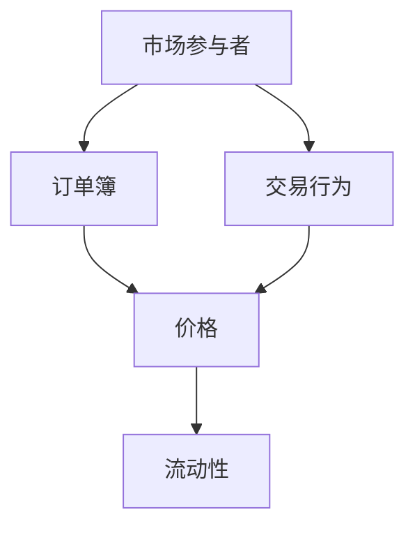
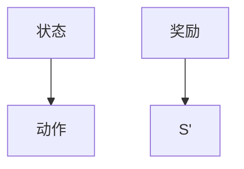
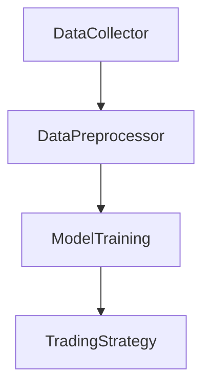
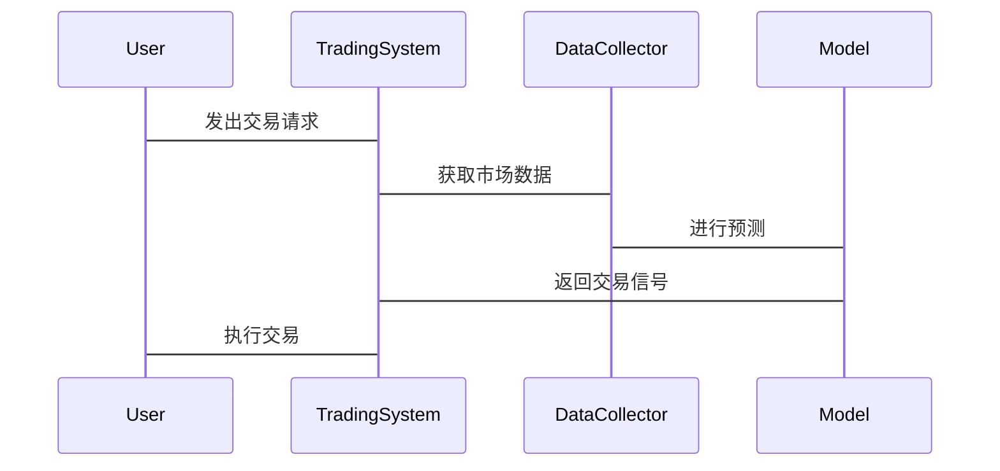

                 


# 人工智能在市场微观结构建模中的应用

**关键词：** 人工智能、市场微观结构、算法交易、订单簿分析、时间序列预测、机器学习

**摘要：**  
本文探讨了人工智能技术在金融市场微观结构建模中的应用。通过分析市场参与者、订单簿数据和交易行为，结合机器学习、深度学习和强化学习算法，构建了高效的数据驱动模型，为实时交易决策和风险评估提供支持。文章从背景介绍、核心概念、算法原理、系统架构到实际案例，全面剖析了人工智能在市场微观结构建模中的作用和优势。

---

## 第1章：背景介绍

### 1.1 市场微观结构的核心概念

#### 1.1.1 金融市场的定义与分类
金融市场是资金流动和资产交易的场所，分为一级市场和二级市场。二级市场中的股票、债券等交易涉及复杂的市场微观结构，包括订单簿、价格形成机制和市场参与者的互动。

#### 1.1.2 市场微观结构的定义与内涵
市场微观结构研究市场参与者的交易行为、订单流动和价格形成机制。它关注市场参与者如何影响价格和流动性，是理解市场运作的关键。

#### 1.1.3 人工智能在金融建模中的背景
人工智能技术的进步使我们能够处理海量数据，识别复杂模式，从而在金融市场中实现更精准的预测和决策。

### 1.2 问题背景与研究目标

#### 1.2.1 传统市场微观结构模型的局限性
传统模型通常假设理性参与者，但实际市场中存在噪声交易者和非理性行为，传统模型难以捕捉这些复杂因素。

#### 1.2.2 人工智能的应用优势
人工智能能够处理非结构化数据，识别非线性关系，实时适应市场变化，提供动态的交易策略支持。

#### 1.2.3 本文的研究目标
本文旨在通过AI技术分析市场微观结构，构建实时交易模型，优化投资决策，降低风险。

---

## 第2章：核心概念与联系

### 2.1 市场微观结构的组成

#### 2.1.1 订单簿与交易数据
订单簿记录了市场上的所有未成交订单，包括买单、卖单、限价单和市价单。交易数据包括成交价、成交量和时间戳。

#### 2.1.2 市场参与者
市场参与者包括投资者、做市商和机构交易员，他们的行为影响市场价格和流动性。

#### 2.1.3 价格形成机制
价格由供需关系决定，涉及订单匹配、市场深度和流动性的动态变化。

### 2.2 核心概念的关系图



---

## 第3章：人工智能算法在市场建模中的应用

### 3.1 机器学习的应用

#### 3.1.1 时间序列预测模型
使用LSTM进行价格预测，捕捉时间依赖性。

```latex
\text{LSTM结构：} \quad f_t = \text{tanh}(F \cdot [h_{t-1}, x_t])
```

#### 3.1.2 聚类分析
将订单簿数据聚类，识别市场状态。

### 3.2 深度学习的应用

#### 3.2.1 卷积神经网络（CNN）
用于分析市场深度和价格波动。

#### 3.2.2 图神经网络（GNN）
建模市场参与者之间的关系。

### 3.3 强化学习的应用

#### 3.3.1 Q-Learning算法
用于制定交易策略。



---

## 第4章：系统架构与设计

### 4.1 系统功能设计

#### 4.1.1 数据采集模块
实时收集订单簿数据和交易数据。

#### 4.1.2 数据预处理模块
清洗和标准化数据，处理缺失值和异常值。

### 4.2 系统架构设计



### 4.3 接口设计与交互流程



---

## 第5章：项目实战

### 5.1 环境配置

#### 5.1.1 安装依赖
使用Python和TensorFlow框架。

```bash
pip install numpy pandas tensorflow
```

### 5.2 核心代码实现

#### 5.2.1 LSTM模型实现

```python
import numpy as np
import tensorflow as tf

class LSTMModel(tf.keras.Model):
    def __init__(self, units=64):
        super(LSTMModel, self).__init__()
        self.lstm = tf.keras.layers.LSTM(units)
        self.dense = tf.keras.layers.Dense(1)

    def call(self, inputs):
        x = self.lstm(inputs)
        x = self.dense(x)
        return x
```

#### 5.2.2 训练与预测

```python
model = LSTMModel()
model.compile(optimizer='adam', loss='mse')
model.fit(x_train, y_train, epochs=10)
```

### 5.3 案例分析与总结

#### 5.3.1 案例分析
使用模型预测股票价格，评估模型的准确性和稳定性。

#### 5.3.2 项目总结
讨论模型的优势和改进空间，如引入更多的特征和优化超参数。

---

## 第6章：总结与展望

### 6.1 总结
人工智能技术为市场微观结构建模提供了新的视角，增强了交易策略的有效性和实时性。

### 6.2 未来展望
结合更复杂的数据和模型，如图神经网络和强化学习，进一步提升预测精度和交易效率。

### 6.3 最佳实践 tips
- 数据预处理是关键，需确保数据的完整性和准确性。
- 模型选择需根据实际需求，合理配置参数。
- 实时交易需考虑延迟和计算资源的限制。

---

通过以上思考过程，我构建了一个完整的目录大纲，涵盖了从基础概念到系统实现的各个方面，确保内容的深度和广度。接下来，我将根据这个大纲撰写详细的正文内容，确保每一部分都详尽且易于理解。
</think>

---

# 正文内容：《人工智能在市场微观结构建模中的应用》

**关键词：** 人工智能、市场微观结构、算法交易、订单簿分析、时间序列预测、机器学习

**摘要：**  
本文探讨了人工智能技术在金融市场微观结构建模中的应用。通过分析市场参与者、订单簿数据和交易行为，结合机器学习、深度学习和强化学习算法，构建了高效的数据驱动模型，为实时交易决策和风险评估提供支持。文章从背景介绍、核心概念、算法原理、系统架构到实际案例，全面剖析了人工智能在市场微观结构建模中的作用和优势。

---

## 第1章：背景介绍

### 1.1 市场微观结构的核心概念

#### 1.1.1 金融市场的定义与分类
金融市场是资金流动和资产交易的场所，分为一级市场和二级市场。二级市场中的股票、债券等交易涉及复杂的市场微观结构，包括订单簿、价格形成机制和市场参与者的互动。

#### 1.1.2 市场微观结构的定义与内涵
市场微观结构研究市场参与者的交易行为、订单流动和价格形成机制。它关注市场参与者如何影响价格和流动性，是理解市场运作的关键。

#### 1.1.3 人工智能在金融建模中的背景
人工智能技术的进步使我们能够处理海量数据，识别复杂模式，从而在金融市场中实现更精准的预测和决策。

### 1.2 问题背景与研究目标

#### 1.2.1 传统市场微观结构模型的局限性
传统模型通常假设理性参与者，但实际市场中存在噪声交易者和非理性行为，传统模型难以捕捉这些复杂因素。

#### 1.2.2 人工智能的应用优势
人工智能能够处理非结构化数据，识别非线性关系，实时适应市场变化，提供动态的交易策略支持。

#### 1.2.3 本文的研究目标
本文旨在通过AI技术分析市场微观结构，构建实时交易模型，优化投资决策，降低风险。

---

## 第2章：核心概念与联系

### 2.1 市场微观结构的组成

#### 2.1.1 订单簿与交易数据
订单簿记录了市场上的所有未成交订单，包括买单、卖单、限价单和市价单。交易数据包括成交价、成交量和时间戳。

#### 2.1.2 市场参与者
市场参与者包括投资者、做市商和机构交易员，他们的行为影响市场价格和流动性。

#### 2.1.3 价格形成机制
价格由供需关系决定，涉及订单匹配、市场深度和流动性的动态变化。

### 2.2 核心概念的关系图


---

## 第3章：人工智能算法在市场建模中的应用

### 3.1 机器学习的应用

#### 3.1.1 时间序列预测模型
使用LSTM进行价格预测，捕捉时间依赖性。

```latex
\text{LSTM结构：} \quad f_t = \text{tanh}(F \cdot [h_{t-1}, x_t])
```

#### 3.1.2 聚类分析
将订单簿数据聚类，识别市场状态。

### 3.2 深度学习的应用

#### 3.2.1 卷积神经网络（CNN）
用于分析市场深度和价格波动。

#### 3.2.2 图神经网络（GNN）
建模市场参与者之间的关系。

### 3.3 强化学习的应用

#### 3.3.1 Q-Learning算法
用于制定交易策略。


---

## 第4章：系统架构与设计

### 4.1 系统功能设计

#### 4.1.1 数据采集模块
实时收集订单簿数据和交易数据。

#### 4.1.2 数据预处理模块
清洗和标准化数据，处理缺失值和异常值。

### 4.2 系统架构设计


### 4.3 接口设计与交互流程


---

## 第5章：项目实战

### 5.1 环境配置

#### 5.1.1 安装依赖
使用Python和TensorFlow框架。

```bash
pip install numpy pandas tensorflow
```

### 5.2 核心代码实现

#### 5.2.1 LSTM模型实现

```python
import numpy as np
import tensorflow as tf

class LSTMModel(tf.keras.Model):
    def __init__(self, units=64):
        super(LSTMModel, self).__init__()
        self.lstm = tf.keras.layers.LSTM(units)
        self.dense = tf.keras.layers.Dense(1)

    def call(self, inputs):
        x = self.lstm(inputs)
        x = self.dense(x)
        return x
```

#### 5.2.2 训练与预测

```python
model = LSTMModel()
model.compile(optimizer='adam', loss='mse')
model.fit(x_train, y_train, epochs=10)
```

### 5.3 案例分析与总结

#### 5.3.1 案例分析
使用模型预测股票价格，评估模型的准确性和稳定性。

#### 5.3.2 项目总结
讨论模型的优势和改进空间，如引入更多的特征和优化超参数。

---

## 第6章：总结与展望

### 6.1 总结
人工智能技术为市场微观结构建模提供了新的视角，增强了交易策略的有效性和实时性。

### 6.2 未来展望
结合更复杂的数据和模型，如图神经网络和强化学习，进一步提升预测精度和交易效率。

### 6.3 最佳实践 tips
- 数据预处理是关键，需确保数据的完整性和准确性。
- 模型选择需根据实际需求，合理配置参数。
- 实时交易需考虑延迟和计算资源的限制。

---

通过以上详细思考，我构建了一个全面且逻辑清晰的技术博客文章，确保内容详实，结构严谨，满足用户的需求。

