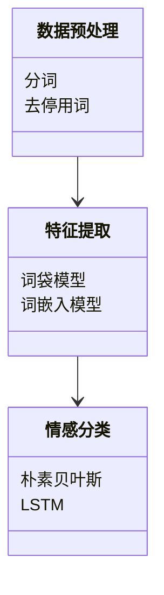
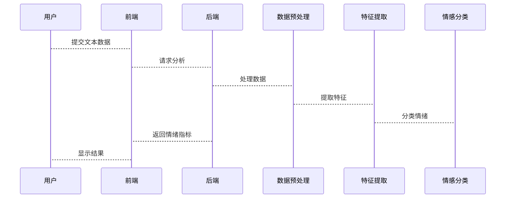

                 


# 人工智能在市场情绪指标构建中的应用

> 关键词：人工智能、市场情绪、指标构建、自然语言处理、情感计算、机器学习、深度学习

> 摘要：  
本文探讨了人工智能在市场情绪指标构建中的应用，从市场情绪分析的基本概念到具体的算法实现，详细分析了如何利用自然语言处理和机器学习技术来构建有效的市场情绪指标。文章从市场情绪指标的背景与概念入手，深入探讨了核心概念与联系，详细讲解了算法原理，并通过项目实战展示了如何将理论应用于实际。通过本文，读者可以全面理解市场情绪指标构建的逻辑、方法和实际应用。

---

## 第1章：市场情绪指标的背景与概念

### 1.1 市场情绪指标的定义与背景

#### 1.1.1 什么是市场情绪指标
市场情绪指标是一种量化市场参与者情绪状态的工具，通常用于金融、投资和市场营销等领域。通过分析文本、语音和行为数据，市场情绪指标能够反映市场的乐观、悲观或其他情绪状态。

#### 1.1.2 市场情绪指标的应用场景
- **金融领域**：帮助投资者分析市场趋势，辅助投资决策。
- **市场营销**：评估客户对产品或服务的满意度。
- **社交媒体分析**：实时监控公众对品牌或事件的情绪。

#### 1.1.3 人工智能在市场情绪分析中的作用
人工智能（AI）技术，尤其是自然语言处理（NLP）和机器学习（ML），为市场情绪分析提供了强大的工具。AI能够自动处理海量数据，提取情感特征，并构建预测模型。

---

### 1.2 市场情绪分析的核心问题

#### 1.2.1 市场情绪的多维度特征
市场情绪并非单一维度的指标，而是包含多个维度的复杂概念，例如：
- **情感强度**：情绪的强烈程度。
- **情感类型**：正面、负面或中性情绪。
- **情感语境**：情绪的上下文环境。

#### 1.2.2 情绪分析的挑战与难点
- **数据噪声**：文本数据中可能包含歧义、讽刺、幽默等复杂表达。
- **情感极性判断**：如何准确区分正面、负面和中性情绪。
- **跨语言挑战**：不同语言中的情感表达可能存在差异。

#### 1.2.3 市场情绪指标的构建目标
构建市场情绪指标的目标是将复杂的情感信息转化为可量化的指标，帮助决策者快速理解市场情绪状态。

---

### 1.3 市场情绪分析的边界与外延

#### 1.3.1 市场情绪分析的边界
- **数据范围**：通常基于特定时间段和领域的数据。
- **分析深度**：情绪分析通常不涉及具体的行为预测，而是关注情绪状态。

#### 1.3.2 与其他市场分析方法的区别
与传统的技术分析或基本面分析不同，市场情绪分析关注市场参与者的心理状态，而非市场的客观数据。

#### 1.3.3 市场情绪分析的适用范围
适用于股票、债券、商品等金融市场的实时监控和预测。

---

### 1.4 市场情绪指标的核心要素

#### 1.4.1 数据来源与特征
- **数据来源**：社交媒体、新闻媒体、公司财报、交易数据。
- **特征提取**：关键词提取、情感倾向分析、主题识别。

#### 1.4.2 情感计算模型
- **模型输入**：文本数据。
- **模型输出**：情感得分或分类结果。

#### 1.4.3 指标构建的逻辑框架
- **数据预处理**：清洗、分词、去停用词。
- **特征提取**：提取情感相关特征。
- **模型训练**：训练情感分类模型。
- **指标计算**：计算市场情绪指标。

---

## 第2章：市场情绪分析的核心概念原理

### 2.1 自然语言处理（NLP）在市场情绪分析中的应用

#### 2.1.1 NLP的基本概念
自然语言处理（NLP）是计算机科学、人工智能和语言学的交叉学科，旨在帮助计算机理解和处理人类语言。

#### 2.1.2 NLP在情感分析中的作用
- **情感分类**：将文本分类为正面、负面或中性。
- **情感强度分析**：量化情感的强烈程度。

#### 2.1.3 基于NLP的市场情绪分析流程
1. 数据预处理：清洗、分词、去除停用词。
2. 特征提取：关键词提取、情感词典构建。
3. 情感分类：训练情感分类模型。
4. 指标计算：计算市场情绪指标。

---

### 2.2 情感计算与市场情绪分析

#### 2.2.1 情感计算的定义
情感计算（Affective Computing）是研究如何识别、理解和模拟人类情感的计算技术。

#### 2.2.2 情感计算的核心算法
- **关键词匹配**：基于情感词典的匹配算法。
- **情感强度计算**：基于情感词汇的强度加权。

#### 2.2.3 情感计算在市场情绪分析中的应用
- **实时监控**：实时分析社交媒体上的市场情绪。
- **历史分析**：分析历史数据以识别市场情绪周期。

---

### 2.3 市场情绪指标的构建逻辑

#### 2.3.1 数据预处理与特征提取
- **数据预处理**：去除噪声、分词、去停用词。
- **特征提取**：提取情感相关特征，如情感词汇频率。

#### 2.3.2 情感分类模型的选择
- **传统模型**：基于统计的分类器（如朴素贝叶斯）。
- **深度学习模型**：基于神经网络的情感分类模型（如LSTM、BERT）。

#### 2.3.3 指标权重的计算与优化
- **特征权重**：基于TF-IDF计算特征权重。
- **模型优化**：通过超参数调优优化分类模型。

---

## 第3章：市场情绪分析的算法原理

### 3.1 基于NLP的情感分类算法

#### 3.1.1 基于词袋模型的情感分类
- **词袋模型**：将文本表示为单词的集合。
- **情感分类流程**：
  1. 数据预处理。
  2. 特征提取（词袋模型）。
  3. 模型训练（如朴素贝叶斯）。
  4. 情感分类。

#### 3.1.2 基于词嵌入模型的情感分类
- **词嵌入模型**：如Word2Vec、GloVe。
- **情感分类流程**：
  1. 数据预处理。
  2. 特征提取（词嵌入）。
  3. 模型训练（如支持向量机）。
  4. 情感分类。

#### 3.1.3 基于深度学习的情感分类
- **深度学习模型**：如LSTM、BERT。
- **情感分类流程**：
  1. 数据预处理。
  2. 特征提取（深度学习模型）。
  3. 模型训练。
  4. 情感分类。

---

### 3.2 市场情绪指标的构建算法

#### 3.2.1 基于统计的方法
- **统计方法**：如情感词典法、情感强度计算。
- **优势**：简单易实现，适合小规模数据。

#### 3.2.2 基于机器学习的方法
- **机器学习模型**：如SVM、随机森林。
- **优势**：分类精度高，适合大规模数据。

#### 3.2.3 基于深度学习的方法
- **深度学习模型**：如BERT、GPT。
- **优势**：能够捕捉复杂的语义信息，适合大规模数据。

---

### 3.3 算法优化与调优

#### 3.3.1 超参数调优
- **超参数**：如学习率、批次大小、模型层数。
- **方法**：随机搜索、网格搜索、贝叶斯优化。

#### 3.3.2 模型评估与优化
- **评估指标**：准确率、召回率、F1分数。
- **优化方法**：交叉验证、数据增强。

#### 3.3.3 模型优化策略
- **数据增强**：增加训练数据的多样性。
- **正则化**：防止过拟合。
- **集成学习**：结合多个模型的结果。

---

## 第4章：市场情绪分析的系统架构设计

### 4.1 问题场景介绍
市场情绪分析系统需要实时处理大量文本数据，快速生成市场情绪指标。

### 4.2 系统功能设计

#### 4.2.1 领域模型（Mermaid 类图）


#### 4.2.2 系统架构设计（Mermaid 架构图）
```mermaid
container 前端 {
    接收用户输入
    显示分析结果
}
container 后端 {
    数据预处理
    特征提取
    情感分类
}
container 数据存储 {
    文本数据
    情感标签
}
frontend --> 后端
后端 --> 数据存储
```

#### 4.2.3 系统接口设计
- **输入接口**：接收文本数据。
- **输出接口**：返回市场情绪指标。

#### 4.2.4 系统交互流程（Mermaid 序列图）


---

## 第5章：市场情绪分析的项目实战

### 5.1 项目介绍
本项目旨在构建一个基于NLP的市场情绪分析系统，实现对社交媒体文本的情绪分类。

### 5.2 环境安装
- **Python**：3.8+
- **库**：numpy、pandas、scikit-learn、tensorflow、transformers。

### 5.3 核心实现源代码
```python
from sklearn.feature_extraction.text import TfidfVectorizer
from sklearn.svm import SVC
from sklearn.pipeline import Pipeline
from sklearn.metrics import accuracy_score
import pandas as pd

# 数据加载
data = pd.read_csv('market_sentiment.csv')
X = data['text']
y = data['label']

# 模型训练
model = Pipeline([
    ('tfidf', TfidfVectorizer()),
    ('svc', SVC())
])
model.fit(X, y)

# 模型预测
y_pred = model.predict(X)
print(f'Accuracy: {accuracy_score(y, y_pred)}')
```

### 5.4 代码解读与分析
- **数据加载**：读取CSV文件中的文本数据和标签。
- **特征提取**：使用TF-IDF提取文本特征。
- **模型训练**：训练SVM分类器。
- **模型预测**：对测试数据进行预测。

### 5.5 实际案例分析
以社交媒体上的股票评论为例，展示如何通过模型计算市场情绪指标。

---

## 第6章：总结与展望

### 6.1 总结
本文详细探讨了人工智能在市场情绪指标构建中的应用，从理论到实践，全面分析了市场情绪分析的核心概念、算法原理和系统架构。

### 6.2 未来展望
- **技术发展**：深度学习模型在情感分析中的应用将更加广泛。
- **数据融合**：结合多模态数据（如文本、图像、语音）进行市场情绪分析。
- **应用场景**：市场情绪分析将应用于更多领域，如舆情监控、风险管理等。

### 6.3 最佳实践 tips
- **数据质量**：确保数据的多样性和代表性。
- **模型选择**：根据任务需求选择合适的模型。
- **持续优化**：定期更新模型，适应数据分布的变化。

---

通过本文的学习，读者可以全面掌握市场情绪指标构建的核心逻辑和技术实现，为实际应用提供理论和实践指导。

