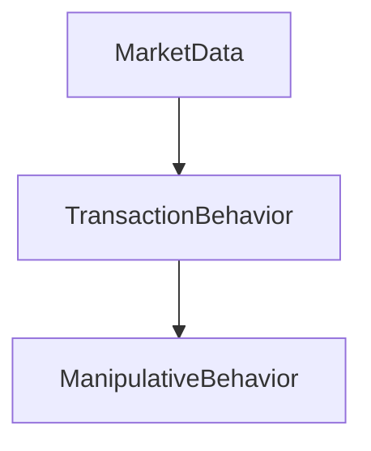
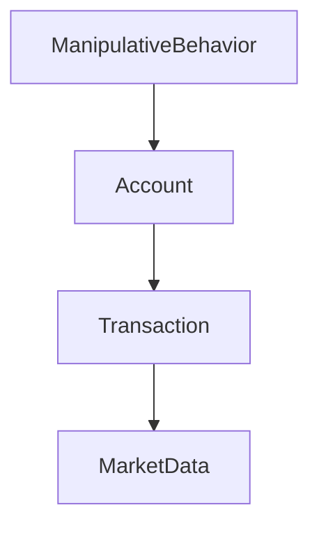
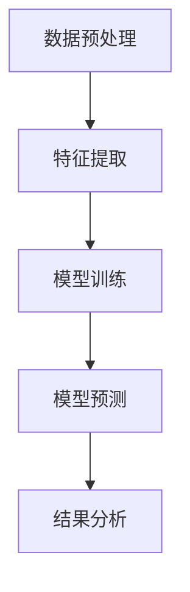

                 


# 人工智能在市场操纵行为检测中的应用

## 关键词：人工智能、市场操纵、金融数据分析、机器学习、异常检测

## 摘要

本文探讨了人工智能技术在检测市场操纵行为中的应用，分析了市场操纵行为的定义、特征以及其对金融市场的危害。通过结合机器学习、深度学习等技术，本文详细阐述了如何利用人工智能算法对市场数据进行特征提取、分类与异常检测，实现对市场操纵行为的高效识别。文章还结合实际案例，介绍了系统架构设计与项目实现过程，并总结了人工智能在市场操纵行为检测中的优势与挑战。

---

# 第一部分：背景介绍

## 第1章：市场操纵行为与人工智能的结合

### 1.1 市场操纵行为的定义与特征

#### 1.1.1 市场操纵行为的法律定义

市场操纵行为是指通过虚假的交易行为或误导性信息，影响市场价格或交易量，以谋取不正当利益的行为。根据相关法律法规，市场操纵行为包括但不限于“拉高抛售”、“打压洗盘”、“对倒交易”等。

#### 1.1.2 市场操纵行为的主要特征

1. **异常交易行为**：交易量突增、价格剧烈波动、大额交易集中在特定时间段等。
2. **信息不对称**：操纵者利用信息优势，误导市场参与者。
3. **非随机性**：市场操纵行为往往表现出一定的模式和规律。

#### 1.1.3 市场操纵行为的分类与影响

市场操纵行为可分为以下几类：
- **价格操纵**：通过虚假交易抬高或压低股价。
- **成交量操纵**：通过大量交易制造虚假的交易量。
- **信息操纵**：通过发布虚假信息影响市场情绪。

市场操纵行为对金融市场稳定性和公平性造成严重威胁，破坏了市场资源配置效率。

---

### 1.2 人工智能在金融领域的应用背景

#### 1.2.1 人工智能技术在金融领域的应用现状

人工智能技术在金融领域的应用已经非常广泛，包括股票价格预测、风险管理、信用评估、欺诈检测等。然而，市场操纵行为的隐蔽性和复杂性使得传统的金融分析方法难以有效识别。

#### 1.2.2 人工智能在市场行为分析中的优势

人工智能技术具有以下优势：
1. **数据处理能力**：能够处理海量的市场数据，发现隐藏的规律。
2. **实时性**：能够实时分析市场数据，快速识别异常行为。
3. **自我学习能力**：通过深度学习模型，能够不断优化检测算法。

#### 1.2.3 市场操纵行为检测的难点与挑战

1. **数据复杂性**：市场数据包含噪声和不确定性。
2. **行为隐蔽性**：操纵者会采用复杂的策略掩盖其行为。
3. **法律法规的复杂性**：不同国家和地区的市场操纵行为认定标准不同。

---

### 1.3 本章小结

本章介绍了市场操纵行为的定义、特征和分类，分析了人工智能技术在金融领域的应用背景，指出了市场操纵行为检测的难点与挑战。人工智能技术的应用为市场操纵行为检测提供了新的思路和方法。

---

# 第二部分：人工智能技术在市场操纵检测中的核心概念

## 第2章：人工智能与市场操纵行为的核心概念

### 2.1 人工智能技术的核心原理

#### 2.1.1 机器学习的基本原理

机器学习是一种通过数据训练模型的技术，模型能够从数据中学习到特征，并根据这些特征进行预测。常用的机器学习算法包括支持向量机（SVM）、随机森林（Random Forest）等。

#### 2.1.2 深度学习的基本原理

深度学习是一种基于人工神经网络的机器学习技术，通过多层神经网络模型，能够自动提取数据特征。常用的深度学习算法包括卷积神经网络（CNN）、循环神经网络（RNN）等。

#### 2.1.3 自然语言处理与时间序列分析

自然语言处理（NLP）技术能够分析新闻、公告等文本数据，提取情感倾向和关键词。时间序列分析技术能够分析股票价格、成交量等时序数据，发现其中的规律。

---

### 2.2 市场数据与行为特征分析

#### 2.2.1 市场数据的特征提取

市场数据包括股票价格、成交量、交易频率、买卖双方力量对比等。通过特征工程，可以从这些数据中提取有用的特征，例如波动率、成交额集中度等。

#### 2.2.2 异常交易行为的识别

异常交易行为包括交易量突增、价格剧烈波动、大额交易集中在特定时间段等。通过设置阈值或使用异常检测算法，可以识别这些异常行为。

#### 2.2.3 多维度数据融合分析

通过将股票价格、成交量、新闻数据等多维度数据进行融合分析，可以更全面地识别市场操纵行为。

---

### 2.3 市场操纵行为的分类与模式识别

#### 2.3.1 市场操纵行为的主要类型

1. **拉高抛售**：操纵者在低位买入股票，通过拉升股价后高位抛售，赚取差价。
2. **打压洗盘**：操纵者在高位卖出股票，通过打压股价吸引投资者低位买入，再低位吸筹后拉升股价。
3. **对倒交易**：操纵者利用多个账户进行虚假交易，制造交易量假象。

#### 2.3.2 不同类型市场操纵行为的特征分析

- **拉高抛售**：股价短期内快速上涨，随后迅速下跌，成交量在高位放大。
- **打压洗盘**：股价在低位震荡，成交量低，随后突然拉升。
- **对倒交易**：交易量集中在某些时间段，成交额与真实市场情况不符。

#### 2.3.3 市场操纵行为的模式识别方法

通过聚类分析、分类算法等技术，可以对市场操纵行为进行模式识别。例如，使用随机森林算法对不同类型的市场操纵行为进行分类。

---

### 2.4 核心概念对比与ER实体关系图

#### 2.4.1 AI技术与传统金融分析方法的对比

- **传统方法**：依赖人工分析，难以处理海量数据。
- **AI技术**：能够自动处理海量数据，发现隐藏规律。

#### 2.4.2 市场数据与交易行为的ER实体关系图



#### 2.4.3 市场操纵行为的实体关系图分析



---

# 第三部分：人工智能算法在市场操纵检测中的原理与实现

## 第3章：基于机器学习的市场操纵检测算法

### 3.1 特征工程与数据预处理

#### 3.1.1 数据清洗与标准化

- 数据清洗：去除缺失值、异常值。
- 数据标准化：将数据归一化处理，使其具有相同的尺度。

#### 3.1.2 特征提取与选择

- 特征提取：从市场数据中提取有用的特征，例如波动率、成交额集中度等。
- 特征选择：通过统计检验或模型评估，选择对分类效果影响最大的特征。

#### 3.1.3 时间序列数据的特征工程

- 常用的时间序列特征：均值、标准差、自相关系数等。

---

### 3.2 分类算法实现

#### 3.2.1 支持向量机（SVM）算法

- SVM是一种监督学习算法，适用于小规模数据集的分类任务。
- 优点：对噪声数据有较强的鲁棒性。
- 缺点：对大规模数据集的处理效率较低。

#### 3.2.2 随机森林（Random Forest）算法

- 随机森林是一种基于决策树的集成学习算法。
- 优点：能够处理高维数据，对噪声数据有较强的鲁棒性。
- 缺点：计算复杂度较高。

#### 3.2.3 神经网络（NN）算法

- 神经网络是一种基于人工神经网络的深度学习算法。
- 优点：能够自动提取数据特征，适用于大规模数据集的分类任务。
- 缺点：计算资源消耗较大，需要大量的训练数据。

---

### 3.3 异常检测算法实现

#### 3.3.1 基于孤立森林（Isolation Forest）的异常检测

- Isolation Forest是一种无监督学习算法，适用于异常检测任务。
- 优点：计算效率较高，适合处理大规模数据集。

#### 3.3.2 基于聚类算法的异常检测

- 聚类算法（如K-Means）可以用于异常检测，通过将数据分成簇，识别与簇中心差异较大的点。

#### 3.3.3 基于深度学习的异常检测

- 使用循环神经网络（RNN）或变种模型（如LSTM）进行异常检测，能够捕捉时间序列数据中的复杂模式。

---

### 3.4 算法流程图与代码实现

#### 3.4.1 算法流程图



#### 3.4.2 Python代码示例

```python
import pandas as pd
from sklearn.ensemble import RandomForestClassifier
from sklearn.model_selection import train_test_split
from sklearn.metrics import accuracy_score

# 数据加载与预处理
data = pd.read_csv('market_data.csv')
X = data.drop(columns=['label'])
y = data['label']

# 数据分割
X_train, X_test, y_train, y_test = train_test_split(X, y, test_size=0.2)

# 模型训练
model = RandomForestClassifier()
model.fit(X_train, y_train)

# 模型预测
y_pred = model.predict(X_test)

# 结果评估
print('Accuracy:', accuracy_score(y_test, y_pred))
```

---

## 第4章：基于深度学习的市场操纵检测

### 4.1 时间序列数据的深度学习模型

#### 4.1.1 LSTM网络的原理与优势

- LSTM（长短期记忆网络）是一种特殊的RNN结构，能够捕捉时间序列数据中的长距离依赖关系。
- 优点：适合处理时间序列数据，能够捕捉复杂的模式。

#### 4.1.2 LSTM网络的结构与实现

- LSTM网络包含输入门、遗忘门和输出门。
- 通过调整门的参数，可以控制信息的流动。

#### 4.1.3 LSTM网络的训练与优化

- 使用反向传播算法（BPTT）训练模型。
- 通过调整学习率和批量大小，优化模型性能。

---

### 4.2 基于深度学习的异常检测

#### 4.2.1 基于AE（自动编码器）的异常检测

- AE是一种无监督学习模型，适用于异常检测任务。
- 通过重构损失来识别异常点。

#### 4.2.2 基于GAN（生成对抗网络）的异常检测

- GAN由生成器和判别器组成，可以用于生成正常交易行为，通过判别器识别异常行为。

#### 4.2.3 深度学习模型的训练与调优

- 使用数据增强技术，提高模型的泛化能力。
- 调整模型超参数，优化模型性能。

---

## 第5章：系统分析与架构设计

### 5.1 问题场景介绍

- **问题场景**：检测股票市场中的市场操纵行为。
- **目标**：通过人工智能技术，实现对市场操纵行为的实时检测。

### 5.2 系统功能设计

- **领域模型**：股票、交易、市场数据、用户。
- **功能模块**：数据采集、特征提取、模型训练、结果分析。

---

## 第6章：项目实战与案例分析

### 6.1 环境安装与数据准备

- **环境安装**：安装Python、TensorFlow、Keras等工具。
- **数据准备**：下载股票市场数据，清洗与预处理。

### 6.2 核心代码实现

```python
import tensorflow as tf
from tensorflow.keras import layers

# 模型定义
model = tf.keras.Sequential()
model.add(layers.LSTM(64, input_shape=(timesteps, features)))
model.add(layers.Dense(1, activation='sigmoid'))

# 模型编译
model.compile(loss='binary_crossentropy', optimizer='adam', metrics=['accuracy'])

# 模型训练
model.fit(X_train, y_train, epochs=10, batch_size=32)
```

### 6.3 案例分析与结果解读

- **案例分析**：以某只股票为例，分析模型检测结果。
- **结果解读**：识别出异常交易行为，分析其可能的市场操纵行为类型。

---

## 第7章：总结与展望

### 7.1 总结

- **总结**：人工智能技术在市场操纵行为检测中的应用优势。
- **不足**：现有算法的局限性，例如数据依赖性、模型解释性等。

### 7.2 展望

- **未来方向**：探索更高效的算法，如图神经网络（GNN）。
- **应用拓展**：将人工智能技术应用于更多金融场景，如风险管理、信用评估等。

---

# 结语

人工智能技术为市场操纵行为检测提供了新的思路和方法。通过结合机器学习、深度学习等技术，可以有效识别异常交易行为，维护金融市场的公平与稳定。然而，市场操纵行为的复杂性和隐蔽性仍然对人工智能技术提出了更高的要求，未来需要进一步研究更高效、更鲁棒的检测算法。

---

