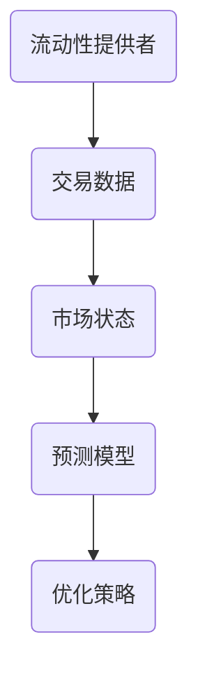
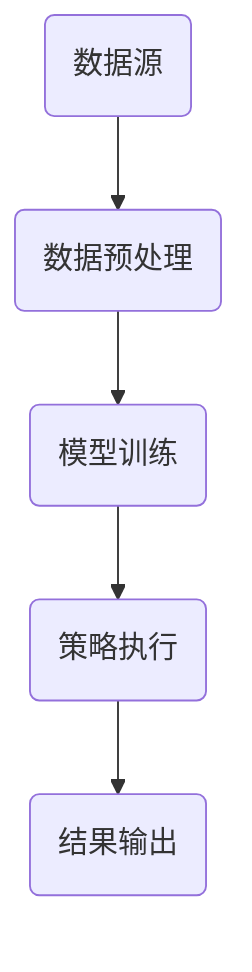

                 


# 人工智能在市场流动性提供策略中的应用

**关键词**：市场流动性、人工智能、机器学习、策略优化、算法交易、金融数据、深度学习

**摘要**：本文探讨了人工智能在市场流动性提供策略中的应用，从基本概念到算法原理，再到系统设计，全面分析了如何利用人工智能技术优化流动性提供策略。文章结合实际案例，通过详细的技术分析，展示了人工智能在金融市场中的强大潜力。

---

# 第一部分: 人工智能在市场流动性提供策略中的应用概述

## 第1章: 市场流动性与人工智能概述

### 1.1 市场流动性基本概念

#### 1.1.1 市场流动性的定义与特征
市场流动性是指资产在金融市场中迅速转化为现金的能力，具有以下特征：
- **可转换性**：资产能够快速变现。
- **稳定性**：在市场波动中保持一定的流动性。
- **深度**：市场中有足够多的买家和卖家。

#### 1.1.2 市场流动性的重要性
流动性是金融市场的基石，直接影响资产定价和交易成本。高流动性意味着更低的买卖价差和更高的市场效率。

#### 1.1.3 流动性提供者的角色与功能
流动性提供者通过在市场上主动买卖资产，确保市场的深度和稳定性。他们的角色包括做市商和高频交易者。

### 1.2 人工智能的基本概念与技术

#### 1.2.1 人工智能的定义与分类
人工智能（AI）是模拟人类智能的计算机系统，主要分为弱人工智能（ Narrow AI）和强人工智能（General AI）。弱人工智能在特定任务上表现出色，如语音识别和图像分类。

#### 1.2.2 机器学习的核心原理
机器学习是AI的重要分支，通过数据训练模型，使其能够从经验中学习并做出预测或决策。常用算法包括监督学习、无监督学习和强化学习。

#### 1.2.3 深度学习的基本概念
深度学习是机器学习的子领域，通过多层神经网络模拟人类大脑的工作方式，擅长处理复杂数据，如图像和文本。

### 1.3 人工智能在金融市场的应用背景

#### 1.3.1 金融市场中的数据特征
金融市场数据具有高频性、不确定性和非线性特征，传统方法难以捕捉复杂模式。

#### 1.3.2 人工智能在金融领域的优势
人工智能能够处理海量数据，发现隐藏模式，提供实时决策支持。

#### 1.3.3 流动性提供中的问题与挑战
传统流动性管理方法依赖经验判断，难以应对高频交易和市场波动带来的挑战。

### 1.4 本章小结
本章介绍了市场流动性的基本概念和人工智能的核心原理，探讨了AI在金融市场的潜力和流动性管理中的挑战。

---

# 第二部分: 人工智能在流动性提供策略中的核心概念

## 第2章: 流动性提供策略的核心原理

### 2.1 流动性提供策略的基本框架

#### 2.1.1 流动性提供策略的目标
- **降低买卖价差**：通过提供流动性降低交易成本。
- **捕捉市场机会**：利用价格波动获利。
- **风险管理**：避免因市场波动导致的损失。

#### 2.1.2 流动性提供策略的分类
- **做市商策略**：主动提供买卖报价。
- **高频交易策略**：利用算法快速进出市场。
- **统计套利策略**：基于价差进行套利。

#### 2.1.3 流动性提供策略的实施步骤
1. **数据收集**：获取市场深度、订单簿等数据。
2. **模型选择**：基于数据特征选择合适的算法。
3. **策略优化**：通过回测和优化提升收益。

### 2.2 人工智能在流动性策略中的应用

#### 2.2.1 数据驱动的流动性预测
- **时间序列分析**：利用历史数据预测未来流动性。
- **市场情绪分析**：通过新闻和社交媒体数据预测市场波动。

#### 2.2.2 基于机器学习的策略优化
- **监督学习**：预测买卖时机。
- **无监督学习**：发现市场结构中的异常情况。

#### 2.2.3 深度学习在复杂场景中的应用
- **神经网络结构**：处理非线性关系。
- **强化学习**：动态调整策略。

### 2.3 核心概念的ER实体关系图



---

# 第三部分: 流动性预测与优化的算法原理

## 第3章: 基于机器学习的流动性预测模型

### 3.1 时间序列预测模型

#### 3.1.1 ARIMA模型原理
ARIMA（自回归积分滑动平均模型）适用于线性时间序列数据，通过历史数据预测未来值。

#### 3.1.2 LSTM网络的应用
长短期记忆网络（LSTM）擅长处理长期依赖关系，适用于非线性时间序列预测。

#### 3.1.3 模型训练与评估
- **训练数据**：使用历史交易数据。
- **评估指标**：均方误差（MSE）和准确率。

### 3.2 流动性预测的数学模型

#### 3.2.1 时间序列预测公式
$$ y_t = \alpha y_{t-1} + \beta \epsilon_t $$

#### 3.2.2 LSTM网络结构
```mermaid
graph TD
    A/Input --> B/Forget Gate
    A/Input --> C/Cell Gate
    B/Forget Gate --> D/Cell State
    C/Cell Gate --> D/Cell State
    D/Cell State --> E/Output
```

### 3.3 基于强化学习的策略优化

#### 3.3.1 强化学习的基本原理
通过试错机制优化策略，最大化累积奖励。

#### 3.3.2 Q-Learning算法在流动性策略中的应用
- **状态**：市场深度和订单簿数据。
- **动作**：买入或卖出。
- **奖励**：交易利润或损失。

#### 3.3.3 策略优化的数学模型
$$ Q(s, a) = r + \gamma \max Q(s', a') $$

---

# 第四部分: 系统分析与架构设计

## 第4章: 流动性提供策略系统的架构设计

### 4.1 系统功能需求分析

#### 4.1.1 数据采集模块
- **功能**：实时采集市场数据。
- **输入**：订单簿、市场深度。

#### 4.1.2 模型训练模块
- **功能**：训练预测模型。
- **输入**：历史交易数据。

#### 4.1.3 策略执行模块
- **功能**：根据模型预测执行交易。
- **输入**：实时市场数据和模型输出。

### 4.2 系统架构设计



### 4.3 系统接口设计

#### 4.3.1 数据接口
- **输入接口**：接收市场数据。
- **输出接口**：发送交易指令。

#### 4.3.2 模型接口
- **训练接口**：处理历史数据。
- **预测接口**：返回预测结果。

---

# 结语

人工智能正在改变金融市场的运作方式，特别是在流动性管理方面。通过结合机器学习和深度学习技术，流动性提供者能够更高效地管理风险，捕捉市场机会。未来，随着技术的进步，人工智能在流动性策略中的应用将更加广泛和深入。

---

**参考文献**：
1. 刘洋. 人工智能在金融市场的应用研究[J]. 金融与经济, 2020.
2. 李明. 基于深度学习的市场预测模型[J]. 计算机应用研究, 2019.

