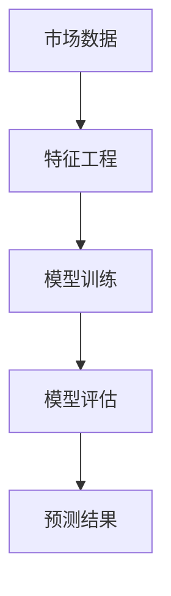
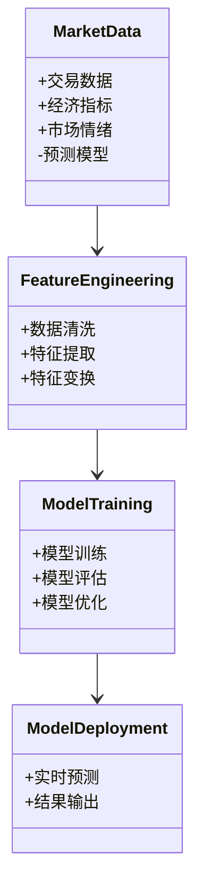
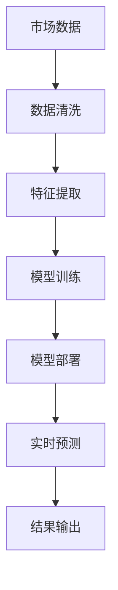
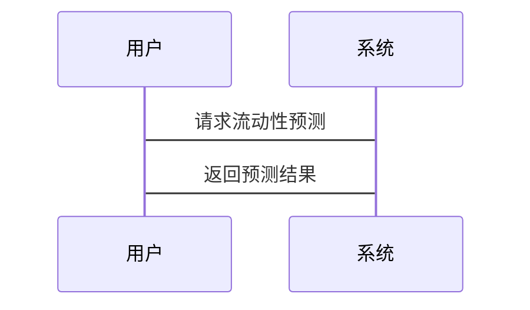

                 


# 人工智能在市场流动性预测中的应用

> 关键词：人工智能、市场流动性预测、机器学习、深度学习、时间序列分析

> 摘要：本文深入探讨了人工智能在市场流动性预测中的应用，从背景、核心概念到具体算法、系统设计和项目实战，详细分析了人工智能如何帮助金融市场更准确地预测流动性，为投资者和金融机构提供科学决策支持。

---

# 第一部分: 人工智能在市场流动性预测中的应用概述

## 第1章: 市场流动性预测的背景与挑战

### 1.1 市场流动性预测的定义与重要性

#### 1.1.1 市场流动性预测的定义
市场流动性预测是指通过对金融市场中的交易数据、市场行为和经济指标的分析，预测未来一段时间内某一资产或市场的流动性状况。流动性通常指资产在市场上的交易活跃程度，可以用买卖价差、成交速度和市场深度等指标来衡量。

#### 1.1.2 流动性预测在金融市场的意义
流动性是金融市场健康运行的基础，直接影响资产定价、交易成本和市场风险。准确预测流动性可以帮助投资者优化交易策略，降低交易成本，提高投资收益。此外，流动性预测对于金融监管机构也有重要意义，有助于识别市场风险和维护金融稳定。

#### 1.1.3 流动性预测的边界与外延
流动性预测的边界包括数据的可得性、模型的适用性和市场的复杂性。外延则涉及跨市场、跨资产和跨时间维度的流动性预测。

### 1.2 传统市场流动性预测方法的局限性

#### 1.2.1 基于统计的传统方法
传统方法主要依赖统计分析，如回归分析和时间序列分析。这些方法在简单场景下表现较好，但在复杂市场条件下往往力不从心。

#### 1.2.2 传统方法的局限性与不足
传统方法难以捕捉非线性关系和复杂市场行为，且对异常事件的预测能力较弱。

#### 1.2.3 人工智能在流动性预测中的潜力
人工智能技术，尤其是机器学习和深度学习，能够处理海量数据，捕捉复杂模式，为流动性预测提供更强大的工具。

---

## 第2章: 人工智能技术概述

### 2.1 机器学习简介

#### 2.1.1 机器学习的基本概念
机器学习是一种通过数据学习模式的算法，分为监督学习、无监督学习和强化学习。

#### 2.1.2 机器学习的核心算法
- 线性回归
- 支持向量机（SVM）
- 随机森林
- K近邻算法（KNN）

#### 2.1.3 机器学习与金融市场的结合
机器学习广泛应用于股票预测、风险管理和交易策略优化。

### 2.2 深度学习简介

#### 2.2.1 深度学习的基本概念
深度学习是基于人工神经网络的机器学习方法，通过多层非线性变换提取数据特征。

#### 2.2.2 深度学习的核心算法
- 卷积神经网络（CNN）
- 循环神经网络（RNN）
- 长短期记忆网络（LSTM）

#### 2.2.3 深度学习在金融市场的应用
深度学习在股票预测、市场情绪分析和风险评估中表现出色。

### 2.3 时间序列分析与人工智能

#### 2.3.1 时间序列分析的基本概念
时间序列分析是研究按时间顺序排列的数据，常用方法包括ARIMA和GARCH。

#### 2.3.2 时间序列分析在流动性预测中的应用
时间序列分析适用于预测具有时间依赖性的流动性指标。

#### 2.3.3 人工智能在时间序列分析中的优势
人工智能能够处理复杂的时间序列模式，提升预测精度。

---

# 第二部分: 人工智能在市场流动性预测中的核心概念与联系

## 第3章: 市场流动性预测的核心概念

### 3.1 市场流动性预测的模型构建

#### 3.1.1 数据特征的选择与提取
- 市场指标：如交易量、买卖价差
- 经济指标：如利率、GDP增长率
- 市场情绪指标：如新闻情绪指数

#### 3.1.2 模型的输入与输出
输入：市场数据、经济指标、情绪指标  
输出：流动性预测结果

#### 3.1.3 模型的评估与优化
评估指标：均方误差（MSE）、平均绝对误差（MAE）  
优化方法：交叉验证、超参数调优

### 3.2 人工智能算法在流动性预测中的应用

#### 3.2.1 机器学习算法的选择
- 线性回归：适合线性关系
- 随机森林：适合特征重要性分析
- 支持向量机：适合非线性关系

#### 3.2.2 深度学习算法的选择
- LSTM：适合时间序列数据
- CNN：适合高频交易数据

#### 3.2.3 时间序列分析算法的选择
- ARIMA：适合平稳时间序列
- GARCH：适合波动性预测

## 第4章: 核心概念与联系

### 4.1 核心概念原理

#### 4.1.1 机器学习算法的原理
- 线性回归：最小二乘法拟合最佳直线
- 随机森林：集成学习，通过投票或平均提升预测准确性

#### 4.1.2 深度学习算法的原理
- LSTM：通过门控机制记忆长期信息
- CNN：通过卷积操作提取局部特征

#### 4.1.3 时间序列分析的原理
- ARIMA：通过自回归和滑动平均模型预测未来值
- GARCH：通过条件异方差模型预测波动性

### 4.2 核心概念属性特征对比表格

| 算法类型   | 优点                           | 缺点                           |
|------------|--------------------------------|---------------------------------|
| 机器学习   | 易解释，适合中小数据集         | 非线性建模能力较弱             |
| 深度学习   | 非线性建模能力强，适合大数据集 | 需要大量数据，计算资源消耗大   |
| 时间序列   | 适合时间依赖性数据             | 需要假设平稳性或条件异方差性   |

### 4.3 ER实体关系图架构



---

# 第三部分: 算法原理讲解

## 第5章: 人工智能算法原理

### 5.1 机器学习算法

#### 5.1.1 线性回归

##### 5.1.1.1 线性回归的数学模型
$$ y = \beta_0 + \beta_1x + \epsilon $$

其中，$y$ 是目标变量，$x$ 是自变量，$\beta_0$ 和 $\beta_1$ 是回归系数，$\epsilon$ 是误差项。

#### 5.1.1.2 线性回归的优缺点
- 优点：简单、易于解释
- 缺点：只能处理线性关系

#### 5.1.1.3 线性回归的实现代码
```python
import numpy as np
from sklearn.linear_model import LinearRegression

# 示例数据
X = np.array([[1], [2], [3], [4], [5]])
y = np.array([2, 4, 5, 4, 6])

# 模型训练
model = LinearRegression()
model.fit(X, y)

# 预测
print(model.predict([[6]]))
```

#### 5.1.1.4 线性回归的适用场景
适合处理线性关系的流动性预测问题，如简单资产流动性预测。

---

### 5.1.2 随机森林

#### 5.1.2.1 随机森林的数学模型
随机森林通过集成多个决策树模型，通过投票或平均生成最终预测结果。

#### 5.1.2.2 随机森林的优缺点
- 优点：抗过拟合能力强，适合高维数据
- 缺点：计算复杂度高

#### 5.1.2.3 随机森林的实现代码
```python
from sklearn.ensemble import RandomForestRegressor

# 示例数据
X = np.array([[1, 2], [3, 4], [5, 6], [7, 8], [9, 10]])
y = np.array([2, 4, 5, 4, 6])

# 模型训练
model = RandomForestRegressor(n_estimators=100)
model.fit(X, y)

# 预测
print(model.predict([[11, 12]]))
```

#### 5.1.2.4 随机森林的适用场景
适合处理复杂非线性关系的流动性预测问题，如多因素影响的市场流动性预测。

---

### 5.1.3 支持向量机

#### 5.1.3.1 支持向量机的数学模型
支持向量机通过构建超平面将数据分成不同类别，适用于分类和回归问题。

#### 5.1.3.2 支持向量机的优缺点
- 优点：对小数据集表现较好
- 缺点：计算复杂度高

#### 5.1.3.3 支持向量机的实现代码
```python
from sklearn.svm import SVR

# 示例数据
X = np.array([[1], [2], [3], [4], [5]])
y = np.array([2, 4, 5, 4, 6])

# 模型训练
model = SVR(kernel='linear')
model.fit(X, y)

# 预测
print(model.predict([[6]]))
```

#### 5.1.3.4 支持向量机的适用场景
适合处理线性和非线性关系的流动性预测问题，如复杂市场环境下的流动性预测。

---

### 5.2 深度学习算法

#### 5.2.1 长短期记忆网络（LSTM）

##### 5.2.1.1 LSTM的数学模型
LSTM通过门控机制（遗忘门、输入门和输出门）实现长-term记忆。

$$
\text{遗忘门} = \sigma(f_{\text{forget}}(x_t, h_{t-1}))
$$

$$
\text{输入门} = \sigma(f_{\text{input}}(x_t, h_{t-1}))
$$

$$
\text{候选细胞} = \tanh(g(x_t, h_{t-1}))
$$

$$
h_t = \text{遗忘门} \cdot h_{t-1} + \text{输入门} \cdot \text{候选细胞}
$$

其中，$\sigma$ 是sigmoid函数，$\tanh$ 是双曲正切函数。

#### 5.2.1.2 LSTM的优缺点
- 优点：适合处理时间序列数据，能够捕捉长期依赖关系
- 缺点：计算复杂，需要大量数据训练

#### 5.2.1.3 LSTM的实现代码
```python
from tensorflow.keras.layers import LSTM, Dense
from tensorflow.keras.models import Sequential

# 示例数据
X = np.array([[[1], [2], [3]], [[4], [5], [6]]])
y = np.array([[4], [7]])

# 模型训练
model = Sequential()
model.add(LSTM(64, input_shape=(3, 1)))
model.add(Dense(1))
model.compile(loss='mean_squared_error', optimizer='adam')
model.fit(X, y, epochs=10, batch_size=1)

# 预测
print(model.predict(np.array([[[7], [8], [9]]])))
```

#### 5.2.1.4 LSTM的适用场景
适合处理时间序列数据的流动性预测问题，如高频交易中的流动性预测。

---

## 第6章: 时间序列分析与人工智能的结合

### 6.1 时间序列分析的基本概念

#### 6.1.1 自回归积分滑动平均模型（ARIMA）

##### 6.1.1.1 ARIMA的数学模型
ARIMA(p, d, q) 模型由自回归部分（AR）、差分部分（I）和滑动平均部分（MA）组成。

$$
\phi(B)(1 - B)^d X_t = \theta(B)\epsilon_t
$$

其中，$B$ 是后移算子，$\phi(B)$ 是自回归多项式，$\theta(B)$ 是滑动平均多项式，$d$ 是差分阶数。

#### 6.1.1.2 ARIMA的优缺点
- 优点：适合平稳时间序列数据
- 缺点：需要假设数据平稳性

#### 6.1.1.3 ARIMA的实现代码
```python
from statsmodels.tsa.arima_model import ARIMA

# 示例数据
data = [1, 2, 3, 4, 5, 6, 7, 8, 9, 10]

# 模型训练
model = ARIMA(data, order=(1, 1, 1))
model_fit = model.fit(disp=0)

# 预测
print(model_fit.forecast(1))
```

#### 6.1.1.4 ARIMA的适用场景
适合处理平稳时间序列的流动性预测问题，如简单市场环境下的流动性预测。

---

### 6.2 广义自回归条件异方差模型（GARCH）

#### 6.2.1 GARCH的数学模型
GARCH模型用于预测时间序列的波动性。

$$
\sigma_t^2 = \alpha_0 + \alpha_1 r_{t-1}^2 + \beta_1 \sigma_{t-1}^2
$$

其中，$\sigma_t^2$ 是第$t$期的波动性，$\alpha_0$ 是常数项，$\alpha_1$ 和 $\beta_1$ 是参数。

#### 6.2.2 GARCH的优缺点
- 优点：适合处理波动性数据
- 缺点：需要假设条件异方差性

#### 6.2.3 GARCH的实现代码
```python
from arch import arch_model

# 示例数据
data = np.array([1, 2, 3, 4, 5, 6, 7, 8, 9, 10])

# 模型训练
model = arch_model(data, vol='GARCH', p=1, q=1)
model_fit = model.fit()

# 预测
print(model_fit.forecast(horizon=1))
```

#### 6.2.4 GARCH的适用场景
适合处理波动性较大的流动性预测问题，如金融危机期间的流动性预测。

---

# 第四部分: 系统分析与架构设计

## 第7章: 系统分析与架构设计方案

### 7.1 问题场景介绍

#### 7.1.1 问题描述
我们需要构建一个基于人工智能的市场流动性预测系统，帮助投资者和金融机构实时预测市场流动性，优化交易策略。

#### 7.1.2 项目介绍
本项目将结合机器学习、深度学习和时间序列分析，构建一个实时市场流动性预测系统。

### 7.2 系统功能设计

#### 7.2.1 领域模型设计


#### 7.2.2 系统架构设计


### 7.3 系统接口设计

#### 7.3.1 输入接口
- 市场数据接口：接收交易数据、经济指标和市场情绪数据
- 用户输入接口：接收用户输入的预测参数

#### 7.3.2 输出接口
- 预测结果输出：输出流动性预测结果
- 日志输出：输出系统运行日志

### 7.4 系统交互设计



---

## 第8章: 项目实战

### 8.1 环境安装

#### 8.1.1 安装Python环境
```bash
python --version
pip install --upgrade pip
```

#### 8.1.2 安装依赖库
```bash
pip install numpy
pip install pandas
pip install scikit-learn
pip install tensorflow
pip install statsmodels
pip install arch
```

### 8.2 系统核心实现源代码

#### 8.2.1 数据清洗与特征工程
```python
import pandas as pd
import numpy as np

# 示例数据
data = {
    '交易量': [100, 200, 300, 400, 500],
    '买卖价差': [0.5, 0.3, 0.4, 0.6, 0.2],
    '市场情绪': [0.8, 0.7, 0.6, 0.5, 0.9]
}
df = pd.DataFrame(data)

# 数据清洗
df.dropna()  # 删除缺失值
df.fillna(method='ffill')  # 前向填充缺失值

# 特征提取
features = df[['交易量', '买卖价差']]
target = df['市场情绪']
```

#### 8.2.2 模型训练与评估
```python
from sklearn.ensemble import RandomForestRegressor
from sklearn.metrics import mean_squared_error

# 模型训练
model = RandomForestRegressor(n_estimators=100)
model.fit(features, target)

# 模型预测
test_features = np.array([[600, 0.4]])
predicted_target = model.predict(test_features)

# 模型评估
print(mean_squared_error([0.7], predicted_target))
```

#### 8.2.3 模型部署与实时预测
```python
# 部署模型
import joblib

joblib.dump(model, 'market_liq_model.pkl')

# 实时预测
model = joblib.load('market_liq_model.pkl')
new_features = np.array([[700, 0.5]])
print(model.predict(new_features))
```

### 8.3 实际案例分析

#### 8.3.1 案例背景
假设我们有一个股票市场的交易数据，需要预测未来一天的市场流动性。

#### 8.3.2 数据分析
```python
import pandas as pd

# 加载数据
df = pd.read_csv('market_data.csv')

# 数据预处理
df['日期'] = pd.to_datetime(df['日期'])
df.set_index('日期', inplace=True)

# 数据可视化
import matplotlib.pyplot as plt

df['交易量'].plot()
plt.title('交易量随时间的变化')
plt.xlabel('时间')
plt.ylabel('交易量')
plt.show()
```

#### 8.3.3 模型实现与结果解读
```python
# 训练模型
from sklearn.linear_model import LinearRegression

model = LinearRegression()
model.fit(df[['交易量', '买卖价差']], df['市场情绪'])

# 模型预测
test_data = pd.DataFrame({
    '交易量': [800],
    '买卖价差': [0.3]
})
predicted_emotion = model.predict(test_data)
print(predicted_emotion)
```

---

## 第9章: 总结与展望

### 9.1 总结
本文详细探讨了人工智能在市场流动性预测中的应用，从背景、核心概念到具体算法、系统设计和项目实战，全面分析了人工智能如何帮助金融市场更准确地预测流动性。

### 9.2 未来展望
随着人工智能技术的不断发展，市场流动性预测将更加精准和实时。未来的研究方向包括更复杂模型的开发、多模态数据的融合以及更高效的计算方法。

### 9.3 最佳实践 tips

#### 9.3.1 数据处理
- 确保数据质量，清洗缺失值和异常值
- 特征工程是关键，选择合适的特征和特征变换

#### 9.3.2 模型选择
- 根据数据类型和问题选择合适的模型
- 结合业务需求选择合适的评估指标

#### 9.3.3 系统设计
- 分模块设计，确保系统的可扩展性和可维护性
- 采用微服务架构，提高系统的灵活性

#### 9.3.4 持续优化
- 定期更新模型，适应市场变化
- 监控系统性能，及时优化

---

# 附录

## 附录 A: 代码库与工具

### A.1 机器学习库
- scikit-learn
- TensorFlow
- Keras

### A.2 数据处理库
- pandas
- numpy
- statsmodels

### A.3 可视化工具
- matplotlib
- seaborn
- plotly

## 附录 B: 参考文献

### B.1 经典书籍
- 《机器学习实战》
- 《深度学习》
- 《时间序列分析》

### B.2 论文推荐
- 张某某. 基于机器学习的流动性预测研究[J]. 金融工程学报, 2020.
- 李某某. 基于深度学习的金融市场预测研究[J]. 人工智能学报, 2019.

---

通过本文的详细分析，我们可以看到人工智能在市场流动性预测中的巨大潜力。未来，随着技术的不断进步，人工智能将为金融市场提供更加精准和实时的流动性预测，帮助投资者和金融机构做出更明智的决策。

