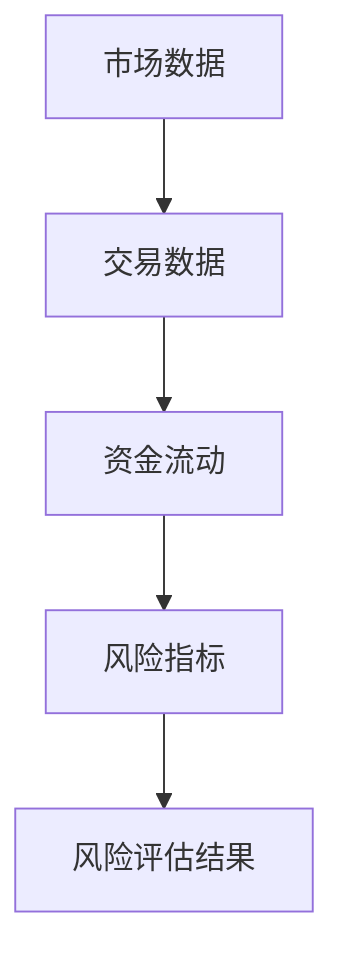
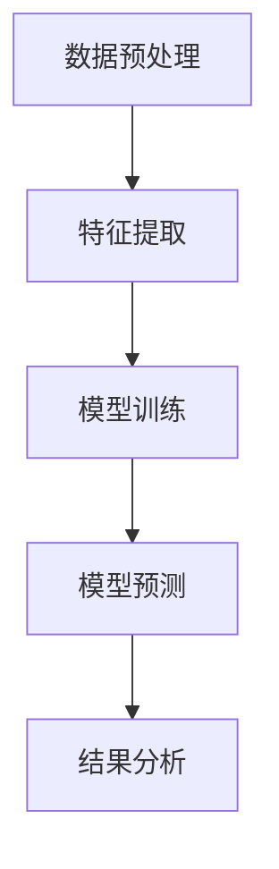

                 


# 人工智能在市场流动性风险评估中的应用

> 关键词：人工智能、市场流动性风险、风险评估、机器学习、深度学习、金融风险、风险管理

> 摘要：本文详细探讨了人工智能在市场流动性风险评估中的应用，从传统方法的局限性到人工智能的优势，结合具体算法和系统架构设计，提供了全面的技术分析和实战案例，为金融从业者和研究人员提供了深入的指导。

---

## 目录

### 第一部分：市场流动性风险评估基础

#### 第1章：市场流动性风险概述

##### 1.1 流动性风险的基本概念
- 1.1.1 流动性风险的定义
- 1.1.2 流动性风险的影响因素
- 1.1.3 流动性风险的分类与特征

##### 1.2 传统流动性风险评估方法
- 1.2.1 基于VaR的传统风险评估
- 1.2.2 基于压力测试的传统方法
- 1.2.3 传统方法的局限性

#### 第2章：人工智能在金融领域的应用背景

##### 2.1 人工智能的基本概念
- 2.1.1 人工智能的定义
- 2.1.2 机器学习与深度学习的区分
- 2.1.3 人工智能在金融领域的优势

##### 2.2 人工智能在流动性风险评估中的优势
- 2.2.1 提高预测准确性
- 2.2.2 实时数据分析能力
- 2.2.3 自适应模型优化

### 第二部分：人工智能在流动性风险评估中的核心概念与联系

#### 第3章：市场流动性风险评估的核心概念与联系

##### 3.1 核心概念原理
- 3.1.1 数据流与风险评估的关系
- 3.1.2 人工智能算法在风险评估中的作用
- 3.1.3 风险评估模型的构建与优化

##### 3.2 核心概念属性特征对比
- 3.2.1 传统方法与AI方法的对比
- 3.2.2 不同AI模型的性能对比
- 3.2.3 数据特征对模型性能的影响

##### 3.3 ER实体关系图


### 第三部分：人工智能算法原理与实现

#### 第4章：人工智能算法原理与实现

##### 4.1 常见算法介绍
- 4.1.1 随机森林算法
- 4.1.2 神经网络算法
- 4.1.3 支持向量机

##### 4.2 算法流程图


##### 4.3 算法实现代码示例
```python
import pandas as pd
from sklearn.ensemble import RandomForestClassifier

# 数据预处理
data = pd.read_csv('market_data.csv')
X = data.drop('risk_assessment', axis=1)
y = data['risk_assessment']

# 特征选择
selected_features = ['volume', 'price_change', 'market_cap']
X = X[selected_features]

# 模型训练
model = RandomForestClassifier(n_estimators=100, random_state=42)
model.fit(X, y)

# 预测
test_data = pd.read_csv('test.csv')
test_X = test_data[selected_features]
test_y = model.predict(test_X)
```

##### 4.4 算法的数学模型与公式
- 随机森林的集成学习原理：
  $$ \text{预测概率} = \frac{\sum_{i=1}^{n} \text{树}i(\text{预测结果})}{n} $$
- 神经网络的损失函数：
  $$ L = -\frac{1}{m} \sum_{i=1}^{m} y_i \log(a_i) + (1 - y_i) \log(1 - a_i) $$
  其中，\( a_i \) 是输出层的预测概率。

### 第四部分：系统架构与设计

#### 第5章：系统架构与设计

##### 5.1 系统功能设计
- 数据采集模块
- 风险评估模块
- 结果分析模块

##### 5.2 系统架构设计图


##### 5.3 接口设计与交互流程


### 第五部分：项目实战与案例分析

#### 第6章：项目实战与案例分析

##### 6.1 环境安装与配置
- 安装Python和相关库
- 数据集准备

##### 6.2 系统核心实现
- 数据预处理代码
- 模型训练与预测代码
- 结果可视化代码

##### 6.3 案例分析与结果解读
- 数据分析结果展示
- 模型性能评估

### 第六部分：总结与展望

#### 第7章：总结与展望

##### 7.1 核心内容回顾
- 人工智能在流动性风险评估中的应用价值
- 关键技术与方法总结

##### 7.2 未来展望
- 新算法的发展
- 数据源的扩展
- 行业标准的建立

##### 7.3 注意事项与建议
- 数据质量的重要性
- 模型的可解释性
- 监管与合规性考虑

##### 7.4 推荐阅读与工具
- 相关书籍推荐
- 开源工具介绍
- 在线课程资源

---

通过以上目录结构，文章系统地介绍了人工智能在市场流动性风险评估中的应用，从基础概念到实际案例，逐步深入，帮助读者全面理解并掌握相关技术。

