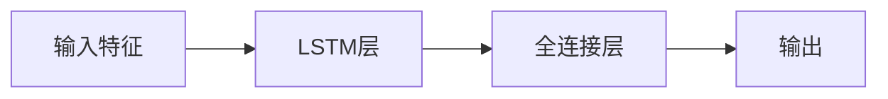
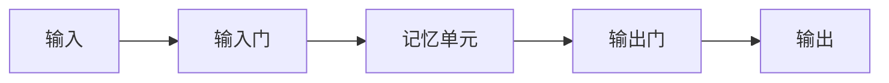

                 

## 第三章: 投资决策中的数据与特征工程

### 3.1 投资数据的分类与处理

#### 3.1.1 数据分类
投资数据主要分为三类：市场数据、公司基本面数据和新闻数据。

- **市场数据**：包括股票价格、成交量等实时数据，通常用于技术分析。
- **公司基本面数据**：如财务报表数据，包括收入、利润等，用于基本面分析。
- **新闻数据**：包括公司公告、行业新闻等，用于分析市场情绪。

#### 3.1.2 数据清洗与预处理
数据清洗是处理脏数据的过程，常见的步骤包括处理缺失值、异常值和重复值。

- **缺失值处理**：可以使用均值、中位数填充，或删除相关数据。
- **异常值处理**：使用Z-score或IQR方法检测并处理异常值。
- **重复值处理**：直接删除重复数据。

预处理还包括标准化和归一化。例如，标准化使用Z-score公式：

$$ Z = \frac{x - \mu}{\sigma} $$

归一化使用Min-Max公式：

$$ X_{\text{norm}} = \frac{X - X_{\text{min}}}{X_{\text{max}} - X_{\text{min}}} $$

#### 3.1.3 数据特征提取
特征工程是将原始数据转换为有用的特征。例如，从价格数据中提取动量：

$$ \text{动量} = \frac{\text{当前价格}}{\text{过去价格}} $$

### 3.2 特征工程在投资中的重要性

#### 3.2.1 特征工程的定义
特征工程是通过构建和选择特征来提高模型性能的过程。

#### 3.2.2 投资相关特征的构建
构建有用的特征是投资决策的关键。例如，使用技术指标RSI（相对强弱指数）：

$$ RSI = \frac{100 - \frac{S}{A + S} \times 100} $$

其中，S是上涨幅度，A是下跌幅度。

#### 3.2.3 特征选择与优化
使用LASSO回归进行特征选择：

$$ LASSO = \sum \alpha |\beta_i| + \text{损失函数} $$

### 3.3 特征工程的应用案例

#### 3.3.1 股票价格预测案例
使用LSTM模型，结合技术指标作为特征。模型结构如下：

### 第四章: 人工智能在投资决策中的核心算法

#### 4.1 机器学习算法在投资中的应用

##### 4.1.1 线性回归与逻辑回归

- **线性回归**：用于预测连续变量，如股票价格。
- **逻辑回归**：用于分类问题，如判断股票是否会上涨。

##### 4.1.2 支持向量机（SVM）

适用于分类和回归问题，尤其适合高维数据。

##### 4.1.3 随机森林与XGBoost

集成学习方法，用于特征重要性分析和高精度预测。

#### 4.2 深度学习算法在投资中的应用

##### 4.2.1 LSTM网络

适用于时间序列预测，模型结构如下：

##### 4.2.2 Transformer架构

用于文本分析，通过自注意力机制捕捉长距离依赖。

#### 4.3 集成学习与超参数调优

通过集成学习提高模型鲁棒性，使用网格搜索优化超参数。

### 小结

本章详细探讨了人工智能在投资决策中的数据处理和特征工程，以及核心算法的应用。通过实际案例展示了如何利用这些技术进行股票预测和风险管理，帮助读者理解如何在投资中有效应用人工智能技术。

