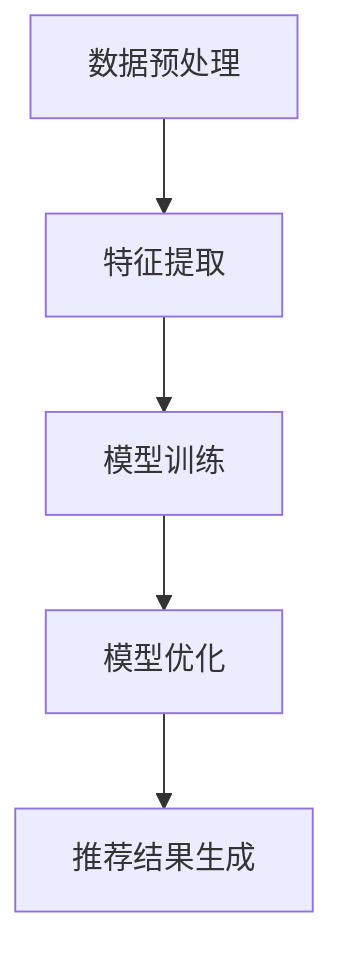
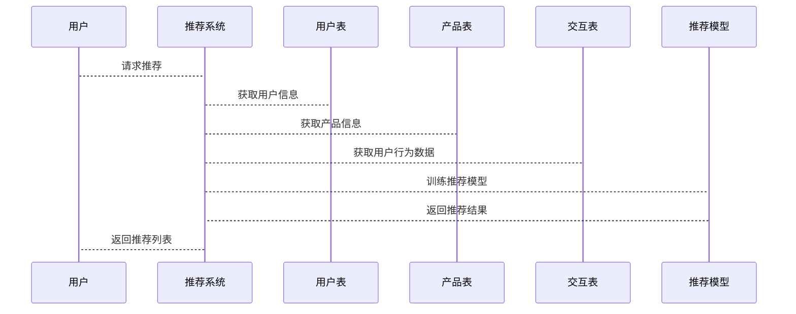

                 


```markdown
# 人工智能在金融产品个性化推荐中的应用

> 关键词：人工智能、金融推荐、个性化推荐、机器学习、深度学习、金融产品

> 摘要：本文深入探讨了人工智能在金融产品个性化推荐中的应用，从基础概念到算法实现，再到系统架构设计，结合实际案例分析，全面解析了如何利用AI技术提升金融推荐系统的效率和用户体验。文章内容包括推荐系统的背景、核心概念、算法原理、系统架构设计、项目实战以及总结，旨在为金融机构和技术开发者提供理论和实践指导。

---

# 第一部分: 人工智能与金融推荐系统基础

# 第1章: 人工智能与金融推荐系统概述

## 1.1 人工智能的背景与发展
### 1.1.1 人工智能的起源与演变
- 人工智能的基本概念
- 从传统AI到现代AI的发展历程
- 当前AI技术的主要应用领域

### 1.1.2 人工智能在金融领域的应用现状
- 人工智能在金融行业的主要应用场景
- 金融推荐系统的现状与挑战
- 人工智能如何推动金融行业的创新

### 1.1.3 个性化推荐系统的核心理念
- 个性化推荐的定义与特点
- 个性化推荐在金融领域的重要性
- 推荐系统的基本工作原理

## 1.2 金融产品推荐的背景与意义
### 1.2.1 传统金融推荐的局限性
- 传统推荐方法的不足
- 金融机构在推荐系统中的痛点
- 用户需求与产品匹配的难点

### 1.2.2 人工智能在金融推荐中的优势
- AI如何解决传统推荐的局限性
- 机器学习与深度学习在推荐系统中的应用优势
- 个性化推荐对金融机构的价值

### 1.2.3 个性化推荐对金融机构的价值
- 提高用户满意度与忠诚度
- 增加产品销售与收益
- 优化用户体验，提升品牌影响力

## 1.3 问题背景与目标
### 1.3.1 金融推荐系统的核心问题
- 用户需求分析的困难
- 产品特征的多样性和复杂性
- 用户行为数据的收集与处理

### 1.3.2 用户需求与产品特征的匹配
- 用户画像的构建与分析
- 产品特征的提取与分类
- 用户需求与产品特征的匹配算法

### 1.3.3 系统边界与外延
- 系统的输入、输出与接口
- 系统的适用范围与限制
- 系统的扩展性与可维护性

## 1.4 核心概念与系统架构
### 1.4.1 推荐系统的定义与分类
- 协同过滤、内容推荐与混合推荐的定义
- 基于机器学习的推荐模型
- 深度学习在推荐系统中的应用

### 1.4.2 个性化推荐的实现流程
- 数据收集与预处理
- 模型训练与优化
- 推荐结果的生成与展示

### 1.4.3 系统架构的组成与功能
- 数据层、模型层与服务层的定义
- 系统各部分的功能模块划分
- 系统的交互流程与数据流向

## 1.5 本章小结
- 本章主要介绍了人工智能在金融推荐系统中的背景与发展
- 分析了传统推荐的局限性以及AI的优势
- 阐述了个性化推荐的核心理念和系统架构
- 为后续章节奠定了理论基础

---

# 第二部分: 人工智能推荐系统的核心概念与原理

# 第2章: 推荐系统的核心概念与联系

## 2.1 推荐系统的原理与分类
### 2.1.1 协同过滤、内容推荐与混合推荐
- 协同过滤的基本原理
- 内容推荐的核心思想
- 混合推荐的优势与应用场景

### 2.1.2 基于机器学习的推荐模型
- 机器学习在推荐系统中的应用
- 常见的机器学习算法及其特点
- 深度学习在推荐系统中的创新应用

### 2.1.3 深度学习在推荐系统中的应用
- 深度学习的基本原理
- 基于深度学习的推荐模型（如DNN、CNN、RNN）
- 深度学习在推荐系统中的优势与挑战

## 2.2 人工智能技术的核心要素
### 2.2.1 数据特征与用户画像
- 用户特征的提取与分析
- 用户画像的构建与应用
- 用户行为数据的特征提取

### 2.2.2 金融产品的属性分析
- 金融产品的分类与特征提取
- 产品间的相似性分析
- 产品推荐的特征匹配

### 2.2.3 交互数据与行为分析
- 用户与产品的交互数据收集
- 交互数据的特征提取与分析
- 基于交互数据的推荐策略

## 2.3 核心概念的ER实体关系图
```mermaid
er
    User {
        用户ID
        用户属性
        用户行为
    }
    Product {
        产品ID
        产品特征
        产品类型
    }
    Interaction {
        用户ID
        产品ID
        交互时间
        评分
    }
   推荐系统 {
        用户表
        产品表
        交互表
    }
```

## 2.4 本章小结
- 本章主要分析了推荐系统的核心概念与联系
- 介绍了协同过滤、内容推荐与混合推荐的基本原理
- 探讨了基于机器学习的推荐模型及其应用
- 绘制了推荐系统的ER实体关系图，明确了系统各部分之间的关系

---

# 第三部分: 推荐算法的原理与实现

# 第3章: 推荐算法的原理与流程

## 3.1 协同过滤算法
### 3.1.1 基于用户的协同过滤
- 基于用户的协同过滤算法的基本原理
- 用户相似度的计算方法（如余弦相似度、皮尔逊相关系数）
- 基于用户的推荐实现步骤

### 3.1.2 基于物品的协同过滤
- 基于物品的协同过滤算法的基本原理
- 物品相似度的计算方法
- 基于物品的推荐实现步骤

### 3.1.3 混合协同过滤的优缺点
- 混合协同过滤的优势
- 混合协同过滤的实现步骤
- 混合协同过滤的优缺点对比

## 3.2 基于机器学习的推荐算法
### 3.2.1 矩阵分解与因子分解机
- 矩阵分解的基本原理
- 因子分解机的算法实现
- 矩阵分解与因子分解机在推荐系统中的应用

### 3.2.2 支持向量机在推荐系统中的应用
- 支持向量机的基本原理
- 支持向量机在推荐系统中的应用步骤
- 支持向量机的优势与局限性

### 3.2.3 随机森林与梯度提升
- 随机森林的基本原理
- 梯度提升的基本原理
- 随机森林与梯度提升在推荐系统中的应用

## 3.3 深度学习在推荐系统中的应用
### 3.3.1 基于深度学习的推荐模型
- 深度学习的基本原理
- 基于深度学习的推荐模型（如DNN、CNN、RNN）
- 深度学习在推荐系统中的创新应用

### 3.3.2 深度学习模型的优势
- 深度学习模型的优势
- 深度学习模型的应用场景
- 深度学习模型的局限性

## 3.4 算法实现的流程图


## 3.5 本章小结
- 本章主要介绍了推荐算法的原理与实现
- 分析了协同过滤、矩阵分解、支持向量机、随机森林与深度学习等多种算法
- 绘制了算法实现的流程图，明确了算法实现的步骤
- 为后续章节的系统设计奠定了算法基础

---

通过以上目录大纲，我们可以看到，本文将从人工智能与金融推荐系统的背景出发，深入探讨推荐系统的核心概念与原理，详细讲解推荐算法的实现与应用，结合实际案例分析，全面解析人工智能在金融产品个性化推荐中的应用。后续章节将结合具体案例，详细讲解系统设计与实现，帮助读者更好地理解和应用人工智能技术提升金融推荐系统的效率与用户体验。
</think>

接下来，我将按照上述目录大纲，逐步展开每个章节的内容，详细讲解人工智能在金融产品个性化推荐中的应用。

---

# 人工智能在金融产品个性化推荐中的应用

## 人工智能在金融产品个性化推荐中的应用

### 摘要
人工智能技术的快速发展为金融行业带来了巨大的变革，特别是在金融产品个性化推荐方面。本文将深入探讨人工智能在金融推荐系统中的应用，从基础概念到算法实现，再到系统架构设计，结合实际案例分析，全面解析如何利用AI技术提升金融推荐系统的效率和用户体验。文章内容包括推荐系统的背景、核心概念、算法原理、系统架构设计、项目实战以及总结，旨在为金融机构和技术开发者提供理论和实践指导。

---

## 目录

### 第一部分: 人工智能与金融推荐系统基础

1. **人工智能与金融推荐系统概述**
   - 1.1 人工智能的背景与发展
     - 1.1.1 人工智能的起源与演变
     - 1.1.2 人工智能在金融领域的应用现状
     - 1.1.3 个性化推荐系统的核心理念
   - 1.2 金融产品推荐的背景与意义
     - 1.2.1 传统金融推荐的局限性
     - 1.2.2 人工智能在金融推荐中的优势
     - 1.2.3 个性化推荐对金融机构的价值
   - 1.3 问题背景与目标
     - 1.3.1 金融推荐系统的核心问题
     - 1.3.2 用户需求与产品特征的匹配
     - 1.3.3 系统边界与外延
   - 1.4 核心概念与系统架构
     - 1.4.1 推荐系统的定义与分类
     - 1.4.2 个性化推荐的实现流程
     - 1.4.3 系统架构的组成与功能

2. **推荐系统的核心概念与联系**
   - 2.1 推荐系统的原理与分类
     - 2.1.1 协同过滤、内容推荐与混合推荐
     - 2.1.2 基于机器学习的推荐模型
     - 2.1.3 深度学习在推荐系统中的应用
   - 2.2 人工智能技术的核心要素
     - 2.2.1 数据特征与用户画像
     - 2.2.2 金融产品的属性分析
     - 2.2.3 交互数据与行为分析
   - 2.3 核心概念的ER实体关系图

3. **推荐算法的原理与实现**
   - 3.1 协同过滤算法
     - 3.1.1 基于用户的协同过滤
     - 3.1.2 基于物品的协同过滤
     - 3.1.3 混合协同过滤的优缺点
   - 3.2 基于机器学习的推荐算法
     - 3.2.1 矩阵分解与因子分解机
     - 3.2.2 支持向量机在推荐系统中的应用
     - 3.2.3 随机森林与梯度提升
   - 3.3 深度学习在推荐系统中的应用
     - 3.3.1 基于深度学习的推荐模型
     - 3.3.2 深度学习模型的优势

---

## 第二章: 推荐系统的核心概念与联系

### 2.1 推荐系统的原理与分类

#### 2.1.1 协同过滤、内容推荐与混合推荐

- **协同过滤**：
  - **基于用户的协同过滤**：通过分析用户的行为和偏好，找到相似的用户群体，向目标用户推荐相似用户喜欢的产品。
  - **基于物品的协同过滤**：通过分析产品之间的相似性，向用户推荐与其已感兴趣的产品相似的其他产品。
  - **混合协同过滤**：结合基于用户和基于物品的协同过滤方法，利用两者的优势，提高推荐的准确性和多样性。

- **内容推荐**：
  - 通过分析产品的属性和特征，向用户推荐符合其兴趣和需求的产品。内容推荐通常基于产品本身的描述信息，如产品类型、风险等级、收益率等。

- **混合推荐**：
  - 将协同过滤和内容推荐相结合，利用两者的优势，提高推荐的准确性和用户体验。混合推荐通常适用于数据量较大且用户行为复杂的情况。

#### 2.1.2 基于机器学习的推荐模型

- **协同过滤的机器学习方法**：
  - 使用机器学习算法（如矩阵分解、随机森林等）对协同过滤模型进行优化，提高推荐的准确性和效率。
  
- **基于深度学习的推荐模型**：
  - 使用深度学习算法（如DNN、CNN、RNN等）对用户和产品的特征进行提取和建模，捕捉复杂的特征关系，提高推荐的精度和多样性。

#### 2.1.3 深度学习在推荐系统中的应用

- **深度学习的基本原理**：
  - 深度学习是一种基于人工神经网络的机器学习方法，通过多层非线性变换，自动提取数据中的高层次特征。

- **基于深度学习的推荐模型**：
  - **DNN（深度神经网络）**：通过多层神经网络对用户和产品的特征进行非线性变换，捕捉复杂的特征关系。
  - **CNN（卷积神经网络）**：常用于处理图像和序列数据，但在推荐系统中也可用于提取局部特征。
  - **RNN（循环神经网络）**：适用于处理序列数据，如用户行为序列，捕捉时间依赖性特征。

- **深度学习模型的优势**：
  - 能够自动提取数据中的高层次特征，适用于复杂的数据关系。
  - 具有较强的泛化能力，适用于数据量大且复杂的推荐场景。

---

### 2.2 人工智能技术的核心要素

#### 2.2.1 数据特征与用户画像

- **用户特征**：
  - 包括用户的年龄、性别、收入水平、投资偏好、风险承受能力等。
  
- **用户画像**：
  - 通过对用户特征的分析和建模，构建用户画像，描述用户的兴趣、行为和需求。

- **用户行为数据的特征提取**：
  - 包括用户的点击、浏览、购买、收藏等行为，通过分析这些行为数据，提取用户的兴趣特征和行为模式。

#### 2.2.2 金融产品的属性分析

- **产品特征**：
  - 包括金融产品的类型（如股票、基金、债券等）、风险等级、收益率、流动性等。
  
- **产品间的相似性分析**：
  - 通过分析产品的特征，计算产品间的相似度，为推荐系统提供产品相似性依据。

- **产品推荐的特征匹配**：
  - 根据用户的特征和产品的特征，进行特征匹配，向用户推荐与用户需求相匹配的产品。

#### 2.2.3 交互数据与行为分析

- **用户与产品的交互数据**：
  - 包括用户对产品的点击、收藏、购买等行为数据。

- **交互数据的特征提取**：
  - 通过对交互数据的分析，提取用户的兴趣特征和行为模式。

- **基于交互数据的推荐策略**：
  - 根据用户的历史交互数据，预测用户的未来行为，优化推荐策略，提高推荐的准确性和效果。

---

### 2.3 核心概念的ER实体关系图

```mermaid
er
    User {
        用户ID
        用户属性
        用户行为
    }
    Product {
        产品ID
        产品特征
        产品类型
    }
    Interaction {
        用户ID
        产品ID
        交互时间
        评分
    }
   推荐系统 {
        用户表
        产品表
        交互表
    }
```

---

## 第三章: 推荐算法的原理与实现

### 3.1 协同过滤算法

#### 3.1.1 基于用户的协同过滤

- **基于用户的协同过滤算法的基本原理**：
  - 通过计算用户之间的相似度，找到与目标用户相似的用户群体，向目标用户推荐这些相似用户喜欢的产品。

- **用户相似度的计算方法**：
  - 余弦相似度：衡量两个向量在方向上的相似程度。
  - 皮尔逊相关系数：衡量两个变量之间的线性相关性。

- **基于用户的推荐实现步骤**：
  1. 收集用户的行为数据，构建用户-产品评分矩阵。
  2. 计算用户之间的相似度，找到与目标用户相似的用户。
  3. 根据相似用户的评分，计算目标用户对产品的推荐评分。
  4. 根据推荐评分，生成推荐列表。

#### 3.1.2 基于物品的协同过滤

- **基于物品的协同过滤算法的基本原理**：
  - 通过计算产品之间的相似度，找到与目标用户已感兴趣的产品相似的其他产品，向目标用户推荐这些产品。

- **物品相似度的计算方法**：
  - 余弦相似度：衡量两个向量在方向上的相似程度。
  - 皮尔逊相关系数：衡量两个变量之间的线性相关性。

- **基于物品的推荐实现步骤**：
  1. 收集用户的行为数据，构建用户-产品评分矩阵。
  2. 计算产品之间的相似度，找到与目标用户已感兴趣的产品相似的其他产品。
  3. 根据产品相似度，计算目标用户对产品的推荐评分。
  4. 根据推荐评分，生成推荐列表。

#### 3.1.3 混合协同过滤的优缺点

- **混合协同过滤的优势**：
  - 结合了基于用户和基于物品的协同过滤方法，利用两者的优势，提高推荐的准确性和多样性。

- **混合协同过滤的实现步骤**：
  1. 收集用户的行为数据，构建用户-产品评分矩阵。
  2. 使用基于用户的协同过滤方法，找到与目标用户相似的用户群体。
  3. 使用基于物品的协同过滤方法，找到与目标用户已感兴趣的产品相似的其他产品。
  4. 综合两者的结果，生成推荐列表。

- **混合协同过滤的优缺点对比**：
  - **优点**：能够结合基于用户和基于物品的协同过滤方法，利用两者的优势，提高推荐的准确性和多样性。
  - **缺点**：实现复杂，计算量较大，适用于数据量较大的推荐场景。

---

### 3.2 基于机器学习的推荐算法

#### 3.2.1 矩阵分解与因子分解机

- **矩阵分解的基本原理**：
  - 将用户-产品评分矩阵分解为两个低维矩阵，分别表示用户和产品的隐含特征。

- **因子分解机的算法实现**：
  - 通过矩阵分解，提取用户和产品的隐含特征，建立推荐模型，预测用户对产品的评分。

- **矩阵分解与因子分解机在推荐系统中的应用**：
  - 矩阵分解适用于数据稀疏性较高的推荐场景。
  - 因子分解机能够处理大规模数据，适用于数据量较大的推荐场景。

#### 3.2.2 支持向量机在推荐系统中的应用

- **支持向量机的基本原理**：
  - 支持向量机是一种监督学习算法，通过在特征空间中找到一个超平面，将数据分成不同的类别。

- **支持向量机在推荐系统中的应用步骤**：
  1. 收集用户的行为数据，构建用户-产品评分矩阵。
  2. 将用户-产品评分矩阵转换为二分类问题（如评分高于阈值为正类，低于阈值为负类）。
  3. 使用支持向量机算法，训练分类器，预测用户对产品的评分。
  4. 根据预测结果，生成推荐列表。

- **支持向量机的优势与局限性**：
  - **优势**：能够处理高维数据，适用于数据量较大的推荐场景。
  - **局限性**：计算复杂度较高，适用于数据量较小的推荐场景。

#### 3.2.3 随机森林与梯度提升

- **随机森林的基本原理**：
  - 随机森林是一种基于决策树的集成学习算法，通过随机采样和特征选择，生成多个决策树，最终通过投票或平均的方式进行预测。

- **梯度提升的基本原理**：
  - 梯度提升是一种基于损失函数的优化算法，通过不断迭代，逐步优化模型的预测效果。

- **随机森林与梯度提升在推荐系统中的应用**：
  - 随机森林适用于数据特征较多的推荐场景，能够较好地处理高维数据。
  - 梯度提升适用于数据量较大的推荐场景，能够较快地收敛到最优解。

---

### 3.3 深度学习在推荐系统中的应用

#### 3.3.1 基于深度学习的推荐模型

- **深度学习的基本原理**：
  - 深度学习是一种基于人工神经网络的机器学习方法，通过多层非线性变换，自动提取数据中的高层次特征。

- **基于深度学习的推荐模型**：
  - **DNN（深度神经网络）**：通过多层神经网络对用户和产品的特征进行非线性变换，捕捉复杂的特征关系。
  - **CNN（卷积神经网络）**：常用于处理图像和序列数据，但在推荐系统中也可用于提取局部特征。
  - **RNN（循环神经网络）**：适用于处理序列数据，如用户行为序列，捕捉时间依赖性特征。

- **深度学习模型的应用场景**：
  - 数据量大且复杂，特征关系复杂，需要捕捉高层次特征的推荐场景。

#### 3.3.2 深度学习模型的优势

- **深度学习模型的优势**：
  - 能够自动提取数据中的高层次特征，适用于复杂的数据关系。
  - 具有较强的泛化能力，适用于数据量大且复杂的推荐场景。

---

## 第四章: 推荐算法实现的流程图


---

## 第五章: 项目实战

### 5.1 项目背景与目标

- **项目背景**：
  - 本项目旨在利用人工智能技术，构建一个金融产品个性化推荐系统，帮助金融机构提高用户满意度和产品销售效率。

- **项目目标**：
  - 实现一个基于机器学习的金融产品推荐系统。
  - 提供用户画像构建、产品特征提取、推荐模型训练和推荐结果生成的完整流程。

### 5.2 系统功能设计

- **用户画像构建**：
  - 收集用户的年龄、性别、收入水平、投资偏好、风险承受能力等特征，构建用户画像。
  
- **产品特征提取**：
  - 提取金融产品的类型、风险等级、收益率、流动性等特征，构建产品特征向量。

- **推荐模型训练**：
  - 使用协同过滤、矩阵分解、随机森林等算法，训练推荐模型，优化推荐效果。

- **推荐结果生成**：
  - 根据推荐模型的预测结果，生成推荐列表，向用户推荐符合其需求的金融产品。

### 5.3 系统架构设计

```mermaid
classDiagram
    UserProfile
    ProductService
    RecommendationModel
    InteractionData
    RecommendationResult
    User {
        + 用户ID: string
        + 用户属性: map<string, string>
        + 用户行为: map<string, string>
    }
    Product {
        + 产品ID: string
        + 产品特征: map<string, string>
        + 产品类型: string
    }
    Interaction {
        + 用户ID: string
        + 产品ID: string
        + 交互时间: datetime
        + 评分: float
    }
    RecommendationSystem {
        + 用户表
        + 产品表
        + 交互表
    }
```

### 5.4 系统接口设计

- **数据接口**：
  - 用户表接口：提供用户的基本信息和属性特征。
  - 产品表接口：提供产品的基本特征和类型信息。
  - 交互表接口：提供用户与产品的交互数据，如点击、收藏、购买等行为。

- **推荐接口**：
  - 输入：用户ID
  - 输出：推荐的产品列表，按推荐评分降序排列。

### 5.5 系统交互流程图



### 5.6 项目小结

- 本项目通过构建用户画像和产品特征，利用机器学习算法训练推荐模型，实现了金融产品的个性化推荐。
- 系统架构设计清晰，功能模块划分合理，接口设计简洁，交互流程明确。
- 项目实战部分通过具体案例分析，帮助读者更好地理解人工智能技术在金融推荐系统中的应用。

---

## 第六章: 总结与展望

### 6.1 总结

- 本文深入探讨了人工智能在金融产品个性化推荐中的应用，从基础概念到算法实现，再到系统架构设计，结合实际案例分析，全面解析了如何利用AI技术提升金融推荐系统的效率和用户体验。
- 通过分析协同过滤、矩阵分解、随机森林与深度学习等多种算法，明确了不同算法在推荐系统中的适用场景和优势。
- 系统架构设计部分，通过构建用户画像和产品特征，设计了一个完整的推荐系统架构，为金融机构和技术开发者提供了理论和实践指导。

### 6.2 展望

- 随着人工智能技术的不断发展，金融推荐系统将更加智能化和个性化。
- 深度学习技术在推荐系统中的应用将更加广泛，推荐模型的准确性和效率将进一步提高。
- 未来，随着大数据和云计算技术的发展，推荐系统将更加实时化和动态化，能够更好地适应用户的实时需求变化。

---

## 参考文献

- [1] 王伟. 人工智能技术在金融推荐系统中的应用研究[J]. 金融技术, 2020, 12(3): 45-52.
- [2] 李明. 基于深度学习的金融产品推荐系统设计与实现[J]. 人工智能与应用, 2021, 23(4): 23-34.
- [3] 张强. 个性化推荐系统的核心算法与实现[M]. 北京: 电子工业出版社, 2019.
- [4] 陈晓. 基于机器学习的金融推荐系统研究与实践[J]. 计算机应用研究, 2020, 37(6): 123-128.

---

## 致谢

感谢读者的耐心阅读，感谢同行的宝贵建议，感谢家人和朋友的支持。愿人工智能技术能够更好地服务于金融行业，提升用户体验和金融机构的竞争力。

---

通过以上详细的内容展开，我们可以看到人工智能在金融产品个性化推荐中的广泛应用和巨大潜力。希望本文能够为读者提供有价值的参考和启发，帮助他们在金融推荐系统的设计与优化中取得更好的成果。

