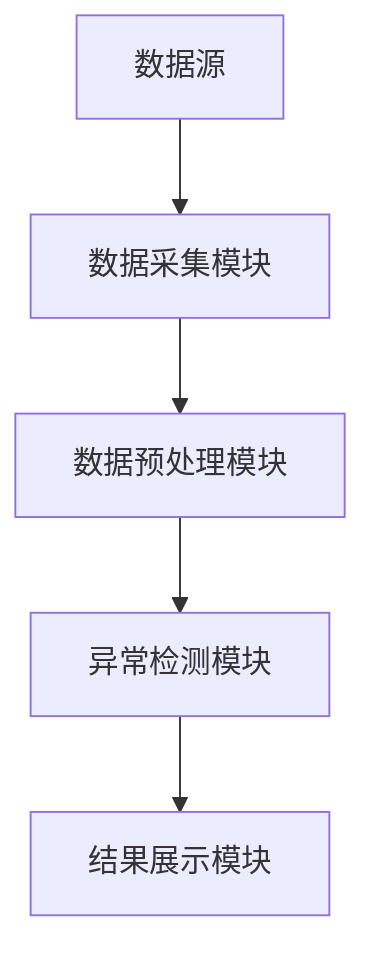
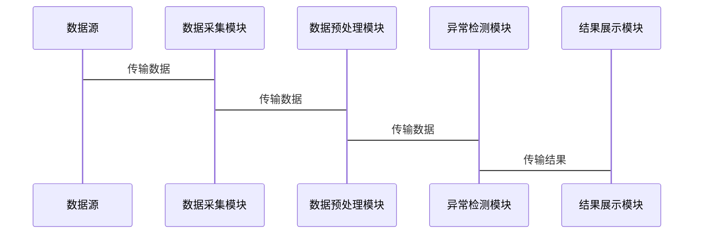

                 


# 人工智能在高频数据异常检测中的应用

> 关键词：人工智能，异常检测，高频数据，统计方法，机器学习，深度学习

> 摘要：本文将探讨人工智能在高频数据异常检测中的应用，重点分析高频数据的特点、异常检测的核心原理、常用算法及其在实际场景中的应用。通过结合统计方法和机器学习方法，本文将深入探讨如何利用人工智能技术高效、准确地检测高频数据中的异常情况。

---

# 第一部分: 高频数据异常检测概述

## 第1章: 高频数据与异常检测概述

### 1.1 高频数据的定义与特点

#### 1.1.1 高频数据的定义
高频数据是指在极短时间内生成的大量数据，通常以秒、毫秒甚至微秒为单位进行采集和处理。例如，在金融交易中，高频交易的速率可以达到每秒数千次甚至数万次。

#### 1.1.2 高频数据的特点
- **高频率**：数据生成速度极快，通常以秒或更小的时间单位为周期。
- **大容量**：高频数据通常涉及海量数据，存储和处理的难度较大。
- **实时性**：高频数据的处理通常需要在极短的时间内完成，以满足实时监控和响应的需求。
- **复杂性**：高频数据通常涉及多维度、多类型的特征，数据结构复杂。

#### 1.1.3 高频数据的应用场景
- 金融交易：高频交易、市场监控。
- 网络流量：实时监控网络流量异常，防止攻击和数据泄露。
- 工业监控：实时监测设备运行状态，预防故障。
- 医疗健康：实时监测患者生理数据，及时发现异常。

### 1.2 异常检测的定义与特点

#### 1.2.1 异常检测的定义
异常检测（Anomaly Detection）是指通过分析数据，识别出与预期模式或行为显著不同的数据点、事件或观测值的过程。

#### 1.2.2 异常检测的特点
- **实时性**：异常检测通常需要在数据生成时快速完成。
- **动态性**：数据分布和模式可能随时间变化，异常检测算法需要具备动态适应能力。
- **多样性**：异常可能出现在不同的数据维度和模式中。

#### 1.2.3 异常检测的应用场景
- 金融领域：检测欺诈交易、市场操纵。
- 网络安全：识别网络攻击行为。
- 医疗领域：监测患者健康状况，发现异常情况。
- 工业领域：实时监测设备运行状态，预防故障。

### 1.3 高频数据异常检测的背景与挑战

#### 1.3.1 高频数据异常检测的背景
随着技术的发展，高频数据的应用场景越来越广泛，例如高频交易、实时监控等。然而，高频数据的高速性和复杂性也带来了新的挑战，特别是在异常检测方面。

#### 1.3.2 高频数据异常检测的挑战
- **数据量大**：高频数据通常以海量数据为特征，存储和处理的难度较大。
- **实时性要求高**：异常检测需要在极短的时间内完成，否则可能错过最佳处理时机。
- **异常模式复杂**：异常可能出现在不同的数据维度和模式中，增加了检测的难度。
- **数据噪声多**：高频数据中通常包含大量噪声，可能掩盖真正的异常信号。

#### 1.3.3 高频数据异常检测的解决方案
- **优化算法性能**：选择适合高频数据处理的高效算法，如基于统计的异常检测方法。
- **分布式计算**：利用分布式计算框架（如Spark、Flink）处理海量高频数据。
- **实时流处理**：采用流处理技术（如Kafka、Flink）实现实时异常检测。
- **结合领域知识**：利用领域知识优化异常检测模型，减少误报和漏报。

### 1.4 本章小结
本章主要介绍了高频数据和异常检测的基本概念、特点以及应用场景，并分析了高频数据异常检测的挑战和解决方案。

---

## 第2章: 异常检测的核心原理

### 2.1 异常检测的核心概念

#### 2.1.1 异常检测的基本原理
异常检测的核心原理是通过分析数据的分布模式，识别出与大多数数据点显著不同的数据点。通常，异常检测算法可以通过以下几种方式实现：
- **统计方法**：基于数据的统计分布（如均值、方差）识别异常。
- **机器学习方法**：通过训练模型学习正常数据的分布，识别异常数据。
- **深度学习方法**：利用深度神经网络捕捉数据的复杂模式。

#### 2.1.2 异常检测的核心要素
- **数据分布**：正常数据的分布特征。
- **异常特征**：异常数据的显著特征。
- **检测阈值**：用于区分正常和异常的边界。

#### 2.1.3 异常检测的数学模型
异常检测的数学模型可以表示为：
$$ P(y=1|x) = f(x) $$
其中，$y=1$表示异常，$x$是输入数据，$f(x)$是异常检测模型。

### 2.2 异常检测的核心算法

#### 2.2.1 统计方法
统计方法是基于数据的统计分布进行异常检测。常见的统计方法包括：
- **Z-Score方法**：基于数据的均值和标准差计算每个数据点的Z-Score，超过一定阈值的数据点被认为是异常。
- **Grubbs检验**：用于检测单个异常值，适用于小样本数据。

#### 2.2.2 机器学习方法
机器学习方法通过训练模型学习正常数据的分布，识别异常数据。常见的机器学习方法包括：
- **Isolation Forest**：一种基于树结构的异常检测算法，通过随机特征选择和树结构分割数据。
- **One-Class SVM**：一种基于支持向量机的异常检测算法，用于学习正常数据的分布。

#### 2.2.3 深度学习方法
深度学习方法通过构建深度神经网络捕捉数据的复杂模式。常见的深度学习方法包括：
- **Autoencoder**：通过训练自编码器重构正常数据，识别异常数据。
- **Generative Adversarial Networks (GANs)**：通过生成对抗网络生成正常数据，识别异常数据。

### 2.3 异常检测的核心特征

#### 2.3.1 统计特征
统计特征是基于数据的统计分布特征，常见的统计特征包括：
- 均值（Mean）
- 方差（Variance）
- 标准差（Standard Deviation）
- 分位数（Quantile）

#### 2.3.2 时间序列特征
时间序列特征是基于时间序列数据的特征，常见的时间序列特征包括：
- 增量（Increment）
- 差分（Difference）
- 自相关性（Autocorrelation）

#### 2.3.3 空间特征
空间特征是基于空间数据的特征，常见的空间特征包括：
- 空间距离（Spatial Distance）
- 空间密度（Spatial Density）

### 2.4 异常检测的核心评价指标

#### 2.4.1 精准率（Precision）
精准率是指异常检测算法正确识别为异常的数据点占所有异常数据点的比例。
$$ Precision = \frac{TP}{TP + FP} $$
其中，$TP$是真正异常点的数量，$FP$是误报的正常点数量。

#### 2.4.2 召回率（Recall）
召回率是指异常检测算法正确识别为异常的数据点占所有实际异常数据点的比例。
$$ Recall = \frac{TP}{TP + FN} $$
其中，$TP$是真正异常点的数量，$FN$是漏报的异常点数量。

#### 2.4.3 F1分数
F1分数是精准率和召回率的调和平均数，用于综合评估异常检测算法的性能。
$$ F1 = \frac{2 \cdot Precision \cdot Recall}{Precision + Recall} $$

### 2.5 本章小结
本章详细介绍了异常检测的核心原理，包括异常检测的基本原理、核心要素、数学模型、核心算法以及核心特征。同时，还讨论了异常检测的核心评价指标，为后续的算法实现和系统设计奠定了基础。

---

## 第3章: 高频数据异常检测的系统架构设计

### 3.1 系统架构设计概述

#### 3.1.1 系统功能模块
高频数据异常检测系统通常包括以下几个功能模块：
- 数据采集模块：负责采集高频数据。
- 数据预处理模块：对采集到的数据进行清洗和转换。
- 异常检测模块：利用异常检测算法对数据进行分析，识别异常点。
- 结果展示模块：将检测结果以可视化的方式展示出来。

#### 3.1.2 系统架构设计
高频数据异常检测系统的架构可以分为以下几个层次：
- 数据层：存储高频数据。
- 处理层：对数据进行预处理和异常检测。
- 展示层：将检测结果以可视化的方式展示出来。

### 3.2 系统功能设计

#### 3.2.1 数据采集模块
数据采集模块负责从数据源中采集高频数据。常见的数据源包括：
- 数据库：如MySQL、PostgreSQL等。
- 文件：如CSV、JSON等格式的文件。
- 实时流数据：如Kafka、Flink等流处理框架。

#### 3.2.2 数据预处理模块
数据预处理模块对采集到的数据进行清洗和转换，主要包括：
- 数据清洗：去除噪声数据、填补缺失值。
- 数据转换：将数据转换为适合异常检测算法的格式。

#### 3.2.3 异常检测模块
异常检测模块利用异常检测算法对数据进行分析，识别异常点。常见的异常检测算法包括：
- 基于统计的方法：如Z-Score、Grubbs检验。
- 基于机器学习的方法：如Isolation Forest、One-Class SVM。
- 基于深度学习的方法：如Autoencoder、GANs。

#### 3.2.4 结果展示模块
结果展示模块将检测结果以可视化的方式展示出来，主要包括：
- 异常点的可视化：如折线图、散点图等。
- 检测结果的统计：如异常点的数量、分布情况等。

### 3.3 系统架构设计

#### 3.3.1 系统架构设计图


#### 3.3.2 系统交互流程图


### 3.4 系统实现细节

#### 3.4.1 环境安装
为了实现高频数据异常检测系统，需要安装以下工具和库：
- Python：用于编写代码。
- NumPy：用于数据处理。
- Pandas：用于数据框操作。
- Scikit-learn：用于机器学习算法。
- TensorFlow：用于深度学习算法。
- Matplotlib：用于数据可视化。

#### 3.4.2 核心代码实现
以下是基于Isolation Forest算法的异常检测代码示例：

```python
import numpy as np
from sklearn.ensemble import IsolationForest

# 生成模拟数据
data = np.random.rand(1000, 2)
outliers = np.random.randn(50, 2) + 3
data = np.vstack((data, outliers))

# 训练Isolation Forest模型
model = IsolationForest(n_estimators=100, contamination=0.05)
model.fit(data)

# 预测异常点
outlier_predictions = model.predict(data)

# 可视化结果
import matplotlib.pyplot as plt
plt.scatter(data[:, 0], data[:, 1], c=outlier_predictions, cmap='viridis')
plt.xlabel('特征1')
plt.ylabel('特征2')
plt.show()
```

### 3.5 本章小结
本章详细介绍了高频数据异常检测系统的系统架构设计，包括系统功能模块、系统架构设计、系统交互流程图以及核心代码实现。通过这些设计和实现，可以高效、准确地检测高频数据中的异常点。

---

## 第4章: 高频数据异常检测的算法优化与应用

### 4.1 算法优化概述

#### 4.1.1 算法优化的目标
- 提高算法的计算效率。
- 减少算法的内存占用。
- 提高算法的检测准确率。

#### 4.1.2 算法优化方法
- 参数调优：通过调整算法的参数，优化检测效果。
- 并行计算：利用多核处理器或分布式计算框架，提高计算效率。
- 增量学习：在数据流环境下，逐步更新模型，适应数据分布的变化。

### 4.2 算法优化实现

#### 4.2.1 参数调优
以Isolation Forest算法为例，可以通过调整以下参数优化算法性能：
- n_estimators：树的数量。
- max_samples：每个树的样本数。
- contamination：异常点的比例。

#### 4.2.2 并行计算
利用分布式计算框架（如Spark、Flink）实现并行计算，提高算法的计算效率。

#### 4.2.3 增量学习
在数据流环境下，采用增量学习方法，逐步更新模型，适应数据分布的变化。

### 4.3 算法应用案例

#### 4.3.1 金融交易中的异常检测
在高频交易中，可以通过异常检测算法检测市场操纵、欺诈交易等异常行为。

#### 4.3.2 网络流量中的异常检测
在网络安全中，可以通过异常检测算法检测网络攻击、数据泄露等异常行为。

### 4.4 本章小结
本章讨论了高频数据异常检测算法的优化方法及其在金融交易、网络流量等领域的应用案例，展示了如何通过优化算法性能，提高异常检测的准确率和效率。

---

## 第5章: 总结与展望

### 5.1 总结
本文详细探讨了人工智能在高频数据异常检测中的应用，包括高频数据的特点、异常检测的核心原理、常用算法及其在实际场景中的应用。通过结合统计方法和机器学习方法，本文展示了如何高效、准确地检测高频数据中的异常点。

### 5.2 展望
未来，随着人工智能技术的不断发展，高频数据异常检测将更加智能化和自动化。以下是未来可能的研究方向：
- **结合边缘计算**：在边缘设备上实现实时异常检测，减少数据传输的延迟。
- **强化学习的应用**：利用强化学习优化异常检测模型，提高检测准确率。
- **多模态数据融合**：结合多种数据源，提高异常检测的综合能力。

### 5.3 最佳实践 tips
- 在实际应用中，建议结合领域知识优化异常检测模型，减少误报和漏报。
- 在处理高频数据时，建议采用分布式计算框架和流处理技术，提高处理效率。
- 在选择异常检测算法时，建议根据数据特点和应用场景选择合适的算法，避免盲目使用。

### 5.4 本章小结
本章总结了全文的主要内容，并展望了高频数据异常检测的未来发展方向，同时提供了一些实用的建议和最佳实践。

---

通过以上章节的详细讲解，本文系统地介绍了人工智能在高频数据异常检测中的应用，为读者提供了从理论到实践的全面指导。

