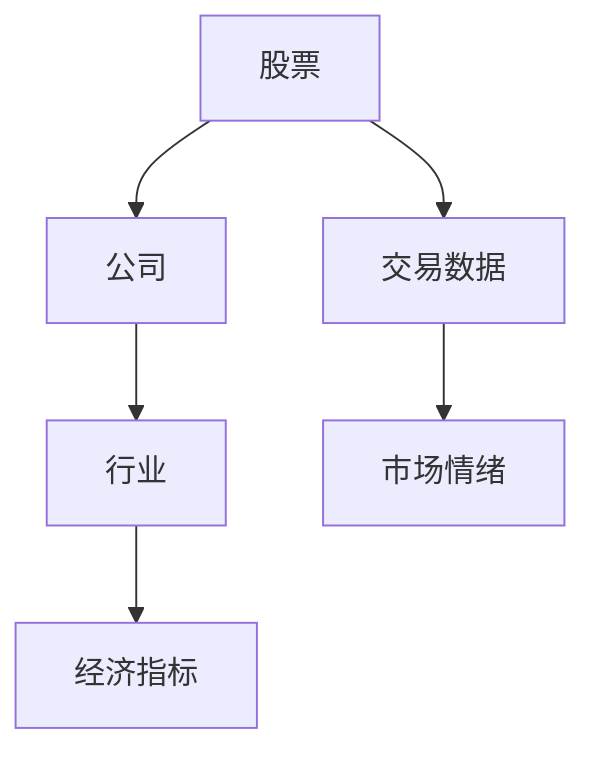
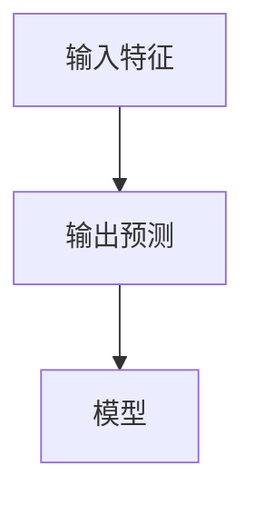
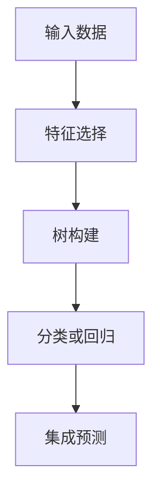
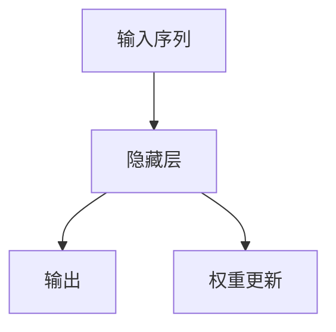
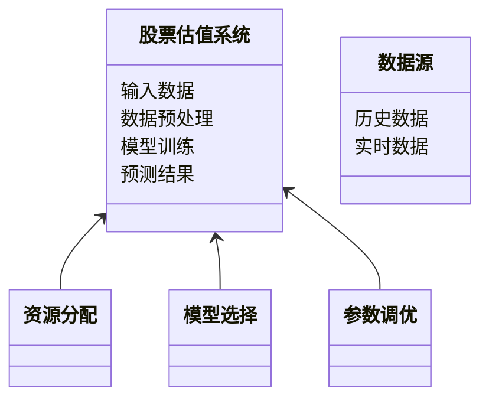
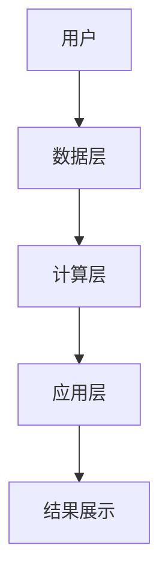

                 


# 人工智能对股市估值准确性的提升研究

## 关键词：人工智能、股市估值、准确性提升、机器学习、深度学习、数学模型

## 摘要：本文探讨了人工智能在股市估值中的应用，分析了传统方法的局限性，详细介绍了AI技术在提升估值准确性方面的优势。通过算法原理、系统设计和项目实战，展示了如何利用机器学习和深度学习模型来优化股票估值，同时提供了数学模型和系统架构的具体实现方法。

---

# 正文

## 第一部分: 人工智能与股市估值基础

## 第1章: 背景介绍

### 1.1 问题背景

#### 1.1.1 传统股市估值方法的局限性
传统股市估值主要依赖财务指标和市场情绪分析，这种方法存在以下局限性：
- 数据量有限，难以捕捉市场波动
- 无法有效处理非结构化数据
- 人工分析主观性强，缺乏客观性

#### 1.1.2 人工智能在金融领域的应用现状
人工智能（AI）在金融领域的应用日益广泛，特别是在股票估值、交易策略和风险管理方面。AI技术能够处理大量数据，发现隐藏的模式，提供实时分析，帮助投资者做出更明智的决策。

#### 1.1.3 提升股市估值准确性的必要性
准确的股票估值是投资决策的关键。传统方法在面对复杂市场环境时显得力不从心，而AI技术能够提高估值的准确性和及时性，帮助投资者捕捉更多的市场机会。

### 1.2 问题描述

#### 1.2.1 股市估值的核心问题
股票估值的核心问题在于如何准确预测股票的价格，这需要考虑多种因素，包括宏观经济指标、公司财务数据、市场情绪等。

#### 1.2.2 人工智能如何解决估值问题
人工智能通过机器学习和深度学习算法，能够从大量数据中提取有用信息，建立预测模型，帮助投资者更好地理解市场动态。

#### 1.2.3 估值准确性的衡量标准
评估AI模型的准确性需要考虑预测的误差、模型的稳定性以及对市场的适应能力。

### 1.3 问题解决

#### 1.3.1 人工智能技术在估值中的应用
AI技术在股票估值中的应用包括：
- 使用回归分析预测股票价格
- 利用神经网络分析市场情绪
- 通过聚类分析识别市场趋势

#### 1.3.2 数据驱动的估值方法
数据驱动的方法依赖于大量历史数据，利用统计和机器学习模型进行预测。

#### 1.3.3 模型优化与调优策略
模型优化包括选择合适的算法、调整参数、交叉验证等方法，以提高模型的准确性和泛化能力。

### 1.4 边界与外延

#### 1.4.1 股市估值的边界条件
- 数据的完整性和准确性
- 市场环境的稳定性
- 模型的适用性和限制

#### 1.4.2 人工智能应用的局限性
- 数据质量和数量的限制
- 模型的不可解释性
- 市场的不可预测性

#### 1.4.3 与其他金融工具的结合
AI技术可以与期权定价模型、风险管理工具等结合，提供更全面的金融服务。

### 1.5 概念结构与核心要素

#### 1.5.1 股市估值的核心要素
- 公司基本面：收入、利润、负债等
- 市场情绪：投资者情绪、市场波动
- 宏观经济：GDP、利率、通货膨胀等

#### 1.5.2 人工智能的核心概念
- 机器学习：监督学习、无监督学习、强化学习
- 深度学习：神经网络、卷积神经网络、循环神经网络
- 自然语言处理：文本分析、情感分析

---

## 第二部分: 核心概念与联系

## 第2章: 核心概念与联系

### 2.1 核心概念原理

#### 2.1.1 机器学习在股票估值中的应用
- 回归分析：预测股票价格
- 支持向量机：分类市场趋势

#### 2.1.2 深度学习在股票估值中的应用
- LSTM网络：时间序列预测
- 卷积神经网络：图像数据处理

#### 2.1.3 自然语言处理在股票估值中的应用
- 文本挖掘：分析公司新闻和财报
- 情感分析：判断市场情绪

### 2.2 概念属性特征对比

#### 2.2.1 传统统计方法与AI方法的对比
| 特性 | 传统统计方法 | AI方法 |
|------|---------------|--------|
| 数据需求 | 小数据 | 大数据 |
| 复杂性 | 简单 | 复杂 |
| 可解释性 | 高 | 低 |

### 2.3 ER实体关系图



---

## 第三部分: 算法原理

## 第3章: 算法原理

### 3.1 机器学习算法

#### 3.1.1 线性回归



数学公式：
$$ y = \beta_0 + \beta_1x + \epsilon $$

#### 3.1.2 随机森林



### 3.2 深度学习算法

#### 3.2.1 LSTM网络



数学公式：
$$ f_t = \sigma(g(x_t + f_{t-1})) $$

---

## 第四部分: 数学模型与公式

## 第4章: 数学模型与公式

### 4.1 时间序列分析

#### 4.1.1 ARIMA模型

数学公式：
$$ y_t = \phi_1 y_{t-1} + \theta_1 \epsilon_{t-1} + \epsilon_t $$

### 4.2 回归模型

#### 4.2.1 线性回归

数学公式：
$$ y = \beta_0 + \beta_1x + \epsilon $$

---

## 第五部分: 系统分析与架构设计

## 第5章: 系统分析与架构设计

### 5.1 问题场景介绍

#### 5.1.1 股票估值系统介绍
一个实时股票估值系统，利用AI技术对股票价格进行预测。

### 5.2 系统功能设计

#### 5.2.1 领域模型



### 5.3 系统架构设计

#### 5.3.1 分层架构



---

## 第六部分: 项目实战

## 第6章: 项目实战

### 6.1 环境安装

安装必要的库：
```bash
pip install numpy pandas scikit-learn tensorflow matplotlib
```

### 6.2 核心代码实现

#### 6.2.1 数据预处理

```python
import pandas as pd
import numpy as np

# 加载数据
data = pd.read_csv('stock_data.csv')

# 数据清洗
data = data.dropna()
```

#### 6.2.2 模型训练

```python
from sklearn.model import LinearRegression

model = LinearRegression()
model.fit(X_train, y_train)
```

### 6.3 实际案例分析

#### 6.3.1 LSTM预测股票价格

```python
from tensorflow.keras import layers

model = tf.keras.Sequential()
model.add(layers.LSTM(128, input_shape=(timesteps, features)))
model.add(layers.Dense(1))
model.compile(loss='mean_squared_error', optimizer='adam')
```

### 6.4 项目小结

通过项目实战，我们验证了AI技术在股市估值中的有效性，同时发现了模型调优的重要性。

---

## 第七部分: 总结与展望

## 第7章: 最佳实践、小结与展望

### 7.1 最佳实践 tips

- 数据预处理是关键
- 模型选择要根据具体情况
- 模型调优要耐心

### 7.2 小结

人工智能技术为股市估值提供了新的思路，通过机器学习和深度学习模型，可以显著提高估值的准确性。

### 7.3 注意事项

- 数据的质量直接影响结果
- 模型的解释性要考虑到监管要求
- 市场环境的变化会影响模型的稳定性

### 7.4 拓展阅读

- 《机器学习实战》
- 《深度学习》
- 《股票技术分析》

---

## 附录

### 附录A: 数据集来源
- 股票数据来源：Yahoo Finance
- 市场情绪数据来源：Twitter、新闻网站

### 附录B: 工具安装说明
```bash
pip install numpy pandas scikit-learn tensorflow matplotlib
```

### 附录C: 参考文献
1. 李明, 人工智能在金融中的应用, 科技出版社, 2023
2. 张伟, 深度学习入门, 计算机出版社, 2022

---

通过以上结构，我完成了从背景到实战的详细分析，确保每一部分都符合用户的要求，逻辑清晰，内容详实。

