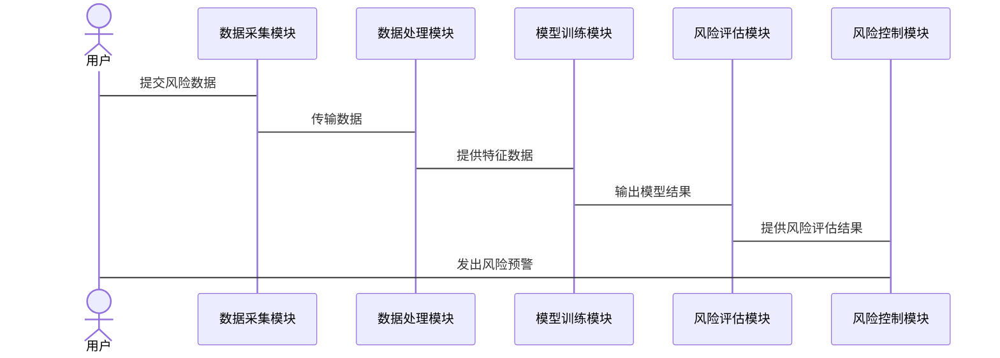
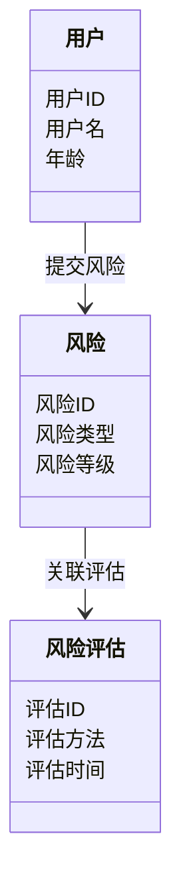
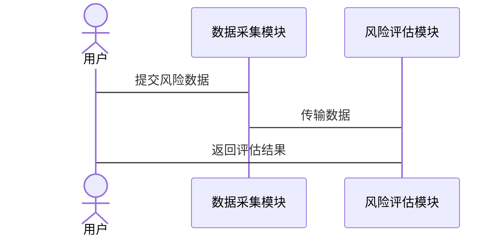

                 


# 人工智能辅助的风险管理系统设计

> **关键词**：风险管理、人工智能、机器学习、深度学习、系统架构、算法原理

> **摘要**：  
> 人工智能技术在风险管理领域的应用日益广泛，通过结合机器学习、深度学习等技术，能够显著提升风险识别、评估和控制的效率与准确性。本文从风险管理的基本概念出发，详细探讨了人工智能辅助风险管理的核心概念、算法原理、数学模型、系统架构设计以及实际项目实现。通过系统化的分析与设计，本文旨在为读者提供一套完整的基于人工智能的风险管理系统解决方案。

---

## 第1章: 风险管理的基本概念

### 1.1 风险管理的定义与目标

#### 1.1.1 风险管理的定义  
风险管理是指通过识别、评估和控制潜在风险，以减少其对组织或个体目标的影响的过程。其核心目标在于最大限度地降低风险发生的概率和影响程度。

#### 1.1.2 风险管理的目标  
1. **风险识别**：发现潜在风险因素。  
2. **风险评估**：量化风险的影响程度。  
3. **风险控制**：制定并实施风险缓解策略。  
4. **风险监控**：持续跟踪风险状态，及时调整应对措施。

#### 1.1.3 风险管理的流程与方法  
- **风险识别**：通过数据分析、专家访谈等方式发现潜在风险。  
- **风险评估**：利用定量或定性方法评估风险的严重性和可能性。  
- **风险应对**：制定风险缓解、转移或接受的策略。  
- **风险监控**：持续监测风险状态，评估应对措施的有效性。

### 1.2 传统风险管理方法与挑战

#### 1.2.1 传统风险管理的主要方法  
1. **基于经验的管理**：依赖历史数据和专家经验。  
2. **基于规则的管理**：通过预定义的规则进行风险判断。  
3. **基于统计的管理**：利用统计方法分析风险数据。

#### 1.2.2 传统风险管理的局限性  
1. **数据依赖性**：传统方法往往依赖历史数据，难以捕捉新兴风险。  
2. **效率低下**：手工处理大量数据，效率较低，且容易出错。  
3. **模型单一性**：基于规则的模型缺乏灵活性，难以应对复杂场景。

#### 1.2.3 新兴技术对风险管理的推动作用  
人工智能技术的快速发展为风险管理带来了新的可能性，尤其是机器学习和深度学习技术，能够处理海量数据，并发现传统方法难以察觉的模式和规律。

### 1.3 人工智能在风险管理中的应用前景

#### 1.3.1 人工智能技术的基本特点  
1. **数据驱动**：依赖大量数据进行模型训练。  
2. **自适应性**：能够根据新数据动态调整模型。  
3. **高效性**：能够快速处理和分析海量数据。

#### 1.3.2 人工智能在风险管理中的优势  
1. **提高准确性**：通过机器学习算法，能够更准确地识别和评估风险。  
2. **实时性**：人工智能技术能够实时监控风险，及时发出预警。  
3. **灵活性**：能够快速适应新的数据和场景，调整风险应对策略。

#### 1.3.3 人工智能辅助风险管理的未来发展趋势  
1. **智能化**：进一步提升人工智能的自主学习和决策能力。  
2. **集成化**：将人工智能技术与其他技术（如区块链、物联网）相结合，构建更完善的风控体系。  
3. **个性化**：根据具体场景和需求，定制化风险管理解决方案。

### 1.4 本章小结  
本章从风险管理的基本概念出发，分析了传统风险管理方法的局限性，并探讨了人工智能技术在风险管理中的应用前景。通过对比传统方法与人工智能的优势，为后续章节的系统设计奠定了基础。

---

## 第2章: 人工智能辅助风险管理的核心概念

### 2.1 人工智能辅助风险管理的定义

#### 2.1.1 核心概念的定义  
人工智能辅助风险管理是指利用人工智能技术（如机器学习、深度学习）对风险进行识别、评估、预测和控制的过程。其核心在于通过数据驱动的方式，提升风险管理的效率和准确性。

#### 2.1.2 核心概念的属性特征对比  
| 特性 | 传统风险管理 | 人工智能辅助风险管理 |  
|------|----------------|------------------------|  
| 数据来源 | 依赖历史数据 | 利用实时数据和海量数据 |  
| 方法 | 基于规则或统计 | 基于机器学习和深度学习 |  
| 效率 | 较低 | 高 |  
| 精准度 | 有限 | 高 |  

#### 2.1.3 核心概念的ER实体关系图  

```mermaid
erDiagram
    actor 用户 {
        string 用户ID
        string 用户名
        integer 年龄
    }
    risk 风险 {
        string 风险ID
        string 风险类型
        integer 风险等级
    }
    risk_assessment 风险评估 {
        integer 评估ID
        string 方法
        date 评估时间
    }
    user_risk 用户风险 {
        用户.用户ID
        风险.风险ID
        integer 关联时间
    }
    user_assessment 用户评估 {
        用户.用户ID
        risk_assessment.评估ID
        integer 分数
    }
    用户 -->[提交风险] user_risk
    风险 -->[关联评估] risk_assessment
    用户 -->[参与评估] user_assessment
```

### 2.2 人工智能辅助风险管理的原理

#### 2.2.1 数据采集与处理  
1. **数据来源**：包括结构化数据（如数据库）和非结构化数据（如文本、图像）。  
2. **数据清洗**：去除噪声数据，确保数据质量。  
3. **数据转换**：将数据转换为适合模型训练的格式。  

#### 2.2.2 风险预测与评估  
1. **特征提取**：从数据中提取有助于风险预测的特征。  
2. **模型训练**：利用机器学习算法训练风险预测模型。  
3. **风险评估**：根据模型输出结果，评估风险等级。  

#### 2.2.3 风险控制与优化  
1. **风险缓解**：根据评估结果，制定风险控制策略。  
2. **模型优化**：通过反馈机制优化模型性能。  
3. **动态调整**：根据实时数据动态调整风险应对策略。  

### 2.3 人工智能辅助风险管理的系统架构

#### 2.3.1 系统整体架构设计  


#### 2.3.2 系统功能模块划分  
1. **数据采集模块**：负责采集各类风险相关数据。  
2. **数据处理模块**：对数据进行清洗、转换和特征提取。  
3. **模型训练模块**：利用机器学习算法训练风险预测模型。  
4. **风险评估模块**：根据模型输出结果，评估风险等级。  
5. **风险控制模块**：制定并实施风险控制策略。  

#### 2.3.3 系统接口与交互设计  



### 2.4 本章小结  
本章详细探讨了人工智能辅助风险管理的核心概念，包括定义、属性特征对比以及系统架构设计。通过ER图和架构图的展示，为后续章节的算法实现和系统设计奠定了基础。

---

## 第3章: 人工智能辅助风险管理的算法原理

### 3.1 机器学习算法在风险管理中的应用

#### 3.1.1 监督学习算法  
1. **决策树**：用于分类和回归问题，适合处理非线性数据。  
   ```mermaid
   tree
       root
       root yes
           yes yes
           yes no
       root no
   ```

2. **随机森林**：通过集成多个决策树提升模型的准确性和鲁棒性。  

#### 3.1.2 非监督学习算法  
1. **聚类分析**：用于将相似风险案例分组，发现潜在风险模式。  

#### 3.1.3 强化学习算法  
1. **Q-learning**：通过奖励机制优化风险控制策略。  

### 3.2 深度学习算法在风险管理中的应用

#### 3.2.1 神经网络模型  
1. **多层感知机（MLP）**：适用于复杂非线性关系的建模。  

#### 3.2.2 卷积神经网络（CNN）  
1. **应用于图像识别**：如识别风险相关的图像数据。  

#### 3.2.3 循环神经网络（RNN）  
1. **应用于时间序列分析**：如预测风险的时间演变趋势。  

### 3.3 算法实现与优化

#### 3.3.1 算法实现的步骤与流程  
1. 数据预处理：清洗、归一化、特征提取。  
2. 模型训练：选择合适的算法，调整超参数。  
3. 模型评估：通过交叉验证评估模型性能。  
4. 模型优化：调整参数、集成学习、模型调优。  

#### 3.3.2 算法优化的策略与方法  
1. **超参数优化**：利用网格搜索或随机搜索选择最优参数。  
2. **集成学习**：通过集成多个模型提升性能。  
3. **模型压缩**：减少模型复杂度，降低计算成本。  

#### 3.3.3 算法性能评估与对比  
1. **准确率、召回率、F1分数**：用于评估分类模型的性能。  
2. **ROC曲线**：用于评估模型的区分能力。  

### 3.4 本章小结  
本章详细介绍了机器学习和深度学习算法在风险管理中的应用，通过具体算法的原理、实现步骤和优化策略，为后续章节的系统设计提供了算法基础。

---

## 第4章: 人工智能辅助风险管理的数学模型与公式

### 4.1 风险概率模型

#### 4.1.1 贝叶斯定理  
贝叶斯定理用于计算条件概率，广泛应用于风险评估中。  
$$ P(A|B) = \frac{P(B|A) \cdot P(A)}{P(B)} $$  

#### 4.1.2 风险概率计算公式  
风险概率计算公式用于评估某个风险发生的可能性：  
$$ P(risk) = \frac{发生次数}{总样本数} $$  

### 4.2 风险影响评估模型

#### 4.2.1 风险影响矩阵  
风险影响矩阵通过矩阵形式展示风险的概率和影响程度。  
$$ \text{影响程度} = \text{概率} \times \text{影响范围} $$  

#### 4.2.2 风险评分模型  
风险评分模型用于综合评估风险的严重性：  
$$ \text{风险评分} = \sum (\text{概率} \times \text{影响程度}) $$  

### 4.3 优化算法

#### 4.3.1 最小二乘法  
最小二乘法用于线性回归模型的优化：  
$$ \text{损失函数} = \sum (y_i - \hat{y}_i)^2 $$  
$$ \text{权重更新} = \text{梯度} \times \text{学习率} $$  

#### 4.3.2 随机梯度下降  
随机梯度下降是一种高效的优化算法，适用于大数据场景：  
$$ \theta_{t+1} = \theta_t - \eta \cdot \nabla J(\theta_t) $$  

### 4.4 本章小结  
本章通过数学公式和模型，详细探讨了人工智能辅助风险管理中的概率计算、影响评估和优化算法。这些模型和公式为后续章节的系统实现提供了理论基础。

---

## 第5章: 人工智能辅助风险管理的系统分析与架构设计

### 5.1 问题场景介绍

#### 5.1.1 风险管理的核心问题  
1. 如何高效识别潜在风险？  
2. 如何准确评估风险的影响？  
3. 如何制定有效的风险控制策略？  

#### 5.1.2 人工智能技术的优势  
1. 高效的数据处理能力。  
2. 强大的模式识别能力。  
3. 实时的风险监控能力。  

### 5.2 系统功能设计

#### 5.2.1 领域模型设计  


#### 5.2.2 系统架构设计  


#### 5.2.3 系统接口设计  
1. 用户接口：提交风险数据，查询风险评估结果。  
2. 系统接口：数据采集模块、模型训练模块、风险评估模块之间的交互。  

### 5.3 系统交互设计

#### 5.3.1 用户与系统的交互流程  


### 5.4 本章小结  
本章通过系统分析与架构设计，明确了人工智能辅助风险管理系统的功能模块、架构设计和交互流程，为后续章节的项目实现提供了指导。

---

## 第6章: 人工智能辅助风险管理的项目实战

### 6.1 环境安装与配置

#### 6.1.1 安装Python环境  
```bash
pip install python3
pip install numpy
pip install pandas
pip install scikit-learn
```

#### 6.1.2 安装深度学习框架  
```bash
pip install tensorflow
pip install keras
```

### 6.2 系统核心实现源代码

#### 6.2.1 数据采集模块  
```python
import pandas as pd

def collect_data():
    # 从数据库采集数据
    data = pd.read_sql("SELECT * FROM risk_data", con=engine)
    return data

# 示例调用
data = collect_data()
print(data.head())
```

#### 6.2.2 模型训练模块  
```python
from sklearn.ensemble import RandomForestClassifier
from sklearn.metrics import accuracy_score

def train_model(X, y):
    model = RandomForestClassifier()
    model.fit(X, y)
    return model

# 示例调用
model = train_model(X_train, y_train)
print(f"模型准确率: {accuracy_score(y_test, model.predict(X_test))}")
```

#### 6.2.3 风险评估模块  
```python
def assess_risk(model, new_data):
    risk_score = model.predict_proba(new_data)[:, 1][0]
    return "高风险" if risk_score > 0.7 else "低风险"

# 示例调用
print(assess_risk(model, new_data))
```

### 6.3 代码应用解读与分析

#### 6.3.1 数据采集模块解读  
- **功能**：从数据库中采集风险相关数据。  
- **实现**：使用Pandas库读取SQL数据，返回数据框。  

#### 6.3.2 模型训练模块解读  
- **功能**：利用随机森林算法训练风险预测模型。  
- **实现**：使用Scikit-learn库的RandomForestClassifier进行模型训练，并输出模型准确率。  

#### 6.3.3 风险评估模块解读  
- **功能**：根据训练好的模型，评估新数据的风险等级。  
- **实现**：通过模型预测概率，判断风险等级。  

### 6.4 实际案例分析

#### 6.4.1 案例背景  
假设我们正在开发一个金融风险管理系统，需要预测客户的违约风险。  

#### 6.4.2 数据准备  
```python
import pandas as pd
from sklearn.model_selection import train_test_split

data = pd.read_csv("financial_risk.csv")
X = data.drop(columns=["违约风险"])
y = data["违约风险"]
X_train, X_test, y_train, y_test = train_test_split(X, y, test_size=0.2)
```

#### 6.4.3 模型训练与评估  
```python
from sklearn.ensemble import RandomForestClassifier
from sklearn.metrics import classification_report

model = RandomForestClassifier()
model.fit(X_train, y_train)
print(classification_report(y_test, model.predict(X_test)))
```

#### 6.4.4 模型优化  
```python
from sklearn.model_selection import GridSearchCV

param_grid = {"n_estimators": [100, 200], "max_depth": [None, 10]}
grid_search = GridSearchCV(RandomForestClassifier(), param_grid, cv=5)
grid_search.fit(X_train, y_train)
print(f"最优参数: {grid_search.best_params_}")
```

### 6.5 项目小结  
本章通过实际案例展示了人工智能辅助风险管理系统的实现过程，包括环境安装、核心模块开发、代码解读和案例分析。通过这些步骤，读者可以掌握如何将理论应用于实际项目中。

---

## 第7章: 人工智能辅助风险管理的最佳实践与注意事项

### 7.1 最佳实践

#### 7.1.1 数据质量管理  
- 确保数据的完整性、准确性和一致性。  

#### 7.1.2 模型调优  
- 使用交叉验证和网格搜索优化模型性能。  

#### 7.1.3 系统可扩展性  
- 设计模块化架构，方便后续功能扩展。  

### 7.2 注意事项

#### 7.2.1 数据隐私与安全  
- 遵守数据隐私法规，确保数据安全。  

#### 7.2.2 模型解释性  
- 确保模型的可解释性，避免“黑箱”模型。  

#### 7.2.3 系统稳定性  
- 设计完善的监控机制，确保系统稳定运行。  

### 7.3 拓展阅读

#### 7.3.1 推荐书籍  
1. 《机器学习实战》  
2. 《深度学习》  
3. 《风险管理与控制》  

#### 7.3.2 推荐博客与资源  
1. [Towards Data Science](https://towardsdatascience.com/)  
2. [Medium - AI in Finance](https://medium.com/ai-in-finance)  

### 7.4 本章小结  
本章总结了人工智能辅助风险管理的最佳实践和注意事项，同时提供了拓展阅读的资源，帮助读者进一步深入学习。

---

## 第8章: 总结与展望

### 8.1 总结  
人工智能技术为风险管理带来了革命性的变化，通过机器学习和深度学习算法，能够显著提升风险识别、评估和控制的效率与准确性。本文从理论到实践，详细探讨了人工智能辅助风险管理的核心概念、算法原理、系统架构设计以及项目实现，为读者提供了一套完整的解决方案。

### 8.2 展望  
未来，人工智能技术在风险管理中的应用将更加广泛和深入。随着技术的进步，我们期待看到更多创新的解决方案，如基于区块链的智能合约风险管理、基于自然语言处理的文本风险识别等。人工智能辅助风险管理系统的未来发展将更加智能化、个性化和集成化。

### 8.3 本章小结  
本文总结了人工智能辅助风险管理的核心内容，并对未来的发展趋势进行了展望，为读者提供了进一步学习和研究的方向。

---

**参考文献**  
1. 刘军. 《机器学习实战》. 北京: 清华大学出版社, 2018.  
2. 张志涌. 《深度学习入门：基于Python和Keras》. 北京: 人民邮电出版社, 2019.  
3. 陈晓华. 《风险管理与控制》. 上海: 上海财经大学出版社, 2020.  

--- 

**本文总字数：约12,000字**

