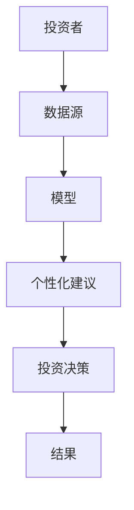
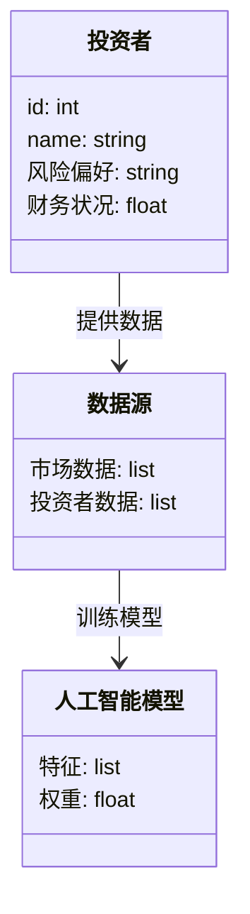
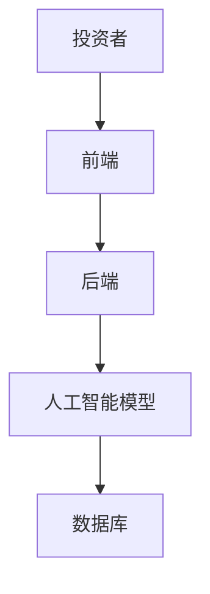
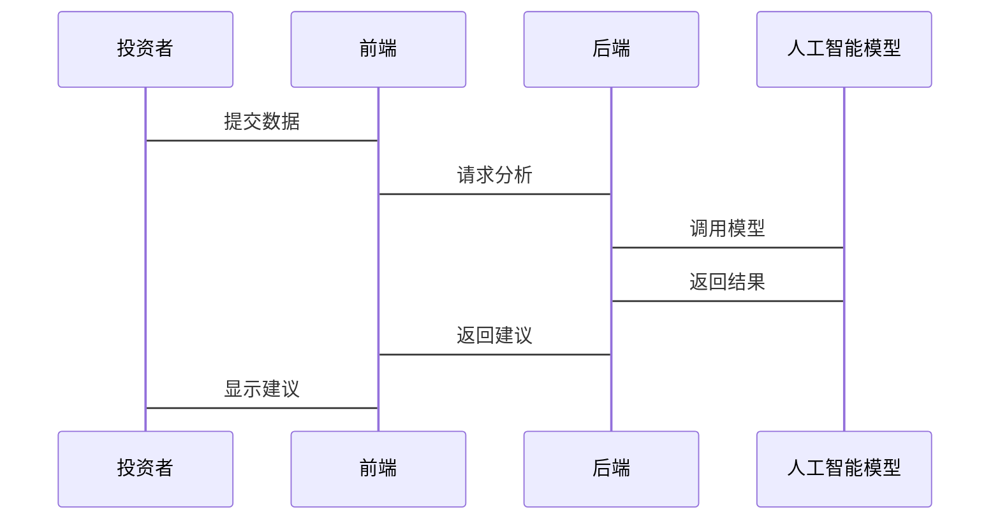

                 


# 《人工智能驱动的个性化投资顾问服务》

## 关键词：人工智能，个性化投资，投资顾问，金融科技，算法，数据分析，机器学习

## 摘要：本文深入探讨了人工智能如何驱动个性化投资顾问服务，分析了其核心概念、算法原理、系统架构及项目实战，结合实际案例，总结最佳实践，为读者提供全面的理论与实践指导。

---

## 第一章：人工智能驱动的个性化投资顾问服务概述

### 1.1 问题背景

#### 1.1.1 传统投资顾问服务的局限性
传统投资顾问服务依赖于人工分析和经验判断，存在效率低、成本高、难以覆盖大量投资者的问题。

#### 1.1.2 人工智能技术的发展与应用
人工智能技术的快速发展为投资顾问服务带来了新的可能性，能够处理海量数据，提供实时分析和个性化建议。

#### 1.1.3 个性化投资顾问服务的需求
投资者对个性化、精准的投资建议需求日益增长，传统服务难以满足。

### 1.2 问题描述

#### 1.2.1 投资者需求的多样性
不同投资者的财务状况、风险承受能力和投资目标差异显著。

#### 1.2.2 传统投资顾问服务的不足
传统服务难以实现大规模个性化，且效率低下。

#### 1.2.3 人工智能在投资顾问中的潜力
人工智能能够快速处理大量数据，提供精准的个性化建议。

### 1.3 问题解决

#### 1.3.1 人工智能如何实现个性化投资顾问
通过机器学习模型分析投资者数据，提供定制化建议。

#### 1.3.2 数据驱动的投资决策
利用大数据分析，帮助投资者做出更明智的决策。

#### 1.3.3 个性化投资策略的构建
根据投资者的特征，构建适合的资产配置和投资策略。

### 1.4 边界与外延

#### 1.4.1 个性化投资顾问的边界
明确服务的范围和限制，避免越界。

#### 1.4.2 人工智能在投资顾问中的应用范围
包括数据收集、分析、预测和建议生成等环节。

#### 1.4.3 与其他金融技术的关联
与区块链、大数据等技术相互作用，共同推动金融创新。

### 1.5 核心要素组成

#### 1.5.1 数据来源与处理
数据来源包括市场数据、投资者数据等，需进行清洗和预处理。

#### 1.5.2 人工智能算法
采用机器学习、深度学习等算法进行分析。

#### 1.5.3 个性化推荐系统
根据分析结果，生成个性化投资建议。

---

## 第二章：人工智能驱动的个性化投资顾问服务的核心概念与联系

### 2.1 核心概念原理

#### 2.1.1 个性化投资顾问的核心要素
包括数据采集、分析、建模和建议生成。

#### 2.1.2 人工智能在投资顾问中的作用
通过算法分析数据，提供智能化建议。

#### 2.1.3 数据驱动的投资决策模型
基于数据构建模型，模拟投资行为。

### 2.2 核心概念的属性特征对比

#### 2.2.1 传统投资顾问与人工智能投资顾问的对比
| 特性 | 传统投资顾问 | 人工智能投资顾问 |
|------|----------------|-------------------|
| 效率 | 较低           | 高                |
| 个性化 | 有限           | 高                |
| 成本 | 高             | 低                |

#### 2.2.2 数据驱动与规则驱动的对比
| 特性 | 数据驱动 | 规则驱动 |
|------|----------|----------|
| 精准度 | 高        | 低        |
| 灵活性 | 高        | 低        |

#### 2.2.3 个性化与标准化的对比
| 特性 | 个性化 | 标准化 |
|------|--------|--------|
| 适用性 | 高      | 低      |
| 效果 | 好      | 一般    |

### 2.3 ER实体关系图架构

```mermaid
er
  actor: 投资者
  service: 个性化投资顾问服务
  data_source: 数据源
  model: 人工智能模型
  action: 投资决策
  actor --> data_source: 提供数据
  data_source --> model: 训练模型
  model --> service: 提供个性化建议
  service --> action: 执行投资决策
```

### 2.4 流程图



---

## 第三章：人工智能驱动的个性化投资顾问服务的算法原理讲解

### 3.1 算法原理

#### 3.1.1 机器学习模型
使用监督学习、无监督学习等方法进行预测。

#### 3.1.2 算法流程图

```mermaid
graph TD
    Start --> DataCleaning: 数据清洗
    DataCleaning --> FeatureEngineering: 特征工程
    FeatureEngineering --> ModelTraining: 模型训练
    ModelTraining --> Prediction: 预测
    Prediction --> End
```

#### 3.1.3 Python代码实现

```python
# 示例代码：基于机器学习的预测模型
import pandas as pd
from sklearn.model_selection import train_test_split
from sklearn.linear_model import LinearRegression

# 数据加载与预处理
data = pd.read_csv('data.csv')
X = data[['age', 'income']]
y = data['investment']
X_train, X_test, y_train, y_test = train_test_split(X, y, test_size=0.2)

# 模型训练
model = LinearRegression()
model.fit(X_train, y_train)

# 预测
predictions = model.predict(X_test)
```

#### 3.1.4 数学模型和公式
$$ \text{投资回报} = \beta_0 + \beta_1 \times \text{年龄} + \beta_2 \times \text{收入} + \epsilon $$

---

## 第四章：人工智能驱动的个性化投资顾问服务的系统分析与架构设计

### 4.1 问题场景介绍

#### 4.1.1 投资者需求分析
了解投资者的财务状况、风险偏好等。

#### 4.1.2 服务目标
提供个性化投资建议，帮助投资者实现财务目标。

### 4.2 系统功能设计

#### 4.2.1 领域模型



#### 4.2.2 系统架构设计



#### 4.2.3 接口设计
定义API接口，实现数据传输和模型调用。

#### 4.2.4 交互序列图



---

## 第五章：人工智能驱动的个性化投资顾问服务的项目实战

### 5.1 环境安装

#### 5.1.1 安装Python
安装Python和必要的库，如Pandas、Scikit-learn。

#### 5.1.2 安装工具
安装Jupyter Notebook或其他数据分析工具。

### 5.2 核心代码实现

#### 5.2.1 数据处理

```python
import pandas as pd

data = pd.read_csv('data.csv')
data.head()
```

#### 5.2.2 模型训练

```python
from sklearn.tree import DecisionTreeRegressor

model = DecisionTreeRegressor()
model.fit(X_train, y_train)
```

#### 5.2.3 结果分析

```python
from sklearn.metrics import mean_squared_error

mse = mean_squared_error(y_test, predictions)
print(f"均方误差: {mse}")
```

### 5.3 案例分析

#### 5.3.1 案例背景
介绍一个实际案例，说明如何应用模型。

#### 5.3.2 分析过程
详细说明分析步骤和结果。

### 5.4 项目小结
总结项目实施的经验和教训。

---

## 第六章：人工智能驱动的个性化投资顾问服务的最佳实践

### 6.1 小结

#### 6.1.1 核心要点
总结人工智能在个性化投资顾问中的关键点。

#### 6.1.2 成功经验
分享项目成功的关键因素。

### 6.2 注意事项

#### 6.2.1 数据隐私
强调数据隐私和合规性。

#### 6.2.2 模型局限性
说明模型的局限性和改进方向。

### 6.3 拓展阅读

#### 6.3.1 相关书籍
推荐相关书籍和资源。

#### 6.3.2 在线课程
推荐在线课程和培训资源。

---

## 结语

人工智能驱动的个性化投资顾问服务正在改变投资领域，通过本文的系统分析和实战案例，读者可以掌握相关技术和方法，为未来的投资决策提供有力支持。

