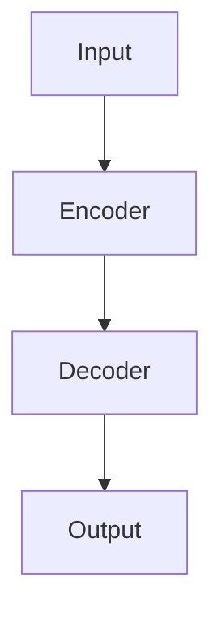
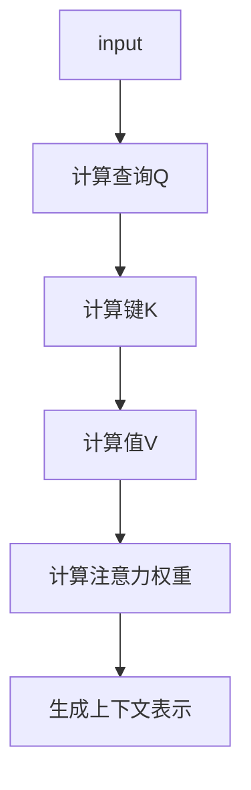
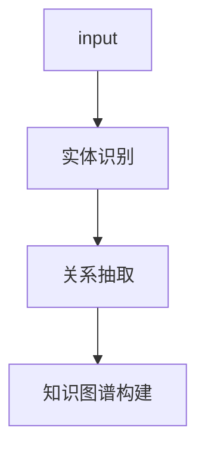
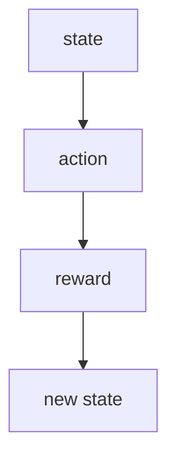
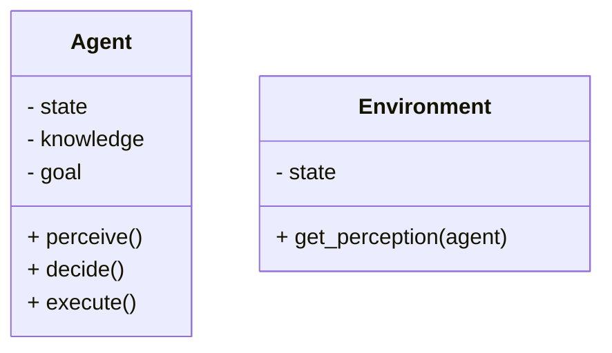
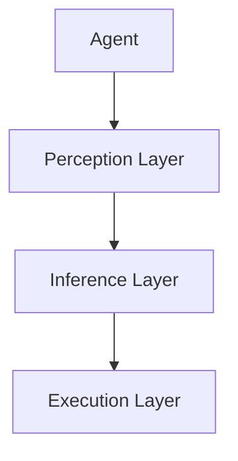
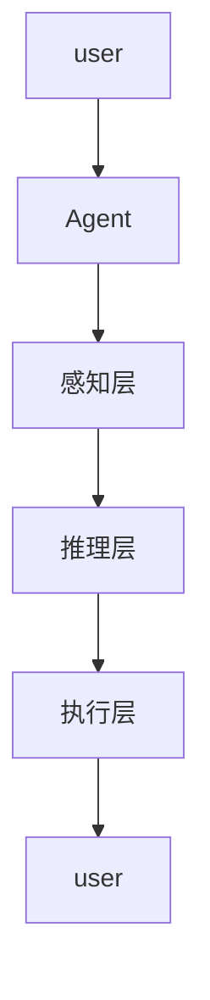
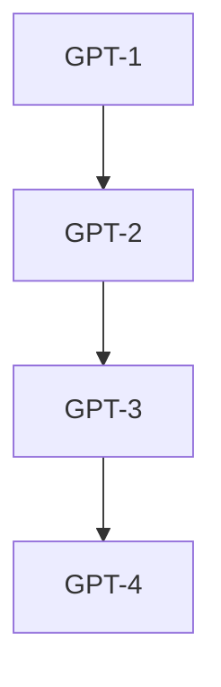
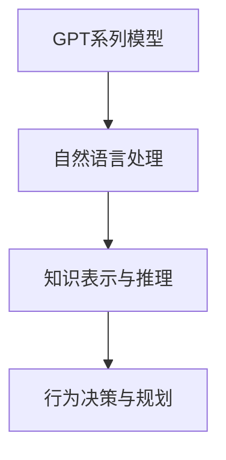
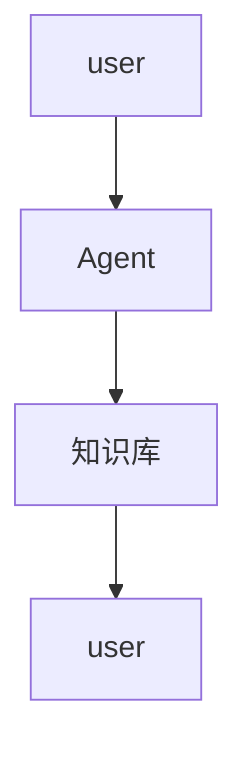

                 


# 从GPT到AI Agent：技术演进与应用变革

## 关键词：GPT, AI Agent, 人工智能, 技术演进, 应用变革, 机器学习, 自然语言处理

## 摘要：
本文系统地探讨了从GPT到AI Agent的技术演进过程，分析了GPT系列模型的核心原理及其在AI Agent中的应用。通过详细的技术分析，本文揭示了AI Agent的实现原理、系统架构设计以及在不同领域的实际应用案例。最后，本文展望了AI Agent的未来发展方向，为读者提供了全面的技术视角和实践指导。

---

## 第1章: 从GPT到AI Agent：背景与概念

### 1.1 GPT系列模型的演进历程

#### 1.1.1 GPT-1的核心特点与技术突破
GPT-1（Generative Pre-trained Transformer）由OpenAI于2018年首次提出，是基于Transformer架构的生成式模型。其核心特点包括：
- **自注意力机制**：通过计算词与词之间的关系，生成连贯的文本。
- **预训练-微调模式**：通过大规模数据预训练后，在特定任务上进行微调。
- **生成式任务**：支持文本生成、问答系统等任务。

#### 1.1.2 GPT-2的改进与创新
GPT-2在GPT-1的基础上，通过增加模型参数量和改进训练方法，显著提升了生成能力：
- **参数规模扩大**：从1.5亿参数提升至超过15亿参数。
- **长上下文理解**：能够处理更长的上下文，生成更连贯的文本。

#### 1.1.3 GPT-3的多模态能力与通用性
GPT-3引入了多模态输入处理能力，能够处理文本、图像等多种数据类型：
- **多任务通用性**：支持文本生成、翻译、问答等多种任务。
- **零样本学习**：在未见过的任务上也能生成合理的结果。

#### 1.1.4 GPT-4的突破性进展与应用场景
GPT-4在生成能力、逻辑推理和多模态处理方面取得了显著突破：
- **更强大的生成能力**：支持更长的上下文和更复杂的对话。
- **逻辑推理**：能够处理复杂的数学问题和逻辑推理任务。
- **多模态应用**：在图像、文本等多种模态数据上实现协同处理。

#### 1.1.5 GPT系列模型的技术对比
以下是GPT系列模型的核心技术对比：

| 模型 | 参数规模（亿） | 核心技术 | 主要应用场景 |
|------|----------------|----------|--------------|
| GPT-1 | 1.5 | 自注意力机制 | 文本生成、问答系统 |
| GPT-2 | 15 | 长上下文理解 | 高质量文本生成 |
| GPT-3 | 175 | 多模态输入 | 多任务通用生成 |
| GPT-4 | 万亿 | 逻辑推理 | 多模态协同处理 |

---

### 1.2 AI Agent的定义与核心特征

#### 1.2.1 AI Agent的基本概念
AI Agent（人工智能代理）是一种能够感知环境、自主决策并执行任务的智能系统。其核心特征包括：
- **自主性**：能够自主决策，无需外部干预。
- **反应性**：能够实时感知环境并做出反应。
- **目标导向性**：以特定目标为导向，优化决策过程。
- **学习能力**：能够通过经验改进性能。

#### 1.2.2 AI Agent的核心特征对比
以下是AI Agent与传统AI的对比：

| 特性 | 传统AI | AI Agent |
|------|---------|----------|
| 感知环境 | 无 | 有 |
| 自主决策 | 无 | 有 |
| 学习能力 | 无 | 有 |
| 适应性 | 无 | 有 |

#### 1.2.3 AI Agent与传统AI的区别
AI Agent的核心区别在于其自主性和适应性。传统AI依赖于预定义的规则和数据，而AI Agent能够通过感知环境和学习不断优化自身的决策过程。

#### 1.2.4 AI Agent的分类与应用场景
AI Agent可以分为以下几类：
- **基于规则的AI Agent**：通过预定义的规则进行决策。
- **基于学习的AI Agent**：通过机器学习算法进行训练，具备自适应能力。
- **基于知识图谱的AI Agent**：结合知识图谱进行推理和决策。

---

### 1.3 GPT与AI Agent的关系

#### 1.3.1 GPT作为AI Agent的核心技术
GPT系列模型为AI Agent提供了强大的自然语言处理能力和生成能力，是AI Agent的核心技术之一。

#### 1.3.2 AI Agent对GPT的延伸与扩展
AI Agent将GPT的生成能力扩展到更广泛的应用场景，如智能客服、教育辅助、内容创作等。

#### 1.3.3 GPT与AI Agent的协同工作模式
GPT作为AI Agent的“大脑”，负责生成文本和理解意图，而AI Agent则负责执行具体任务并返回结果。

---

### 1.4 本章小结
本章介绍了GPT系列模型的演进历程及其在AI Agent中的应用。通过对比分析，揭示了GPT系列模型的核心技术特点以及AI Agent的定义、分类和应用场景。

---

## 第2章: GPT系列模型的技术原理

### 2.1 GPT系列模型的核心原理

#### 2.1.1 Transformer架构的数学模型
Transformer由编码器和解码器组成，其核心是自注意力机制。

##### 2.1.1.1 自注意力机制的公式
$$\text{Attention}(Q, K, V) = \text{softmax}\left(\frac{QK^T}{\sqrt{d_k}}\right)V$$
其中，$Q$、$K$、$V$分别为查询、键、值向量，$d_k$为向量维度。

##### 2.1.1.2 Transformer的架构图


---

#### 2.1.2 自监督学习的原理
自监督学习通过预测上下文中的词来学习语言模型。

##### 2.1.2.1 自监督学习的损失函数
$$\text{Loss} = -\sum_{i=1}^{n} \text{log}p(w_i|x)$$
其中，$w_i$为第$i$个词，$x$为输入序列。

---

#### 2.1.3 注意力机制的实现细节
注意力机制通过计算词与词之间的相关性，生成上下文表示。

##### 2.1.3.1 注意力机制的流程图


---

#### 2.1.4 梯度下降与优化算法
常用的优化算法包括随机梯度下降（SGD）和Adam优化器。

##### 2.1.4.1 Adam优化器的公式
$$\text{Adam}(θ) = θ - \eta \frac{m}{\epsilon + \sqrt{n}}$$
其中，$\eta$为学习率，$m$为梯度移动平均，$n$为二阶矩估计。

---

### 2.2 GPT系列模型的训练过程

#### 2.2.1 数据预处理与特征提取
数据预处理包括分词、去除停用词等步骤。

#### 2.2.2 模型训练的并行化技术
通过并行计算加速模型训练，常用技术包括数据并行和模型并行。

#### 2.2.3 模型压缩与推理优化
模型压缩技术包括剪枝和量化，推理优化包括使用轻量化模型。

#### 2.2.4 模型评估与调优方法
模型评估指标包括困惑度（Perplexity）和生成文本的质量评估。

---

### 2.3 GPT系列模型的数学公式

#### 2.3.1 Transformer的注意力机制公式
如前所述，注意力机制的公式为：
$$\text{Attention}(Q, K, V) = \text{softmax}\left(\frac{QK^T}{\sqrt{d_k}}\right)V$$

#### 2.3.2 梯度下降优化算法的数学推导
Adam优化器的数学推导如下：
$$\text{Adam}(θ) = θ - \eta \frac{m}{\epsilon + \sqrt{n}}$$

---

### 2.4 本章小结
本章详细介绍了GPT系列模型的核心原理，包括Transformer架构、自监督学习和优化算法等技术细节。

---

## 第3章: AI Agent的实现原理

### 3.1 AI Agent的核心技术

#### 3.1.1 知识表示与推理
知识表示是AI Agent的核心技术之一，常用的知识表示方法包括知识图谱和符号逻辑。

##### 3.1.1.1 知识图谱的构建流程


#### 3.1.2 行为决策与规划
行为决策是AI Agent的核心功能，常用的决策方法包括基于规则的决策和基于强化学习的决策。

##### 3.1.2.1 强化学习的决策流程


#### 3.1.3 多模态数据处理
多模态数据处理是AI Agent的重要能力，能够处理文本、图像等多种数据类型。

#### 3.1.4 自然语言理解与生成
自然语言理解与生成是AI Agent的核心能力，基于GPT系列模型实现。

---

### 3.2 AI Agent的决策机制

#### 3.2.1 基于强化学习的决策模型
强化学习通过奖励机制优化决策过程。

##### 3.2.1.1 强化学习的数学公式
$$\text{Q-learning} = \text{max}_a \text{Q}(s,a)$$

#### 3.2.2 基于规则的决策系统
基于规则的决策系统通过预定义的规则进行决策。

#### 3.2.3 基于知识图谱的推理引擎
知识图谱推理通过图结构进行推理和决策。

#### 3.2.4 基于上下文的动态决策
动态决策根据上下文信息实时调整决策策略。

---

### 3.3 AI Agent的实现流程

#### 3.3.1 问题场景介绍
AI Agent需要处理的任务包括对话生成、任务执行等。

#### 3.3.2 系统功能设计
系统功能包括感知、推理、决策和执行。

##### 3.3.2.1 领域模型类图


#### 3.3.3 系统架构设计
系统架构包括感知层、推理层和执行层。

##### 3.3.3.1 系统架构图


#### 3.3.4 系统接口设计
系统接口包括感知接口、推理接口和执行接口。

#### 3.3.5 系统交互流程
系统交互流程包括感知、推理、决策和执行四个步骤。

##### 3.3.5.1 系统交互流程图


---

### 3.4 本章小结
本章详细介绍了AI Agent的实现原理，包括知识表示、行为决策、多模态数据处理和决策机制等内容。

---

## 第4章: GPT到AI Agent的技术演进

### 4.1 GPT系列模型的演进
GPT系列模型从GPT-1到GPT-4，逐步增强了生成能力和多模态处理能力。

#### 4.1.1 GPT系列模型的演进图


### 4.2 AI Agent的实现依赖
AI Agent的实现依赖于GPT系列模型的生成能力和多模态处理能力。

#### 4.2.1 AI Agent的实现依赖图


---

## 第5章: GPT到AI Agent的应用变革

### 5.1 GPT系列模型的应用
GPT系列模型在自然语言处理领域有广泛应用，如文本生成、翻译和问答系统。

#### 5.1.1 GPT系列模型的应用场景
- 文本生成
- 机器翻译
- 问答系统
- 聊天机器人

### 5.2 AI Agent的应用

#### 5.2.1 智能客服
AI Agent可以实现智能客服，提供24小时在线服务。

##### 5.2.1.1 智能客服的流程图


#### 5.2.2 教育辅助
AI Agent可以作为教育辅助工具，提供个性化的学习建议。

##### 5.2.2.1 教育辅助的流程图


#### 5.2.3 内容创作
AI Agent可以辅助内容创作，生成高质量的文章和报告。

#### 5.2.4 企业服务
AI Agent可以为企业提供智能化服务，如智能会议安排和任务管理。

---

### 5.3 从GPT到AI Agent的应用变革
AI Agent的出现，标志着自然语言处理技术从单纯的文本生成向更复杂的任务处理转变。

---

## 第6章: 从GPT到AI Agent的系统架构设计

### 6.1 系统架构设计

#### 6.1.1 问题场景介绍
AI Agent需要处理的任务包括对话生成、任务执行等。

#### 6.1.2 系统功能设计
系统功能包括感知、推理、决策和执行。

##### 6.1.2.1 领域模型类图


#### 6.1.3 系统架构设计
系统架构包括感知层、推理层和执行层。

##### 6.1.3.1 系统架构图


#### 6.1.4 系统接口设计
系统接口包括感知接口、推理接口和执行接口。

#### 6.1.5 系统交互流程
系统交互流程包括感知、推理、决策和执行四个步骤。

##### 6.1.5.1 系统交互流程图


---

### 6.2 系统实现细节

#### 6.2.1 感知层实现
感知层负责接收输入并进行初步处理。

#### 6.2.2 推理层实现
推理层负责基于感知层的输入进行推理和决策。

#### 6.2.3 执行层实现
执行层负责根据推理层的决策执行具体任务。

---

### 6.3 本章小结
本章详细介绍了从GPT到AI Agent的系统架构设计，包括系统功能设计、系统架构设计和系统交互流程等内容。

---

## 第7章: 从GPT到AI Agent的项目实战

### 7.1 项目介绍
本项目旨在实现一个基于GPT系列模型的AI Agent系统。

#### 7.1.1 项目目标
通过本项目，读者可以掌握从GPT到AI Agent的技术实现。

---

### 7.2 核心系统实现

#### 7.2.1 环境安装
需要安装以下环境：
- Python 3.8+
- PyTorch
- Hugging Face Transformers

#### 7.2.2 系统核心实现
以下是系统的核心实现代码：

```python
from transformers import GPT2Tokenizer, GPT2Model
import torch

# 初始化tokenizer和模型
tokenizer = GPT2Tokenizer.from_pretrained('gpt2')
model = GPT2Model.from_pretrained('gpt2')

# 定义生成函数
def generate_text(prompt, max_length=50):
    inputs = tokenizer.encode(prompt, return_tensors='pt')
    outputs = model.generate(inputs, max_length=max_length, do_sample=True)
    return tokenizer.decode(outputs[0])

# 生成文本
print(generate_text("写一篇关于AI Agent的文章"))
```

---

#### 7.2.3 代码应用解读与分析
上述代码实现了基于GPT-2的文本生成功能，可以作为AI Agent的核心模块。

---

#### 7.2.4 案例分析与详细讲解
通过分析上述代码，我们可以看到AI Agent的核心实现基于GPT系列模型的文本生成能力。

---

#### 7.2.5 项目小结
本项目通过实现一个简单的AI Agent系统，展示了从GPT到AI Agent的技术实现过程。

---

## 第8章: 从GPT到AI Agent的未来展望

### 8.1 GPT系列模型的未来发展方向
GPT系列模型将继续在生成能力、多模态处理和逻辑推理方面进行优化。

#### 8.1.1 GPT系列模型的未来发展趋势
- 更强大的生成能力
- 更复杂的多模态处理
- 更强的逻辑推理能力

### 8.2 AI Agent的未来发展方向
AI Agent将在智能决策、多模态协同和人机协作方面进行深入研究。

#### 8.2.1 AI Agent的未来发展趋势
- 更智能化的决策系统
- 更强大的多模态协同能力
- 更自然的人机交互方式

### 8.3 GPT与AI Agent的结合发展
GPT与AI Agent的结合将推动人工智能技术的进一步发展。

---

## 第9章: 总结与建议

### 9.1 本文总结
本文系统地探讨了从GPT到AI Agent的技术演进过程，分析了GPT系列模型的核心原理及其在AI Agent中的应用。

### 9.2 对读者的建议
建议读者深入学习GPT系列模型的技术细节，并结合实际应用场景，探索AI Agent的更多可能性。

### 9.3 注意事项
在实际应用中，需要注意数据安全和隐私保护问题。

### 9.4 拓展阅读
推荐读者阅读以下书籍和论文：
- 《深度学习》—— Ian Goodfellow
- 《生成式预训练模型的研究与应用》—— OpenAI

---

## 第10章: 最佳实践与技术总结

### 10.1 最佳实践
在实际应用中，建议读者结合具体场景，选择合适的模型和算法。

### 10.2 技术总结
从GPT到AI Agent的技术演进，标志着人工智能技术从单一任务处理向多任务协同发展的转变。

---

## 附录

### 附录A: 参考文献
- GPT系列论文
- AI Agent相关文献

### 附录B: 代码示例
- GPT系列模型的实现代码
- AI Agent系统的实现代码

---

## 结束语
感谢您的阅读，希望本文能够为您提供有价值的技术见解和实践指导。

