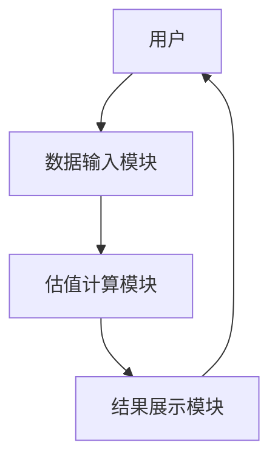
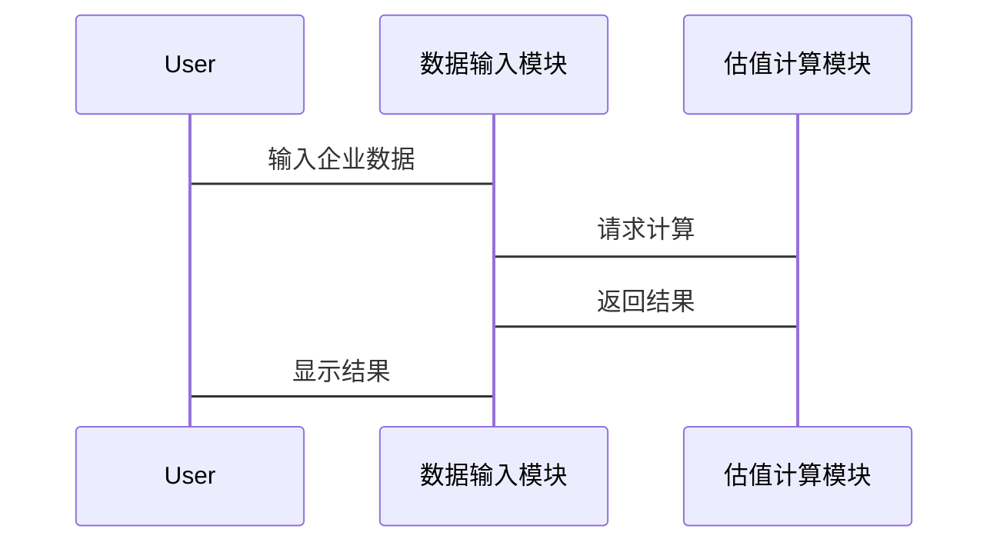

                 


# 从零开始学习企业估值方法

> 关键词：企业估值，DCF模型，相对估值法，EV/EBITDA，CAPM，企业价值

> 摘要：本文将从零开始系统地讲解企业估值的基本概念、核心方法和实际应用，帮助读者掌握从基础到进阶的企业估值技巧。我们将通过详细的理论分析、数学模型推导和实际案例研究，深入探讨企业估值的核心逻辑和操作步骤。

---

## 第一部分: 企业估值方法背景与基础

### 第1章: 企业估值的基本概念

#### 1.1 什么是企业估值
- 1.1.1 企业估值的定义
  - 企业估值是通过对企业未来现金流的折现，计算其当前价值的过程。
  - 示例：假设一家企业未来5年的现金流分别为100万、120万、150万、200万和250万，折现率设定为8%，那么我们可以计算其现值总和，即企业估值。

- 1.1.2 企业估值的重要性
  - 企业估值是投资决策的核心依据，帮助企业确定其市场价值。
  - 示例：投资者通过对企业估值的分析，可以判断企业的合理价格区间，避免高估或低估的风险。

- 1.1.3 企业估值的应用场景
  - 初创企业融资：帮助企业确定合理的融资价格。
  - 投资决策：帮助投资者评估潜在投资的价值。
  - 并购交易：帮助企业确定收购目标的合理价格。

#### 1.2 企业估值的核心要素
- 1.2.1 企业价值的构成
  - 企业价值包括资产价值、品牌价值、客户价值等。
  - 示例：一家公司的品牌价值可以通过市场地位、客户忠诚度等因素进行评估。

- 1.2.2 企业估值的关键指标
  - EV（企业价值）：企业的整体价值，包括股权和债务。
  - EBITDA（息税折旧及摊销前利润）：衡量企业盈利能力的重要指标。
  - WACC（加权平均资本成本）：用于折现现金流的无风险利率。

- 1.2.3 企业估值的边界与外延
  - 企业估值的边界：企业的财务状况、市场环境、行业竞争等。
  - 企业估值的外延：包括企业未来增长潜力、技术创新能力等。

#### 1.3 企业估值与其他相关概念的对比
- 1.3.1 企业价值与资产价值的区别
  - 企业价值是整体价值，包括所有资产和负债。
  - 资产价值是单项资产的价值之和。
  - 示例：企业的固定资产价值可能远低于其整体价值，因为整体价值考虑了协同效应。

- 1.3.2 企业估值与财务分析的关系
  - 财务分析是企业估值的基础，包括利润表、资产负债表等分析。
  - 企业估值是对财务分析的进一步应用，通过模型计算企业价值。

- 1.3.3 企业估值与投资决策的联系
  - 投资决策基于企业估值结果，确定投资是否合理。
  - 示例：如果企业估值高于市场价格，说明投资具有潜在收益。

### 第2章: 企业估值的核心概念与联系

#### 2.1 企业估值的核心原理
- 2.1.1 企业价值的计算公式
  - EV = EBITDA × 倍数
  - EV = 净利润 × 市盈率
  - EV = 现金流折现值总和

- 2.1.2 企业估值的逻辑框架
  - 确定企业的未来现金流
  - 确定合适的折现率
  - 计算现值总和，得出企业估值

- 2.1.3 企业估值的关键假设
  - 稳定的现金流增长
  - 稳定的折现率
  - 稳定的市场环境

#### 2.2 核心概念对比表格
- 2.2.1 不同估值方法的对比
  | 方法         | 优点                 | 缺点                 |
  |--------------|----------------------|----------------------|
  | DCF模型      | 精确，考虑未来现金流   | 计算复杂             |
  | 相对估值法    | 简单，基于市场数据     | 受市场波动影响大       |
  | EV/EBITDA    | 易于比较             | 受企业规模影响较大     |

- 2.2.2 各种指标的优缺点分析
  - DCF模型：优点是精确，缺点是计算复杂。
  - 相对估值法：优点是简单，缺点是受市场波动影响大。

- 2.2.3 企业估值与市场估值的差异
  - 企业估值是内在价值，市场估值是市场交易价格。
  - 示例：如果市场估值低于企业估值，说明企业可能被低估。

#### 2.3 实体关系图（ER图）
```mermaid
erDiagram
    customer[客户] {
        id
        name
        email
    }
    employee[员工] {
        id
        name
        position
    }
    transaction[交易] {
        id
        customer_id
        employee_id
        date
        amount
    }
    customer --> transaction : 进行交易
    employee --> transaction : 处理交易
```

### 第3章: 企业估值的算法原理

#### 3.1 DCF模型的算法原理
- 3.1.1 DCF模型的步骤
  1. 确定企业未来现金流
  2. 确定合适的折现率
  3. 计算各期现金流的现值
  4. 求和得到企业估值

- 3.1.2 DCF模型的数学公式
  $$EV = \sum_{t=1}^{n} \frac{CF_t}{(1 + WACC)^t}$$
  其中，CF_t是第t期的现金流，WACC是加权平均资本成本。

- 3.1.3 DCF模型的假设
  - 稳定的现金流增长
  - 稳定的折现率
  - 稳定的市场环境

#### 3.2 相对估值法的算法原理
- 3.2.1 相对估值法的步骤
  1. 确定可比公司的市场估值
  2. 计算可比公司的估值倍数
  3. 应用倍数到目标公司

- 3.2.2 相对估值法的数学公式
  $$EV = 倍数 × 关键指标$$
  例如，EV/EBITDA倍数法：
  $$EV = 倍数 × EBITDA$$

#### 3.3 CAPM模型的算法原理
- 3.3.1 CAPM模型的步骤
  1. 确定无风险利率
  2. 确定市场预期回报率
  3. 确定企业贝塔系数
  4. 计算WACC

- 3.3.2 CAPM模型的数学公式
  $$WACC = r_f + β × (r_m - r_f)$$
  其中，r_f是无风险利率，r_m是市场预期回报率，β是贝塔系数。

#### 3.4 代码实现
```python
def dcf_valuation(cash_flows, discount_rate):
    present_value = 0
    for t in range(len(cash_flows)):
        present_value += cash_flows[t] / (1 + discount_rate)**t
    return present_value

cash_flows = [100, 120, 150, 200, 250]
discount_rate = 0.08
ev = dcf_valuation(cash_flows, discount_rate)
print("企业估值为：", ev)
```

### 第4章: 企业估值的系统架构

#### 4.1 系统功能设计
- 4.1.1 用户需求分析
  - 用户需要输入企业数据
  - 用户需要选择估值方法
  - 用户需要查看估值结果

- 4.1.2 系统功能模块
  - 数据输入模块
  - 估值计算模块
  - 结果展示模块

- 4.1.3 系统功能流程
  1. 用户输入企业数据
  2. 系统选择估值方法
  3. 计算企业估值
  4. 展示结果

#### 4.2 系统架构设计
- 4.2.1 系统架构图


- 4.2.2 系统接口设计
  - 输入接口：用户输入企业数据
  - 输出接口：显示估值结果

- 4.2.3 系统交互流程


### 第5章: 项目实战

#### 5.1 环境安装
- 安装Python和相关库
  - 使用pip安装numpy和pandas

#### 5.2 系统核心实现
- 实现DCF模型的代码
  ```python
  import numpy as np

  def calculate_ev(cash_flows, discount_rate):
      return np.npv(discount_rate, cash_flows)

  cash_flows = [100, 120, 150, 200, 250]
  discount_rate = 0.08
  ev = calculate_ev(cash_flows, discount_rate)
  print("企业估值为：", ev)
  ```

- 实现相对估值法的代码
  ```python
  def calculate_ev_relative(market_multiple, company_metric):
      return market_multiple * company_metric

  market_multiple = 10
  company_metric = 100
  ev = calculate_ev_relative(market_multiple, company_metric)
  print("企业估值为：", ev)
  ```

#### 5.3 代码应用解读
- DCF模型代码解读
  - 使用numpy的npv函数计算净现值
  - 现金流和折现率作为输入参数
  - 输出计算的企业估值

- 相对估值法代码解读
  - 通过市场倍数和公司指标计算企业估值
  - 简单直接，适用于快速估值

#### 5.4 实际案例分析
- 案例1：使用DCF模型估值
  - 假设企业未来5年的现金流分别为100万、120万、150万、200万、250万，折现率为8%。
  - 计算现值总和，得到企业估值。

- 案例2：使用相对估值法估值
  - 假设可比公司的EV/EBITDA倍数为10，目标公司的EBITDA为100万。
  - 计算EV=10×100=1000万。

#### 5.5 项目小结
- 项目总结
  - 学习了企业估值的基本方法
  - 掌握了DCF模型和相对估值法的应用
  - 通过实际案例加深了理解

### 第6章: 总结与扩展阅读

#### 6.1 总结
- 本章系统地介绍了企业估值的基本概念、核心方法和实际应用。
- 通过理论分析和代码实现，帮助读者掌握了企业估值的核心逻辑和操作步骤。

#### 6.2 扩展阅读
- 推荐书籍：《企业价值评估：方法与应用》
- 推荐工具：Excel、Python、R
- 推荐资源：Coursera上的相关课程

#### 6.3 最佳实践 Tips
- 选择合适的估值方法
- 注意数据的准确性和完整性
- 考虑市场环境和行业特点
- 定期更新和调整估值模型

---

# 结语

通过本篇文章的学习，读者应该能够从零开始系统地掌握企业估值的基本方法和实际应用。从基础概念到高级技巧，从理论分析到代码实现，全面了解企业估值的核心逻辑。希望本文能够为读者提供有价值的参考和指导，帮助他们在企业估值领域取得更大的进步。

---

感谢您的阅读，如果您有任何问题或建议，请随时与我联系。

