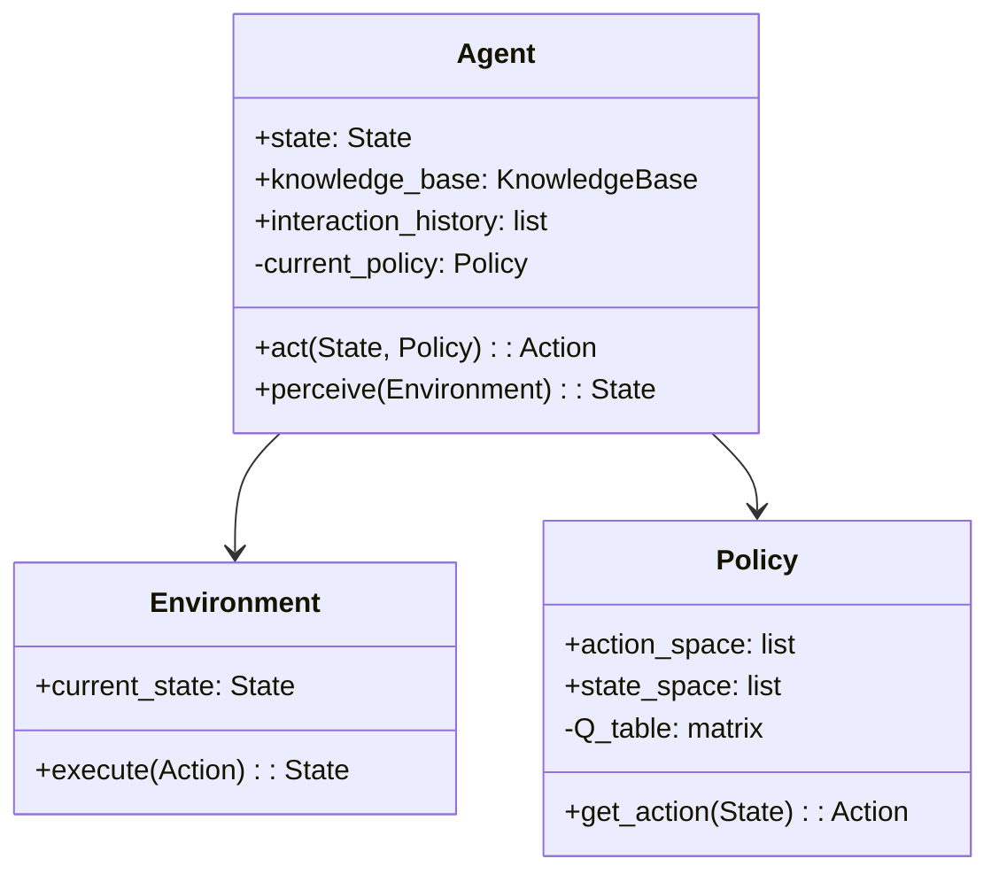
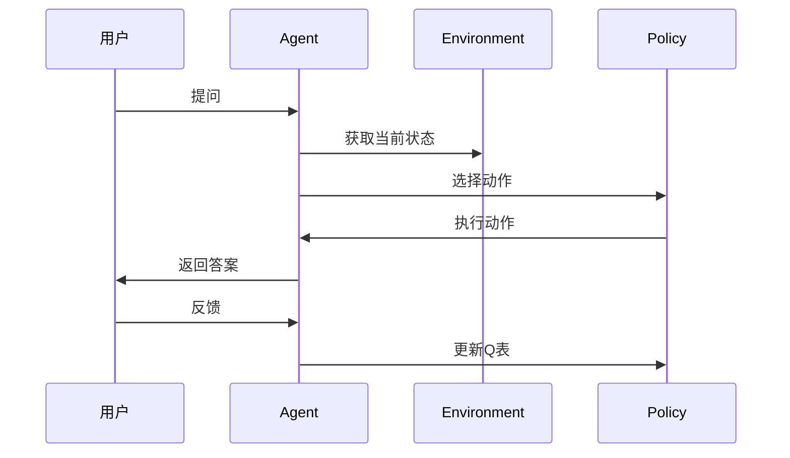

                 


# 从零开始：构建AI Agent的完整指南

> 关键词：AI Agent, 人工智能, 强化学习, 系统架构, 项目实战

> 摘要：本文将全面指导读者从零开始构建一个AI Agent，涵盖背景、核心概念、算法原理、系统架构、项目实战、优化与进阶等部分。通过详细的技术分析和实际案例，帮助读者掌握AI Agent的构建过程。

---

## 第一部分: AI Agent的背景与概念

### 第1章: AI Agent的背景与概念

#### 1.1 AI Agent的基本概念

##### 1.1.1 什么是AI Agent
AI Agent（人工智能代理）是指能够感知环境、自主决策并执行任务的智能实体。它可以是一个软件程序或物理设备，通过传感器获取信息，利用算法处理信息，并通过执行器与环境交互。

##### 1.1.2 AI Agent的类型
AI Agent可以分为以下几类：
- **反应式AI Agent**：基于当前感知做出反应，适用于实时任务。
- **认知式AI Agent**：具备复杂推理和规划能力，适用于复杂任务。
- **协作式AI Agent**：能够与其他Agent或人类协作完成任务。

##### 1.1.3 AI Agent的应用场景
AI Agent广泛应用于自动驾驶、智能助手、机器人、游戏AI、推荐系统等领域。

#### 1.2 AI Agent的核心技术基础

##### 1.2.1 人工智能与机器学习
AI Agent依赖于机器学习算法来训练模型，使其能够从数据中学习并做出决策。

##### 1.2.2 自然语言处理
AI Agent需要理解人类语言，以便与用户进行有效交互。

##### 1.2.3 计算机视觉
AI Agent可能需要通过视觉信息（如图像或视频）来感知环境。

#### 1.3 AI Agent的发展现状

##### 1.3.1 当前技术趋势
强化学习和深度学习是当前AI Agent技术的主要驱动力。

##### 1.3.2 应用领域的进展
AI Agent在自动驾驶、智能客服、机器人等领域取得了显著进展。

##### 1.3.3 未来发展方向
未来，AI Agent将更加智能化、协作化和个性化。

#### 1.4 本章小结
本章介绍了AI Agent的基本概念、类型、应用场景及其核心技术基础，为后续章节奠定了基础。

---

## 第二部分: AI Agent的核心概念与技术基础

### 第2章: AI Agent的核心概念

#### 2.1 智能体的基本结构

##### 2.1.1 状态表示
状态表示是AI Agent感知环境的基础。例如，在迷宫导航中，状态可以表示为当前位置。

##### 2.1.2 行为选择
行为选择是AI Agent根据当前状态决定执行的动作。例如，在迷宫中选择“左转”或“右转”。

##### 2.1.3 感知与交互
AI Agent通过传感器（如摄像头、麦克风）感知环境，并通过执行器（如马达、扬声器）与环境交互。

#### 2.2 AI Agent的决策机制

##### 2.2.1 基于规则的决策
基于规则的决策通过预定义的规则做出决策。例如，设置规则“如果前方有障碍，则后退”。

##### 2.2.2 基于模型的决策
基于模型的决策利用数学模型进行推理和决策。例如，使用马尔可夫决策过程（MDP）模型。

##### 2.2.3 强化学习的应用
强化学习通过试错机制优化决策策略。例如，使用Q-learning算法优化迷宫导航中的路径选择。

#### 2.3 感知与交互技术

##### 2.3.1 多模态感知
多模态感知结合多种传感器信息（如视觉、听觉）进行更准确的感知。

##### 2.3.2 自然语言理解
自然语言理解使AI Agent能够理解人类语言并进行有效交互。

##### 2.3.3 实时交互技术
实时交互技术确保AI Agent能够快速响应用户输入。

#### 2.4 规划与推理

##### 2.4.1 任务规划
任务规划涉及将目标分解为一系列子任务，并制定执行计划。例如，制定从起点到终点的路径规划。

##### 2.4.2 知识表示
知识表示将知识以结构化形式存储，便于推理。例如，使用图结构表示知识图谱。

##### 2.4.3 推理与决策
推理与决策基于知识表示进行逻辑推理，做出最优决策。例如，使用逻辑推理解决复杂问题。

#### 2.5 本章小结
本章详细讲解了AI Agent的核心概念，包括基本结构、决策机制、感知与交互技术以及规划与推理方法。

---

## 第三部分: AI Agent的算法原理

### 第3章: AI Agent的核心算法

#### 3.1 状态空间与动作空间

##### 3.1.1 状态表示方法
状态表示方法有多种，如向量表示、符号表示等。例如，在迷宫中，每个位置可以用一个二维向量表示。

##### 3.1.2 动作选择策略
动作选择策略包括随机选择、贪心选择和基于模型的选择。例如，在迷宫中，随机选择“左转”或“右转”。

##### 3.1.3 状态转移
状态转移是基于当前状态和执行的动作，计算下一个状态的过程。例如，在迷宫中，当前在位置A，选择“右转”后到达位置B。

#### 3.2 强化学习的核心算法

##### 3.2.1 强化学习的基本概念
强化学习通过试错机制，学习最优策略。例如，使用Q-learning算法优化迷宫导航中的路径选择。

##### 3.2.2 Q-learning算法
Q-learning算法通过更新Q值表，学习最优动作价值函数。数学公式为：

$$ Q(s, a) \leftarrow Q(s, a) + \alpha [r + \gamma \max Q(s', a') - Q(s, a)] $$

其中，$\alpha$ 是学习率，$\gamma$ 是折扣因子。

##### 3.2.3 算法实现步骤
1. 初始化Q值表为零。
2. 在每个时间步，根据当前状态选择动作。
3. 执行动作，观察下一个状态和奖励。
4. 更新Q值表。
5. 重复上述步骤，直到达到终止条件。

#### 3.3 奖励机制设计

##### 3.3.1 奖励函数
奖励函数定义了每个状态-动作对的奖励值。例如，在迷宫中，到达终点给予正奖励，碰撞障碍物给予负奖励。

##### 3.3.2 奖励设计原则
- 明确性：奖励应明确指导智能体的行为。
- 可微性：奖励应可区分不同行为的好坏。
- 延时性：奖励可能在多个时间步之后给予。

#### 3.4 算法实现与优化

##### 3.4.1 算法实现示例
以下是一个简单的Q-learning算法实现：

```python
import numpy as np

# 初始化Q表
Q = np.zeros((state_space, action_space))

# 参数设置
alpha = 0.1
gamma = 0.9

# 训练过程
for episode in range(episodes):
    state = initial_state
    while not episode_ended:
        # 选择动作
        if np.random.random() < epsilon:
            action = random_choice
        else:
            action = np.argmax(Q[state, :])
        
        # 执行动作，观察下一个状态和奖励
        next_state, reward = step(state, action)
        
        # 更新Q表
        Q[state, action] += alpha * (reward + gamma * np.max(Q[next_state, :]) - Q[state, action])
        
        state = next_state
```

##### 3.4.2 算法优化技巧
- **ε-greedy策略**：平衡探索与利用，避免过早收敛。
- **经验回放**：通过存储历史经验，减少样本方差。
- **网络结构优化**：使用神经网络近似Q值函数，提高学习效率。

#### 3.5 本章小结
本章详细讲解了AI Agent的核心算法，包括状态空间、动作空间、Q-learning算法、奖励机制设计以及算法实现与优化。

---

## 第四部分: 系统分析与架构设计

### 第4章: AI Agent的系统分析与架构设计

#### 4.1 问题场景介绍

##### 4.1.1 项目背景
假设我们正在开发一个智能客服AI Agent，用于回答用户的问题并提供解决方案。

##### 4.1.2 项目介绍
智能客服AI Agent需要具备自然语言理解、知识库查询和对话管理功能。

#### 4.2 系统功能设计

##### 4.2.1 领域模型设计
领域模型展示了系统的功能模块及其关系。以下是一个Mermaid类图：



#### 4.3 系统架构设计

##### 4.3.1 系统架构图
以下是一个Mermaid架构图，展示了系统的分层架构：


#### 4.4 系统接口设计

##### 4.4.1 接口定义
- `get_action(state)`：根据当前状态选择动作。
- `update_policy(reward)`：更新策略以优化Q值表。

#### 4.5 系统交互设计

##### 4.5.1 交互流程图
以下是一个Mermaid交互序列图，展示了智能客服AI Agent与用户之间的交互流程：



#### 4.6 本章小结
本章通过一个智能客服AI Agent的案例，详细讲解了系统分析与架构设计的过程，包括领域模型设计、系统架构设计、接口设计和交互流程设计。

---

## 第五部分: 项目实战

### 第5章: AI Agent的项目实战

#### 5.1 环境搭建

##### 5.1.1 安装必要的库
安装TensorFlow和OpenAI Gym：

```bash
pip install tensorflow gym
```

#### 5.2 系统核心实现

##### 5.2.1 状态处理
状态处理代码示例：

```python
def get_state(observation):
    # 状态处理逻辑
    return processed_state
```

##### 5.2.2 策略选择
策略选择代码示例：

```python
def choose_action(state, epsilon=0.1):
    if random.random() < epsilon:
        return random.choice(action_space)
    else:
        return np.argmax(Q[state, :])
```

##### 5.2.3 奖励计算
奖励计算代码示例：

```python
def get_reward(state, action, next_state):
    # 奖励计算逻辑
    return reward
```

#### 5.3 代码实现与解读

##### 5.3.1 完整代码示例
以下是一个简单的Q-learning算法实现：

```python
import numpy as np
import gym

# 初始化环境
env = gym.make('CartPole-v0')
env.reset()

# 参数设置
alpha = 0.1
gamma = 0.9
epsilon = 0.1

# 初始化Q表
Q = np.zeros((env.observation_space.shape[0], env.action_space.n))

# 训练过程
for episode in range(1000):
    state = env.reset()
    while True:
        # 选择动作
        if np.random.random() < epsilon:
            action = env.action_space.sample()
        else:
            action = np.argmax(Q[state, :])
        
        # 执行动作，观察下一个状态和奖励
        next_state, reward, done, _ = env.step(action)
        
        # 更新Q表
        Q[state, action] += alpha * (reward + gamma * np.max(Q[next_state, :]) - Q[state, action])
        
        state = next_state
        if done:
            break

print("训练完成！")
```

##### 5.3.2 代码解读
- **环境初始化**：使用OpenAI Gym的CartPole环境。
- **参数设置**：学习率$\alpha$，折扣因子$\gamma$，探索率$\epsilon$。
- **Q表初始化**：创建一个二维数组，记录每个状态-动作对的Q值。
- **训练过程**：通过多次迭代，更新Q表，优化策略。

#### 5.4 实际案例分析

##### 5.4.1 迷宫导航问题
迷宫导航问题是常见的AI Agent任务，目标是通过迷宫到达终点。

##### 5.4.2 实际案例代码实现
迷宫导航问题的代码实现：

```python
import numpy as np

# 初始化迷宫
maze_size = 5
start = (0, 0)
end = (4, 4)

# 初始化Q表
Q = np.zeros((maze_size, maze_size, 4))

# 参数设置
alpha = 0.1
gamma = 0.9
epsilon = 0.1

# 动作空间：上下左右
actions = [(0, 1), (0, -1), (1, 0), (-1, 0)]

# 训练过程
for episode in range(1000):
    state = start
    while True:
        # 选择动作
        if np.random.random() < epsilon:
            action = random.choice(actions)
        else:
            action = actions[np.argmax(Q[state[0], state[1], :])]
        
        # 执行动作，观察下一个状态和奖励
        next_state = (state[0] + action[0], state[1] + action[1])
        if next_state == end:
            reward = 1
            next_state = end
            done = True
        else:
            reward = -0.1
            done = False
        
        # 更新Q表
        Q[state[0], state[1], action_index] += alpha * (reward + gamma * np.max(Q[next_state[0], next_state[1], :]) - Q[state[0], state[1], action_index])
        
        state = next_state
        if done:
            break

print("训练完成！")
```

##### 5.4.3 代码解读
- **环境初始化**：创建一个5x5的迷宫，起点为(0,0)，终点为(4,4)。
- **Q表初始化**：记录每个位置的四个方向的Q值。
- **动作空间**：定义四个可能的动作（上下左右）。
- **训练过程**：通过多次迭代，更新Q表，优化迷宫导航路径。

#### 5.5 项目小结
本章通过实际案例，详细讲解了AI Agent的项目实战，包括环境搭建、核心功能实现、代码实现与解读以及实际案例分析。

---

## 第六部分: 优化与进阶

### 第6章: AI Agent的优化与进阶

#### 6.1 性能优化

##### 6.1.1 算法优化
- **经验回放**：通过存储历史经验，减少样本方差。
- **网络结构优化**：使用更深的神经网络提高表达能力。

##### 6.1.2 资源管理
优化内存和计算资源的使用，提高训练效率。

#### 6.2 多智能体协作

##### 6.2.1 通信机制
定义智能体之间的通信协议，实现信息共享。

##### 6.2.2 任务分配
根据智能体的能力和环境信息，动态分配任务。

#### 6.3 前沿技术

##### 6.3.1 大模型结合
将AI Agent与大语言模型（如GPT）结合，提升自然语言处理能力。

##### 6.3.2 边缘计算
通过边缘计算技术，实现低延迟、高实时性的AI Agent。

#### 6.4 伦理与安全

##### 6.4.1 伦理问题
确保AI Agent的行为符合伦理规范，避免滥用。

##### 6.4.2 安全问题
保护用户隐私，防止数据泄露和攻击。

#### 6.5 本章小结
本章探讨了AI Agent的优化与进阶方向，包括算法优化、多智能体协作、前沿技术以及伦理与安全问题。

---

## 第七部分: 总结与展望

### 第7章: 总结与展望

#### 7.1 全文总结
本文从零开始，全面指导了AI Agent的构建过程，涵盖了背景、核心概念、算法原理、系统架构、项目实战、优化与进阶等部分。

#### 7.2 技术趋势
未来，AI Agent将更加智能化、协作化和个性化，结合大模型和边缘计算，实现更广泛的应用。

#### 7.3 进一步学习
建议读者深入学习强化学习、多智能体协作、大模型技术等领域，保持对AI技术的关注。

#### 7.4 本章小结
本文总结了AI Agent的构建过程，并展望了未来的发展方向，为读者提供了进一步学习的建议。

---

# 附录: 参考文献与拓展阅读

- 刘军, 《人工智能: 理论与实践》
- Andrew Ng, 《Machine Learning》
- Sutton, R. S., & Barto, A. G., 《Reinforcement Learning: An Introduction》

---

通过以上内容，读者可以系统地学习AI Agent的构建过程，从理论到实践，逐步掌握相关技术和方法。

