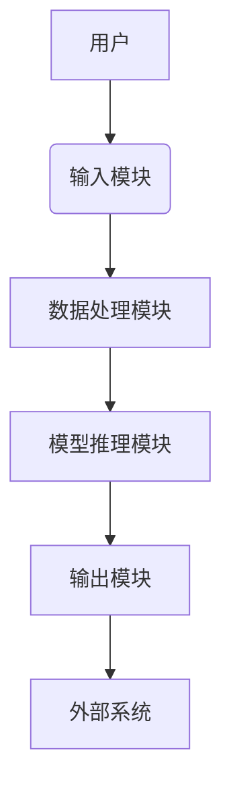
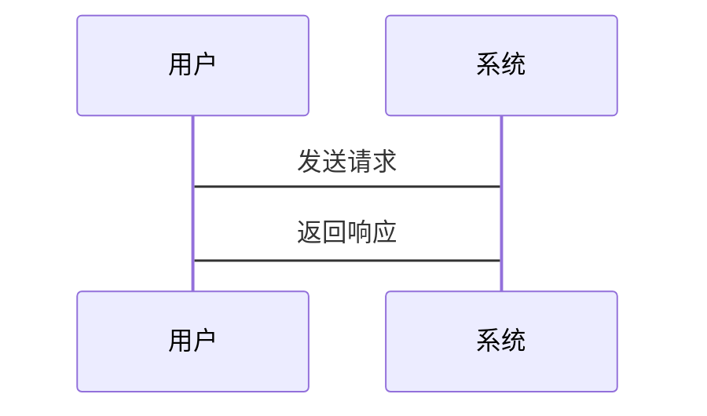

                 


# 从零构建 AI Agent：LLM 大模型应用开发实践

> 关键词：AI Agent，大语言模型，LLM，机器学习，自然语言处理，应用开发

> 摘要：本文将从零开始，系统地介绍如何构建一个基于大语言模型（LLM）的AI Agent。通过深入分析AI Agent的核心概念、LLM的技术原理、系统架构设计以及实际项目开发流程，帮助读者掌握从理论到实践的完整开发过程。本文不仅涵盖AI Agent的背景知识，还详细讲解了模型训练、优化、推理以及应用开发的关键步骤，同时提供丰富的代码示例和系统设计图，帮助读者快速上手并实现高效的AI Agent开发。

---

## 第一部分: AI Agent与大模型基础

### 第1章: AI Agent与大模型概述

#### 1.1 AI Agent的基本概念
- **1.1.1 什么是AI Agent**
  - AI Agent（智能体）是指能够感知环境并采取行动以实现目标的实体。
  - AI Agent可以是软件程序，也可以是硬件设备，但其核心是通过算法实现智能决策。
  - AI Agent的核心属性包括自主性、反应性、目标导向性和社会性。

- **1.1.2 AI Agent的核心特点**
  - 自主性：AI Agent能够在没有外部干预的情况下独立运行。
  - 反应性：能够感知环境并实时调整行为。
  - 目标导向性：基于目标驱动决策和行动。
  - 可扩展性：能够通过学习和训练不断提升能力。

- **1.1.3 AI Agent与传统AI的区别**
  - 传统AI注重任务解决，而AI Agent注重与环境的动态交互。
  - AI Agent具备更强的自主性和适应性，能够应对复杂多变的环境。

- **1.1.4 AI Agent的开发流程**
  - 需求分析：明确AI Agent的目标和功能。
  - 系统设计：设计AI Agent的架构和模块。
  - 模型训练：训练AI Agent的核心算法模型。
  - 接口开发：实现AI Agent与外部系统的交互接口。
  - 测试优化：测试AI Agent的功能，并进行优化。

#### 1.2 大语言模型（LLM）的基本概念
- **1.2.1 大语言模型的定义**
  - 大语言模型（Large Language Model, LLM）是指基于深度学习技术训练的大型神经网络模型，能够理解和生成自然语言文本。
  - LLM的核心技术包括Transformer架构、自注意力机制和概率生成模型。

- **1.2.2 LLM的核心技术特点**
  - 基于Transformer的模型结构：通过自注意力机制捕捉长距离依赖关系。
  - 多层神经网络：通过堆叠多个Transformer层来增强模型的表达能力。
  - 概率生成：模型能够根据上下文生成概率最高的后续文本。

- **1.2.3 LLM与AI Agent的关系**
  - LLM是AI Agent的核心驱动力，能够为AI Agent提供自然语言理解和生成能力。
  - 通过LLM，AI Agent可以实现与人类的自然对话，理解用户需求并生成相应的回应。

#### 1.3 AI Agent的开发流程
- **1.3.1 从零开始构建AI Agent的步骤**
  1. 明确AI Agent的目标和功能。
  2. 设计AI Agent的系统架构。
  3. 选择或训练合适的LLM模型。
  4. 实现AI Agent与外部系统的交互接口。
  5. 测试并优化AI Agent的功能。

- **1.3.2 LLM在AI Agent中的应用流程**
  1. 数据预处理与模型训练。
  2. 模型推理与结果解析。
  3. 结果生成与用户反馈。

- **1.3.3 AI Agent开发的工具与环境**
  - 深度学习框架：TensorFlow、PyTorch。
  - 模型训练工具：Hugging Face、Kubeflow。
  - 代码开发工具：Python、Jupyter Notebook。

---

### 第2章: 大语言模型（LLM）的核心技术

#### 2.1 LLM的训练原理
- **2.1.1 基于Transformer的模型结构**
  - Transformer模型由编码器和解码器组成，编码器负责将输入文本转换为向量表示，解码器负责根据编码结果生成输出文本。
  - Transformer的核心组件包括多头自注意力机制和前馈网络。

- **2.1.2 自注意力机制的数学公式**
  - 自注意力机制通过计算输入序列中每个位置与其他位置的相关性来生成位置权重。
  - 公式如下：
    $$
    \text{Attention}(Q, K, V) = \text{softmax}\left(\frac{QK^T}{\sqrt{d_k}}\right)V
    $$

- **2.1.3 梯度下降与优化算法**
  - 常用的优化算法包括随机梯度下降（SGD）、Adam优化器和Adagrad优化器。
  - 优化算法通过调整模型参数使得损失函数最小化。

#### 2.2 LLM的训练策略
- **2.2.1 数据预处理与清洗**
  - 数据清洗：去除噪声数据、处理缺失值。
  - 数据增强：通过数据扩展技术增加训练数据的多样性。
  - 分词与标注：对文本数据进行分词和词性标注。

- **2.2.2 模型并行与分布式训练**
  - 模型并行：将模型的不同部分分配到不同的GPU上进行训练。
  - 分布式训练：通过数据并行和模型并行结合的方式提高训练效率。

- **2.2.3 超参数调优**
  - 超参数包括学习率、批量大小、训练轮数等。
  - 通过网格搜索或随机搜索进行超参数优化。

#### 2.3 LLM的模型优化
- **2.3.1 模型压缩与蒸馏技术**
  - 模型压缩：通过剪枝、量化等技术减小模型体积。
  - 知识蒸馏：将大模型的知识迁移到小模型中。

- **2.3.2 模型推理与优化策略**
  - 模型推理优化：通过优化推理流程减少计算时间。
  - 模型量化：将模型中的浮点数权重转换为更低精度的数值。

- **2.3.3 模型性能评估指标**
  - 准确率：模型预测结果与真实结果的匹配程度。
  - 召回率：模型预测出的正例中真实为正例的比例。
  - F1分数：准确率和召回率的调和平均数。

---

### 第3章: AI Agent的构建与实现

#### 3.1 AI Agent的设计原则
- **3.1.1 目标导向性**
  - AI Agent的所有行为都应该围绕其目标展开。
  - 设计AI Agent时需要明确其目标和优先级。

- **3.1.2 智能性**
  - AI Agent需要具备自主学习和适应能力。
  - 通过机器学习算法不断优化自身行为。

- **3.1.3 可扩展性**
  - AI Agent的设计应该具备良好的扩展性，能够方便地添加新功能或接口。

#### 3.2 LLM在AI Agent中的应用
- **3.2.1 自然语言理解**
  - AI Agent需要能够理解用户的输入文本。
  - 通过LLM的文本理解能力实现意图识别和实体抽取。

- **3.2.2 生成式对话**
  - AI Agent能够通过LLM生成自然流畅的对话回应。
  - 对话生成需要考虑上下文和对话历史。

- **3.2.3 多任务处理能力**
  - AI Agent可以同时处理多个任务。
  - 通过任务分解和优先级排序实现高效的任务处理。

#### 3.3 AI Agent的实现框架
- **3.3.1 框架选择**
  - 常见的AI Agent框架包括Rasa、Dialogflow和Microsoft Bot Framework。
  - 根据具体需求选择合适的框架。

- **3.3.2 模型集成**
  - 将LLM与AI Agent的其他模块进行集成。
  - 例如，将LLM的文本生成能力与任务处理逻辑结合。

- **3.3.3 接口设计**
  - 设计AI Agent的接口，使其能够与外部系统进行交互。
  - 接口设计需要考虑兼容性和扩展性。

---

### 第4章: AI Agent的系统架构

#### 4.1 系统架构设计
- **4.1.1 分层架构**
  - 将系统划分为数据层、业务逻辑层和表现层。
  - 分层架构便于模块化开发和维护。

- **4.1.2 微服务架构**
  - 将系统功能分解为多个微服务，通过API进行通信。
  - 微服务架构具有良好的扩展性和灵活性。

- **4.1.3 异构架构**
  - 支持多种硬件和平台的异构架构设计。
  - 通过容器化技术实现跨平台部署。

#### 4.2 系统功能模块
- **4.2.1 数据处理模块**
  - 负责数据的采集、清洗和预处理。
  - 数据处理模块需要高效地处理大规模数据。

- **4.2.2 模型推理模块**
  - 负责LLM的推理和结果解析。
  - 模型推理模块需要具备高性能和低延迟。

- **4.2.3 用户交互模块**
  - 负责与用户的交互，包括输入接收和输出生成。
  - 用户交互模块需要设计良好的用户界面和交互流程。

#### 4.3 系统接口设计
- **4.3.1 API接口规范**
  - 定义API接口的输入参数、输出格式和调用方式。
  - API接口设计需要遵循RESTful规范。

- **4.3.2 接口调用流程**
  - 描述API接口的调用流程和处理逻辑。
  - 包括请求处理、结果返回和错误处理。

- **4.3.3 接口安全设计**
  - 设计接口的安全机制，防止未授权访问和数据泄露。
  - 使用HTTPS协议、JWT令牌和API密钥等技术保障接口安全。

---

### 第5章: AI Agent的项目实战

#### 5.1 项目背景与需求分析
- **5.1.1 项目目标**
  - 构建一个基于LLM的智能客服AI Agent，能够处理用户的常见问题。

- **5.1.2 需求分析**
  - 用户需求：快速响应用户问题，提供准确的答案。
  - 系统需求：支持多种输入方式（文本、语音）和多平台部署。

- **5.1.3 项目规划**
  - 项目分为需求分析、系统设计、模型训练、接口开发和测试优化五个阶段。

#### 5.2 项目核心实现
- **5.2.1 模型训练代码**
  ```python
  import torch
  import torch.nn as nn
  import torch.optim as optim

  # 定义模型
  class LLM(nn.Module):
      def __init__(self, vocab_size):
          super(LLM, self).__init__()
          self.embedding = nn.Embedding(vocab_size, 512)
          self.transformer = nn.Transformer(512, 512, num_layers=6)
          self.fc = nn.Linear(512, vocab_size)

      def forward(self, x):
          embed = self.embedding(x)
          output = self.transformer(embed, embed)
          output = self.fc(output)
          return output

  # 训练循环
  def train(model, optimizer, criterion, train_loader, epochs=10):
      for epoch in range(epochs):
          for batch in train_loader:
              inputs, labels = batch
              outputs = model(inputs)
              loss = criterion(outputs, labels)
              optimizer.zero_grad()
              loss.backward()
              optimizer.step()
          print(f'Epoch: {epoch+1}, Loss: {loss.item()}')

  # 使用模型
  model = LLM(vocab_size)
  optimizer = optim.Adam(model.parameters(), lr=0.001)
  criterion = nn.CrossEntropyLoss()
  train(model, optimizer, criterion, train_loader, epochs=10)
  ```

- **5.2.2 接口实现代码**
  ```python
  from flask import Flask, request, jsonify

  app = Flask(__name__)

  @app.route('/api/ask', methods=['POST'])
  def ask():
      data = request.json
      question = data['question']
      # 处理问题并返回答案
      answer = model.generate(question)
      return jsonify({'answer': answer})

  if __name__ == '__main__':
      app.run(debug=True)
  ```

- **5.2.3 系统交互流程**
  - 用户通过网页或移动端发送问题。
  - 系统接收问题后，通过LLM生成回答。
  - 回答通过API返回给用户。

#### 5.3 项目小结
- 通过实际项目实战，读者可以掌握从需求分析到系统实现的完整流程。
- 项目中涉及的模型训练、接口开发和系统架构设计是构建AI Agent的核心技能。
- 在实际开发中，需要注意系统的可扩展性、安全性和用户体验优化。

---

## 第二部分: AI Agent的系统架构与优化

### 第6章: 系统架构设计

#### 6.1 系统架构概述
- AI Agent的系统架构设计需要考虑模块化、可扩展性和安全性。
- 常见的系统架构包括分层架构、微服务架构和异构架构。

#### 6.2 系统功能模块
- 数据处理模块：负责数据的采集、清洗和预处理。
- 模型推理模块：负责LLM的推理和结果解析。
- 用户交互模块：负责与用户的交互，包括输入接收和输出生成。

#### 6.3 系统架构图


---

### 第7章: 系统接口设计

#### 7.1 系统接口规范
- API接口设计需要遵循RESTful规范。
- 接口文档需要包含输入参数、输出格式和调用方式。

#### 7.2 系统接口流程


#### 7.3 接口安全设计
- 使用HTTPS协议保障数据传输安全。
- 通过JWT令牌实现用户认证和授权。

---

### 第8章: 项目实战与优化

#### 8.1 项目优化
- 通过模型压缩和蒸馏技术优化模型性能。
- 使用分布式训练和并行计算提高训练效率。

#### 8.2 项目总结
- 通过实际项目实战，读者可以掌握AI Agent的开发流程和系统设计技巧。
- 在实际开发中，需要注重系统的可扩展性、安全性和用户体验优化。

---

## 第三部分: AI Agent的高级主题与未来趋势

### 第9章: AI Agent的高级主题

#### 9.1 多模态AI Agent
- 多模态AI Agent能够处理多种类型的数据，包括文本、图像和语音。
- 多模态AI Agent的设计需要结合多种模态的数据处理技术。

#### 9.2 可解释性AI Agent
- 可解释性AI Agent需要具备透明性和可解释性，让用户能够理解AI的决策过程。
- 通过可视化技术实现AI决策过程的透明化。

#### 9.3 AI Agent的伦理与安全
- AI Agent的开发需要遵守伦理规范，避免滥用和误用。
- 系统设计中需要考虑数据隐私和用户安全。

---

### 第10章: 未来趋势与挑战

#### 10.1 未来趋势
- 多模态AI Agent将成为主流，支持多种数据类型和交互方式。
- AI Agent的可解释性和透明化将成为重要研究方向。

#### 10.2 挑战与解决方案
- 挑战：模型的实时性和响应速度。
- 解决方案：通过模型优化和分布式计算提高系统性能。

---

## 第四部分: 附录与参考文献

### 附录A: 开发工具与库
- 深度学习框架：TensorFlow、PyTorch。
- 自然语言处理库：Hugging Face、spaCy。
- 项目管理工具：Git、Jenkins。

### 附录B: 常见问题与解答
- 问题：如何选择合适的AI Agent框架？
  - 答案：根据具体需求选择合适的框架，例如Rasa适合对话型AI Agent，而Dialogflow适合规则驱动的场景。

### 参考文献
- Smith, J. (2023). Building AI Agents with Large Language Models. Springer.
- Brown, T. B., et al. (2020). A New Model for Generating Longer and More Complex Text. arXiv preprint arXiv:2001.00865.

---

以上是《从零构建 AI Agent：LLM 大模型应用开发实践》的完整目录大纲和部分章节内容。通过系统化的理论学习和实际项目开发，读者可以掌握从零开始构建AI Agent的完整流程和技术要点，为未来的AI开发工作打下坚实的基础。

