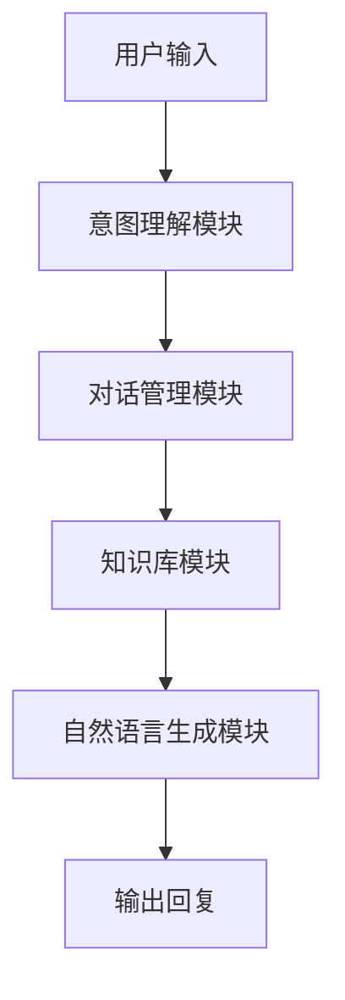
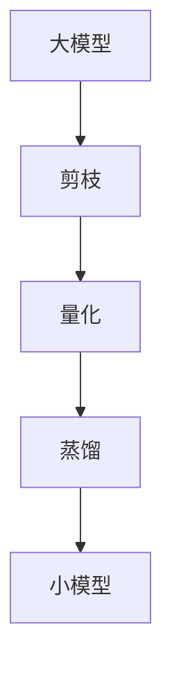

                 


# 从零构建AI Agent：LLM大模型应用开发实践

---

## 关键词：
AI Agent, 大语言模型, LLM, 机器学习, 人工智能, 自然语言处理, 智能系统

---

## 摘要：
本文从零开始，系统地介绍如何构建基于大语言模型（LLM）的AI Agent。文章首先概述了AI Agent和LLM的基本概念，接着深入讲解了自然语言处理技术和LLM的训练机制。然后，详细探讨了AI Agent的核心模块构建，包括意图理解、对话管理、知识库构建与检索。随后，从系统架构设计、项目实战到系统优化与部署，逐步引导读者完成AI Agent的开发实践。最后，展望了AI Agent的未来发展趋势和技术挑战，为读者提供了全面的理论和实践指导。

---

## 目录大纲：

### 第1章：AI Agent与LLM概述
1.1 AI Agent的基本概念  
1.2 LLM的基本原理  
1.3 本书的核心内容与学习方法  

### 第2章：自然语言处理与LLM原理
2.1 自然语言处理基础  
2.2 大语言模型的训练机制  
2.3 LLM的数学模型与公式  

### 第3章：模型训练与优化
3.1 数据预处理与模型选择  
3.2 模型训练策略与超参数调优  
3.3 模型压缩与轻量化部署  

### 第4章：AI Agent的核心模块构建
4.1 意图理解模块  
4.2 对话管理模块  
4.3 知识库构建与检索模块  

### 第5章：系统架构与设计
5.1 系统功能模块划分  
5.2 系统架构设计与实现  
5.3 接口设计与交互流程  

### 第6章：项目实战与案例分析
6.1 项目环境搭建与工具配置  
6.2 代码实现与功能实现  
6.3 案例分析与经验总结  

### 第7章：系统优化与部署
7.1 模型优化与性能调优  
7.2 模型压缩与轻量化部署  
7.3 系统的可解释性与安全性  

### 第8章：AI Agent的未来展望
8.1 技术发展趋势  
8.2 技术挑战与解决方案  
8.3 未来发展建议与展望  

---

## 正文：

### 第1章：AI Agent与LLM概述

#### 1.1 AI Agent的基本概念
AI Agent（人工智能代理）是指能够感知环境、执行任务并做出决策的智能实体。AI Agent可以是软件程序，也可以是硬件设备，其核心目标是通过与环境的交互来实现特定的目标。AI Agent可以分为简单反射型、基于模型的反射型、目标驱动型和效用驱动型等几种类型。

**AI Agent的特点：**
- **自主性**：能够在没有外部干预的情况下自主运作。
- **反应性**：能够感知环境并实时做出反应。
- **目标导向**：具有明确的目标，能够通过行为来实现目标。
- **学习能力**：能够通过经验改进自身的性能。

**AI Agent的应用场景：**
- 智能助手（如Siri、Alexa）
- 智能客服系统
- 自动驾驶系统
- 智能推荐系统

#### 1.2 LLM的基本原理
大语言模型（LLM，Large Language Model）是一种基于深度学习的自然语言处理模型，通常采用Transformer架构。LLM通过大量的文本数据进行训练，能够生成与训练数据类似的文本，并具有理解和生成自然语言的能力。

**LLM的核心技术：**
- **Transformer架构**：由Google在2018年提出，主要由编码器和解码器两部分组成。
- **自注意力机制**：模型能够关注输入文本中的重要部分，从而更好地理解上下文。
- **多层神经网络**：通过多层的非线性变换，模型能够捕捉到复杂的语言模式。

**LLM的优势：**
- **强大的语言理解能力**：能够处理复杂的语义理解任务。
- **生成能力强**：可以生成高质量的文本，如回答问题、写文章等。
- **可扩展性**：通过微调和迁移学习，可以在特定领域内进行优化。

#### 1.3 本书的核心内容与学习方法
本书旨在帮助读者从零开始，系统地构建基于LLM的AI Agent。内容涵盖了AI Agent的基本概念、LLM的原理、模型训练、系统设计与实现等多个方面。学习方法包括：
- 理论学习与实践结合：先理解基本原理，再通过项目实战巩固知识。
- 环境搭建：熟悉开发工具和相关库的安装与配置。
- 持续优化：通过不断调优模型和改进系统架构，提升AI Agent的性能。

---

### 第2章：自然语言处理与LLM原理

#### 2.1 自然语言处理基础
自然语言处理（NLP）是计算机科学与人工智能的交叉领域，旨在让计算机能够理解、生成和处理人类语言。NLP的核心任务包括文本分类、命名实体识别、句法分析、语义理解等。

**NLP的基本流程：**
1. **文本预处理**：包括分词、去除停用词、词干提取等。
2. **特征提取**：将文本转换为数值形式，便于计算机处理。
3. **模型训练**：使用机器学习算法训练模型，使其能够理解和生成文本。

**常用的NLP技术：**
- **分词**：将文本分割成有意义的词语或短语。
- **词向量表示**：将词语表示为向量，常用的有Word2Vec、GloVe等。
- **语言模型**：用于预测下一个词，常见的有n-gram模型、循环神经网络（RNN）和Transformer模型。

#### 2.2 大语言模型的训练机制
大语言模型的训练通常采用监督学习的方式，使用大量的文本数据进行训练。训练过程包括以下几个步骤：
1. **数据预处理**：清洗数据，分词，构建训练样本。
2. **模型初始化**：初始化模型参数，通常使用随机权重。
3. **前向传播**：输入训练样本，计算模型的输出。
4. **损失计算**：计算模型输出与真实标签之间的差异，得到损失值。
5. **反向传播**：通过梯度下降算法，更新模型参数，以最小化损失。

**LLM的训练目标：**
- **优化目标函数**：通常使用交叉熵损失函数，目标是最小化预测与真实值之间的差异。
- **模型优化**：通过调整学习率、批量大小等超参数，提升模型的收敛速度和性能。

**交叉熵损失函数公式：**
$$ L = -\frac{1}{N}\sum_{i=1}^{N} \sum_{j=1}^{M} y_{ij} \log p(y_{ij}|x_i) $$
其中，$N$是训练样本的数量，$M$是词表的大小，$y_{ij}$是标签，$p(y_{ij}|x_i)$是模型在给定输入$x_i$下生成$y_{ij}$的概率。

---

#### 2.3 LLM的数学模型与公式
大语言模型的核心是Transformer架构，由编码器和解码器组成。编码器负责将输入的文本转换为数值表示，解码器负责根据编码器的输出生成目标文本。

**Transformer的结构：**
1. **编码器**：由多个编码层组成，每个编码层包括自注意力机制和前馈网络。
2. **解码器**：由多个解码层组成，每个解码层包括自注意力机制和交叉注意力机制。

**自注意力机制公式：**
$$ \text{Attention}(Q, K, V) = \text{softmax}\left(\frac{QK^T}{\sqrt{d_k}}\right)V $$
其中，$Q$是查询向量，$K$是键向量，$V$是值向量，$d_k$是向量的维度。

**交叉注意力机制公式：**
$$ \text{Cross-Attention}(Q, K, V) = \text{softmax}\left(\frac{QK^T}{\sqrt{d_k}}\right)V $$

---

### 第3章：模型训练与优化

#### 3.1 数据预处理与模型选择
模型的性能很大程度上依赖于训练数据的质量。数据预处理包括文本清洗、分词、去除停用词、数据增强等。选择合适的模型架构是训练成功的关键，常用的模型包括BERT、GPT、T5等。

**数据清洗步骤：**
1. **去除特殊字符**：删除文本中的标点符号、数字等非字母字符。
2. **分词**：将文本分割成词语或短语。
3. **去除停用词**：移除常见词汇，如“and”、“the”等，以减少噪音。
4. **数据增强**：通过同义词替换、句式变换等方式增加数据多样性。

#### 3.2 模型训练策略与超参数调优
训练策略包括批量训练、学习率衰减、早停等。超参数调优是优化模型性能的重要步骤，常用的超参数包括学习率、批量大小、训练轮数等。

**批量训练与学习率衰减：**
- 批量训练可以提高训练效率，减少计算成本。
- 学习率衰减可以避免模型在后期训练中出现过拟合现象。

**超参数调优方法：**
1. **网格搜索**：遍历所有可能的超参数组合，选择最优组合。
2. **随机搜索**：随机选择超参数组合，减少搜索空间。
3. **贝叶斯优化**：基于概率模型，选择最优超参数。

---

#### 3.3 模型压缩与轻量化部署
模型压缩是减少模型大小、提升推理速度的重要手段。常用的方法包括剪枝、知识蒸馏、量化等。

**模型剪枝：**
- 删除模型中冗余的参数，减少模型大小。
- 使用L1/L2正则化，惩罚项的加入可以减少参数的绝对值，从而减少模型大小。

**知识蒸馏：**
- 将大模型的知识迁移到小模型中，保持小模型的性能。
- 常用的蒸馏方法包括软目标蒸馏和硬目标蒸馏。

**模型量化：**
- 将模型中的浮点数参数转换为较低精度的整数，如Int8、Int4等。
- 量化可以显著减少模型大小，同时保持模型的性能。

---

### 第4章：AI Agent的核心模块构建

#### 4.1 意图理解模块
意图理解是AI Agent的核心任务之一，旨在理解用户输入的文本所表达的意图。

**意图分类模型：**
1. **基于特征的分类**：提取文本特征，使用机器学习算法（如SVM、随机森林）进行分类。
2. **基于深度学习的分类**：使用RNN、LSTM、Transformer等模型进行分类。

**意图分类流程：**
1. **文本预处理**：分词、去除停用词等。
2. **特征提取**：将文本转换为数值表示。
3. **模型训练**：训练意图分类模型。
4. **意图预测**：根据输入文本，预测意图类别。

---

#### 4.2 对话管理模块
对话管理是AI Agent与用户交互的核心模块，负责维护对话状态，生成合适的回复。

**对话管理的挑战：**
- 对话状态跟踪：需要维护当前对话的上下文信息。
- 多轮对话：需要处理用户的多轮输入，保持对话连贯性。
- 情境理解：需要理解用户的意图和情感倾向。

**常用的对话管理方法：**
1. **基于规则的对话管理**：根据预定义的规则生成回复。
2. **基于深度学习的对话管理**：使用神经网络模型（如Transformer）生成回复。
3. **混合方法**：结合规则和深度学习，提高对话系统的灵活性和准确性。

---

#### 4.3 知识库构建与检索模块
知识库是AI Agent的重要组成部分，用于存储和检索知识。

**知识库构建步骤：**
1. **数据收集**：收集相关领域的数据，如文本、结构化数据等。
2. **数据预处理**：清洗数据，提取关键信息。
3. **知识表示**：将知识以结构化形式存储，如知识图谱、向量数据库等。
4. **知识推理**：根据已有知识进行推理，生成新的知识。

**知识检索方法：**
1. **基于关键词的检索**：根据输入的关键词，检索相关知识。
2. **基于向量的检索**：将输入文本转换为向量，检索最相似的知识。
3. **基于规则的检索**：根据预定义的规则，检索相关知识。

---

### 第5章：系统架构与设计

#### 5.1 系统功能模块划分
AI Agent的系统架构需要根据功能需求进行模块划分，常见的模块包括：
1. **意图理解模块**：负责解析用户的意图。
2. **对话管理模块**：负责维护对话状态，生成回复。
3. **知识库模块**：负责存储和检索知识。
4. **自然语言生成模块**：负责生成自然语言回复。

**功能模块划分示意图：**



---

#### 5.2 系统架构设计与实现
系统架构设计需要考虑模块之间的交互关系，选择合适的通信方式和数据存储方式。

**系统架构设计步骤：**
1. **需求分析**：明确系统功能需求和性能需求。
2. **模块划分**：根据功能需求划分模块。
3. **接口设计**：定义模块之间的接口和通信协议。
4. **系统实现**：根据设计文档，逐步实现各模块功能。
5. **系统集成**：将各模块集成到一起，进行整体测试。

**系统架构示意图：**


---

#### 5.3 接口设计与交互流程
接口设计需要明确各模块之间的交互方式和数据格式，常见的接口设计包括RESTful API、gRPC等。

**交互流程：**
1. **用户输入**：用户通过输入设备发送指令或问题。
2. **意图理解**：系统解析用户的意图，生成相应的指令。
3. **对话管理**：系统根据意图，生成回复内容。
4. **知识检索**：系统检索相关知识，生成回复内容。
5. **自然语言生成**：系统生成自然语言回复，返回给用户。

---

### 第6章：项目实战与案例分析

#### 6.1 项目环境搭建与工具配置
项目实战需要搭建合适的开发环境，安装必要的工具和库。

**开发环境搭建步骤：**
1. **安装Python**：选择合适的Python版本，建议使用Python 3.8或更高。
2. **安装必要的库**：如TensorFlow、PyTorch、Hugging Face Transformers等。
3. **配置开发工具**：如Jupyter Notebook、VS Code等。
4. **下载数据集**：选择合适的训练数据集，如公开的NLP数据集。

---

#### 6.2 代码实现与功能实现
根据系统架构设计，逐步实现各模块功能。

**代码实现步骤：**
1. **数据预处理**：清洗数据，分词，构建训练样本。
2. **模型训练**：选择合适的模型架构，训练模型。
3. **意图分类**：实现意图分类模块，测试模型性能。
4. **对话管理**：实现对话管理模块，测试对话流程。
5. **知识检索**：实现知识检索模块，测试检索效果。

**代码示例（意图分类）：**

```python
import torch
from torch import nn
from torch.utils.data import DataLoader

# 数据集类
class IntentDataset(torch.utils.data.Dataset):
    def __init__(self, texts, labels):
        self.texts = texts
        self.labels = labels
    def __len__(self):
        return len(self.texts)
    def __getitem__(self, idx):
        return self.texts[idx], self.labels[idx]

# 模型类
class IntentClassifier(nn.Module):
    def __init__(self, vocab_size, embed_dim, hidden_dim, output_dim):
        super(IntentClassifier, self).__init__()
        self.embedding = nn.Embedding(vocab_size, embed_dim)
        self.lstm = nn.LSTM(embed_dim, hidden_dim, batch_first=True)
        self.fc = nn.Linear(hidden_dim, output_dim)
    def forward(self, x):
        embeds = self.embedding(x)
        out, _ = self.lstm(embeds)
        out = self.fc(out[:, -1, :])
        return out

# 训练函数
def train_model(model, dataloader, optimizer, criterion, num_epochs):
    for epoch in range(num_epochs):
        for inputs, labels in dataloader:
            outputs = model(inputs)
            loss = criterion(outputs, labels)
            loss.backward()
            optimizer.step()
            optimizer.zero_grad()
```

---

#### 6.3 案例分析与经验总结
通过实际案例分析，总结项目开发的经验和教训。

**案例分析：**
- **项目背景**：如构建一个智能客服系统。
- **需求分析**：识别用户的意图，如查询订单、退换货等。
- **系统设计**：设计意图分类模块、对话管理模块等。
- **实现过程**：从数据收集到模型训练，再到系统集成。

**经验总结：**
- **数据质量**：数据质量直接影响模型性能，数据预处理非常重要。
- **模型选择**：选择合适的模型架构，避免过度复杂的模型。
- **系统架构**：模块化设计，便于后续维护和扩展。

---

### 第7章：系统优化与部署

#### 7.1 模型优化与性能调优
模型优化是提升AI Agent性能的重要手段，包括模型压缩、算法优化、分布式训练等。

**模型优化方法：**
1. **剪枝**：删除模型中冗余的参数，减少模型大小。
2. **量化**：将模型中的浮点数参数转换为较低精度的整数，减少模型大小。
3. **知识蒸馏**：将大模型的知识迁移到小模型中，保持小模型的性能。

---

#### 7.2 模型压缩与轻量化部署
模型压缩是减少模型大小、提升推理速度的重要手段，常用的方法包括剪枝、量化、知识蒸馏等。

**模型压缩示意图：**



---

#### 7.3 系统的可解释性与安全性
系统的可解释性与安全性是AI Agent的重要属性，需要在开发过程中加以考虑。

**系统的可解释性：**
- **模型解释**：通过可视化工具（如LIME、SHAP）解释模型的预测结果。
- **日志记录**：记录系统的运行日志，便于问题排查。

**系统的安全性：**
- **数据隐私保护**：确保用户数据的安全，避免数据泄露。
- **防止攻击**：设计防护机制，防止恶意攻击。

---

### 第8章：AI Agent的未来展望

#### 8.1 技术发展趋势
AI Agent的技术发展趋势包括多模态发展、人机协作增强、边缘计算应用等。

**多模态发展：**
- **视觉-语言模型**：结合图像和文本信息，提升AI Agent的感知能力。
- **语音-语言模型**：结合语音和文本信息，提升AI Agent的交互能力。

**人机协作增强：**
- **增强的对话能力**：通过人机协作，提升对话的自然性和连贯性。
- **多语言支持**：支持多种语言，扩大AI Agent的应用范围。

**边缘计算应用：**
- **本地部署**：AI Agent可以在边缘设备上本地部署，减少对云服务的依赖。
- **低延迟交互**：边缘计算可以实现低延迟的交互，提升用户体验。

---

#### 8.2 技术挑战与解决方案
AI Agent的发展面临诸多技术挑战，如数据隐私、模型可解释性、计算资源需求等。

**技术挑战：**
- **数据隐私**：如何在保护用户隐私的前提下，提升AI Agent的性能。
- **模型可解释性**：如何让AI Agent的决策过程更加透明，便于用户理解和信任。
- **计算资源需求**：如何在资源受限的环境中，部署高性能的AI Agent。

**解决方案：**
- **联邦学习**：通过联邦学习，实现数据隐私保护下的模型训练。
- **可解释性模型**：设计可解释的模型架构，便于用户理解和信任。
- **轻量化技术**：通过模型压缩、量化等技术，减少模型对计算资源的需求。

---

#### 8.3 未来发展建议与展望
未来，AI Agent将在更多领域得到应用，技术也将不断进步。建议开发者：
1. **关注前沿技术**：密切关注AI领域的最新技术，如多模态模型、可解释性模型等。
2. **注重伦理与安全**：在开发过程中，注重数据隐私和系统安全性。
3. **加强跨学科合作**：AI Agent的开发需要跨学科合作，如计算机科学、认知科学等。

---

## 结语
从零构建AI Agent是一项复杂的系统工程，涉及自然语言处理、机器学习、系统架构等多个方面。通过本文的系统介绍和实践指导，读者可以逐步掌握AI Agent的开发技能，为未来的AI应用开发打下坚实的基础。希望本文能够为读者提供有价值的参考和启发，让我们共同迎接AI Agent时代的到来！

