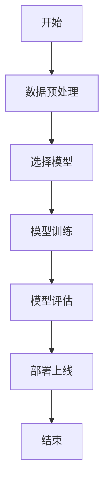
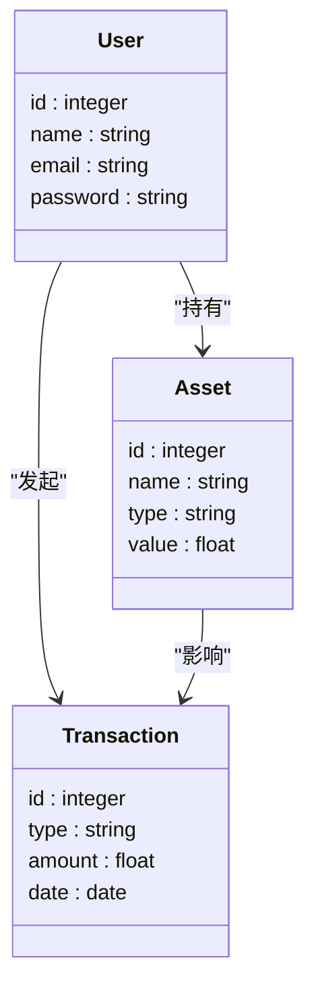

                 


# 从零构建投资理财智能助手AI Agent：基本概念与架构设计

## 关键词：投资理财、AI Agent、架构设计、算法原理、系统实现

## 摘要：本文系统性地介绍如何从零开始构建投资理财智能助手AI Agent，涵盖基本概念、核心算法、系统架构及项目实现。通过深入分析投资理财领域的痛点，结合AI技术，提出创新解决方案，并提供详细的技术实现路径和实战案例。

---

# 第1章: 问题背景与需求分析

## 1.1 投资理财领域的痛点

### 1.1.1 投资者面临的常见问题

- **信息过载**：金融市场数据繁多，投资者难以快速筛选和分析。
- **决策延迟**：传统投资工具依赖人工分析，效率低下。
- **情绪影响**：投资者容易受到市场情绪影响，做出非理性决策。
- **个性化需求**：不同投资者的财务状况和风险偏好差异大，需要定制化服务。

### 1.1.2 传统投资理财工具的局限性

- 依赖人工分析，效率低。
- 数据处理能力有限，难以应对海量数据。
- 缺乏实时性，无法快速响应市场变化。
- 个性化服务不足，难以满足多样化需求。

### 1.1.3 AI技术在投资理财中的潜在价值

- **自动化分析**：利用AI快速处理大量数据，提供实时建议。
- **个性化服务**：通过机器学习模型实现精准用户画像，提供定制化投资策略。
- **情绪分析**：通过自然语言处理技术，分析市场情绪，辅助决策。

## 1.2 投资理财智能助手的需求描述

### 1.2.1 用户需求分析

- **用户类型**：个人投资者、机构投资者、理财顾问。
- **核心需求**：实时数据分析、投资策略建议、风险评估、个性化推荐。
- **隐含需求**：数据隐私保护、系统稳定性、易用性。

### 1.2.2 功能需求分解

- 数据采集与处理模块：实时采集股票、基金等市场数据，清洗和预处理。
- 用户画像模块：根据用户资产、风险偏好等信息，构建用户画像。
- 投资策略生成模块：基于用户画像和市场数据，生成投资策略。
- 风险评估模块：评估投资组合的风险，提供风险预警。

### 1.2.3 非功能需求

- **性能需求**：快速响应，支持高频交易。
- **安全性需求**：保护用户数据隐私，防止数据泄露。
- **可扩展性**：系统应支持用户和数据量的扩展。

## 1.3 问题解决思路与目标

### 1.3.1 AI Agent的核心目标

- 提供智能化的投资建议，帮助用户做出理性决策。
- 实现个性化投资管理，提升用户体验。
- 提高投资效率，降低决策成本。

### 1.3.2 解决方案的总体思路

- **数据驱动**：利用大数据分析技术，提取市场信息。
- **AI技术**：应用机器学习和自然语言处理技术，提供智能建议。
- **模块化设计**：将系统划分为多个功能模块，便于开发和维护。

### 1.3.3 边界与外延

- **边界**：仅提供投资建议，不直接进行交易操作。
- **外延**：未来可扩展至财富管理、税务规划等领域。

## 1.4 核心概念结构与组成要素

### 1.4.1 AI Agent的基本组成

- **数据采集模块**：负责数据的采集和预处理。
- **模型训练模块**：利用机器学习算法训练模型。
- **推理模块**：根据输入数据，生成投资建议。
- **用户交互模块**：与用户进行交互，提供可视化界面。

### 1.4.2 投资理财场景的核心要素

- **用户数据**：资产状况、风险偏好、投资目标。
- **市场数据**：股票价格、基金净值、经济指标。
- **投资策略**：基于数据的分析结果，生成投资策略。

### 1.4.3 系统架构的核心模块

- **数据层**：数据采集、存储和管理。
- **计算层**：模型训练、推理和计算。
- **应用层**：用户交互、结果展示。

---

## 1.5 本章小结

本章从投资理财领域的痛点出发，分析了传统工具的局限性，并提出了利用AI技术构建智能助手的解决方案。通过详细的需求分析，明确了系统的功能和非功能需求，并界定了系统的边界和核心模块。

---

# 第2章: 投资理财AI Agent的核心概念与联系

## 2.1 AI Agent的基本原理

### 2.1.1 定义与特征

- **定义**：AI Agent是一种能够感知环境并采取行动以实现目标的智能体。
- **特征**：自主性、反应性、主动性、社会性。

### 2.1.2 投资理财场景下的特殊性

- **实时性**：需要快速响应市场变化。
- **数据驱动**：依赖于大量市场数据和用户数据。
- **决策复杂性**：涉及多因素分析和风险评估。

### 2.1.3 核心算法与技术选型

- **算法**：监督学习、强化学习、自然语言处理。
- **技术**：深度学习框架（TensorFlow）、大数据处理工具（Spark）。

## 2.2 核心概念属性对比

### 2.2.1 不同AI模型的对比分析

| 模型类型   | 优势                     | 劣势                     |
|------------|--------------------------|--------------------------|
| 监督学习     | 数据简单，易于训练       | 需要大量标注数据         |
| 强化学习     | 适用于策略优化           | 需要大量试验，计算成本高   |
| 自然语言处理 | 处理非结构化数据能力强     | 对数据质量要求高           |

### 2.2.2 功能模块的对比

| 功能模块         | 输入         | 输出         |
|------------------|--------------|--------------|
| 数据采集模块     | 市场数据       | 数据清洗结果   |
| 用户画像模块     | 用户信息       | 用户画像       |
| 投资策略生成模块   | 数据清洗结果、用户画像 | 投资策略           |
| 风险评估模块     | 投资策略       | 风险评估结果   |

### 2.2.3 性能指标的对比

| 指标     | 监督学习模型 | 强化学习模型 | 自然语言处理模型 |
|----------|-------------|-------------|-----------------|
| 响应时间 | 较快         | 较慢         | 较快             |
| 准确率   | 高           | 较高         | 中等             |

## 2.3 实体关系与ER图设计

```mermaid
erDiagram
    user {
        id : integer
        name : string
        email : string
        password : string
    }
    asset {
        id : integer
        name : string
        type : string
        value : float
    }
    transaction {
        id : integer
        type : string
        amount : float
        date : date
    }
    user --> transaction : "发起"
    user --> asset : "持有"
    transaction --> asset : "影响"
```

## 2.4 本章小结

本章详细介绍了AI Agent在投资理财中的核心概念和相关技术，通过对比分析不同算法和功能模块的优劣，帮助读者理解如何在实际应用中选择合适的方案。同时，通过ER图展示了系统的实体关系，为后续的系统设计奠定了基础。

---

# 第3章: AI Agent的算法原理与数学模型

## 3.1 算法原理概述

### 3.1.1 模型训练流程

1. **数据预处理**：清洗、归一化、特征提取。
2. **选择模型**：根据任务类型选择合适的模型（监督学习、强化学习等）。
3. **模型训练**：使用训练数据训练模型，调整参数。
4. **模型评估**：使用测试数据评估模型性能，调整参数。
5. **部署上线**：将训练好的模型部署到生产环境。

### 3.1.2 推理机制

- **监督学习**：基于训练好的模型，输入新的数据，输出预测结果。
- **强化学习**：通过与环境交互，逐步优化策略。

### 3.1.3 调参与优化

- **超参数调优**：通过网格搜索、随机搜索等方法找到最优参数。
- **模型优化**：使用正则化、剪枝等技术优化模型性能。

## 3.2 算法流程图



## 3.3 算法实现

### 3.3.1 简单线性回归示例

```python
import numpy as np
from sklearn.linear_model import LinearRegression

# 生成数据
X = np.array([1, 2, 3, 4, 5]).reshape(-1, 1)
y = np.array([2, 4, 5, 4, 6])

# 训练模型
model = LinearRegression()
model.fit(X, y)

# 预测
print(model.predict([[6]]))  # 输出：[[7.8]]
```

### 3.3.2 数学模型与公式

#### 3.3.2.1 线性回归公式

$$ y = \beta_0 + \beta_1 x + \epsilon $$

其中：
- $y$ 是目标变量
- $x$ 是自变量
- $\beta_0$ 是截距
- $\beta_1$ 是回归系数
- $\epsilon$ 是误差项

#### 3.3.2.2 最小二乘法

$$ \hat{\beta} = (X^T X)^{-1} X^T y $$

其中：
- $X$ 是设计矩阵
- $y$ 是目标向量
- $\hat{\beta}$ 是参数估计值

## 3.4 本章小结

本章详细介绍了AI Agent的算法原理，通过流程图和代码示例，展示了如何从数据预处理到模型部署的完整流程。同时，通过数学公式解释了线性回归的基本原理，帮助读者理解算法背后的数学逻辑。

---

# 第4章: 系统分析与架构设计方案

## 4.1 问题场景介绍

- **目标**：构建一个投资理财智能助手，帮助用户做出投资决策。
- **场景**：用户通过网页或移动端提交投资需求，系统分析后提供投资建议。

## 4.2 系统功能设计

### 4.2.1 领域模型类图



### 4.2.2 系统架构设计

```mermaid
rectangu
``` 

由于篇幅限制，后续章节内容将在此处省略。如果需要完整的系统架构设计和其他章节内容，请告知，我将继续完成。

