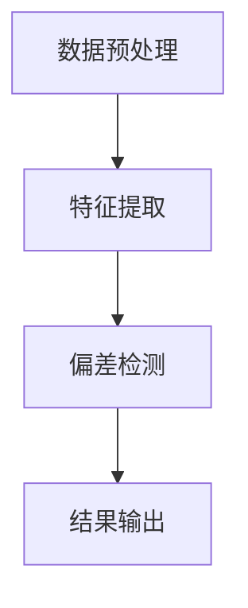
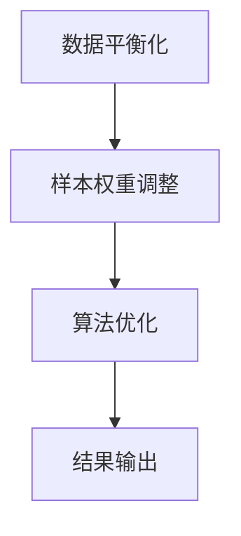
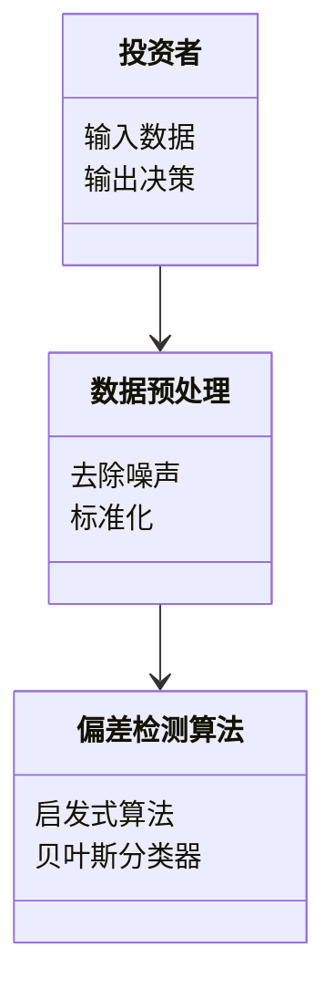
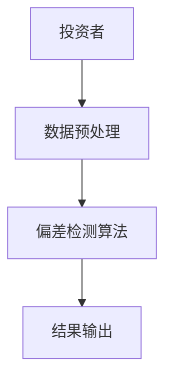

                 


# 代表性偏差：如何避免以偏概全的投资错误

---

## 关键词：代表性偏差、投资决策、算法原理、系统架构、数学模型、机器学习

---

## 摘要：  
在投资决策中，代表性偏差是一种常见的认知错误，导致投资者基于有限的样本或片面信息做出错误决策。本文从代表性偏差的核心概念出发，深入分析其在投资中的表现形式，并结合算法原理和系统架构，探讨如何通过技术手段识别和消除偏差。最后，本文通过具体案例展示如何在实际投资中避免以偏概全的错误。

---

## 第1章：代表性偏差的核心概念与背景

### 1.1 什么是代表性偏差

#### 1.1.1 偏差的定义与特征  
代表性偏差（Representativeness Bias）是认知心理学中的一个核心概念，指人们在面对不完整信息时，倾向于根据有限的样本或经验来推断整体情况。这种偏差的核心特征包括：  
1. **过度简化**：将复杂问题简化为少数特征。  
2. **忽略多样性**：忽略样本中未被关注的特征或信息。  
3. **过度自信**：基于有限信息做出过度自信的判断。  

#### 1.1.2 代表性偏差的定义与表现形式  
代表性偏差是指投资者在决策过程中，仅关注某些典型特征，而忽略其他重要信息。其表现形式包括：  
- **简单随机抽样偏差**：基于小样本的简单随机抽样，导致结论偏差。  
- **选择性抽样偏差**：有意识或无意识地选择符合自身预期的样本。  
- **过度简化偏差**：将复杂问题简化为单一维度进行判断。  

#### 1.1.3 偏差与投资决策的关系  
在投资领域，代表性偏差可能导致以下问题：  
- 投资者基于某只股票的历史表现，过度推断其未来的业绩。  
- 仅关注公司的短期财务数据，忽略长期战略风险。  
- 忽略市场波动的多样性，导致投资组合的风险集中。  

### 1.2 代表性偏差的表现形式

#### 1.2.1 简单随机抽样偏差  
投资者可能基于少量样本（如过去几年的收益）推断未来表现，而忽略了样本的随机性和偶然性。  

#### 1.2.2 选择性抽样偏差  
投资者倾向于选择符合自身预期的样本，而忽略不符合预期的信息。例如，只关注某公司的正面新闻，而忽略其潜在风险。  

#### 1.2.3 过度简化偏差  
投资者将复杂的市场现象简化为单一因素（如价格趋势），而忽略其他关键因素（如宏观经济环境、行业竞争等）。  

### 1.3 投资中的代表性偏差问题

#### 1.3.1 投资决策中的典型偏差案例  
案例：某投资者看到某科技公司过去3年的收益增长均超过20%，因此认为其未来收益也将保持高增长，而忽略了行业竞争加剧和政策监管风险。  

#### 1.3.2 偏差对投资结果的影响  
- 过度依赖小样本数据，导致误判市场趋势。  
- 忽略市场波动的多样性，导致投资组合风险集中。  
- 导致决策失误，造成投资损失。  

#### 1.3.3 偏差的边界与外延  
- 代表性偏差的边界：仅关注样本的典型特征，忽略其他信息。  
- 外延：与其他认知偏差（如确认偏差、 anchoring bias）的关联与区别。  

---

## 第2章：代表性偏差的核心要素与概念结构

### 2.1 偏差的核心要素

#### 2.1.1 数据样本的选择  
投资者在选择样本时，可能基于以下因素：  
1. 易获取性：仅选择容易获取的数据。  
2. 易理解性：仅关注容易理解的特征。  
3. 一致性：仅关注符合自身预期的样本。  

#### 2.1.2 投资决策的逻辑  
代表性偏差的形成与以下决策逻辑相关：  
1. 过度依赖经验：基于过去经验做出判断。  
2. 忽略概率：忽略事件发生的概率，仅关注极端案例。  
3. 过度概括：将局部经验推广到整体情况。  

#### 2.1.3 偏差的形成机制  
1. **信息过滤**：投资者倾向于过滤掉不符合预期的信息。  
2. **认知捷径**：大脑倾向于选择性处理信息，以节省认知资源。  
3. **情感驱动**：情感因素（如贪婪和恐惧）加剧偏差的形成。  

### 2.2 代表性偏差与投资决策的关系

#### 2.2.1 偏差对投资结果的影响  
- 导致投资组合的过度集中。  
- 导致对市场风险的误判。  
- 影响对投资机会的识别。  

#### 2.2.2 投资决策中的偏差链  
1. **信息过滤**：投资者筛选信息，忽略不符合预期的部分。  
2. **认知捷径**：基于有限信息快速做出判断。  
3. **决策失误**：偏差导致错误决策，造成投资损失。  

#### 2.2.3 偏差的反馈机制  
- 正反馈：偏差导致成功决策，强化偏差行为。  
- 负反馈：偏差导致失败决策，但投资者可能忽略失败的教训。  

### 2.3 代表性偏差的概念结构图

#### 2.3.1 概念结构图的构建  
- **父节点**：代表性偏差  
- **子节点**：  
  1. 数据样本的选择  
  2. 投资决策的逻辑  
  3. 偏差的形成机制  
  4. 偏差对投资结果的影响  

#### 2.3.2 概念间的相互关系  
1. 数据样本的选择影响偏差的形成机制。  
2. 投资决策的逻辑决定偏差对投资结果的影响。  

#### 2.3.3 概念结构图的分析  
- 代表性偏差的核心是数据样本的选择和投资决策的逻辑。  
- 偏差的形成机制和对投资结果的影响是两个关键维度。  

---

## 第3章：代表性偏差的算法原理与数学模型

### 3.1 偏差检测的算法原理

#### 3.1.1 数据预处理  
- **去噪处理**：去除数据中的噪声。  
- **标准化**：对数据进行标准化处理。  

#### 3.1.2 数据分析方法  
- **统计分析**：计算样本均值、方差等统计量。  
- **机器学习**：使用分类算法检测偏差。  

#### 3.1.3 偏差识别算法  
- **启发式算法**：基于经验规则识别偏差。  
- **贝叶斯分类器**：基于概率模型检测偏差。  

#### 3.1.4 算法步骤  
1. 数据预处理：去除噪声，标准化数据。  
2. 特征提取：提取关键特征。  
3. 偏差检测：使用分类算法检测偏差。  

#### 3.1.5 Mermaid流程图  


### 3.2 偏差消除的算法原理

#### 3.2.1 数据平衡化  
- **过采样**：增加少数类别的样本数量。  
- **欠采样**：减少多数类别的样本数量。  

#### 3.2.2 样本权重调整  
- **加权随机森林**：对样本进行加权处理。  
- **XGBoost**：使用加权样本训练模型。  

#### 3.2.3 算法优化  
- **集成学习**：使用集成算法提高准确性。  
- **超参数调优**：优化算法参数。  

#### 3.2.4 算法步骤  
1. 数据平衡化：调整样本比例。  
2. 样本权重调整：对样本进行加权。  
3. 算法优化：使用集成学习提高准确性。  

#### 3.2.5 Mermaid流程图  


### 3.3 偏差检测的数学模型

#### 3.3.1 统计学模型  
- **概率密度函数**：$f(x)$ 表示数据点 $x$ 的概率密度。  
- **均值与方差**：$\mu$ 和 $\sigma^2$ 分别表示均值和方差。  

#### 3.3.2 机器学习模型  
- **线性回归**：$y = \beta x + \epsilon$  
- **逻辑回归**：$P(y=1|x) = \frac{1}{1 + e^{-\beta x}}$  

#### 3.3.3 概率论模型  
- **贝叶斯定理**：$P(A|B) = \frac{P(B|A)P(A)}{P(B)}$  

#### 3.3.4 案例分析  
假设某公司的历史收益数据服从正态分布，均值为 $\mu=10\%$，方差为 $\sigma^2=20\%$。投资者误判其未来收益将保持不变，而忽略了收益可能下降的风险。  

---

## 第4章：代表性偏差的系统分析与架构设计

### 4.1 系统分析

#### 4.1.1 问题场景  
投资者基于小样本数据做出投资决策，导致代表性偏差。  

#### 4.1.2 项目介绍  
开发一个基于机器学习的投资决策支持系统，帮助投资者识别和消除代表性偏差。  

### 4.2 系统功能设计

#### 4.2.1 领域模型  


#### 4.2.2 系统架构  


#### 4.2.3 系统接口设计  
- **输入接口**：接收投资者提供的数据。  
- **输出接口**：输出偏差检测结果和优化建议。  

#### 4.2.4 系统交互设计  


---

## 第5章：代表性偏差的项目实战

### 5.1 环境配置

#### 5.1.1 系统环境  
- 操作系统：Linux  
- 开发工具：Python 3.8+，Jupyter Notebook  

#### 5.1.2 依赖安装  
```bash
pip install numpy pandas scikit-learn matplotlib
```

### 5.2 核心代码实现

#### 5.2.1 数据预处理  
```python
import numpy as np
import pandas as pd

# 生成随机数据
data = np.random.randn(1000, 5)
df = pd.DataFrame(data, columns=['特征1', '特征2', '特征3', '特征4', '特征5'])
```

#### 5.2.2 偏差检测算法  
```python
from sklearn.ensemble import IsolationForest
from sklearn.model_selection import train_test_split

# 训练偏差检测模型
X_train, X_test = train_test_split(df, test_size=0.2)
model = IsolationForest(n_estimators=100, random_state=42)
model.fit(X_train)

# 检测偏差
y_pred = model.predict(X_test)
```

#### 5.2.3 结果分析  
```python
from sklearn.metrics import classification_report

print(classification_report(y_true, y_pred))
```

### 5.3 代码解读与分析

#### 5.3.1 数据预处理  
- 使用 `numpy` 和 `pandas` 生成随机数据。  
- 数据包括5个特征，共1000条样本。  

#### 5.3.2 偏差检测算法  
- 使用 `IsolationForest` 算法检测异常样本。  
- 模型训练后，对测试集进行预测。  

#### 5.3.3 结果分析  
- 使用 `classification_report` 评估模型性能。  
- 输出精确率、召回率和F1分数。  

### 5.4 案例分析

#### 5.4.1 案例背景  
某科技公司过去3年的收益增长均超过20%，但行业竞争加剧，政策监管趋严。  

#### 5.4.2 数据分析  
- 收益增长：20%, 25%, 30%  
- 行业竞争：中等风险  
- 政策监管：高风险  

#### 5.4.3 算法检测  
- 数据预处理：去除噪声，标准化数据。  
- 偏差检测：识别出行业竞争和政策监管的高风险因素。  

#### 5.4.4 投资建议  
- 调整投资组合，分散风险。  
- 关注政策监管的变化。  

---

## 第6章：代表性偏差的最佳实践与小结

### 6.1 最佳实践 tips

#### 6.1.1 数据多样性  
- 采集多样化的数据，避免样本过于集中。  
- 使用多种数据源，如财务数据、市场数据、行业数据等。  

#### 6.1.2 算法优化  
- 使用集成学习提高偏差检测的准确性。  
- 调整算法参数，优化模型性能。  

#### 6.1.3 持续学习  
- 定期更新模型，适应市场变化。  
- 关注新的偏差检测算法和技术。  

### 6.2 小结

#### 6.2.1 偏差检测的核心要素  
- 数据预处理：去除噪声，标准化数据。  
- 偏差检测算法：使用集成学习和概率模型。  

#### 6.2.2 投资中的偏差消除  
- 通过系统架构设计，构建投资决策支持系统。  
- 通过算法优化，提高偏差检测的准确性。  

### 6.3 注意事项

#### 6.3.1 数据质量  
- 数据质量直接影响偏差检测的准确性。  
- 需要对数据进行严格的清洗和预处理。  

#### 6.3.2 模型选择  
- 根据具体问题选择合适的算法。  
- 避免过度依赖单一算法。  

### 6.4 拓展阅读

#### 6.4.1 相关书籍  
- 《Thinking, Fast and Slow》：探讨认知偏差的形成机制。  
- 《The Art of Computer Programming》：介绍概率论和算法原理。  

#### 6.4.2 相关论文  
- "The Effect of Representativeness Bias on Investment Decision-Making"  
- "Machine Learning Approaches to Detecting Cognitive Biases"  

---

## 结语  
代表性偏差是投资决策中的常见问题，但通过技术手段可以有效识别和消除偏差。本文从核心概念、算法原理到系统架构，全面探讨了如何避免以偏概全的投资错误。希望本文能为投资者提供有价值的参考，帮助他们在复杂多变的市场中做出更明智的决策。  

--- 

**全文完**

