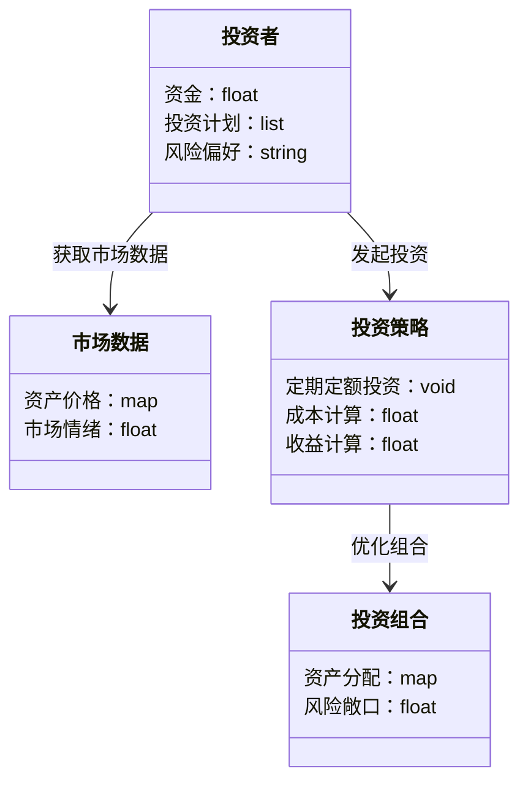
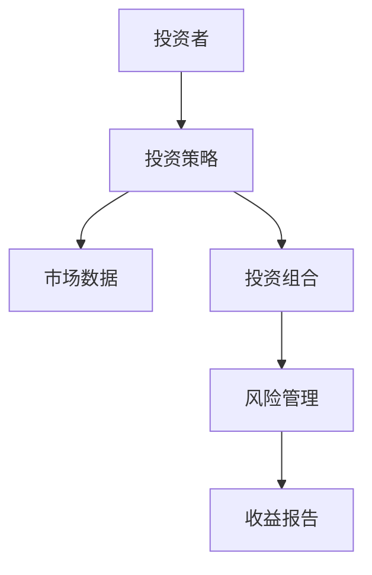
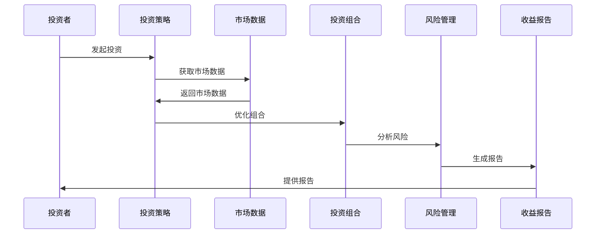

                 


# 价值平均投资法：利用市场波动的智慧策略

> 关键词：价值平均投资法、平均成本法、市场波动、投资策略、复利效应

> 摘要：本文详细介绍了价值平均投资法的基本概念、数学模型、系统设计、项目实战和最佳实践。通过分析市场波动的规律，结合实际案例，探讨了如何利用价值平均投资法优化投资组合，降低投资风险，实现长期稳健收益。

---

# 第1章: 投资的基本概念与市场波动

## 1.1 投资的基本原理

### 1.1.1 复利效应的定义与作用

复利效应是投资中最基本且最重要的概念之一。它指的是投资收益的再投资所产生的额外收益。复利效应的核心在于“利滚利”，即每期的收益会在下一期继续产生收益，从而实现指数级增长。复利效应的数学公式可以表示为：

$$
A = P \times (1 + r)^n
$$

其中：
- \( A \) 表示最终金额
- \( P \) 表示初始本金
- \( r \) 表示年化收益率
- \( n \) 表示投资年数

复利效应的作用在长期投资中尤为明显。例如，投资100元，年化收益率为10%，投资10年后的金额为：

$$
A = 100 \times (1 + 0.1)^{10} = 328.905
$$

### 1.1.2 投资市场的基本特性

投资市场具有波动性和不确定性，但同时也存在一定的规律性。市场的波动性主要由供需关系、市场情绪和宏观经济因素决定。长期来看，市场呈现出向上的趋势，但短期内可能会受到各种因素的影响而大幅波动。

### 1.1.3 投资风险与收益的平衡

投资的本质是通过承担风险来获取收益。风险与收益之间存在正相关关系，即收益越高，风险通常越大。投资者需要根据自身的风险承受能力，选择合适的投资策略。

---

## 1.2 市场波动的规律

### 1.2.1 市场波动的周期性

市场的波动具有一定的周期性，通常表现为上涨和下跌的交替出现。周期的长度因市场环境和经济周期而异，但长期来看，市场最终会回归其内在价值。

### 1.2.2 市场情绪对价格的影响

市场情绪是影响价格的重要因素。当市场情绪乐观时，投资者倾向于追涨，推动价格上涨；当市场情绪悲观时，投资者倾向于抛售，导致价格下跌。市场情绪的波动可以用情绪指数（如恐慌指数）来衡量。

### 1.2.3 市场波动的随机性与可预测性

市场波动既具有随机性，又存在一定的可预测性。随机性主要源于市场的不可预测性事件（如自然灾害、战争等），而可预测性则来源于对宏观经济指标和市场趋势的分析。

---

## 1.3 价值投资的核心理念

### 1.3.1 价值投资的定义

价值投资是一种投资策略，强调以低于内在价值的价格购买优质资产。其核心在于寻找市场先生的错误定价，通过长期持有优质资产，实现价值回归带来的收益。

### 1.3.2 价值投资的基本原则

- **安全边际**：购买价格低于内在价值。
- **长期持有**：耐心等待价值回归。
- **分散投资**：降低单一资产的风险。

### 1.3.3 价值投资与市场波动的关系

价值投资的成功依赖于市场波动。当市场波动导致资产价格低于内在价值时，投资者可以通过价值平均投资法，逐步建仓，摊低成本，实现收益。

---

# 第2章: 价值平均投资法的起源与特点

## 2.1 价值平均投资法的起源

### 2.1.1 价值平均投资法的提出者

价值平均投资法是由投资大师约翰·邓普顿提出的。他强调通过定期定额投资，利用市场波动，摊低成本，实现长期收益。

### 2.1.2 价值平均投资法的理论基础

价值平均投资法的理论基础是复利效应和市场波动。通过定期投资，投资者可以在市场高点和低点之间分散投资，降低整体成本。

### 2.1.3 价值平均投资法的发展历程

随着投资理论的发展和实践的深入，价值平均投资法逐渐被广泛应用。它结合了价值投资和定投的优点，成为一种经典的长期投资策略。

---

## 2.2 价值平均投资法的核心特点

### 2.2.1 定期定额投资的特性

定期定额投资是指投资者按照固定的时间间隔，投入固定金额的资金。这种投资方式可以有效分散投资成本，降低市场波动的影响。

### 2.2.2 平均成本法的优势

平均成本法通过定期投资，逐步降低投资成本。当市场下跌时，每次投资的单位成本较低；当市场上涨时，单位成本较高。整体来看，平均成本低于市场的平均价格。

### 2.2.3 价值平均投资法与传统投资策略的对比

| 对比维度 | 价值平均投资法 | 传统定投 | 普通投资 |
|----------|----------------|----------|----------|
| 投资策略 | 定期定额购买资产 | 定期定额购买资产 | 随机购买资产 |
| 成本控制 | 平均成本低于市场价 | 成本相对固定 | 成本波动较大 |
| 适用场景 | 长期投资、市场波动较大 | 长期投资 | 短期投资 |

---

## 2.3 价值平均投资法的适用场景

### 2.3.1 长期投资的适用性

价值平均投资法最适合长期投资。通过长期分散投资，投资者可以在市场波动中获得更优的收益。

### 2.3.2 不同市场环境下的应用

- **牛市**：市场上涨时，价值平均投资法的收益略低于一次性投资，但风险更低。
- **熊市**：市场下跌时，价值平均投资法的优势明显，可以通过低位建仓摊低成本。

### 2.3.3 个人投资者与机构投资者的差异

个人投资者更适合使用价值平均投资法，因为它简单易行，不需要频繁操作。机构投资者则可以根据市场情况调整投资策略。

---

# 第3章: 价值平均投资法的数学模型与公式

## 3.1 投资成本的计算公式

### 3.1.1 投资成本的计算方法

价值平均投资法通过定期投资，计算每期的投资成本，最终摊平整体成本。假设每期投资金额为 \( x \)，投资价格序列为 \( p_1, p_2, \dots, p_n \)，则每期的投资数量为 \( \frac{x}{p_i} \)。总成本计算公式为：

$$
\text{总成本} = \sum_{i=1}^{n} \frac{x}{p_i}
$$

### 3.1.2 投资成本与时间的关系

随着时间的推移，投资成本逐渐摊薄。假设市场价格保持不变，投资成本为：

$$
\text{平均成本} = \frac{\text{总成本}}{\text{总数量}} = \frac{\sum_{i=1}^{n} \frac{x}{p_i}}{\sum_{i=1}^{n} \frac{x}{p_i}} = p
$$

### 3.1.3 投资成本与金额的关系

当投资金额固定时，市场价格越高，每期投资的数量越少；市场价格越低，每期投资的数量越多。

---

## 3.2 投资收益的计算公式

### 3.2.1 投资收益的计算方法

假设最终资产价格为 \( p_f \)，总数量为 \( N \)，则总收益为：

$$
\text{总收益} = N \times p_f - \text{总成本}
$$

### 3.2.2 投资收益与市场波动的关系

市场波动越大，价值平均投资法的收益越可能超过一次性投资的收益。这是因为市场波动提供了低位建仓的机会，摊低成本。

### 3.2.3 投资收益与投资策略的关系

价值平均投资法的收益取决于投资金额、投资频率和市场波动。通过优化这三个因素，可以最大化投资收益。

---

## 3.3 价值平均投资法的数学模型

### 3.3.1 投资金额的分配模型

假设每期投资金额为 \( x \)，投资时间为 \( n \) 期，每期价格为 \( p_i \)，则每期投资数量为：

$$
\text{每期数量} = \frac{x}{p_i}
$$

总数量为：

$$
\text{总数量} = \sum_{i=1}^{n} \frac{x}{p_i}
$$

平均成本为：

$$
\text{平均成本} = \frac{\sum_{i=1}^{n} x}{\sum_{i=1}^{n} \frac{x}{p_i}} = \frac{\sum_{i=1}^{n} p_i \times \frac{x}{p_i}}{\sum_{i=1}^{n} \frac{x}{p_i}} = \frac{\sum_{i=1}^{n} p_i}{\sum_{i=1}^{n} \frac{1}{p_i}}
$$

---

## 3.4 投资组合的优化模型

### 3.4.1 投资组合的构建

通过价值平均投资法，投资者可以在市场波动中优化投资组合。假设投资者选择多个资产进行投资，每种资产的投资比例可以根据其波动性和收益潜力进行调整。

### 3.4.2 投资组合的优化

通过数学优化方法，投资者可以找到最优的投资组合，使风险最低，收益最大。常用的方法包括均值-方差优化和风险中性优化。

---

# 第4章: 价值平均投资法的系统分析与架构设计

## 4.1 系统分析

### 4.1.1 问题场景介绍

投资者希望通过价值平均投资法优化投资组合，降低投资成本，实现长期稳健收益。

### 4.1.2 项目介绍

本项目旨在设计一个基于价值平均投资法的投资系统，帮助投资者实现自动化投资和风险管理。

### 4.1.3 系统功能设计（领域模型）



---

## 4.2 系统架构设计

### 4.2.1 系统架构图



---

## 4.3 系统实现

### 4.3.1 环境配置

安装Python、Pandas、Matplotlib等工具。

### 4.3.2 核心代码实现

```python
import pandas as pd
import matplotlib.pyplot as plt

def value_averaging_investment(amount, frequency, prices):
    total_cost = 0
    total_quantity = 0
    for price in prices:
        quantity = amount / price
        total_quantity += quantity
        total_cost += amount
    average_cost = total_cost / total_quantity
    return average_cost

# 示例数据
prices = [100, 90, 80, 70, 60]
amount = 1000
print(value_averaging_investment(amount, 'monthly', prices))
```

---

## 4.4 系统交互流程



---

# 第5章: 价值平均投资法的项目实战

## 5.1 项目实战环境搭建

安装必要的库和工具，如Pandas、Matplotlib等。

## 5.2 核心代码实现

### 5.2.1 价值平均投资法的实现

```python
import pandas as pd
import numpy as np

def calculate_average_cost(amount, prices):
    total = 0
    sum_qty = 0
    for price in prices:
        qty = amount / price
        total += qty * price
        sum_qty += qty
    return total / sum_qty

prices = [100, 90, 80, 70, 60]
amount = 1000
average_cost = calculate_average_cost(amount, prices)
print(f"平均成本：{average_cost}")
```

### 5.2.2 投资组合优化

```python
import pandas as pd
from scipy.optimize import minimize

def portfolio_optimization(risk_free_rate, returns, covariance_matrix):
    n = covariance_matrix.shape[0]
    # 目标函数：最小化风险
    def objective(weights):
        return np.dot(weights.T, np.dot(covariance_matrix, weights))
    # 约束条件
    constraints = [
        {'type': 'eq', 'fun': lambda w: sum(w) - 1}
    ]
    # 初始权重
    init_weights = np.array([1/n] * n)
    result = minimize(objective, init_weights, constraints=constraints)
    return result.x

# 示例数据
returns = np.array([0.1, 0.15, 0.08, 0.12])
covariance_matrix = np.array([
    [0.02, 0.01, 0.015, 0.01],
    [0.01, 0.03, 0.02, 0.015],
    [0.015, 0.02, 0.03, 0.02],
    [0.01, 0.015, 0.02, 0.04]
])
weights = portfolio_optimization(0.01, returns, covariance_matrix)
print(f"最优权重：{weights}")
```

## 5.3 项目小结

通过价值平均投资法和投资组合优化，投资者可以在市场波动中实现稳健收益。本项目展示了如何将理论应用于实际，帮助投资者优化投资策略。

---

# 结论

价值平均投资法是一种简单而有效的投资策略，尤其适合长期投资者。通过定期定额投资，投资者可以在市场波动中摊低成本，实现长期稳健收益。本文详细介绍了价值平均投资法的数学模型、系统设计和项目实战，为投资者提供了理论和实践指导。

---

# 最佳实践

- **定期定额投资**：坚持定期投资，避免情绪化决策。
- **分散投资**：通过分散投资降低风险。
- **长期持有**：耐心等待价值回归。
- **动态调整**：根据市场变化适度调整投资策略。

---

# 拓展阅读

- 《价值投资实战策略》
- 《投资的itung原理》
- 《系统化投资策略》

---

通过本文的详细介绍，读者可以全面理解价值平均投资法的核心原理和实际应用，帮助投资者在复杂多变的市场中制定科学的投资策略。

