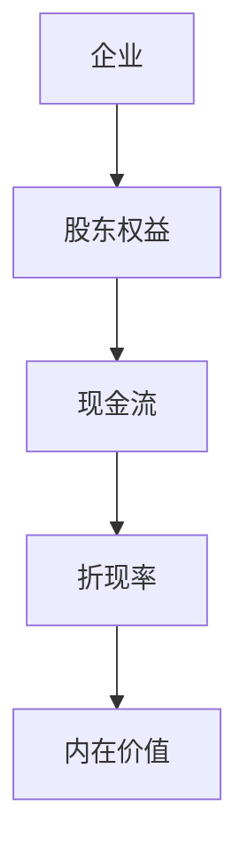
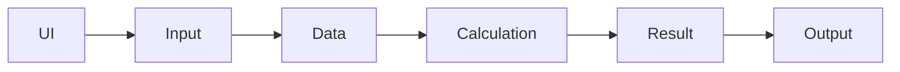

                 


# 价值投资中企业估值的核心算法模型

---

## 关键词：
- 价值投资
- 企业估值
- 核心算法模型
- DCF模型
- 估值方法
- 投资策略

---

## 摘要：
本文将深入探讨价值投资中企业估值的核心算法模型，结合理论分析与实际案例，系统地讲解如何利用这些算法模型进行企业估值。文章从价值投资的背景出发，详细阐述了企业估值的核心概念、算法原理、数学模型和实际应用，并通过案例分析和系统设计展示了如何构建高效的企业估值系统。读者将通过本文掌握企业估值的核心算法模型及其在投资决策中的应用。

---

# 目录

---

## 第1章: 价值投资与企业估值的背景

### 1.1 价值投资的定义与核心理念
- 1.1.1 价值投资的起源与发展
- 1.1.2 价值投资的核心理念
- 1.1.3 企业估值在价值投资中的重要性

### 1.2 企业估值的基本概念
- 1.2.1 企业估值的定义
- 1.2.2 企业估值的核心要素
- 1.2.3 企业估值的常见方法

### 1.3 核心算法模型的背景
- 1.3.1 企业估值算法的发展历程
- 1.3.2 现代企业估值算法的特点
- 1.3.3 算法模型在价值投资中的应用

---

## 第2章: 企业估值的核心概念与联系

### 2.1 核心概念原理
- 2.1.1 内在价值与市场价值
- 2.1.2 股东权益与企业价值
- 2.1.3 现金流与折现率

### 2.2 核心概念属性特征对比
- 2.2.1 内在价值与外在价值的对比
- 2.2.2 现金流与利润的对比
- 2.2.3 折现率与风险的对比

### 2.3 ER实体关系图架构


---

## 第3章: 企业估值算法原理讲解

### 3.1 DCF模型原理
- 3.1.1 DCF模型的定义
- 3.1.2 DCF模型的核心公式
$$DCF = \sum_{t=1}^{n} \frac{CF_t}{(1 + r)^t} + \frac{TV}{(1 + r)^n}$$

### 3.2 DCF模型的应用流程
1. 估计未来现金流
2. 确定合理的折现率
3. 计算DCF值
4. 比较DCF值与市场价格

### 3.3 其他常见估值算法
- 市盈率法（P/E）
- 市净率法（P/B）
- 股权自由现金流模型（FCFE）

---

## 第4章: 数学模型与公式详解

### 4.1 DCF模型的数学推导
$$DCF = \sum_{t=1}^{\infty} \frac{CF_t}{(1 + r)^t}$$

### 4.2 折现率的计算方法
$$r = WACC = \left(\frac{D}{V}\right) \times r_d \times (1 - t) + \left(\frac{E}{V}\right) \times r_e$$

### 4.3 实际案例分析
- 案例：某制造企业的DCF估值

---

## 第5章: 企业估值系统设计

### 5.1 系统功能设计
- 数据输入模块
- 计算模块
- 结果展示模块

### 5.2 系统架构设计


### 5.3 接口设计与交互流程
```mermaid
graph LR
    User->UI: 输入企业数据
    UI->Input: 接收数据
    Input->Data: 存储数据
    Data->Calculation: 启动计算
    Calculation->Result: 输出结果
    Result->Output: 显示结果
```

---

## 第6章: 项目实战与案例分析

### 6.1 项目环境安装
- 安装Python与相关库（numpy, pandas, matplotlib）

### 6.2 核心代码实现
```python
import numpy as np

def dcf_valuation(cash_flows, discount_rate, terminal_value):
    return sum(cash_flows / (1 + discount_rate) ** t for t in range(len(cash_flows))) + terminal_value / (1 + discount_rate) ** len(cash_flows)
```

### 6.3 案例分析
- 选择一家企业，进行DCF模型的估值

---

## 第7章: 总结与展望

### 7.1 最佳实践
- 合理选择折现率
- 综合考虑多种估值方法

### 7.2 小结
- 企业估值的核心在于准确预测现金流和合理评估折现率

### 7.3 注意事项
- 数据的准确性和完整性
- 模型的适用性和限制性

### 7.4 拓展阅读
- 阅读经典投资书籍
- 关注行业动态与市场变化

---

## 附录

### 附录A: 常用估值公式汇总
- DCF模型
- 市盈率法
- 市净率法

### 附录B: 代码示例
```python
import pandas as pd
import numpy as np

def calculate_dcf(cash_flows, discount_rate, terminal_value):
    dcf = 0
    for t in range(len(cash_flows)):
        dcf += cash_flows[t] / (1 + discount_rate) ** t
    dcf += terminal_value / (1 + discount_rate) ** len(cash_flows)
    return dcf

# 示例数据
cash_flows = [100, 150, 200]
discount_rate = 0.1
terminal_value = 500

result = calculate_dcf(cash_flows, discount_rate, terminal_value)
print("DCF Value:", result)
```

---

## 参考文献
1. Graham, Benjamin. *The Intelligent Investor*.
2. Fama, Eugene. *The Theory of Prices*.
3. Lintner, John. *The Valuation of Risk Assets and portfolios in Financial Economics*.

---

通过以上目录结构，您可以逐步展开每一章的内容，深入探讨价值投资中企业估值的核心算法模型。

