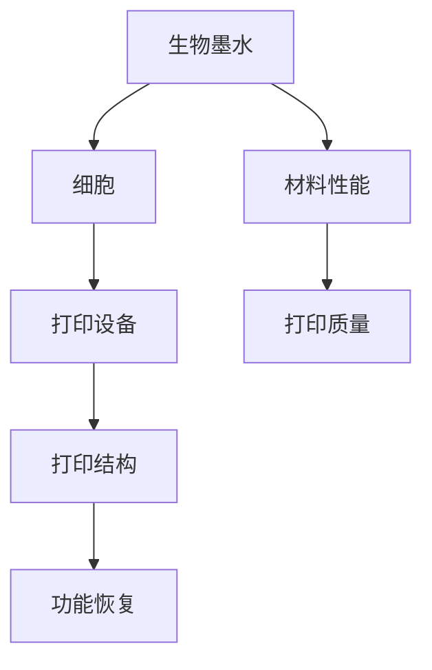
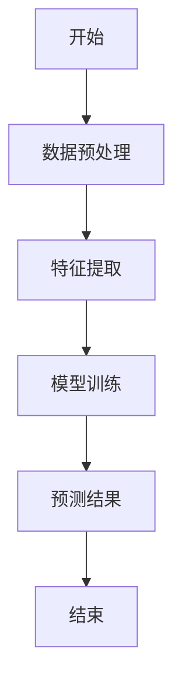

                 


```markdown
# 价值投资中的3D生物打印技术前景

## 关键词：3D生物打印，价值投资，医疗技术，生物材料，投资分析

## 摘要：本文深入探讨了3D生物打印技术在医疗领域的应用前景及其投资价值。通过分析核心技术、市场潜力、技术趋势和投资策略，为投资者提供了详细的技术背景和价值评估方法，帮助读者在价值投资中把握3D生物打印技术的发展机遇。

---

# 第一部分: 3D生物打印技术的背景与现状

## 第1章: 3D生物打印技术的背景与现状

### 1.1 3D生物打印技术的起源与定义
#### 1.1.1 从快速原型制造到3D生物打印的演进
#### 1.1.2 3D生物打印的核心定义与技术特点
#### 1.1.3 3D生物打印在医学领域的应用现状

### 1.2 价值投资与技术前景的关系
#### 1.2.1 价值投资的基本概念与方法
#### 1.2.2 3D生物打印技术的市场潜力
#### 1.2.3 3D生物打印技术对医疗行业的影响

### 1.3 本章小结

---

# 第二部分: 3D生物打印技术的核心技术分析

## 第2章: 3D生物打印技术的关键要素

### 2.1 生物材料的选择与制备
#### 2.1.1 生物墨水的成分与性能
#### 2.1.2 材料的生物相容性与稳定性
#### 2.1.3 材料制备的工艺流程

### 2.2 打印设备与技术原理
#### 2.2.1 3D生物打印设备的分类与特点
#### 2.2.2 典型设备的工作原理与优缺点
#### 2.2.3 设备性能对打印质量的影响

### 2.3 生物墨水与细胞培养技术
#### 2.3.1 生物墨水的配制与性能测试
#### 2.3.2 细胞培养的基本原理与方法
#### 2.3.3 细胞与材料的相互作用

## 第3章: 3D生物打印技术的核心概念与联系

### 3.1 核心概念的原理分析
#### 3.1.1 生物墨水的流变特性
#### 3.1.2 打印精度与结构完整性
#### 3.1.3 细胞活性与功能恢复

### 3.2 核心概念的对比分析
#### 3.2.1 不同生物墨水的性能对比
#### 3.2.2 不同打印技术的优缺点对比
#### 3.2.3 细胞培养条件对打印效果的影响

### 3.3 实体关系图


---

# 第三部分: 3D生物打印技术的算法与预测模型

## 第4章: 3D生物打印技术的算法原理

### 4.1 技术趋势预测算法
#### 4.1.1 机器学习在技术评估中的应用
#### 4.1.2 算法原理与数学模型
#### 4.1.3 算法实现步骤

### 4.2 算法实现
#### 4.2.1 算法流程图

#### 4.2.2 Python代码实现
```python
import numpy as np
from sklearn import linear_model

# 示例数据
X = np.array([[1], [2], [3], [4], [5]])
y = np.array([2, 4, 5, 4, 6])

# 线性回归模型
model = linear_model.LinearRegression()
model.fit(X, y)

# 预测结果
print(model.predict([[6]]))
```

### 4.3 算法优化与改进
#### 4.3.1 不同算法的对比分析
#### 4.3.2 算法优化的数学模型
#### 4.3.3 优化后的算法流程图

---

# 第四部分: 3D生物打印技术的系统分析与设计

## 第5章: 系统功能设计

### 5.1 系统功能模块划分
#### 5.1.1 功能模块的划分与描述
#### 5.1.2 功能模块的交互流程
#### 5.1.3 功能模块的优先级排序

### 5.2 系统架构设计
#### 5.2.1 系统架构的层次划分
#### 5.2.2 系统架构的优缺点对比
#### 5.2.3 系统架构的实现方案

### 5.3 系统接口设计
#### 5.3.1 系统接口的定义与描述
#### 5.3.2 系统接口的交互流程
#### 5.3.3 系统接口的实现方式

---

# 第五部分: 3D生物打印技术的项目实战与案例分析

## 第6章: 项目实战

### 6.1 环境安装与配置
#### 6.1.1 开发环境的搭建
#### 6.1.2 开发工具的安装
#### 6.1.3 依赖库的安装与配置

### 6.2 核心代码实现
#### 6.2.1 核心算法的实现
#### 6.2.2 系统功能的实现
#### 6.2.3 界面设计与实现

### 6.3 项目案例分析
#### 6.3.1 案例背景介绍
#### 6.3.2 案例分析与解读
#### 6.3.3 案例总结与反思

---

# 第六部分: 价值投资中的最佳实践与建议

## 第7章: 最佳实践与建议

### 7.1 投资策略与建议
#### 7.1.1 投资前的准备工作
#### 7.1.2 投资策略的选择与制定
#### 7.1.3 投资过程中的注意事项

### 7.2 项目管理与风险控制
#### 7.2.1 项目管理的方法与技巧
#### 7.2.2 风险控制的策略与措施
#### 7.2.3 风险评估与应对方案

### 7.3 未来发展趋势与投资机会
#### 7.3.1 3D生物打印技术的未来发展趋势
#### 7.3.2 价值投资中的新兴机会
#### 7.3.3 投资者应关注的重点领域

---

## 总结

通过以上目录结构，文章将从技术背景、核心技术分析、算法原理、系统设计、项目实战到最佳实践，全面而深入地探讨3D生物打印技术在价值投资中的前景，为投资者提供详实的技术和投资分析。

