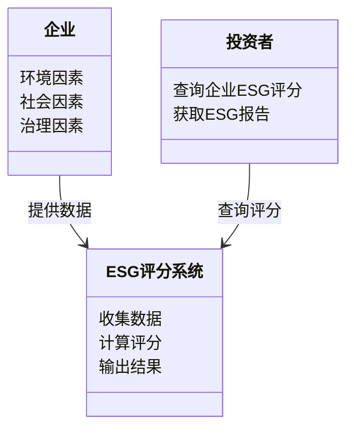
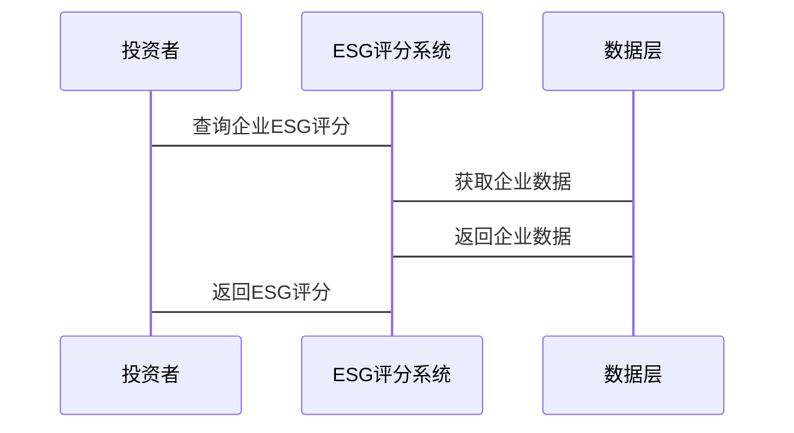

                 


# 价值投资中的ESG因素分析

## 关键词：价值投资、ESG、环境因素、社会因素、公司治理、投资策略

## 摘要：本文系统地探讨了在价值投资中ESG（环境、社会和治理）因素的重要性。通过分析ESG的定义、核心要素及其对投资决策的影响，本文揭示了ESG如何帮助投资者识别风险、优化投资组合并实现长期收益。文章结合实际案例，详细讲解了ESG评分算法、系统设计和项目实战，为投资者提供了实用的指导和最佳实践建议。

---

# 第一部分: 价值投资中的ESG因素分析背景介绍

## 第1章: ESG概念与价值投资的结合

### 1.1 ESG的定义与核心要素

#### 1.1.1 环境（Environmental）因素
环境因素关注企业在资源使用、碳排放、污染控制等方面的实践。以下是环境因素的核心要素：
- **环境政策**：企业是否遵守环保法规，是否有明确的环保目标。
- **资源消耗**：企业在生产过程中对水、能源等资源的使用效率。
- **碳排放**：企业的碳足迹，包括直接和间接排放。

#### 1.1.2 社会（Social）因素
社会因素关注企业在员工权益、社会责任、产品安全等方面的实践。以下是社会因素的核心要素：
- **员工权益**：员工的工作条件、薪酬福利、职业发展机会。
- **社会责任**：企业对社区的支持、公益活动的参与。
- **产品安全**：产品是否符合安全标准，是否存在缺陷。

#### 1.1.3 公司治理（Governance）因素
公司治理因素关注企业在董事会结构、管理层决策、内部控制等方面的实践。以下是治理因素的核心要素：
- **董事会构成**：董事会的独立性、专业性。
- **管理层决策**：决策的透明度、合规性。
- **内部控制**：企业的风险管理、审计机制。

### 1.2 ESG投资的起源与发展

#### 1.2.1 ESG投资的起源
ESG投资起源于20世纪60年代的美国，最初关注于社会责任投资（SRI），主要关注企业的社会影响。随着全球环境问题和社会问题的加剧，ESG投资逐渐扩展到环境和治理领域。

#### 1.2.2 ESG投资的发展现状
目前，ESG投资已经从最初的道德投资扩展到一种广泛的投资策略。全球越来越多的机构投资者将ESG因素纳入投资决策，ESG评级和评分体系也逐渐成熟。

#### 1.2.3 ESG与价值投资的结合
价值投资强调以合理的价格投资于具有持续竞争优势的企业。ESG因素可以帮助投资者识别那些在长期具有可持续竞争优势的企业，从而在价值投资中更好地控制风险并实现收益。

### 1.3 ESG投资的核心理念

#### 1.3.1 ESG与企业价值的关系
ESG因素直接影响企业的运营成本、风险敞口和市场声誉，从而影响企业的长期价值。

#### 1.3.2 ESG与投资风险的关联
企业治理不善可能导致财务风险，环境污染可能导致法律风险，社会责任缺失可能导致声誉风险。ESG因素可以帮助投资者识别和规避这些风险。

#### 1.3.3 ESG与长期投资回报的结合
研究表明，具有较高ESG评级的企业通常具有更稳定的业绩表现和更高的股东回报。

---

## 第2章: ESG因素在价值投资中的应用

### 2.1 ESG因素对投资决策的影响

#### 2.1.1 ESG因素如何影响企业估值
ESG因素通过影响企业的运营效率、成本结构和品牌价值间接影响企业估值。例如，一家在环境保护方面表现优秀的企业可能获得更低的生产成本和更高的品牌溢价。

#### 2.1.2 ESG因素如何影响投资风险
ESG因素可以帮助投资者识别企业的潜在风险，例如环境风险、治理风险和社会风险。通过规避这些风险，投资者可以降低投资组合的整体风险敞口。

#### 2.1.3 ESG因素如何影响投资收益
长期来看，ESG表现优秀的企业通常具有更高的股东回报和更稳定的业绩表现。因此，将ESG因素纳入投资决策可以帮助投资者获得超额收益。

### 2.2 ESG投资的基本策略

#### 2.2.1 基于ESG评分的投资策略
投资者可以通过筛选具有较高ESG评级的企业构建投资组合。这种策略适用于那些希望快速进入ESG投资领域的投资者。

#### 2.2.2 行业选择与ESG因素
不同行业在ESG方面的表现差异较大。例如，能源行业在环境方面的压力较大，而金融行业在治理方面的压力较大。投资者需要根据行业特点选择具有优势的行业。

#### 2.2.3 个股筛选与ESG因素
在个股筛选中，投资者需要结合企业的财务表现、行业地位和ESG评级综合评估企业的投资价值。例如，一家财务表现优秀且ESG评级较高的企业更具有投资价值。

### 2.3 ESG投资的现状与挑战

#### 2.3.1 当前ESG投资的主要模式
当前ESG投资主要通过ESG基金、ETF和定制投资组合等方式进行。投资者可以根据自己的风险偏好和收益目标选择合适的投资方式。

#### 2.3.2 ESG投资的主要挑战
ESG投资的主要挑战包括数据质量、评级标准不统一和信息不对称等问题。不同机构对ESG评级的定义和计算方法存在差异，这可能导致投资者难以做出准确的决策。

#### 2.3.3 ESG投资的未来发展趋势
未来，ESG投资将更加注重数据的透明化和标准化。随着技术的进步，投资者将能够更方便地获取高质量的ESG数据，并通过量化模型优化投资决策。

---

## 第3章: 环境因素分析

### 3.1 环境因素的量化与评估

#### 3.1.1 环境影响评估模型
环境影响评估模型可以帮助投资者量化企业的环境影响。以下是一个简单的环境影响评估模型：

$$
\text{环境影响评分} = \sum (\text{环境因素权重} \times \text{环境因素表现})
$$

其中，环境因素权重是根据行业特点确定的，环境因素表现是根据企业的实际表现评分。

#### 3.1.2 碳排放计算与分析
碳排放是环境因素的重要组成部分。以下是碳排放计算的公式：

$$
\text{碳排放总量} = \text{直接碳排放} + \text{间接碳排放}
$$

其中，直接碳排放是指企业自身生产过程中产生的碳排放，间接碳排放是指企业供应链和产品使用阶段产生的碳排放。

#### 3.1.3 环境合规性分析
环境合规性分析包括对企业是否遵守环保法规、是否有环境违法记录等方面的评估。以下是环境合规性分析的步骤：
1. 收集企业的环保合规数据。
2. 对比环保法规的要求。
3. 评估企业的环境合规性。

---

## 第4章: 社会因素分析

### 4.1 社会因素的量化与评估

#### 4.1.1 社会责任评分模型
社会责任评分模型可以帮助投资者量化企业的社会责任表现。以下是社会责任评分模型：

$$
\text{社会责任评分} = \sum (\text{社会因素权重} \times \text{社会因素表现})
$$

其中，社会因素权重是根据行业特点确定的，社会因素表现是根据企业的实际表现评分。

#### 4.1.2 员工权益评估
员工权益评估包括对企业员工的薪酬福利、工作条件、职业发展机会等方面的评估。以下是员工权益评估的步骤：
1. 收集企业的员工政策数据。
2. 对比行业标准。
3. 评估企业的员工权益表现。

#### 4.1.3 社会责任项目分析
社会责任项目分析包括对企业公益活动、社区支持等方面的评估。以下是社会责任项目分析的步骤：
1. 收集企业的社会责任项目数据。
2. 评估项目的影响力和可持续性。
3. 给予评分。

---

## 第5章: 治理因素分析

### 5.1 治理因素的量化与评估

#### 5.1.1 董事会结构分析
董事会结构分析包括对企业董事会的独立性、专业性和多样性等方面的评估。以下是董事会结构分析的步骤：
1. 收集企业的董事会成员信息。
2. 评估董事会的独立性和专业性。
3. 给予评分。

#### 5.1.2 管理层决策透明度
管理层决策透明度分析包括对企业决策过程的透明度、决策记录的完整性和决策合规性等方面的评估。以下是管理层决策透明度分析的步骤：
1. 收集企业的决策记录。
2. 评估决策过程的透明度。
3. 给予评分。

#### 5.1.3 内部控制与风险管理
内部控制与风险管理分析包括对企业内部控制机制、风险管理流程和内部审计机制等方面的评估。以下是内部控制与风险管理分析的步骤：
1. 收集企业的内部控制数据。
2. 评估内部控制机制的有效性。
3. 给予评分。

---

## 第6章: ESG投资的算法原理

### 6.1 ESG评分算法

#### 6.1.1 ESG评分算法概述
ESG评分算法是一种基于环境、社会和治理因素的综合评分方法。以下是ESG评分算法的步骤：
1. 收集企业的环境、社会和治理数据。
2. 根据行业特点确定各因素的权重。
3. 计算各因素的评分。
4. 综合各因素评分得到最终的ESG评分。

#### 6.1.2 ESG评分算法的数学模型
以下是ESG评分算法的数学模型：

$$
\text{ESG评分} = \sum (\text{因素权重} \times \text{因素评分})
$$

其中，因素权重是根据行业特点确定的，因素评分是根据企业的实际表现评分。

#### 6.1.3 ESG评分算法的Python实现
以下是ESG评分算法的Python实现示例：

```python
import pandas as pd

# 定义因素权重
weights = {'环境': 0.4, '社会': 0.3, '治理': 0.3}

# 定义因素评分
scores = {'环境': 0.8, '社会': 0.7, '治理': 0.6}

# 计算ESG评分
esg_score = sum(weights[feature] * scores[feature] for feature in weights)

print(f"ESG评分：{esg_score}")
```

---

## 第7章: ESG投资的系统设计

### 7.1 系统功能设计

#### 7.1.1 领域模型类图
以下是领域模型类图：



#### 7.1.2 系统架构设计
以下是系统架构设计：


#### 7.1.3 系统接口设计
以下是系统接口设计：



---

## 第8章: ESG投资的项目实战

### 8.1 环境安装与数据准备

#### 8.1.1 环境安装
需要安装以下工具和库：
- Python 3.8+
- Pandas
- NumPy
- Matplotlib
- Scikit-learn

#### 8.1.2 数据准备
需要收集企业的环境、社会和治理数据。数据来源可以是公开的企业报告、ESG评级机构的数据等。

### 8.2 核心代码实现

#### 8.2.1 ESG评分计算
以下是ESG评分计算的Python代码：

```python
import pandas as pd

# 定义因素权重
weights = {'环境': 0.4, '社会': 0.3, '治理': 0.3}

# 定义因素评分
scores = {'环境': 0.8, '社会': 0.7, '治理': 0.6}

# 计算ESG评分
esg_score = sum(weights[feature] * scores[feature] for feature in weights)

print(f"ESG评分：{esg_score}")
```

#### 8.2.2 数据可视化
以下是数据可视化的Python代码：

```python
import matplotlib.pyplot as plt

# 定义数据
categories = ['环境', '社会', '治理']
values = [0.8, 0.7, 0.6]

# 绘制柱状图
plt.bar(categories, values)
plt.title('ESG因素表现')
plt.ylabel('评分')
plt.show()
```

### 8.3 案例分析与总结

#### 8.3.1 案例分析
以某能源企业为例，分析其ESG表现。假设该企业的环境评分为0.8，社会评分为0.7，治理评分为0.6，最终ESG评分为0.73。

#### 8.3.2 项目总结
通过本项目，我们可以看到，ESG评分可以帮助投资者识别具有可持续竞争优势的企业。投资者可以根据ESG评分构建投资组合，实现长期收益。

---

## 第9章: 最佳实践与总结

### 9.1 最佳实践

#### 9.1.1 数据来源的可靠性
投资者需要选择可靠的ESG数据源，例如国际知名的ESG评级机构。

#### 9.1.2 持续监控与调整
投资组合需要定期调整，以适应市场变化和企业ESG表现的变化。

#### 9.1.3 风险管理
投资者需要将ESG因素纳入整体风险管理体系，定期评估投资组合的ESG风险敞口。

### 9.2 小结

通过本文的分析，我们可以看到，ESG因素在价值投资中具有重要的地位。投资者可以通过ESG评分识别具有可持续竞争优势的企业，优化投资组合并实现长期收益。

### 9.3 注意事项

- 投资者需要关注ESG数据的透明度和可靠性。
- ESG投资需要结合企业的财务表现和市场环境进行综合评估。
- 投资者需要定期调整投资组合，以适应市场变化和企业ESG表现的变化。

### 9.4 拓展阅读

- "可持续投资：ESG因素的重要性"（书籍）
- "ESG投资策略与实践"（报告）
- "环境、社会和治理因素对投资回报的影响"（学术论文）

---

通过本文的系统分析，我们可以看到，ESG因素在价值投资中具有重要的地位。投资者可以通过ESG评分识别具有可持续竞争优势的企业，优化投资组合并实现长期收益。希望本文的内容能够为投资者提供有价值的参考和指导。

