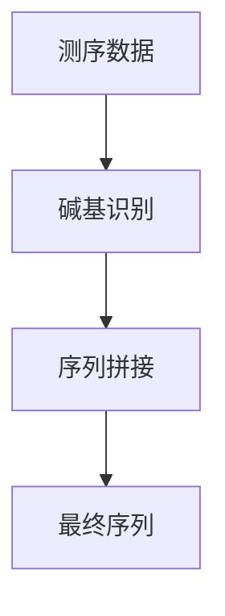
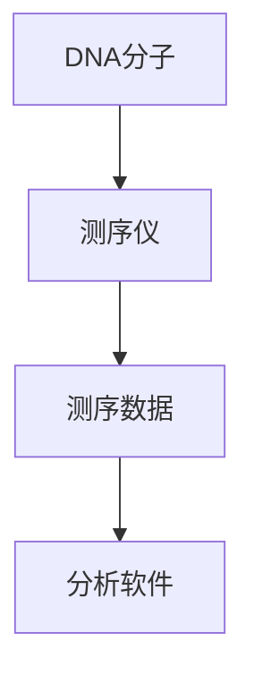
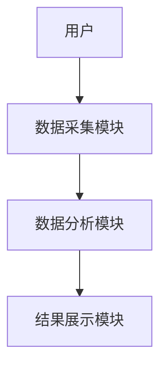
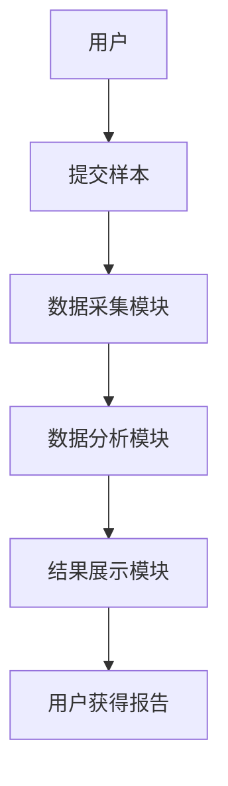

                 


# 《价值投资中的下一代DNA测序技术前景》

---

## 关键词：
- 价值投资、DNA测序技术、精准医疗、生物信息学、医疗投资、基因检测、下一代测序技术（NGS）

---

## 摘要：
随着科技的飞速发展，DNA测序技术在精准医疗和基因研究中的应用越来越广泛。本文从价值投资的角度出发，分析下一代DNA测序技术（NGS）在医疗健康领域的潜力。通过结合测序技术的核心原理、精准医疗的定义与目标、医疗平台的系统架构设计，以及项目实战案例，深入探讨DNA测序技术在医疗投资中的应用前景，为投资者提供科学的决策依据。

---

# 第一章: 背景与核心概念

## 1.1 DNA测序技术的演变与现状

### 1.1.1 DNA测序技术的发展历程
- **第一代测序技术**：早期的链终止法和双脱氧核苷酸法，测序速度慢、成本高。
- **第二代测序技术**（NGS）：高通量测序技术，如Illumina的Solexa平台，极大提升了测序效率和降低了成本。
- **第三代测序技术**：单分子测序技术，如PacBio和Oxford Nanopore，进一步提高了测序速度和准确性。

### 1.1.2 下一代测序技术（NGS）的核心特点
- **高通量**：单次运行可测序数百万条DNA片段。
- **低成本**：相较于第一代技术，NGS大幅降低了测序成本。
- **快速 turnaround time**：从制备到结果输出的时间显著缩短。

### 1.1.3 价值投资中的技术应用潜力
- **精准医疗**：基于个体基因信息的个性化治疗方案。
- **疾病早期筛查**：通过基因检测实现疾病的早发现、早治疗。
- **药物研发**：利用测序数据优化药物开发流程。

## 1.2 价值投资与精准医疗的结合

### 1.2.1 价值投资的基本概念
- **定义**：通过分析企业的基本面，寻找具有长期增长潜力的投资标的。
- **关键指标**：市盈率、市净率、ROE（净资产收益率）等财务指标。

### 1.2.2 精准医疗的定义与目标
- **精准医疗**：基于患者的个体特征（基因、环境、生活方式等）制定个性化治疗方案。
- **目标**：提高治疗效果，降低医疗成本，减少副作用。

### 1.2.3 DNA测序技术在精准医疗中的应用
- **疾病诊断**：通过基因测序辅助诊断罕见病、癌症等疾病。
- **用药指导**：根据患者基因信息优化用药方案，提高治疗效果。
- **疾病预防**：通过基因检测评估患病风险，提前采取预防措施。

## 1.3 问题背景与目标

### 1.3.1 传统医疗中的局限性
- **治疗效果不理想**：传统医疗常采用“一刀切”方式，忽视个体差异。
- **医疗成本高**：由于缺乏精准指导，治疗方案可能效率低下，增加经济负担。

### 1.3.2 DNA测序技术如何解决这些问题
- **个性化治疗**：通过基因测序实现精准诊断和治疗。
- **降低医疗成本**：通过提前预防和优化治疗方案，减少不必要的医疗支出。

### 1.3.3 价值投资在医疗领域的潜力
- **技术创新**：DNA测序技术的不断进步为医疗行业带来新的发展机遇。
- **市场空间**：随着精准医疗的需求增加，相关企业具有较大的增长潜力。

## 1.4 核心概念与边界

### 1.4.1 DNA测序技术的核心要素
| 核心要素 | 描述 |
|----------|------|
| 测序原理 | 基于碱基测序的化学反应 |
| 测序平台 | 不同技术的硬件实现 |
| 数据分析 | 生物信息学算法处理测序数据 |

### 1.4.2 价值投资中的关键指标
| 指标名称 | 描述 |
|----------|------|
| 市盈率 | 价格与收益之比 |
| 市净率 | 价格与资产之比 |
| ROE | 净资产收益率 |

### 1.4.3 两者的结合点与外延
- **结合点**：通过测序技术提升医疗企业的核心竞争力，增加投资价值。
- **外延**：测序技术的应用不仅限于医疗，还可扩展至农业、环保等领域。

## 1.5 本章小结
本章主要介绍了DNA测序技术的发展历程、下一代测序技术的核心特点，以及其在精准医疗中的应用潜力。同时，结合价值投资的基本概念，探讨了测序技术在医疗投资中的重要性。

---

# 第二章: 核心概念与技术原理

## 2.1 测序原理概述

### 2.1.1 测序的基本流程
1. **样本制备**：提取DNA并进行片段化处理。
2. **文库构建**：将DNA片段连接到接头，形成文库。
3. **测序反应**：通过化学反应读取碱基序列。
4. **数据处理**：将测序数据转化为可读的序列信息。

### 2.1.2 测序的关键步骤
- **片段化处理**：将DNA分子切割成较小片段。
- **文库构建**：通过连接接头将片段化后的DNA连接起来。
- **测序反应**：利用测序平台对文库中的DNA片段进行测序。

### 2.1.3 测序技术的数学模型
测序数据的准确率可以用以下公式表示：
$$ \text{准确率} = \frac{\text{正确识别的碱基数}}{\text{总碱基数}} \times 100\% $$

---

## 2.2 测序算法的原理

### 2.2.1 算法的输入与输出
- **输入**：测序数据（如fastq格式文件）。
- **输出**：原始测序数据经过拼接、纠错后的高质量序列。

### 2.2.2 测序算法的流程图（Mermaid）


### 2.2.3 算法的数学模型（公式）
测序数据的错误率可以通过以下公式计算：
$$ \text{错误率} = 1 - \text{准确率} $$

---

## 2.3 测序技术的实体关系图（Mermaid）



---

# 第三章: 价值投资中的测序技术应用

## 3.1 精准医疗的定义与目标

### 3.1.1 精准医疗的核心理念
- 基于患者的个体特征（基因、环境、生活方式）制定个性化治疗方案。

### 3.1.2 精准医疗的目标
- 提高治疗效果，降低医疗成本，减少副作用。

### 3.1.3 精准医疗与传统医疗的区别
- **传统医疗**：基于症状进行治疗，忽视个体差异。
- **精准医疗**：基于个体特征进行治疗，实现个性化医疗。

## 3.2 DNA测序技术在精准医疗中的应用

### 3.2.1 疾病诊断中的应用
- **罕见病诊断**：通过基因测序快速确定疾病原因。
- **癌症诊断**：通过检测肿瘤相关的基因突变，指导治疗方案。

### 3.2.2 药物研发中的应用
- **药物靶点识别**：通过测序发现潜在的药物靶点。
- **药物疗效预测**：通过基因测序预测患者对特定药物的反应。

### 3.2.3 个性化治疗中的应用
- **用药指导**：根据患者基因信息优化用药方案。
- **剂量调整**：根据患者的代谢能力调整药物剂量。

## 3.3 价值投资中的测序技术前景

### 3.3.1 测序技术在医疗投资中的作用
- **提升企业竞争力**：通过测序技术优化医疗企业的诊断和治疗流程。
- **增加投资价值**：测序技术的应用可以提高企业的市场占有率和盈利能力。

### 3.3.2 测序技术的市场潜力
- **市场规模增长**：随着精准医疗的需求增加，测序技术的市场空间广阔。
- **技术创新驱动**：测序技术的不断进步为医疗行业带来新的发展机遇。

### 3.3.3 未来发展趋势
- **技术融合**：测序技术与其他先进技术（如人工智能）的结合将进一步提升医疗水平。
- **应用拓展**：测序技术的应用将从医疗领域扩展到农业、环保等领域。

---

# 第四章: 系统分析与架构设计

## 4.1 精准医疗平台的系统架构

### 4.1.1 系统功能模块
- **数据采集模块**：负责采集患者的基因数据。
- **数据分析模块**：利用生物信息学算法对测序数据进行处理。
- **结果展示模块**：将分析结果以可视化形式呈现给医生和患者。

### 4.1.2 系统架构设计（Mermaid）


### 4.1.3 系统接口设计
- **输入接口**：接收患者的基因数据。
- **输出接口**：输出分析结果，包括疾病风险评估、用药建议等。

## 4.2 系统交互流程（Mermaid）



---

# 第五章: 项目实战

## 5.1 环境安装

### 5.1.1 安装测序分析环境
- **安装Linux系统**：推荐使用Ubuntu或CentOS。
- **安装必要工具**：如Python、Jupyter Notebook、生物信息学工具包（如BWA、Samtools）。

## 5.2 核心代码实现

### 5.2.1 测序数据分析代码（Python）

```python
import os
import subprocess

def run_command(command):
    try:
        subprocess.run(command, check=True, shell=True)
        return True
    except subprocess.CalledProcessError:
        return False

# 示例：从fastq文件中提取测序数据
command = "fastq_to_fasta.py input.fastq > output.fasta"
if run_command(command):
    print("命令执行成功！")
else:
    print("命令执行失败！")
```

### 5.2.2 数据分析与可视化

```python
import pandas as pd
import matplotlib.pyplot as plt

# 读取测序数据
data = pd.read_csv("sequencing_data.csv")

# 绘制测序深度分布图
plt.figure(figsize=(10, 6))
data['depth'].hist(bins=50, alpha=0.7)
plt.title('测序深度分布')
plt.xlabel('深度')
plt.ylabel('频率')
plt.show()
```

## 5.3 实际案例分析

### 5.3.1 病例背景
- **患者信息**：50岁男性，诊断为肺癌。
- **测序数据**：通过对患者肿瘤组织进行全基因组测序，发现多个基因突变。

### 5.3.2 分析结果
- **突变分析**：发现EGFR基因突变，提示患者可能对吉非替尼敏感。
- **用药建议**：建议使用针对EGFR突变的靶向药物进行治疗。

### 5.3.3 投资分析
- **企业评估**：某基因检测公司拥有先进的测序技术，市场占有率高，具有较大的投资价值。

## 5.4 项目小结
本章通过实际案例展示了测序技术在精准医疗中的应用，同时提供了具体的代码实现和数据分析方法，为读者提供了实践参考。

---

# 第六章: 总结与展望

## 6.1 本章总结
- **技术总结**：DNA测序技术在精准医疗中的应用前景广阔，能够显著提升医疗效果和降低成本。
- **投资总结**：测序技术的应用为企业带来了巨大的市场潜力，具有较高的投资价值。

## 6.2 未来展望
- **技术创新**：测序技术的精度和速度将进一步提升，成本将不断降低。
- **应用拓展**：测序技术将从医疗领域扩展到农业、环保等领域，形成更广泛的应用场景。

---

# 第七章: 附录

## 7.1 生物信息学工具推荐
- **常用工具**：BWA、Samtools、GATK、Fastp。
- **工具安装指南**：推荐使用Conda进行环境管理。

## 7.2 相关文献推荐
- **经典文献**：《Next-Generation Sequencing and Its Role in Precision Medicine》。
- **行业报告**：《Global Next-Generation Sequencing Market 2023》。

---

# 结语
通过本篇文章的详细分析，我们可以看到DNA测序技术在精准医疗和价值投资中的巨大潜力。随着技术的不断进步，测序技术将为医疗行业带来更多的创新和变革，为投资者提供更多的投资机会。

