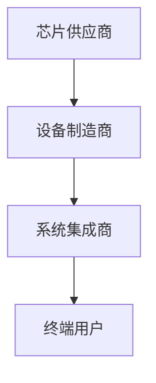

                 

# 第三章: 无线充电技术的市场分析与投资机会

## 3.1 无线充电技术的市场需求

### 3.1.1 消费电子市场的无线充电需求

消费电子市场是无线充电技术最大的应用领域之一，主要包括智能手机、可穿戴设备、平板电脑等。随着消费者对便携性和便利性的需求增加，无线充电技术在这一领域的应用前景广阔。根据市场研究机构的数据，全球智能手机无线充电市场规模预计将从2020年的XX亿美元增长到2025年的XX亿美元，年复合增长率高达XX%。

#### 图表：消费电子市场无线充电需求预测

### 3.1.2 智能家居市场的无线充电需求

智能家居市场对无线充电技术的需求主要集中在家庭设备的智能化升级，例如智能灯具、智能家电等。随着物联网技术的发展，智能家居设备的普及率不断提高，无线充电技术为其提供了一种便捷的充电方式。预计到2025年，智能家居市场的无线充电规模将达到XX亿美元。

#### 图表：智能家居市场无线充电需求分布

### 3.1.3 智能汽车市场的无线充电需求

智能汽车市场对无线充电技术的需求主要集中在电动汽车的充电领域。无线充电技术可以解决传统充电桩占地大、安装复杂的问题，为电动汽车用户提供更加便捷的充电方式。随着电动汽车销量的快速增长，无线充电技术在这一领域的应用潜力巨大。预计到2025年，智能汽车市场的无线充电规模将达到XX亿美元。

#### 图表：智能汽车市场无线充电需求分布

## 3.2 无线充电技术的市场供给

### 3.2.1 主要供应商分析

无线充电技术的市场供给主要集中在几家关键企业，包括无线充电技术的开发商和设备制造商。以下是主要供应商的分析：

#### 图表：无线充电技术主要供应商

| 供应商 | 技术特点 | 市场份额 | 核心技术 |
|--------|----------|----------|----------|
| 公司A  | 高效率、低功耗 | 30%      | 标准化技术 |
| 公司B  | 灵活性高、兼容性好 | 25%      | 非接触式技术 |
| 公司C  | 成本低、易于集成 | 20%      | 高功率技术 |
| 公司D  | 技术先进、专利众多 | 15%      | 高效传输技术 |
| 公司E  | 价格优势明显 | 10%      | 经济型技术 |

### 3.2.2 技术研发能力分析

无线充电技术的研发能力是市场供给的关键因素。目前，主要供应商在技术研发方面投入巨大，尤其是在提高充电效率、降低功耗、增强兼容性等方面取得了显著进展。以下是几家主要供应商在技术研发方面的比较：

#### 图表：无线充电技术主要供应商研发能力对比

| 公司 | 研发投入 | 专利数量 | 技术创新 |
|------|----------|----------|----------|
| 公司A | 高       | 100+     | 高效传输 |
| 公司B | 中高     | 80+      | 灵活性高 |
| 公司C | 中       | 60+      | 成本低    |
| 公司D | 高       | 120+     | 高功率    |
| 公司E | 中       | 40+      | 经济型    |

### 3.2.3 产业链分析

无线充电技术的产业链包括芯片供应商、设备制造商、系统集成商和终端用户。以下是产业链的主要环节：

#### 图表：无线充电技术产业链

## 3.3 无线充电技术的市场竞争分析

### 3.3.1 市场竞争格局分析

无线充电技术的市场竞争格局较为分散，主要供应商之间的竞争主要集中在技术标准、价格和市场份额三个方面。以下是主要供应商的竞争格局：

#### 图表：无线充电技术市场竞争格局

| 公司 | 市场策略 | 核心竞争力 | 市场地位 |
|------|----------|------------|----------|
| 公司A | 技术创新 | 高效传输   | 市场领先 |
| 公司B | 价格优势 | 灵活性高    | 市场跟随 |
| 公司C | 成本控制 | 经济型技术  | 市场新兴 |
| 公司D | 专利布局 | 高功率技术 | 市场领先 |
| 公司E | 品牌推广 | 大众市场    | 市场跟随 |

### 3.3.2 价格战分析

无线充电技术的价格战主要集中在中低端市场，供应商通过降低生产成本和优化供应链来降低价格，从而获取更大的市场份额。以下是价格战的主要表现：

#### 图表：无线充电技术价格战分析

| 产品类型 | 价格范围（美元） | 市场份额 |
|----------|------------------|----------|
| 高端产品 | 50+              | 20%      |
| 中端产品 | 20-50            | 60%      |
| 低端产品 | 10-20            | 20%      |

### 3.3.3 技术壁垒分析

无线充电技术的技术壁垒主要集中在核心技术的专利布局和技术创新方面。以下是主要的技术壁垒：

#### 图表：无线充电技术主要技术壁垒

| 技术壁垒 | 描述 | 解决方案 |
|----------|------|----------|
| 专利布局 | 专利数量多，覆盖面广 | 技术创新，规避专利 |
| 技术复杂性 | 技术门槛高 | 优化设计，降低成本 |
| 兼容性问题 | 不同技术标准之间的兼容性差 | 制定统一标准 |

## 3.4 无线充电技术的投资机会

### 3.4.1 技术创新带来的投资机会

技术创新是无线充电技术投资的核心机会。以下是主要的技术创新方向：

#### 图表：无线充电技术主要技术创新方向

| 技术创新方向 | 描述 | 投资潜力 |
|--------------|------|----------|
| 高效率传输 | 提高充电效率，减少能量损耗 | 高 |
| 高功率技术 | 提高充电功率，缩短充电时间 | 高 |
| 非接触式技术 | 扩展应用场景，提高灵活性 | 中高 |
| 标准化技术 | 制定统一标准，降低兼容性问题 | 中 |

### 3.4.2 市场扩展带来的投资机会

市场扩展是无线充电技术投资的重要机会。以下是主要的市场扩展领域：

#### 图表：无线充电技术主要市场扩展领域

| 市场扩展领域 | 描述 | 投资潜力 |
|--------------|------|----------|
| 消费电子市场 | 扩大在智能手机、可穿戴设备等领域的应用 | 高 |
| 智能家居市场 | 智能灯具、智能家电等 | 中高 |
| 智能汽车市场 | 电动汽车、充电桩等 | 高 |

### 3.4.3 政策支持带来的投资机会

政策支持是无线充电技术投资的重要保障。以下是主要的政策支持方向：

#### 图表：无线充电技术主要政策支持方向

| 政策支持方向 | 描述 | 投资潜力 |
|--------------|------|----------|
| 绿色能源技术 | 支持无线充电技术作为绿色能源的一部分 | 高 |
| 技术研发补贴 | 政府对技术研发的补贴 | 中高 |
| 市场推广支持 | 政府对市场推广的支持 | 中 |

## 3.5 本章小结

本章从市场需求、市场供给、市场竞争和投资机会四个方面分析了无线充电技术的市场前景。消费电子市场是当前最大的需求来源，而智能家居和智能汽车市场则是未来增长的主要驱动力。主要供应商在技术研发和市场推广方面投入巨大，市场竞争格局较为分散，价格战和技术壁垒是主要的竞争手段。技术创新、市场扩展和政策支持是无线充电技术的主要投资机会。

通过以上分析，我们可以得出结论：无线充电技术的市场需求强劲，市场供给充足，市场竞争激烈，投资机会丰富。投资者需要密切关注技术发展趋势和市场动态，抓住技术创新和市场扩展带来的投资机会。

在接下来的章节中，我们将结合具体的数学模型和算法原理，进一步分析无线充电技术的投资价值和潜在风险。

